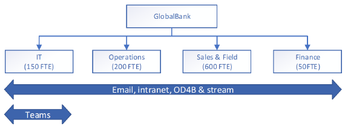

# Developing your continuity plan

This topic provides guidance on developing a business continuity plan which takes Microsoft 365 dependencies into account. Here we recommend methods for analyzing your business functions and identifying the ones which depend on Microsoft 365 services. You'll perform this analysis with the anticipation that there will be service failures and that you have to prepare for those possibilities.

Broadly speaking, business continuity planning involves four aspects, assessment, planning, capability validation, and communication and coordination.

## Assessment
First you must identify the business functions in your org and the services and processes that support them. This includes completing a business impact analysis, where each business function is ranked according to how critical it is and you identify the processes and services that each one depends on. Here's a sample table you can refer to help you get started with your own assessment.

**Sample Business Impact Assessment (BIA)**

This is a BIA document for `name of the service, system, process, or function`

|BIA fields|Description|
|---------|---------|
|BIA type|`is it a business process or technology, service or system?`|
|BIA name|`name of the service/system/function/process`|
|service description|`give a full description of the service, process, or function`|
|enterprise function|`some examples: customer services; legal; marketing; risk management, security, sales, information technology, production, manufacturing`|
|fiscal year|`the current fiscal year, re-evaluate these on a regular basis`|
|criticality|`develop your own classifications, but here are some examples: mission critical, important, deferrable`|
|business unit|`name of the business unit that owns this business function`|
|process (service, feature)|`the name of the process, service, or feature`|
|business group senior leader|`the name and contact information of the senior leader of the business group that owns this business process`|
|Does the technology have an established **internal** SLA or OLA?|`please explain in as much detail as possible`|
|Does the technology have an established **external** SLA or OLA?|`please explain in as much detail as possible`|
|Does the technology have a known executive mandate driving a specific process SLA? If yes, explain in detail.|`details here`|
|Will the loss or compromise of the data associated with this services trigger a major event? If yes, explain in detail.|`details here`|
|Does the service have a workaround or alternative in place for some or all of its key functions and features? If yes, explain in detail.|`details here`|
|Does the service process, store, or transmit customer data, such as personally identifiable information (PII)? If yes, explain in detail.|`details here`|
|BIA status|`develop your own status classification, here are some examples: planned, started, in-progress, complete, on-hold, expired`|
|completion date|`the date this BIA was completed`|
|BIA facilitator|`name of the person or group who is responsible for developing and maintaining this BIA`|
|BIA approval|`name of the person or group who is the executive sponsor of this BIA and who has responsibility for approving it.`|
|contributors|`optional list of the people who helped develop this BIA and their contact information`|
|BIA approval location|`indicate where the executive approval is located, or attach proof to this document`|

## Planning

Next, you look across business processes to see where any cascading dependency relationships exist. Based on the outcome, you prioritize and form resiliency strategies, and standard operating procedures supporting your strategies.

You can use [Microsoft Service Map](https://docs.microsoft.com/azure/azure-monitor/insights/service-map) to help you in with this mapping. Microsoft Service Map automatically discovers application components on Windows and Linux systems and maps all TCP dependencies, identifies connections,  and remote third-party systems that the app depends on. It also maps dependencies to areas of your network that are traditionally dark, such as Active Directory.

Here's a sample dependency analysis (DA) you can start from. In your dependency analysis (DA), you will identify and examine the process dependencies. Make sure you include people, suppliers, customers, partnerships and facilities. The data from this analysis will be used to identify gaps between the recovery requirements of a process and the recovery capabilities of supporting dependencies.

|field|description|
|---------|---------|
|process type|         |
|facilitator|         |
|completed by|         |
|completed date|         |
|contributors|         |
  
## Capability validation

Once you have inventoried your business processes and mapped out relationships to other process and technologies, you need to build validation scenarios for all the processes. Basically, figure out how you are going to validate your business process continuity plans. You'll probably find that some are more important that others and you'll want to prioritize those.
Don't forget that regularly training employees on incident response and continuity measures is important once the plan is established. Post incident reviews should be used to enhance your resiliency strategies by incorporating learnings from each validation or test.

## Incident coordination and communication

During a service incident, normal communications channels may be impacted or degraded, so you should pre-arrange alternatives to help your organization stay connected during an incident. It is critical that the communication channels be established, vetted for security and compliance, and users trained on their use prior to a disruption. Failing from a known state to another known state is far preferable to users coming up with ad-hoc, unknown solutions in the middle of a crisis.

At Microsoft, each service team has established internal alternative communication channels to help us coordinate when our normal communications channels aren’t available. These include backup telephony and audio-conferencing solutions, Yammer groups, Teams groups, internal Service Health Dashboards, and internal Incident Management software.

During your Business Impact Analysis and Dependency Analysis, you will be mapping critical processes and the technologies or services they depend on. Pay special attention to communication during this phase of planning and think of alternatives. Here are some examples.

- If email is your primary method of keeping your users and stakeholders informed, and your email service is degraded or unavailable, you can use another service such as Microsoft Teams, Yammer, or another 3rd-party service as a backup. The key is to establish these beforehand and train your users on where to go. A Yammer thread isn’t going to be useful if no one knows it exists or if no one has it bookmarked.  
- If your internal Incident Management processes rely on voice communications to coordinate your responses, establish an alternative telephony solution for use during a crisis. This solution doesn’t need to have full parity with your primary service but should provide the minimum level of collaboration to coordinate your Business Continuity and Incident Management teams. Additionally, asking users to publish their mobile phone numbers in your Global Address List can provide an additional layer of backup communication in extreme cases.
- You may want to create a custom service health dashboard, or other such site, which can provide status updates during an incident. Training users where to go for information beforehand will help reduce unnecessary calls to help desk and instill confidence in your user base that the situation is being handled quickly and efficiently. Use the O365 Service Communications API to tie this into M365 for an even greater level of visibility.  
- It is critical that the location of your Business Continuity Plans and Standard Operating Procedures is well known. We recommend maintaining online and offline copies of critical documentation, such as with SharePoint Online or OneDrive for Business configured for automatic sync to local devices. For Service/Network Operations Centers and other similar teams that will be absolutely critical for recovery, you may also want to keep hard copies available to be used in the event of an emergency.

## Know your external points of integration

Regardless of business model, every company has points of integration with their customers, partners and vendors. The business value supply chain is built on integration with external entities. Improving business continuity in the event of service disruption requires consideration – and protection – of each point of integration.  
As you analyze your supply chain, external communications should be considered in the same way internal communications are analyzed. Do your customers rely on your Exchange Online servers as the only method of contacting you? Have you established and made your suppliers aware of alternative communication methods, in the event uptime is impacted? Here's
a sample table that suggests how to organize your thinking.

|external entity name|impacting incident scenario|Microsoft 365 services integrated|alternatives|
|---------|---------|---------|---------|
|`vendor name`|mail flow|Exchange Online is the only means of communication with Contoso|set up external Microsoft Teams channels or a third-party collaboration software          |
|`service supplier name`|chat|Microsoft Teams|third party instant messaging|
|`partner name`|voice|Microsoft Teams|mobile or public pstn      |
|`supplier name`|file sharing|externally shared SharePoint sites and OneDrive|third party file sharing         |
