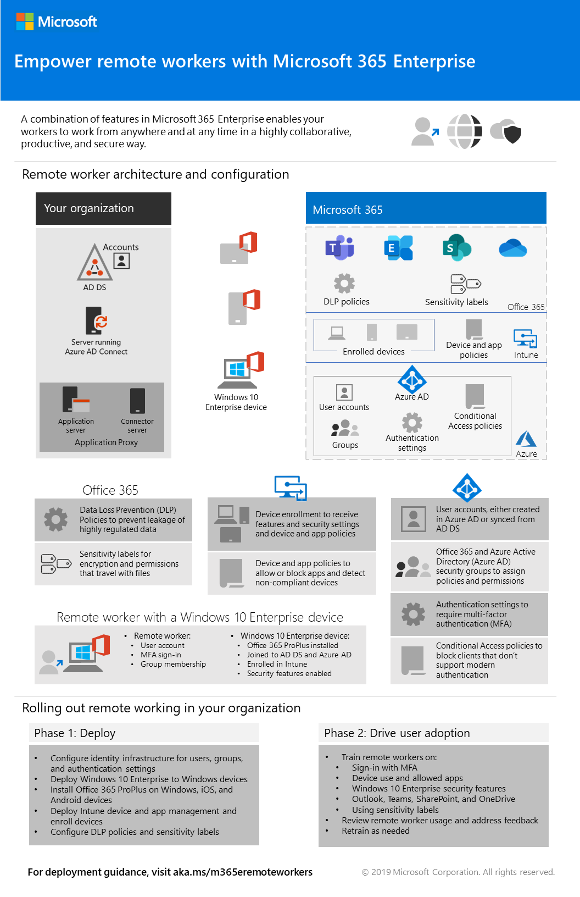
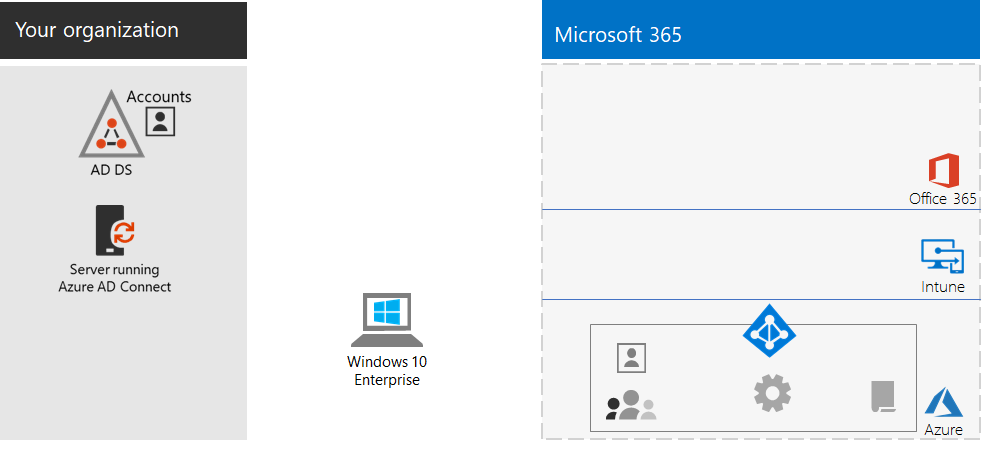
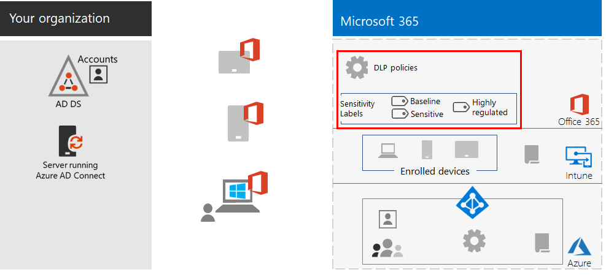
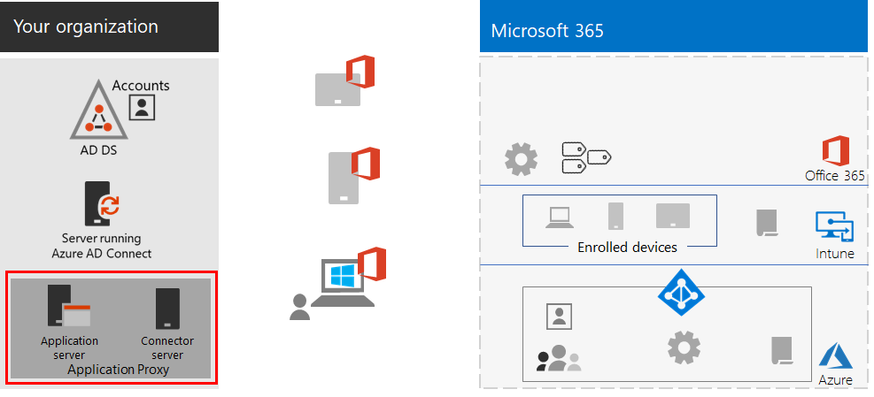
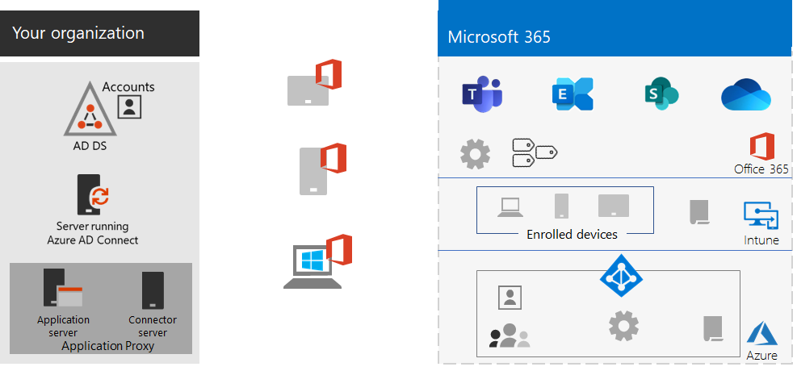
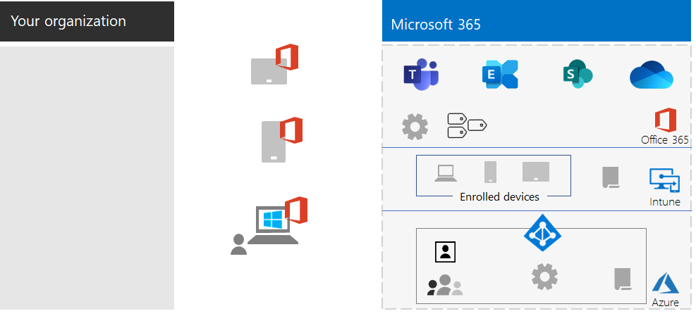

# Empower remote workers

*This scenario applies to both the E3 and E5 versions of Microsoft 365 Enterprise*

Allowing employees to work away from the office seamlessly and securely is important for many organizations to save on office space, hire and retain employees who are unwilling to relocate, and reduce employee commuting, leaving them with more time to be productive and for stress-reducing activities outside of work.

Remote working, also known as teleworking, can span a spectrum that includes:

- Employees that are occasionally away from the office for conferences or client meetings.
- Some employees that work remotely full-time.
- A fully remote organization in which there is no office and all employees are remote.

To support remote workers, a combination of features in Microsoft 365 Enterprise enables your remote workers in a highly collaborative way, such as:

- Online meetings and chat sessions.
- Shared workspaces for cloud-based file storage with global accessibility and real-time collaboration.
- Shared tasks and workflows to divide up the work and get things done.

For strong security, Microsoft 365 Enterprise includes:

- Enforced authentication requirements, detecting and responding to high-risk sign-ins, and blocking selected apps and non-compliant devices.
- Encrypted connections and digital assets in the cloud.
- Permissions to define who can do what with files.
- Data loss prevention (DLP) to prevent leakage of highly regulated data.

To meet these criteria for remote workers, use the following Microsoft 365 Enterprise features:

- User identity and sign-in security
  - Azure Active Directory (Azure AD) user accounts with multi-factor authentication (MFA)
  - Conditional Access policies to require MFA for risky sign-ins
- Collaboration platforms
  - Microsoft Teams, SharePoint, and OneDrive, with which remote workers can schedule and attend online video-based meetings and work on the same documents at the same time
- Secure access to resources
  - Groups and permissions for Teams, SharePoint sites, and OneDrive so that only authenticated and permitted users have access
- Protection for leaked files
  - Office 365 DLP policies
  - Sensitivity labels for encryption and permissions that travel with files
- Device management and security with Microsoft Intune
  - Enrollment for managed devices
  - App settings for personal devices
  - Device and app policies
- Productivity apps for devices
  - Office 365 ProPlus apps for collaborative experiences with Teams, SharePoint, and OneDrive 
- Windows 10 Enterprise
  - Comprehensive security features to protect against cyberattacks and prevent data leakage
- Access to on-premises apps
  - Organizations that have hybrid identity can use Azure AD Application Proxy instead of virtual private network (VPN) connections

The following phases step you through deploying the feature of Microsoft 365 Enterprise for remote access and driving adoption for remote workers. If you have already deployed elements of these phases, ensure that they meet the stated requirements before moving on to the next element.

For a 1-page summary of this scenario, see the [Empower remote workers poster](media/empower-people-to-work-remotely/empower-remote-workers-scenario.pdf).

You can also download this poster in [PDF](https://github.com/MicrosoftDocs/microsoft-365-docs/raw/public/microsoft-365/enterprise/media/empower-people-to-work-remotely/empower-remote-workers-scenario.pdf) or [PowerPoint](https://github.com/MicrosoftDocs/microsoft-365-docs/raw/public/microsoft-365/enterprise/media/empower-people-to-work-remotely/Empower-Remote-Workers-Poster.pptx) formats and print it on letter, legal, or tabloid (11 x 17)-sized paper.

## Phase 1: Deploy Microsoft 365 features and capabilities for remote workers

Because of the breadth and number of features and capabilities required for this scenario, we’ll step you through the required elements of the foundation infrastructure and workloads sections of the [Microsoft 365 Enterprise Deployment Guide](deploy-microsoft-365-enterprise.md).

### Step 1: Foundation infrastructure requirements for remote workers

In this step, we’ll visit the phases of the [foundation infrastructure](deploy-foundation-infrastructure.md) and list the required elements to enable remote workers.

For [Phase 2: Identity](identity-infrastructure.md), deploy the following for user identity and sign-in security:

- For hybrid identity, user accounts and groups synchronized from on-premises Active Directory Domain Services (AD DS).
- For assigning permissions, synchronized or Azure AD groups with the appropriate members.
- Authentication settings, such as requiring MFA.
- Conditional Access policies to require MFA for risky sign-ins and block clients that don’t support modern authentication.

Here's the resulting configuration with the identity elements highlighted.

 
For [Phase 3: Windows 10 Enterprise](windows10-infrastructure.md), deploy:

- The infrastructure to deploy new devices with Windows 10 Enterprise and to upgrade of your Windows 7 or Windows 8.1 devices to Windows 10 Enterprise
- Enabling comprehensive security features for identity, threat, and information protection

Here's the resulting configuration with Windows 10 Enterprise devices.

 
For [Phase 4: Office 365 ProPlus](office365proplus-infrastructure.md), deploy the infrastructure to install Office 365 ProPlus or upgrade your currently installed Office suite, such as Office 2010 or Office 2013, to Office 365 ProPlus on your organization devices. This will give your users the best security and collaborative experiences.

Here's the resulting configuration with Office 365 ProPlus installed on devices.

 
For [Phase 5: Mobile device management](mobility-infrastructure.md), deploy Intune device and app management for:

- Enrollment of your Windows 10 Enterprise, iOS, macOS, Android, and Android Enterprise devices so they receive features and security settings defined by your organization.
- App settings for extra security and to allow or block apps, even on employee-owned personal devices.
- Compliance policies with Conditional Access to prevent non-compliant devices from connecting.

Here's the resulting configuration with Intune enrolled devices and policies highlighted.

 
For [Phase 6: Information protection](infoprotect-infrastructure.md), design and configure protection for your digital assets with:

- Office 365 DLP policies.
- Office 365 sensitivity labels for encryption and permissions that travel with files.

Here's the resulting configuration with DLP policies and sensitivity labels highlighted.

 
For access to on-premises apps, you can use [Azure AD Application Proxy](https://docs.microsoft.com/azure/active-directory/manage-apps/application-proxy), which requires a hybrid identity environment.

Here's the resulting configuration with the application proxy components highlighted.

 
### Step 2: Workloads for remote workers

For [Exchange Online](exchangeonline-workload.md), deploy Exchange Online mailboxes to each of your users.

For [Teams](teams-workload.md), deploy Teams to your users and groups.

For [SharePoint and OneDrive](sharepoint-online-onedrive-workload.md), deploy SharePoint team or communication sites and OneDrive folders.

Here's the resulting configuration with the workloads highlighted.

 
### Deployment results

After deploying the foundation infrastructure and workloads and rolling out Windows 10 Enterprise and Office 365 ProPlus, remote workers:

- Are subject to strong authentication and identity protection.
- Have the latest and most secure version of Windows on their Windows devices.
- Have the latest and most productive version of the Office suite on their devices.
- Are subject to app management and device compliance policies.
- Are subject to DLP policies and restrictions.
- Can assign sensitivity labels for encryption and permissions that travel with files and email.
- Can access on-premises apps without a VPN connection.
- Can perform their own work and participate in real-time collaboration with co-workers with chats, meetings, and files in Teams and files in SharePoint and OneDrive.

When offline (not connected to the Internet), your remote workers can change local copies of files. When they reconnect to the Internet, OneDrive synchronizes local copies with the files stored in your Microsoft 365 subscription. 

Here's the resulting configuration for remote workers of your organization if you use hybrid identity.

 
 
Here's the resulting configuration for remote workers your organization if you use cloud-only identity.

## Phase 2: Drive user adoption for remote workers

Now that the foundation infrastructure and workloads are in place, it’s time to drive the ongoing usage of these capabilities to your remote workers so they can be productive anywhere and at any time.

### Step 1: Train your users

Train your remote workers on:

- Proper sign-in procedures, including MFA registration, and how sign ins can be challenged when risk is detected.
- The use of devices and how policies can be used to block access for non-compliant devices.
- The use of allowed apps and how Intune app polices can be used to block apps.
- Windows 10 Enterprise security features.
- How to use Outlook for email and calendaring.
- How to use [Teams](https://docs.microsoft.com/microsoftteams/training-microsoft-teams-landing-page) for chat, video-based conferencing, document sharing, and threaded conversations.
- How to use SharePoint team or communication sites and OneDrive folders to browse files in a user's library and those belonging to a group.
- How to use and apply sensitivity labels for files containing sensitive or highly regulated data, for both local and online versions of files.

This training should include hands-on exercises so that your students can experience these capabilities and their results.

### Step 2: Conduct periodic reviews of usage and address worker feedback

In the weeks after training:

- Quickly address remote worker feedback and fine tune polices and configurations.
- Analyze usage for teams, SharePoint sites, and OneDrive folders and compare it with usage expectations.
- Verify that sensitive or highly regulated files have been properly labeled with the appropriate sensitivity label.

Retrain your users as needed.

### User adoption results

Your remote workers can use their Windows 10 Enterprise or other devices and Office 365 ProPlus to access and work on shared Microsoft 365 Enterprise cloud services and resources in a secure environment, and they’re meeting, creating, and collaborating in real time.

## See also

[Workloads and scenarios](deploy-workloads.md)

[Microsoft 365 Productivity Library](https://aka.ms/productivitylibrary) (https://aka.ms/productivitylibrary)

[Deployment guide](deploy-microsoft-365-enterprise.md)
