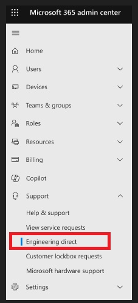
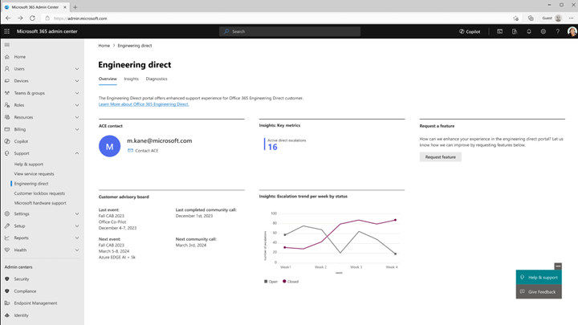
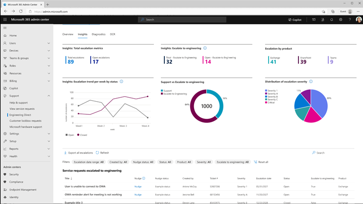
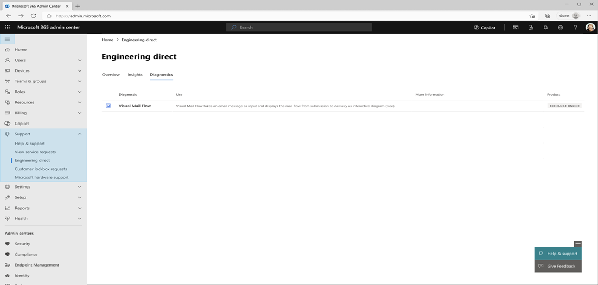
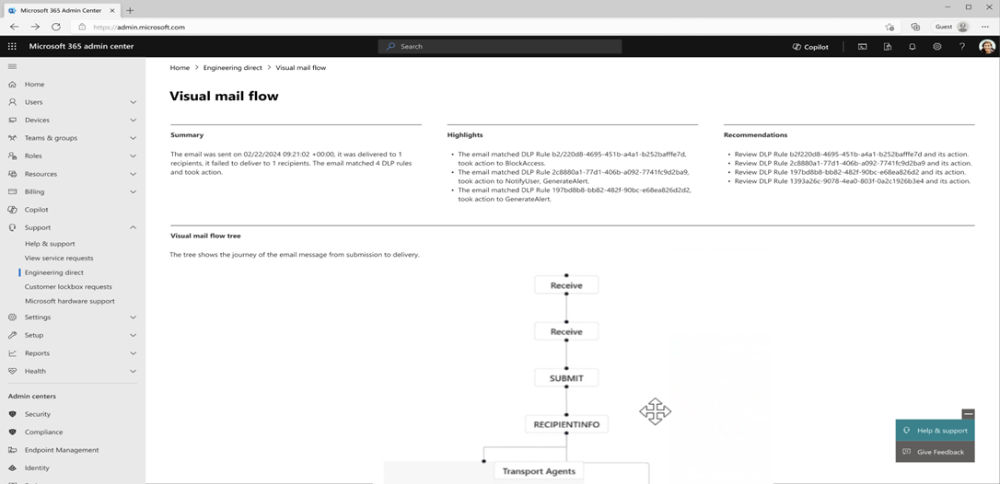
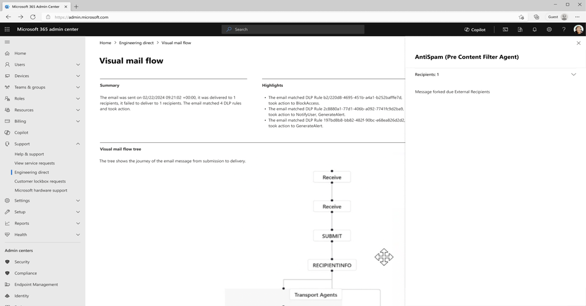

---  
title: "Engineering Direct Portal in the Microsoft 365 Admin Center"
author: kelleyvice-msft
ms.author: kvice  
manager: scotv
ms.date: 08/07/2024  
ms.topic: article
ms.service: microsoft-365-business  
ms.subservice: m365-admin-center  
ms.localizationpriority: medium
ms.collection: 
- scotvorg
- must-keep
ms.custom: QuickDraft  
ms.reviewer: kwekua; holliep  
search.appverid: MET150  
f1.keywords:  
audience:  
description: Understand the new Engineering Direct Portal in the Microsoft 365 admin center and learn how to access and use its features
ai-usage: ai-assisted  
---  

# Engineering Direct Portal in the Microsoft 365 Admin Center

The Engineering Direct Portal is a new feature within the Microsoft 365 admin center designed to provide Office Engineering Direct (OED) customers with an enhanced engineering experience. This article provides an overview of the portal's features, how to access it, and its functionality.

The Engineering Direct Portal offers:

- Delivery metrics to help highlight what OED provides and how you use the service
- Insight into support tickets that have been raised to the product group
- Self-service diagnostics to empower you with immediate insights and resolutions
- Features and diagnostics suggested by our OED customers

> [!NOTE]
> The portal is available to all OED customers and their in-scope tenants at no additional charge. Permissions are currently granted to anyone within your tenant with an RBAC (role-based access control) **support** role.

## Accessing the Engineering Direct Portal

The Engineering Direct Portal is located under **Support** within the Microsoft 365 admin center. To access the portal, follow these steps:

1. Navigate to the Microsoft 365 admin center.
1. Select **Support**.
1. Select **Engineering Direct** to enter the portal.

## Overview Page

Once in the portal, you'll see the **Overview** page. This page contains several key elements:

- **ACE Contact**: If you have an Advanced Cloud Engineer (ACE) assigned, you'll see an ACE tile with primary contact information. This lists your ACE email address with a clickable option to start an email. The tile won't be visible to customers without an ACE.
- **Insights: Key Metrics**: This tile lists both your engineering escalations and those that have been resolved for the last six months. An issue is considered an 'engineering escalation' once it has been raised to and assigned to a Microsoft Engineering team member (either through our support organization, or through your usage of the "Escalate to Engineering" feature).
  - Total escalations include open or closed tickets
  - Active escalations include only those tickets that are open
- **Customer Advisory Board (CAB)**: The CAB tile will list the last and next CAB events as well as the last and next community calls. This is informational only; registrations and calendar blockers will continue to be provided separately through existing process channels.
- **Insights: Escalation Trend Per Week by Status**: A monthly view of escalations by open and closed for the last six months. This is a focused view of all reactive issues, filtered by all issues that have a Microsoft engineering element.
- **Request A Feature**: Allows you to submit feedback or a request to the Engineering Direct Portal team. Feedback can be both related to the portal itself and its functionality, and any broader engineering features you would like to see in Engineering Direct. Feature requests submitted via this method are visible to users in your private **MyFeedback** section of the feedback portal.

## Insights Page

The **Insights** page provides detailed metrics, visuals, and lists on both your current engineering tickets and those that have been resolved within the last six months. This could be through support or through the "Escalate to Engineering" feature. The layout of this page might differ from the screenshot. This page contains:

1. **Total escalation metrics** – Cumulative total of tickets escalated to product groups in the last six months.
2. **Escalate to Engineering** - Cumulative total of tickets using the Escalate to Engineering feature in the last six months.
3. **Escalations by product** – Active engineering tickets to the product groups by service product.
4. **Escalation trend per week by status** – Monthly view of open or closed tickets escalated to the product groups.
5. **Support vs. Escalate to Engineering** – Visual showcasing active tickets escalated to engineering either via support or the Escalate to Engineering feature. The number in the center represents the current total active tickets.
6. **Distribution of escalation severity** – Visual of tickets escalated to the product groups by severity.
7. **Service Requests Escalated to engineering** – List view with filters of tickets that have been escalated to product groups:

    - **Title** – support ticket title
    - **Created By** – individual who opened the support ticket
    - **Ticket #** – support ticket number
    - **Severity** – ticket severity
    - **Escalation date** – date the issue was first escalated to the product groups
    - **Status** – status of the ticket escalated to the product groups. Status lists open or closed to start.
    - **Escalate to Engineering – true or false** - represents whether the customer raised the issue directly to engineering
    - **Product** – service product

## Diagnostics Page

The **Diagnostics** page hosts diagnostic tools for self-service issue resolution within your environment. One notable tool is **Visual Mail Flow**, which helps investigate email-related issues.

### Using Visual Mail Flow

Visual Mail Flow enables you to examine issues related to mail flow, such as email submission, group expansion, processing by transport agents (such as AntiSpam, mail flow rules, Data Loss Prevention), and delivery.

Some common situations where Visual Mail Flow can be useful:

- Checking the delivery status of recipients
- Determining reasons for nonreceipt of emails by certain recipients
- Understanding variations in email delivery between recipients
- Identifying mail flow rules applied to an email and their actions
- Identifying Data Loss Prevention rules applied to an email and their actions

### Input Requirements

To use Visual Mail Flow, you need either the email's Message ID *or* the Network Message ID. You can locate either the message ID or the network message ID by opening the email in question, go to **File** -> **Properties** -> **Internet headers**. You can parse through the headers to find either the message ID or network ID. Alternatively, you can copy/paste the entire internet header box and use a tool like [Message Header Analyzer](https://mha.azurewebsites.net/) to parse this information for you.

> [!NOTE]
> Ensure the submitted messages are within the age range of 1 to 90 days.

- **Message ID**: Found in the email header with the "Message-ID:" token. Users can provide this information to help investigate specific messages. Be sure to include the full message ID. This might include angle brackets (<>). Although the form varies depending on the email system, here's an example of what a message ID would look like: `<08f1e0f806a47b4ac109109ae6ef@server.domain>`.
- **Network Message ID**: Found in the email header with the "X-MS-Exchange-Organization-Network-Message-Id:" token. An example of a network message ID is `4d4c1224-7398-4e8e-949f-ce1932c4ab9d`.

### Running the Diagnostic

Enter either the Message ID or Network Message ID, then select **Troubleshoot** to start the diagnosis. Results are generated in approximately 30 seconds.

### Understanding the Results

The Visual Mail Flow diagnostic result includes:

- **Summary**: General conclusion on the mail flow.
- **Highlights**: List of outstanding info and detected issues.
- **Recommendations**: Intelligent recommendations for resolving detected issues.

The **Visual Mail Flow Tree** is an interactive display showing the stages an email went through, with the ability to zoom, drag, and view detailed node information. By examining the tree, you can gain a detailed understanding of how Exchange Online processed the email. In some cases, you might notice that the tree node is split into multiple child nodes. This is due to Exchange Online's bifurcation feature, which separates recipients into multiple sets to process them separately during mail flow.

### Investigating Further

Select a tree node to view a flyout with other details, including recipients processed and node-specific properties for troubleshooting mail flow issues. The flyout contains other details for you to review and investigate. It contains a common “Recipients” property to show which recipients this node processed, and more node-specific properties that vary between nodes to help better troubleshoot mail flow issues.

> [!TIP]
> Emails sent to many recipients or large groups will take a longer time to query or could time out. Querying emails with fewer recipients could improve your experience.

If Visual Mail Flow can’t help you resolve the issue, contact Microsoft Support for further help.

## More information

As we roll out new features, your experience might change.

If you would like to get help or have questions, reach out to [edfeedback@microsoft.com](mailto:edfeedback@microsoft.com) or use the feedback mechanism within the Engineering Direct Portal page. If you are encountering any technical issues, open a support ticket via your normal support channel.
