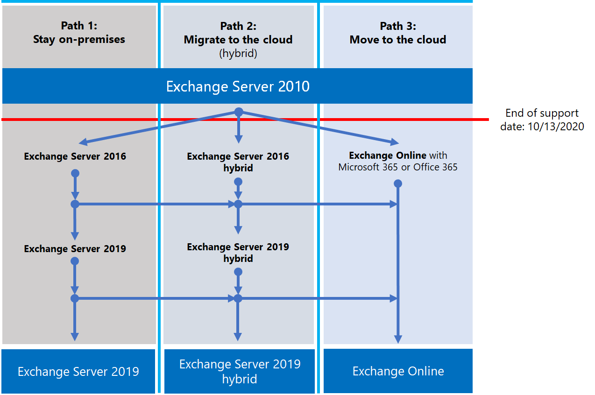

# Exchange 2010 end of support roadmap

*This article applies to both Microsoft 365 Enterprise and Office 365 Enterprise.*

Exchange Server 2010 reached its end of support on **October 13, 2020**. If you haven't already begun your migration from Exchange 2010 to Microsoft 365, Office 365, or Exchange 2016, now's the time to start your planning.

## What does end of support mean?

Exchange Server, like almost all Microsoft products, has a support lifecycle during which we provide new features, bug fixes, security fixes, and so on. This lifecycle typically lasts for 10 years from the date of the product's initial release, and the end of this lifecycle is known as the product's end of support. Because Exchange 2010 reached its end of support on October 13, 2020, Microsoft will no longer provide:

- Technical support for problems that may occur.
- Bug fixes for issues that are discovered and that may impact the stability and usability of the server.
- Security fixes for vulnerabilities that are discovered and that may make the server vulnerable to security breaches.
- Time zone updates.

Your installation of Exchange 2010 will continue to run after this date. However, because of the changes listed above, we strongly recommend that you migrate from Exchange 2010 as soon as possible.

For more information about Office 2010 servers nearing the end of support, see [Resources to help you upgrade from Office 2010 servers and clients](upgrade-from-office-2010-servers-and-products.md).

## What are my options?

With Exchange 2010 reaching its end of support, this is a great time to explore your options and prepare a migration plan. You can:

- Migrate fully to Microsoft 365. Migrate mailboxes using cutover, minimal hybrid, or full hybrid migration, then remove on-premises Exchange servers and Active Directory.
- Migrate your Exchange 2010 servers to Exchange 2016 on your on-premises servers.

> [!IMPORTANT]
> If your organization chooses to migrate mailboxes to Microsoft 365 but intends to keep DirSync or Azure AD Connect in place to continue managing user accounts from on-premises Active Directory, you need to keep at least one Exchange server on-premises. If the last Exchange server is removed, you won't be able to make changes to Exchange recipients in Exchange Online. This is because the source of authority remains in your on-premises Active Directory and changes need to be made there. In this scenario, you have the following options:

- (**Recommended**) If you were able to migrate your mailboxes to Microsoft 365 and upgrade your servers by October 13, 2020, use Exchange 2010 to connect to Microsoft 365 and migrate mailboxes. Next, migrate Exchange 2010 to Exchange 2016 and decommission any remaining Exchange 2010 servers.
- If you couldn't complete the mailbox migration and on-premises server upgrade by October 13, 2020, upgrade your on-premises Exchange 2010 servers to Exchange 2016 first, then use Exchange 2016 to connect to Microsoft 365 and migrate mailboxes.

> [!NOTE]
> While a little more complicated, you may also migrate mailboxes to Microsoft 365 while migrating your on-premises Exchange 2010 servers to Exchange 2016.

Here are the three paths you can take to avoid the end of support for Exchange Server 2010.

The following sections explore each option in more detail.

## Migrate to Microsoft 365

Migrating your email to Microsoft 365 is your best and simplest option to help you retire your Exchange 2010 deployment. With a migration to Microsoft 365, you can make a single hop from old technology to state-of-the-art features, like:

- Compliance capabilities such as Retention Policies, In-Place and Litigation Hold, in-place eDiscovery, and more.
- Microsoft Teams
- Power BI
- Focused Inbox
- MyAnalytics

Microsoft 365 also gets new features and experiences first and you and your users can usually start using them right away. In addition to new features, you won't have to worry about:

- Purchasing and maintaining hardware.
- Paying for heating and cooling of your servers.
- Keeping up to date on security, product, and time zone fixes
- Maintaining storage and software to support compliance requirements
- Upgrading to a new version of Exchange - you're always on the latest version of Exchange in Microsoft 365.

### How should I migrate to Microsoft 365?

Depending on your organization, you have a few options that will help you get to Microsoft 365. When choosing a migration option, you need to consider a few things like the number of seats or mailboxes you need to move, how long you want the migration to last, and whether you need a seamless integration between your on-premises installation and Microsoft 365 during the migration. This table shows your migration options and the most important factors that will determine which method you'll use.

|Migration option|Organization size|Duration|
|---|---|---|
|Cutover migration|Fewer than 150 seats|A week or less|
|Minimal hybrid migration|Fewer than 150 seats|A few weeks or less|
|Full hybrid migration|More than 150 seats|A few weeks or more|

The following sections give you an overview of these methods. Check out [Decide
on a migration
path](https://support.office.com/article/Decide-on-a-migration-path-0d4f2396-9cef-43b8-9bd6-306d01df1e27)
to learn the details of each method.

### Cutover migration

A cutover migration is one where, at a pre-selected date and time, you'll migrate all your mailboxes, distribution groups, contacts, and so on, to Office 365. When you've finished, you'll shut down your on-premises Exchange servers and start using Microsoft 365 exclusively.

The cutover migration method is great for small organizations that don't have very many mailboxes, want to get to Microsoft 365 quickly, and don't want to deal with some of the complexities of the other methods. But it's also somewhat limited because it should be completed in a week or less and because it requires users to reconfigure their Outlook profiles. While cutover migration can handle up to 2,000 mailboxes, we strongly recommend you migrate a maximum of 150 mailboxes with this method. If you try to migrate more than 150 mailboxes, you could run out of time to transfer all the mailboxes before your deadline, and your IT support staff may get overwhelmed helping users reconfigure Outlook.

If you're thinking about doing a cutover migration, here are a few things to consider:

- Microsoft 365 will need to connect to your Exchange 2010 servers using Outlook Anywhere over TCP port 443.
- All on-premises mailboxes will be moved to Microsoft 365.
- You'll need an on-premises administrator account that has access to read the contents of your users' mailboxes.
- The Exchange 2010 accepted domains that you want to use in Microsoft 365 need to be added as verified domains in the service.
- Between the time you start the migration and when you begin the completion phase, Microsoft 365 will periodically synchronize the Microsoft 365 and on-premises mailboxes. This lets you complete the migration without worrying about email being left behind in your on-premises mailboxes.
- Users will receive new temporary passwords for their Microsoft 365 account that they'll need to change when they log in to their mailboxes for the first time.
- You'll need a Microsoft 365 license that includes Exchange Online for each user mailbox you migrate.
- Users will need to set up a new Outlook profile on each of their devices and download their email again. The amount of email that Outlook will download can vary. For more information, take a look at [Work offline in Outlook](https://support.microsoft.com/office/f3a1251c-6dd5-4208-aef9-7c8c9522d633).

To learn more about cutover migration, take a look at:

- [What you need to know about a cutover email migration](https://docs.microsoft.com/Exchange/mailbox-migration/what-to-know-about-a-cutover-migration)
- [Perform a cutover migration of email to Office 365](https://docs.microsoft.com/Exchange/mailbox-migration/cutover-migration-to-office-365)

### Minimal hybrid migration

A minimal hybrid, or express, migration is one where you have a few hundred mailboxes that you want to migrate to Microsoft 365, can complete the migration within a few weeks, and don't need any of the advanced hybrid migration features like shared Free/Busy calendar information.

Minimal hybrid migration is great for organizations that need to take more time to migrate their mailboxes to Microsoft 365, but still plan to complete the migration within a few weeks. You get some benefits of the more advanced full hybrid migration without many of the complexities. You can control how many, and which, mailboxes are migrated at a given time. Microsoft 365 mailboxes will be created with the username and passwords of their on-premises accounts. And, unlike cutover migrations, your users won't need to recreate their Outlook profiles.

If you're thinking about doing minimal hybrid migration, here are a few things to consider:

- You'll need to perform a one-time directory synchronization between your on-premises Active Directory servers and Microsoft 365.
- Users will be able to log in to their Microsoft 365 mailbox using the same username and password they were using when their mailbox was migrated.
- You'll need a Microsoft 365 license that includes Exchange Online for each user mailbox you migrate.
- Users don't need to set up a new Outlook profile on most of their devices (some older Android phones might need a new profile) and won't need to re-download their email.

To learn more about minimal hybrid migration, take a look at [Use Minimal Hybrid to quickly migrate Exchange mailboxes to Office 365](https://docs.microsoft.com/Exchange/mailbox-migration/use-minimal-hybrid-to-quickly-migrate).

### Full hybrid

A full hybrid migration is one where your organization has many hundreds, up to tens of thousands, of mailboxes and you want to move some or all of them to Microsoft 365. Because these migrations are typically longer-term, hybrid migrations make it possible to:

- Show on-premises users the free/busy calendar information for users in Microsoft 365, and vice versa.
- See a unified global address list that contains recipients in both on-premises and Microsoft 365.
- View full Outlook recipient recipient properties for all users, regardless of whether they're on-premises or in Microsoft 365.
- Secure email communication between on-premises Exchange servers and Office 365 using TLS and certificates.
- Treat messages sent between on-premises Exchange servers and Microsoft 365 as internal, enabling them to:
  - Be properly evaluated and processed by transport and compliance agents targeting internal messages.
  - Bypass anti-spam filters.

Full hybrid migrations are best for organizations that expect to stay in a hybrid configuration for many months or more. You'll get the features listed earlier in this section, plus directory synchronization, better integrated compliance features, and the ability to move mailboxes to and from Microsoft 365 using online mailbox moves. Microsoft 365 becomes an extension of your on-premises organization.

If you're thinking about doing a full hybrid migration, here are a few things to consider:

- Full hybrid migrations aren't suited to all types of organizations. Due to the complexity of full hybrid migrations, organizations with less than a few hundred mailboxes don't typically see benefits that justify the effort and cost needed to set one up. If this sounds like your organization, we strongly recommend that you consider Cutover or Minimal hybrid migrations instead.
- You'll need to set up directory synchronization using Azure Active Directory (Azure AD) Connect between your on-premises Active Directory servers and Microsoft 365.
- Users will be able to log in to their Microsoft 365 mailbox using the same username and password they use when they log into the local network (requires Azure AD Connect with password synchronization and/or Active Directory Federation Services).
- You'll need a Microsoft 365 license that includes Exchange Online for each user mailbox you migrate.
- Users don't need to set up a new Outlook profile on most of their devices (some older Android phones might need a new profile) and won't need to re-download their email.

> [!IMPORTANT]
> If your organization chooses to migrate mailboxes to Microsoft 365 but intends to keep DirSync or Azure AD Connect in place to continue managing user accounts from on-premises Active Directory, you need to keep at least one Exchange server on-premises. If the last Exchange server is removed, you won't be able to make changes to Exchange recipients in Exchange Online. This is because the source of authority remains in your on-premises Active Directory and changes need to be made there.

If a full hybrid migration sounds right for you, take a look at the following resources to help you with your migration:

- [Exchange Deployment Assistant](https://aka.ms/exdeploy)
- [Exchange Server Hybrid Deployments](https://docs.microsoft.com/exchange/exchange-hybrid)
- [Hybrid Configuration wizard](https://docs.microsoft.com/exchange/hybrid-configuration-wizard)
- [Hybrid Configuration wizard FAQs](https://docs.microsoft.com/exchange/hybrid-configuration-wizard-faqs)
- [Hybrid deployment prerequisites](https://docs.microsoft.com/exchange/hybrid-deployment-prerequisites)

## Upgrade to a newer version of Exchange Server On-Premises

While we strongly believe that you can achieve the best value and user experience by migrating fully to Microsoft 365, we also understand that some organizations need to keep some Exchange Servers on-premises. This could be because of regulatory requirements, to guarantee data isn't stored in a datacenter located in another country, or it might be because you have unique settings or requirements that can't be met in the cloud, or it could simply be that you need Exchange to manage cloud mailboxes because you still use Active Directory on-premises. In any case for which you choose or need to keep Exchange on-premises, you should ensure your Exchange 2010 environment is upgraded to at least Exchange 2013 or Exchange 2016 and Exchange 2010 is removed before the End of Support date.

For the best experience, we recommend that you upgrade your remaining on-premises environment to Exchange 2016. You don't need to install Exchange Server 2013 if you want to go straight from Exchange Server 2010 to Exchange Server 2016.

Exchange 2016 includes all the features and advancements included with previous releases of Exchange, and it most closely matches the experience available with Microsoft 365 (although some features are available only in Microsoft 365). Check out just a few of the things you've been missing:

|Exchange release|Features|
|---|---|
|**Exchange 2013**|Simplified architecture reducing the number of server roles to three (Mailbox, Client Access, Edge Transport)|
||Data loss prevention policies (DLP) that help keep sensitive information from leaking|
||Significantly improved Outlook Web App Experience|
|**Exchange 2016**|*Features from Exchange 2013 and…*|
||Further simplified server roles to just Mailbox and Edge Transport|
||Improved DLP along with integration with SharePoint|
||Improved database resilience|
||Online document collaboration|

|Consideration|More Info|
|---|---|
|End of support dates|Like Exchange 2010, each version of Exchange has its own end of support date:|
||**Exchange 2013** - April 2023|
||**Exchange 2016** - October 2025|
||The earlier the end of support date, the sooner you'll need to perform another migration. April 2023 is a lot closer than you think!|
|Migration path to Exchange 2013 or 2016|The migration path from Exchange 2010 to a newer version is the same whether you choose Exchange 2013 or Exchange 2016:|
||Install Exchange 2013 or 2016 into your existing Exchange 2010 organization Move services and other infrastructure to Exchange 2013 or 2016 Move mailboxes and public folders to Exchange 2013 or 2016 Decommission remaining Exchange 2010 servers|
|Version coexistence|When migrating to Exchange 2013 or Exchange 2016, you can install either version into an existing Exchange 2010 organization. This enables you to install one or more Exchange 2013 or Exchange 2016 servers and perform your migration.|
|Server hardware|Server hardware requirements have changed from Exchange 2010. You'll need to make sure the hardware you're going to use is compatible. You can find out more about hardware requirements for each version here:|
||[Exchange 2016 System Requirements](https://docs.microsoft.com/Exchange/plan-and-deploy/system-requirements?view=exchserver-2016)|
||[Exchange 2013 System Requirements](https://docs.microsoft.com/Exchange/exchange-2013-system-requirements-exchange-2013-help)|
||You'll find that with the significant improvements in Exchange performance, and the increased computing power and storage capacity in newer servers, you'll likely need fewer servers to support the same number of mailboxes.|
|Operating system version|The minimum supported operating system versions for each version are:|
||**Exchange 2016** Windows Server 2012|
||**Exchange 2013** Windows Server 2008 R2 SP1|
||You can find more information about operating system support at [Exchange Supportability Matrix](https://docs.microsoft.com/exchange/plan-and-deploy/supportability-matrix).|
|Active Directory forest functional level|The minimum supported Active Directory forest functional levels for each version are:|
||**Exchange 2016** Windows Server 2008 R2 SP1|
||**Exchange 2013** Windows Server 2003|
||You can find more information about forest functional level support at [Exchange Supportability Matrix](https://docs.microsoft.com/exchange/plan-and-deploy/supportability-matrix).|
|Office client versions|The minimum supported Office client versions for each version are:|
||**Exchange 2016** Office 2010 (with the latest updates)|
||**Exchange 2013** Office 2007 SP3|
||You can find more information about Office client support at [Exchange Supportability Matrix](https://docs.microsoft.com/exchange/plan-and-deploy/supportability-matrix).|

You can use the following resources to help you with your migration:

- [Exchange Deployment Assistant](https://aka.ms/exdeploy)
- Active Directory schema changes for Exchange [2016](https://docs.microsoft.com/exchange/plan-and-deploy/active-directory/ad-schema-changes?view=exchserver-2016), [2013](https://docs.microsoft.com/Exchange/exchange-2013-active-directory-schema-changes-exchange-2013-help)
- System requirements for Exchange [2016](https://docs.microsoft.com/exchange/plan-and-deploy/system-requirements?view=exchserver-2016), [2013](https://docs.microsoft.com/Exchange/exchange-2013-system-requirements-exchange-2013-help)
- Prerequisites for Exchange [2016](https://docs.microsoft.com/exchange/plan-and-deploy/prerequisites?view=exchserver-2016), [2013](https://docs.microsoft.com/Exchange/exchange-2013-prerequisites-exchange-2013-help)

## Summary of options for Office 2010 client and servers and Windows 7

For a visual summary of the upgrade, migrate, and move-to-the-cloud options for Office 2010 clients and servers and Windows 7, see the [end of support poster](../downloads/Office2010Windows7EndOfSupport.pdf).

This one-page poster is a quick way to understand the various paths you can take to prevent Office 2010 client and server products and Windows 7 from reaching end of support, with preferred paths and option support in Microsoft 365 Enterprise highlighted.

You can also [download](https://github.com/MicrosoftDocs/microsoft-365-docs/raw/public/microsoft-365/downloads/Office2010Windows7EndOfSupport.pdf) this poster and print it in letter, legal, or tabloid (11 x 17) formats.

## What if I need help?

If you're migrating to Microsoft 365, you might be eligible to use our Microsoft FastTrack service. FastTrack provides best practices, tools, and resources to make your migration to Microsoft 365 as seamless as possible. Best of all, you'll have a real support engineer that will walk you through your migration, from planning and design all the way to migrating your last mailbox. If you want to know more about FastTrack, take a look at [Microsoft FastTrack](https://fasttrack.microsoft.com/).

If you run into any problems during your migration to Microsoft 365 and you aren't using FastTrack, or your migration to a newer version of Exchange Server, we're here to help. Here are some resources you can use:

- [Technical community](https://social.technet.microsoft.com/Forums/office/home?category=exchangeserver)
- [Customer support](https://support.microsoft.com/gp/support-options-for-business)

## Related topics

[Resources to help you upgrade from Office 2010 servers and clients](upgrade-from-office-2010-servers-and-products.md)
