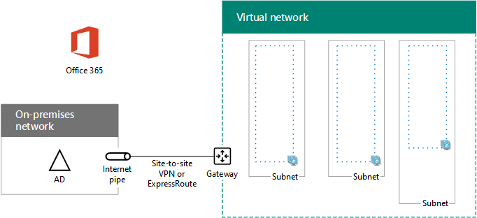

# High availability federated authentication Phase 1: Configure Azure

In this phase, you create the resource groups, virtual network (VNet), and availability sets in Azure that will host the virtual machines in phases 2, 3, and 4. You must complete this phase before moving on to [Phase 2: Configure domain controllers](high-availability-federated-authentication-phase-2-configure-domain-controllers.md). See [Deploy high availability federated authentication for Microsoft 365 in Azure](deploy-high-availability-federated-authentication-for-microsoft-365-in-azure.md) for all of the phases.
  
Azure must be provisioned with these basic components:
  
- Resource groups
    
- A cross-premises Azure virtual network (VNet) with subnets for hosting the Azure virtual machines
    
- Network security groups for performing subnet isolation
    
- Availability sets
    
## Configure Azure components

Before you begin configuring Azure components, fill in the following tables. To assist you in the procedures for configuring Azure, print this section and write down the needed information or copy this section to a document and fill it in. For the settings of the VNet, fill in Table V.
  
|**Item**|**Configuration setting**|**Description**|**Value**|
|:-----|:-----|:-----|:-----|
|1.  <br/> |VNet name  <br/> |A name to assign to the VNet (example FedAuthNet).  <br/> |  <br/> |
|2.  <br/> |VNet location  <br/> |The regional Azure datacenter that will contain the virtual network.  <br/> |  <br/> |
|3.  <br/> |VPN device IP address  <br/> |The public IPv4 address of your VPN device's interface on the Internet.  <br/> |  <br/> |
|4.  <br/> |VNet address space  <br/> |The address space for the virtual network. Work with your IT department to determine this address space.  <br/> |  <br/> |
|5.  <br/> |IPsec shared key  <br/> |A 32-character random, alphanumeric string that will be used to authenticate both sides of the site-to-site VPN connection. Work with your IT or security department to determine this key value. Alternately, see [Create a random string for an IPsec preshared key](https://social.technet.microsoft.com/wiki/contents/articles/32330.create-a-random-string-for-an-ipsec-preshared-key.aspx).  <br/> |  <br/> |
   
 **Table V: Cross-premises virtual network configuration**
  
Next, fill in Table S for the subnets of this solution. All address spaces should be in Classless Interdomain Routing (CIDR) format, also known as network prefix format. An example is 10.24.64.0/20.
  
For the first three subnets, specify a name and a single IP address space based on the virtual network address space. For the gateway subnet, determine the 27-bit address space (with a /27 prefix length) for the Azure gateway subnet with the following:
  
1. Set the variable bits in the address space of the VNet to 1, up to the bits being used by the gateway subnet, then set the remaining bits to 0.
    
2. Convert the resulting bits to decimal and express it as an address space with the prefix length set to the size of the gateway subnet.
    
See [Address space calculator for Azure gateway subnets](address-space-calculator-for-azure-gateway-subnets.md) for a PowerShell command block and C# or Python console application that performs this calculation for you.
  
Work with your IT department to determine these address spaces from the virtual network address space.
  
|**Item**|**Subnet name**|**Subnet address space**|**Purpose**|
|:-----|:-----|:-----|:-----|
|1.  <br/> |  <br/> |  <br/> |The subnet used by the Active Directory Domain Services (AD DS) domain controller and directory synchronization server virtual machines (VMs).  <br/> |
|2.  <br/> |  <br/> |  <br/> |The subnet used by the AD FS VMs.  <br/> |
|3.  <br/> |  <br/> |  <br/> |The subnet used by the web application proxy VMs.  <br/> |
|4.  <br/> |GatewaySubnet  <br/> |  <br/> |The subnet used by the Azure gateway VMs.  <br/> |
   
 **Table S: Subnets in the virtual network**
  
Next, fill in Table I for the static IP addresses assigned to virtual machines and load balancer instances.
  
|**Item**|**Purpose**|**IP address on the subnet**|**Value**|
|:-----|:-----|:-----|:-----|
|1.  <br/> |Static IP address of the first domain controller  <br/> |The fourth possible IP address for the address space of the subnet defined in Item 1 of Table S.  <br/> |  <br/> |
|2.  <br/> |Static IP address of the second domain controller  <br/> |The fifth possible IP address for the address space of the subnet defined in Item 1 of Table S.  <br/> |  <br/> |
|3.  <br/> |Static IP address of the directory synchronization server  <br/> |The sixth possible IP address for the address space of the subnet defined in Item 1 of Table S.  <br/> |  <br/> |
|4.  <br/> |Static IP address of the internal load balancer for the AD FS servers  <br/> |The fourth possible IP address for the address space of the subnet defined in Item 2 of Table S.  <br/> |  <br/> |
|5.  <br/> |Static IP address of the first AD FS server  <br/> |The fifth possible IP address for the address space of the subnet defined in Item 2 of Table S.  <br/> |  <br/> |
|6.  <br/> |Static IP address of the second AD FS server  <br/> |The sixth possible IP address for the address space of the subnet defined in Item 2 of Table S.  <br/> |  <br/> |
|7.  <br/> |Static IP address of the first web application proxy server  <br/> |The fourth possible IP address for the address space of the subnet defined in Item 3 of Table S.  <br/> |  <br/> |
|8.  <br/> |Static IP address of the second web application proxy server  <br/> |The fifth possible IP address for the address space of the subnet defined in Item 3 of Table S.  <br/> |  <br/> |
   
 **Table I: Static IP addresses in the virtual network**
  
For two Domain Name System (DNS) servers in your on-premises network that you want to use when initially setting up the domain controllers in your virtual network, fill in Table D. Work with your IT department to determine this list.
  
|**Item**|**DNS server friendly name**|**DNS server IP address**|
|:-----|:-----|:-----|
|1.  <br/> |  <br/> |  <br/> |
|2.  <br/> |  <br/> |  <br/> |
   
 **Table D: On-premises DNS servers**
  
To route packets from the cross-premises network to your organization network across the site-to-site VPN connection, you must configure the virtual network with a local network that has a list of the address spaces (in CIDR notation) for all of the reachable locations on your organization's on-premises network. The list of address spaces that define your local network must be unique and must not overlap with the address space used for other virtual networks or other local networks.
  
For the set of local network address spaces, fill in Table L. Note that three blank entries are listed but you will typically need more. Work with your IT department to determine this list of address spaces.
  
|**Item**|**Local network address space**|
|:-----|:-----|
|1.  <br/> |  <br/> |
|2.  <br/> |  <br/> |
|3.  <br/> |  <br/> |
   
 **Table L: Address prefixes for the local network**
  
Now let's begin building the Azure infrastructure to host your federated authentication for Microsoft 365.
  
> [!NOTE]
> The following command sets use the latest version of Azure PowerShell. See [Get started with Azure PowerShell](/powershell/azure/get-started-azureps). 
  
First, start an Azure PowerShell prompt and login to your account.
  
```powershell
Connect-AzAccount
```

> [!TIP]
> To generate ready-to-run PowerShell command blocks based on your custom settings, use this [Microsoft Excel configuration workbook](https://github.com/MicrosoftDocs/OfficeDocs-Enterprise/raw/live/Enterprise/downloads/O365FedAuthInAzure_Config.xlsx). 

Get your subscription name using the following command.
  
```powershell
Get-AzSubscription | Sort Name | Select Name
```

For older versions of Azure PowerShell, use this command instead.
  
```powershell
Get-AzSubscription | Sort Name | Select SubscriptionName
```

Set your Azure subscription. Replace everything within the quotes, including the \< and > characters, with the correct name.
  
```powershell
$subscrName="<subscription name>"
Select-AzSubscription -SubscriptionName $subscrName
```

Next, create the new resource groups. To determine a unique set of resource group names, use this command to list your existing resource groups.
  
```powershell
Get-AzResourceGroup | Sort ResourceGroupName | Select ResourceGroupName
```

Fill in the following table for the set of unique resource group names.
  
|**Item**|**Resource group name**|**Purpose**|
|:-----|:-----|:-----|
|1.  <br/> |  <br/> |Domain controllers  <br/> |
|2.  <br/> |  <br/> |AD FS servers  <br/> |
|3.  <br/> |  <br/> |Web application proxy servers  <br/> |
|4.  <br/> |  <br/> |Infrastructure elements  <br/> |
   
 **Table R: Resource groups**
  
Create your new resource groups with these commands.
  
```powershell
$locName="<an Azure location, such as West US>"
$rgName="<Table R - Item 1 - Name column>"
New-AzResourceGroup -Name $rgName -Location $locName
$rgName="<Table R - Item 2 - Name column>"
New-AzResourceGroup -Name $rgName -Location $locName
$rgName="<Table R - Item 3 - Name column>"
New-AzResourceGroup -Name $rgName -Location $locName
$rgName="<Table R - Item 4 - Name column>"
New-AzResourceGroup -Name $rgName -Location $locName
```

Next, you create the Azure virtual network and its subnets.
  
```powershell
$rgName="<Table R - Item 4 - Resource group name column>"
$locName="<your Azure location>"
$vnetName="<Table V - Item 1 - Value column>"
$vnetAddrPrefix="<Table V - Item 4 - Value column>"
$dnsServers=@( "<Table D - Item 1 - DNS server IP address column>", "<Table D - Item 2 - DNS server IP address column>" )
# Get the shortened version of the location
$locShortName=(Get-AzResourceGroup -Name $rgName).Location

# Create the subnets
$subnet1Name="<Table S - Item 1 - Subnet name column>"
$subnet1Prefix="<Table S - Item 1 - Subnet address space column>"
$subnet1=New-AzVirtualNetworkSubnetConfig -Name $subnet1Name -AddressPrefix $subnet1Prefix
$subnet2Name="<Table S - Item 2 - Subnet name column>"
$subnet2Prefix="<Table S - Item 2 - Subnet address space column>"
$subnet2=New-AzVirtualNetworkSubnetConfig -Name $subnet2Name -AddressPrefix $subnet2Prefix
$subnet3Name="<Table S - Item 3 - Subnet name column>"
$subnet3Prefix="<Table S - Item 3 - Subnet address space column>"
$subnet3=New-AzVirtualNetworkSubnetConfig -Name $subnet3Name -AddressPrefix $subnet3Prefix
$gwSubnet4Prefix="<Table S - Item 4 - Subnet address space column>"
$gwSubnet=New-AzVirtualNetworkSubnetConfig -Name "GatewaySubnet" -AddressPrefix $gwSubnet4Prefix

# Create the virtual network
New-AzVirtualNetwork -Name $vnetName -ResourceGroupName $rgName -Location $locName -AddressPrefix $vnetAddrPrefix -Subnet $gwSubnet,$subnet1,$subnet2,$subnet3 -DNSServer $dnsServers

```

Next, you create network security groups for each subnet that has virtual machines. To perform subnet isolation, you can add rules for the specific types of traffic allowed or denied to the network security group of a subnet.
  
```powershell
# Create network security groups
$vnet=Get-AzVirtualNetwork -ResourceGroupName $rgName -Name $vnetName

New-AzNetworkSecurityGroup -Name $subnet1Name -ResourceGroupName $rgName -Location $locShortName
$nsg=Get-AzNetworkSecurityGroup -Name $subnet1Name -ResourceGroupName $rgName
Set-AzVirtualNetworkSubnetConfig -VirtualNetwork $vnet -Name $subnet1Name -AddressPrefix $subnet1Prefix -NetworkSecurityGroup $nsg

New-AzNetworkSecurityGroup -Name $subnet2Name -ResourceGroupName $rgName -Location $locShortName
$nsg=Get-AzNetworkSecurityGroup -Name $subnet2Name -ResourceGroupName $rgName
Set-AzVirtualNetworkSubnetConfig -VirtualNetwork $vnet -Name $subnet2Name -AddressPrefix $subnet2Prefix -NetworkSecurityGroup $nsg

New-AzNetworkSecurityGroup -Name $subnet3Name -ResourceGroupName $rgName -Location $locShortName
$nsg=Get-AzNetworkSecurityGroup -Name $subnet3Name -ResourceGroupName $rgName
Set-AzVirtualNetworkSubnetConfig -VirtualNetwork $vnet -Name $subnet3Name -AddressPrefix $subnet3Prefix -NetworkSecurityGroup $nsg
$vnet | Set-AzVirtualNetwork
```

Next, use these commands to create the gateways for the site-to-site VPN connection.
  
```powershell
$rgName="<Table R - Item 4 - Resource group name column>"
$locName="<Azure location>"
$vnetName="<Table V - Item 1 - Value column>"
$vnet=Get-AzVirtualNetwork -Name $vnetName -ResourceGroupName $rgName
$subnet=Get-AzVirtualNetworkSubnetConfig -VirtualNetwork $vnet -Name "GatewaySubnet"

# Attach a virtual network gateway to a public IP address and the gateway subnet
$publicGatewayVipName="PublicIPAddress"
$vnetGatewayIpConfigName="PublicIPConfig"
New-AzPublicIpAddress -Name $vnetGatewayIpConfigName -ResourceGroupName $rgName -Location $locName -AllocationMethod Dynamic
$publicGatewayVip=Get-AzPublicIpAddress -Name $vnetGatewayIpConfigName -ResourceGroupName $rgName
$vnetGatewayIpConfig=New-AzVirtualNetworkGatewayIpConfig -Name $vnetGatewayIpConfigName -PublicIpAddressId $publicGatewayVip.Id -Subnet $subnet

# Create the Azure gateway
$vnetGatewayName="AzureGateway"
$vnetGateway=New-AzVirtualNetworkGateway -Name $vnetGatewayName -ResourceGroupName $rgName -Location $locName -GatewayType Vpn -VpnType RouteBased -IpConfigurations $vnetGatewayIpConfig

# Create the gateway for the local network
$localGatewayName="LocalNetGateway"
$localGatewayIP="<Table V - Item 3 - Value column>"
$localNetworkPrefix=@( <comma-separated, double-quote enclosed list of the local network address prefixes from Table L, example: "10.1.0.0/24", "10.2.0.0/24"> )
$localGateway=New-AzLocalNetworkGateway -Name $localGatewayName -ResourceGroupName $rgName -Location $locName -GatewayIpAddress $localGatewayIP -AddressPrefix $localNetworkPrefix

# Define the Azure virtual network VPN connection
$vnetConnectionName="S2SConnection"
$vnetConnectionKey="<Table V - Item 5 - Value column>"
$vnetConnection=New-AzVirtualNetworkGatewayConnection -Name $vnetConnectionName -ResourceGroupName $rgName -Location $locName -ConnectionType IPsec -SharedKey $vnetConnectionKey -VirtualNetworkGateway1 $vnetGateway -LocalNetworkGateway2 $localGateway

```

> [!NOTE]
> Federated authentication of individual users does not rely on any on-premises resources. However, if this site-to-site VPN connection becomes unavailable, the domain controllers in the VNet will not receive updates to user accounts and groups made in the on-premises Active Directory Domain Services. To ensure this does not happen, you can configure high availability for your site-to-site VPN connection. For more information, see [Highly Available Cross-Premises and VNet-to-VNet Connectivity](/azure/vpn-gateway/vpn-gateway-highlyavailable)
  
Next, record the public IPv4 address of the Azure VPN gateway for your virtual network from the display of this command:
  
```powershell
Get-AzPublicIpAddress -Name $publicGatewayVipName -ResourceGroupName $rgName
```

Next, configure your on-premises VPN device to connect to the Azure VPN gateway. For more information, see [Configure your VPN device](/azure/vpn-gateway/vpn-gateway-about-vpn-devices).
  
To configure your on-premises VPN device, you will need the following:
  
- The public IPv4 address of the Azure VPN gateway.
    
- The IPsec pre-shared key for the site-to-site VPN connection (Table V - Item 5 - Value column).
    
Next, ensure that the address space of the virtual network is reachable from your on-premises network. This is usually done by adding a route corresponding to the virtual network address space to your VPN device and then advertising that route to the rest of the routing infrastructure of your organization network. Work with your IT department to determine how to do this.
  
Next, define the names of three availability sets. Fill out Table A. 
  
|**Item**|**Purpose**|**Availability set name**|
|:-----|:-----|:-----|
|1.  <br/> |Domain controllers  <br/> |  <br/> |
|2.  <br/> |AD FS servers  <br/> |  <br/> |
|3.  <br/> |Web application proxy servers  <br/> |  <br/> |
   
 **Table A: Availability sets**
  
You will need these names when you create the virtual machines in phases 2, 3, and 4.
  
Create the new availability sets with these Azure PowerShell commands.
  
```powershell
$locName="<the Azure location for your new resource group>"
$rgName="<Table R - Item 1 - Resource group name column>"
$avName="<Table A - Item 1 - Availability set name column>"
New-AzAvailabilitySet -ResourceGroupName $rgName -Name $avName -Location $locName -Sku Aligned  -PlatformUpdateDomainCount 5 -PlatformFaultDomainCount 2
$rgName="<Table R - Item 2 - Resource group name column>"
$avName="<Table A - Item 2 - Availability set name column>"
New-AzAvailabilitySet -ResourceGroupName $rgName -Name $avName -Location $locName -Sku Aligned  -PlatformUpdateDomainCount 5 -PlatformFaultDomainCount 2
$rgName="<Table R - Item 3 - Resource group name column>"
$avName="<Table A - Item 3 - Availability set name column>"
New-AzAvailabilitySet -ResourceGroupName $rgName -Name $avName -Location $locName -Sku Aligned  -PlatformUpdateDomainCount 5 -PlatformFaultDomainCount 2
```

This is the configuration resulting from the successful completion of this phase.
  
**Phase 1: The Azure infrastructure for high availability federated authentication for Microsoft 365**


  
## Next step

Use [Phase 2: Configure domain controllers](high-availability-federated-authentication-phase-2-configure-domain-controllers.md) to continue with the configuration of this workload.
  
## See Also

[Deploy high availability federated authentication for Microsoft 365 in Azure](deploy-high-availability-federated-authentication-for-microsoft-365-in-azure.md)
  
[Federated identity for your Microsoft 365 dev/test environment](federated-identity-for-your-microsoft-365-dev-test-environment.md)
  
[Microsoft 365 solution and architecture center](../solutions/index.yml)

[Understanding Microsoft 365 identity and Azure Active Directory](about-microsoft-365-identity.md)