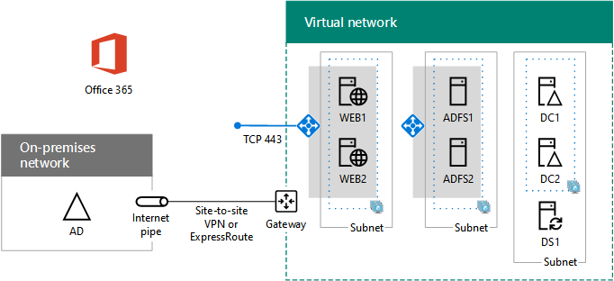

# High availability federated authentication Phase 4: Configure web application proxies

In this phase of deploying high availability for Microsoft 365 federated authentication in Azure infrastructure services, you create an internal load balancer and two AD FS servers.
  
You must complete this phase before moving on to [Phase 5: Configure federated authentication for Microsoft 365](high-availability-federated-authentication-phase-5-configure-federated-authentic.md). See [Deploy high availability federated authentication for Microsoft 365 in Azure](deploy-high-availability-federated-authentication-for-microsoft-365-in-azure.md) for all of the phases.
  
## Create the Internet-facing load balancer in Azure

You must create an Internet-facing load balancer so that Azure distributes the incoming client authentication traffic from the Internet evenly among the two web application proxy servers.
  
> [!NOTE]
> The following command sets use the latest version of Azure PowerShell. See [Get started with Azure PowerShell](/powershell/azure/get-started-azureps). 
  
When you have supplied location and resource group values, run the resulting block at the Azure PowerShell command prompt or in the PowerShell ISE.
  
> [!TIP]
> To generate ready-to-run PowerShell command blocks based on your custom settings, use this [Microsoft Excel configuration workbook](https://github.com/MicrosoftDocs/OfficeDocs-Enterprise/raw/live/Enterprise/downloads/O365FedAuthInAzure_Config.xlsx). 

```powershell
# Set up key variables
$locName="<your Azure location>"
$rgName="<Table R - Item 4 - Resource group name column>"

$publicIP=New-AzPublicIpAddress -ResourceGroupName $rgName -Name "WebProxyPublicIP" -Location $LocName -AllocationMethod "Static"
$frontendIP=New-AzLoadBalancerFrontendIpConfig -Name "WebAppProxyServers-LBFE" -PublicIpAddress $publicIP
$beAddressPool=New-AzLoadBalancerBackendAddressPoolConfig -Name "WebAppProxyServers-LBBE"
$healthProbe=New-AzLoadBalancerProbeConfig -Name "WebServersProbe" -Protocol "TCP" -Port 443 -IntervalInSeconds 15 -ProbeCount 2
$lbrule=New-AzLoadBalancerRuleConfig -Name "WebTraffic" -FrontendIpConfiguration $frontendIP -BackendAddressPool $beAddressPool -Probe $healthProbe -Protocol "TCP" -FrontendPort 443 -BackendPort 443
New-AzLoadBalancer -ResourceGroupName $rgName -Name "WebAppProxyServers" -Location $locName -LoadBalancingRule $lbrule -BackendAddressPool $beAddressPool -Probe $healthProbe -FrontendIpConfiguration $frontendIP
```

To display the public IP address assigned to your Internet-facing load balancer, run these commands at the Azure PowerShell command prompt on your local computer:
  
```powershell
Write-Host (Get-AzPublicIpaddress -Name "WebProxyPublicIP" -ResourceGroup $rgName).IPAddress
```

## Determine your federation service FQDN and create DNS records

You need to determine the DNS name to identify your federation service name on the Internet. Azure AD Connect will configure Microsoft 365 with this name in Phase 5, which will become part of the URL that Microsoft 365 sends to connecting clients to get a security token. An example is fs.contoso.com (fs stands for federation service).
  
Once you have your federation service FDQN, create a public DNS domain A record for the federation service FDQN that resolves to the public IP address of the Azure Internet-facing load balancer.
  
|**Name**|**Type**|**TTL**|**Value**|
|:-----|:-----|:-----|:-----|
|federation service FDQN  <br/> |A  <br/> |3600  <br/> |public IP address of the Azure Internet-facing load balancer (displayed by the **Write-Host** command in the previous section) <br/> |
   
Here is an example:
  
|**Name**|**Type**|**TTL**|**Value**|
|:-----|:-----|:-----|:-----|
|fs.contoso.com  <br/> |A  <br/> |3600  <br/> |131.107.249.117  <br/> |
   
Next, add a DNS address record to your organization's private DNS namespace that resolves your federation service FQDN to the private IP address assigned to the internal load balancer for the AD FS servers (Table I, item 4, Value column).
  
## Create the web application proxy server virtual machines in Azure

Use the following block of Azure PowerShell commands to create the virtual machines for the two web application proxy servers. 
  
Note that the following Azure PowerShell command sets use values from the following tables:
  
- Table M, for your virtual machines
    
- Table R, for your resource groups
    
- Table V, for your virtual network settings
    
- Table S, for your subnets
    
- Table I, for your static IP addresses
    
- Table A, for your availability sets
    
Recall that you defined Table M in [Phase 2: Configure domain controllers](high-availability-federated-authentication-phase-2-configure-domain-controllers.md) and Tables R, V, S, I, and A in [Phase 1: Configure Azure](high-availability-federated-authentication-phase-1-configure-azure.md).
  
When you have supplied all the proper values, run the resulting block at the Azure PowerShell command prompt or in the PowerShell ISE.
  
```powershell
# Set up variables common to both virtual machines
$locName="<your Azure location>"
$vnetName="<Table V - Item 1 - Value column>"
$subnetName="<Table R - Item 3 - Subnet name column>"
$avName="<Table A - Item 3 - Availability set name column>"
$rgNameTier="<Table R - Item 3 - Resource group name column>"
$rgNameInfra="<Table R - Item 4 - Resource group name column>"

$rgName=$rgNameInfra
$vnet=Get-AzVirtualNetwork -Name $vnetName -ResourceGroupName $rgName
$subnet=Get-AzVirtualNetworkSubnetConfig -VirtualNetwork $vnet -Name $subnetName
$backendSubnet=Get-AzVirtualNetworkSubnetConfig -Name $subnetName -VirtualNetwork $vnet
$webLB=Get-AzLoadBalancer -ResourceGroupName $rgName -Name "WebAppProxyServers"

$rgName=$rgNameTier
$avSet=Get-AzAvailabilitySet -Name $avName -ResourceGroupName $rgName

# Create the first web application proxy server virtual machine
$vmName="<Table M - Item 6 - Virtual machine name column>"
$vmSize="<Table M - Item 6 - Minimum size column>"
$staticIP="<Table I - Item 7 - Value column>"
$diskStorageType="<Table M - Item 6 - Storage type column>"

$nic=New-AzNetworkInterface -Name ($vmName +"-NIC") -ResourceGroupName $rgName -Location $locName -Subnet $backendSubnet -LoadBalancerBackendAddressPool $webLB.BackendAddressPools[0] -PrivateIpAddress $staticIP
$vm=New-AzVMConfig -VMName $vmName -VMSize $vmSize -AvailabilitySetId $avset.Id

$cred=Get-Credential -Message "Type the name and password of the local administrator account for the first web application proxy server." 
$vm=Set-AzVMOperatingSystem -VM $vm -Windows -ComputerName $vmName -Credential $cred -ProvisionVMAgent -EnableAutoUpdate
$vm=Set-AzVMSourceImage -VM $vm -PublisherName MicrosoftWindowsServer -Offer WindowsServer -Skus 2016-Datacenter -Version "latest"
$vm=Add-AzVMNetworkInterface -VM $vm -Id $nic.Id
$vm=Set-AzVMOSDisk -VM $vm -Name ($vmName +"-OS") -DiskSizeInGB 128 -CreateOption FromImage -StorageAccountType $diskStorageType
New-AzVM -ResourceGroupName $rgName -Location $locName -VM $vm

# Create the second web application proxy virtual machine
$vmName="<Table M - Item 7 - Virtual machine name column>"
$vmSize="<Table M - Item 7 - Minimum size column>"
$staticIP="<Table I - Item 8 - Value column>"
$diskStorageType="<Table M - Item 7 - Storage type column>"

$nic=New-AzNetworkInterface -Name ($vmName +"-NIC") -ResourceGroupName $rgName -Location $locName  -Subnet $backendSubnet -LoadBalancerBackendAddressPool $webLB.BackendAddressPools[0] -PrivateIpAddress $staticIP
$vm=New-AzVMConfig -VMName $vmName -VMSize $vmSize -AvailabilitySetId $avset.Id

$cred=Get-Credential -Message "Type the name and password of the local administrator account for the second web application proxy server." 
$vm=Set-AzVMOperatingSystem -VM $vm -Windows -ComputerName $vmName -Credential $cred -ProvisionVMAgent -EnableAutoUpdate
$vm=Set-AzVMSourceImage -VM $vm -PublisherName MicrosoftWindowsServer -Offer WindowsServer -Skus 2016-Datacenter -Version "latest"
$vm=Add-AzVMNetworkInterface -VM $vm -Id $nic.Id
$vm=Set-AzVMOSDisk -VM $vm -Name ($vmName +"-OS") -DiskSizeInGB 128 -CreateOption FromImage -StorageAccountType $diskStorageType
New-AzVM -ResourceGroupName $rgName -Location $locName -VM $vm
```

> [!NOTE]
> Because these virtual machines are for an intranet application, they are not assigned a public IP address or a DNS domain name label and exposed to the Internet. However, this also means that you cannot connect to them from the Azure portal. The **Connect** option is unavailable when you view the properties of the virtual machine. Use the Remote Desktop Connection accessory or another Remote Desktop tool to connect to the virtual machine using its private IP address or intranet DNS name and the credentials of the local administrator account.
  
Here is the configuration resulting from the successful completion of this phase, with placeholder computer names.
  
**Phase 4: The Internet-facing load balancer and web application proxy servers for your high availability federated authentication infrastructure in Azure**


  
## Next step

Use [Phase 5: Configure federated authentication for Microsoft 365](high-availability-federated-authentication-phase-5-configure-federated-authentic.md) to continue configuring this workload.
  
## See Also

[Deploy high availability federated authentication for Microsoft 365 in Azure](deploy-high-availability-federated-authentication-for-microsoft-365-in-azure.md)
  
[Federated identity for your Microsoft 365 dev/test environment](federated-identity-for-your-microsoft-365-dev-test-environment.md)
  
[Microsoft 365 solution and architecture center](../solutions/index.yml)