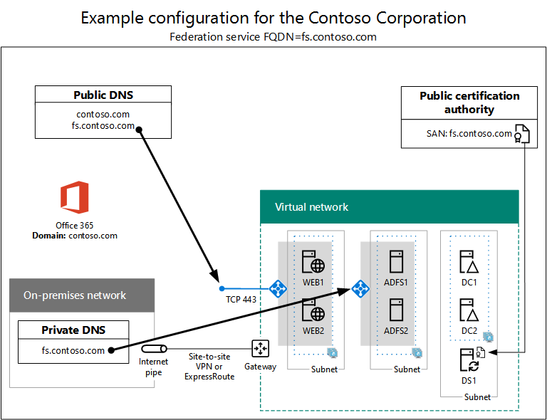
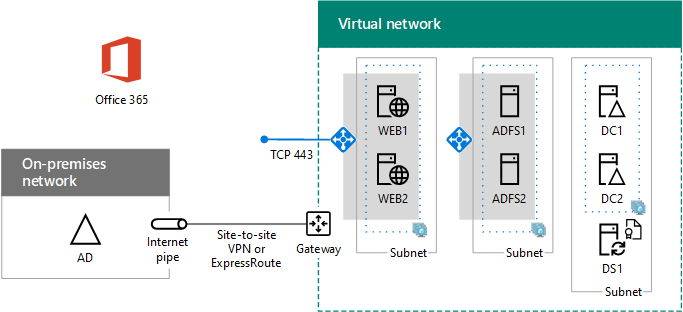

# High availability federated authentication Phase 5: Configure federated authentication for Microsoft 365

In this final phase of deploying high availability federated authentication for Microsoft 365 in Azure infrastructure services, you get and install a certificate issued by a public certification authority, verify your configuration, and then install and run Azure AD Connect on the directory synchronization server. Azure AD Connect configures your Microsoft 365 subscription and your Active Directory Federation Services (AD FS) and web application proxy servers for federated authentication.
  
See [Deploy high availability federated authentication for Microsoft 365 in Azure](deploy-high-availability-federated-authentication-for-microsoft-365-in-azure.md) for all of the phases.
  
## Get a public certificate and copy it to the directory synchronization server

Get a digital certificate from a public certification authority with the following properties:
  
- An X.509 certificate suitable for creating SSL connections.
    
- The Subject Alternative Name (SAN) extended property is set to your federation service FQDN (example: fs.contoso.com).
    
- The certificate must have the private key and be stored in PFX format.
    
Additionally, your organization computers and devices must trust the public certification authority that is issuing the digital certificate. This trust is established by having a root certificate from the public certification authority installed in the trusted root certification authorities store on your computers and devices. Computers running Microsoft Windows typically have a set of these types of certificates installed from commonly-used certification authorities. If the root certificate from your public certification authority is not already installed, you must deploy this to the computers and devices of your organization.
  
For more information about certificate requirements for federated authentication, see [Prerequisites for federation installation and configuration](/azure/active-directory/connect/active-directory-aadconnect-prerequisites#prerequisites-for-federation-installation-and-configuration).
  
When you receive the certificate, copy it to a folder on the C: drive of the directory synchronization server. For example, name the file SSL.pfx and store it in the C:\\Certs folder on the directory synchronization server.
  
## Verify your configuration

You should now be ready to configure Azure AD Connect and federated authentication for Microsoft 365. To ensure that you are, here is a checklist:
  
- Your organization's public domain is added to your Microsoft 365 subscription.
    
- Your organization's Microsoft 365 user accounts are configured to your organization's public domain name and can successfully sign in.
    
- You have determined a federation service FQDN based your public domain name.
    
- A public DNS A record for your federation service FQDN points to the public IP address of the Internet-facing Azure load balancer for the web application proxy servers.
    
- A private DNS A record for your federation service FQDN points to the private IP address of the internal Azure load balancer for the AD FS servers.
    
- A public certification authority-isssued digital certificate suitable for SSL connections with the SAN set to your federation service FQDN is a PFX file stored on your directory synchronization server.
    
- The root certificate for the public certification authority is installed in the Trusted Root Certification Authorities store on your computers and devices.
    
Here is an example for the Contoso organization:
  
**An example configuration for a high availability federated authentication infrastructure in Azure**

  
## Run Azure AD Connect to configure federated authentication

The Azure AD Connect tool configures the AD FS servers, the web application proxy servers, and Microsoft 365 for federated authentication with these steps:
  
1. Create a remote desktop connection to your directory synchronization server with a domain account that has local administrator privileges.
    
2. From the desktop of the directory synchronization server, open Internet Explorer and go to [https://aka.ms/aadconnect](https://aka.ms/aadconnect).
    
3. On the **Microsoft Azure Active Directory Connect** page, click **Download**, and then click **Run**.
    
4. On the **Welcome to Azure AD Connect** page, click **I agree**, and then click **Continue.**
    
5. On the **Express Settings** page, click **Customize**.
    
6. On the **Install required components** page, click **Install**.
    
7. On the **User sign-in** page, click **Federation with AD FS**, and then click **Next**.
    
8. On the **Connect to Azure AD** page, type the name and password of a global administrator account for your Microsoft 365 subscription, and then click **Next**.
    
9. On the **Connect your directories** page, ensure that your on-premises Active Directory Domain Services (AD DS) forest is selected in **Forest**, type the name and password of a domain administrator account, click **Add Directory**, and then click **Next**.
    
10. On the **Azure AD sign-in configuration** page, click **Next**.
    
11. On the **Domain and OU filtering** page, click **Next**.
    
12. On the **Uniquely identifying your users** page, click **Next**.
    
13. On the **Filter users and devices** page, click **Next**.
    
14. On the **Optional features** page, click **Next**.
    
15. On the **AD FS farm** page, click **Configure a new AD FS farm**.
    
16. Click **Browse** and specify the location and name of the SSL certificate from the public certification authority.
    
17. When prompted, type the certificate password, and then click **OK**.
    
18. Verify that the **Subject Name** and **Federation Service Name** are set to your federation service FQDN, and then click **Next**.
    
19. On the **AD FS servers** page, type your first AD FS server's name (Table M - Item 4 - Virtual machine name column), and then click **Add**.
    
20. Type your second AD FS server's name (Table M - Item 5 - Virtual machine name column), click **Add**, and then click **Next**.
    
21. On the **Web Application Proxy servers** page, type your first web application proxy server's name (Table M - Item 6 - Virtual machine name column), and then click **Add**.
    
22. Type your second web application proxy server's name (Table M - Item 7 - Virtual machine name column), click **Add**, and then click **Next**.
    
23. On the **Domain Administrator credentials** page, type the user name and password of a domain administrator account, and then click **Next**.
    
24. On the **AD FS service account** page, type the user name and password of an enterprise administrator account, and then click **Next**.
    
25. On the **Azure AD Domain** page, in **Domain**, select your organization's DNS domain name, and then click **Next**.
    
26. On the **Ready to configure** page, click **Install**.
    
27. On the **Installation complete** page, click **Verify**. You should see two messages indicating that both the intranet and Internet configuration was successfully verified.
    
  - The intranet message should list the private IP address of your Azure internal load balancer for your AD FS servers.
    
  - The Internet message should list the public IP address of your Azure Internet-facing load balancer for your web application proxy servers.
    
28. On the **Installation complete** page, click **Exit**.
    
Here is the final configuration, with placeholder names for the servers.
  
**Phase 5: The final configuration of a high availability federated authentication infrastructure in Azure**

  
Your high availability federated authentication infrastructure for Microsoft 365 in Azure is complete.
  
## See Also

[Deploy high availability federated authentication for Microsoft 365 in Azure](deploy-high-availability-federated-authentication-for-microsoft-365-in-azure.md)
  
[Federated identity for your Microsoft 365 dev/test environment](federated-identity-for-your-microsoft-365-dev-test-environment.md)
  
[Microsoft 365 solution and architecture center](../solutions/index.yml)

[Federated identity for Microsoft 365](https://support.office.com/article/Understanding-Office-365-identity-and-Azure-Active-Directory-06a189e7-5ec6-4af2-94bf-a22ea225a7a9#bk_federated)