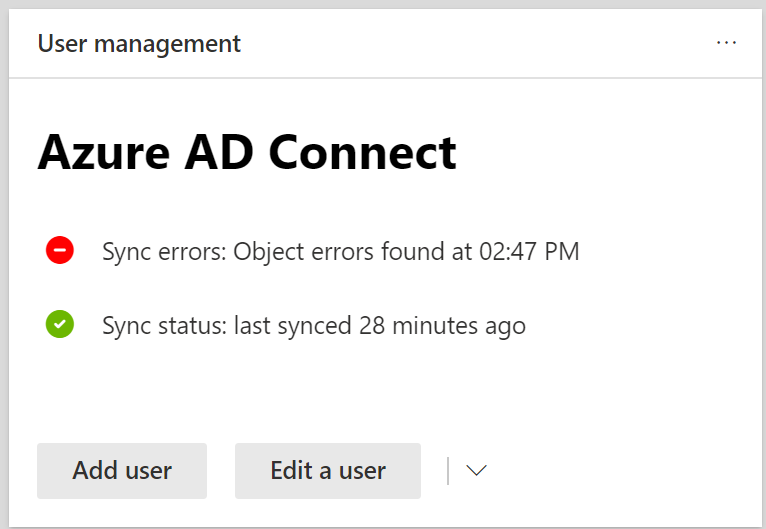
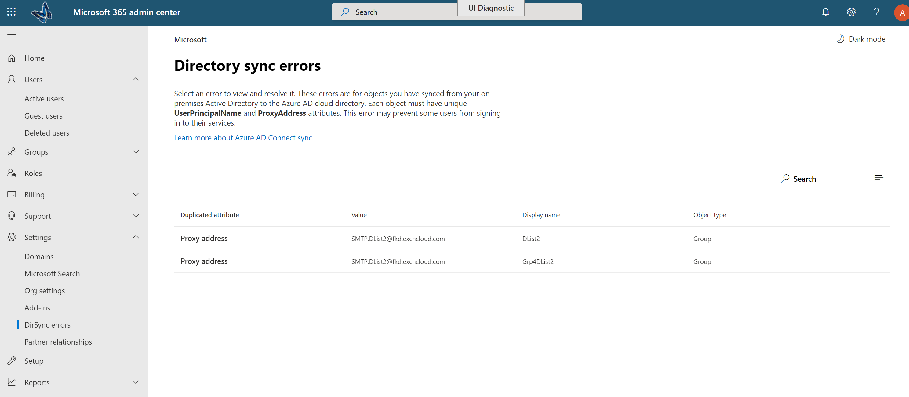
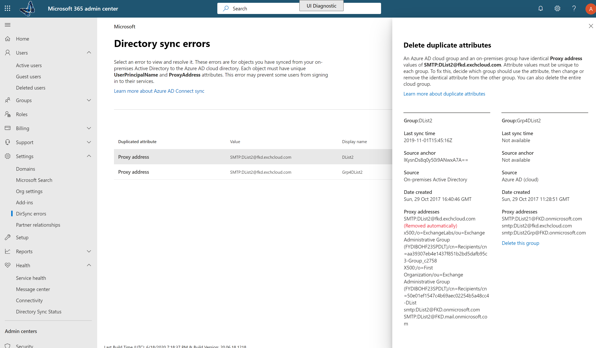

# View directory synchronization errors in Microsoft 365

You can view directory synchronization errors in the Microsoft 365 admin center. Only the User object errors are displayed. To view errors with PowerShell, see [Identify objects with DirSyncProvisioningErrors](/azure/active-directory/hybrid/how-to-connect-syncservice-duplicate-attribute-resiliency).

## View directory synchronization errors in the Microsoft 365 admin center

To view any errors in the Microsoft 365 admin center:
  
1. Sign in to the [Microsoft 365 admin center](https://admin.microsoft.com) with a global administrator account. 
    
2. On the **Home** page, you'll see the **User management** card. 
    
    
  
3. On the card, choose **Sync errors** under **Azure AD Connect** to see the errors on the **Directory sync errors** page.   
    
    

4. Choose any of the errors to display the details pane with information about the error and tips on how to fix it.

   
  
After viewing, see [fixing problems with directory synchronization for Microsoft 365](fix-problems-with-directory-synchronization.md) to correct any identified issues.