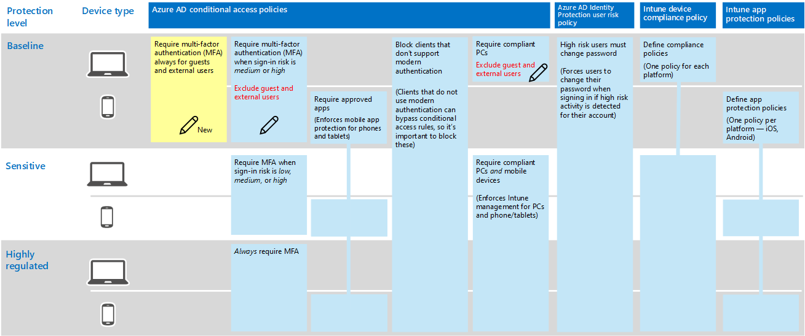

# Policies for allowing guest and external B2B access
This article describes how to adjust the recommended common identity and device access policies to allow B2B account access (guest and external users). This guidance builds on the [Common identity and device access policies](identity-access-policies.md).

These recommendations are designed to apply to the **baseline** tier of protection. However, you can adjust the recommendations based on the granularity of your needs for **sensitive** and **highly regulated** protection. 

Providing a path for B2B users to authenticate with your Azure AD tenant doesn't give these users access to your entire environment. B2B users only have access to resources that are shared with them (such as files) within the services granted in the conditional access policies.

## Updating the common policies to allow and protect guest and external access 

The following diagram illustrates the common identity and device access policies and indicates (with a pencil icon) which policies to add or update to protect guest and external access. 

The following table lists the policies you either need to update or create new. The common policies link to the associated configuration instructions in the [Common identity and device access policies](identity-access-policies.md) article.

|Protection level|Policies|More information|
|:---------------|:-------|:----------------|
|**Baseline**|[Require MFA always for guest and external users](identity-access-policies.md#require-mfa-based-on-sign-in-risk)|Create this new rule and apply it only to guests and external users. Under sign-in risk, leave all options unchecked to always enforce MFA.|
|        |[Require MFA when sign-in risk is *medium* or *high*](identity-access-policies.md#require-mfa-based-on-sign-in-risk)|Modify this rule to exclude guest and external users.|
|        |[Require compliant PCs](identity-access-policies.md#require-compliant-pcs-but-not-compliant-phones-and-tablets)|Modify this rule to exclude guest and external users.|

To include or exclude guests and external users in conditional access rules, click the include or exclude tab and check **All guests and external users**.

## More information

### Guests vs. external users
In Azure AD, guest and external users are the same. The user type for both of these is Guest. Guest users are B2B users.

Microsoft Teams differentiates between guest users and external users within the app, but these are both B2B users when authenticating. For more information about Teams guest and external users, see [Enabling guest and external access for Teams](teams-access-policies.md#enabling-guest-and-external-access-for-teams).

### Require MFA always for guest and external users
This rule prompts guests to register for MFA in your tenant, regardless of whether they're registered for MFA in their home tenant. When accessing resources in your tenant, guests and external users are required to use MFA for every request. 

### Excluding guest and external users from risk-based MFA
While organizations can enforce risk-based policies for B2B users using Identity Protection, there are limitations in the implementation of Identity Protection for B2B collaboration users in a resource directory due to their identity existing in their home directory. Due to these limitations, Microsoft recommends you exclude guest users from risk-based MFA policies and require these users to always use MFA. 

For more information, see [Limitations of Identity Protection for B2B collaboration users](https://docs.microsoft.com/azure/active-directory/identity-protection/concept-identity-protection-b2b#limitations-of-identity-protection-for-b2b-collaboration-users). 

### Excluding guest and external users from device management 
Only one organization can manage a device. If you don't exclude guest and external users from policies that require device compliance, these policies will block these users. 

## Next steps

[Learn how to enable Teams conditional access](teams-access-policies.md)

