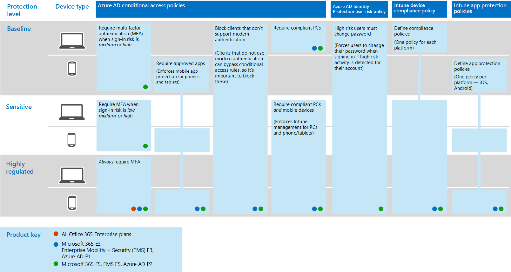
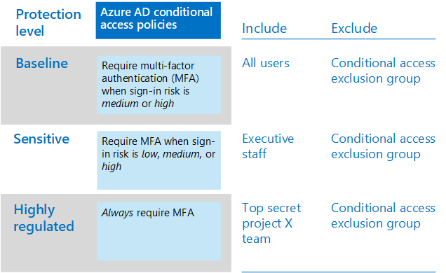

# Common identity and device access policies
This article describes the common recommended policies for securing access to cloud services, including on-premises applications published with Azure AD Application Proxy. 

This guidance discusses how to deploy the recommended policies in a newly-provisioned environment. Setting up these policies in a separate lab environment allows you to understand and evaluate the recommended policies before staging the rollout to your preproduction and production environments. Your newly provisioned environment may be cloud-only or hybrid.  

## Policy set 

The following diagram illustrates the recommended set of policies. It shows which tier of protections each policy applies to and whether the policies apply to PCs or phones and tablets, or both categories of devices. It also indicates where these policies are configured.

The rest of this article describes how to configure these policies. 

Using multi-factor authentication is recommended before enrolling devices into Intune for assurance that the device is in the possession of the intended user. You must also enroll devices into Intune before enforcing device compliance policies.

To give you time to accomplish these tasks, we recommend implementing the baseline policies in the order listed in this table. However, the MFA policies for sensitive and highly regulated protection can be implemented at any time.

|Protection level|Policies|More information|
|:---------------|:-------|:----------------|
|**Baseline**|[Require MFA when sign-in risk is *medium* or *high*](#require-mfa-based-on-sign-in-risk)| |
|        |[Block clients that don't support modern authentication](#block-clients-that-dont-support-modern-authentication)|Clients that do not use modern authentication can bypass conditional access rules, so it's important to block these|
|        |[High risk users must change password](#high-risk-users-must-change-password)|Forces users to change their password when signing in if high-risk activity is detected for their account|
|        |[Define app protection policies](#define-app-protection-policies)|One policy per platform (iOS, Android, Windows).|
|        |[Require approved apps](#require-approved-apps)|Enforces mobile app protection for phones and tablets|
|        |[Define device compliance policies](#define-device-compliance-policies)|One policy for each platform|
|        |[Require compliant PCs](#require-compliant-pcs-but-not-compliant-phones-and-tablets)|Enforces Intune management of PCs|
|**Sensitive**|[Require MFA when sign-in risk is *low*, *medium* or *high*](#require-mfa-based-on-sign-in-risk)| |
|         |[Require compliant PCs *and* mobile devices](#require-compliant-pcs-and-mobile-devices)|Enforces Intune management for PCs and phone/tablets|
|**Highly regulated**|[*Always* require MFA](#require-mfa-based-on-sign-in-risk)|
| | |

## Assigning policies to users
Before configuring policies, identify the Azure AD groups you are using for each tier of protection. Typically, baseline protection applies to everybody in the organization. A user who is included for both baseline and sensitive protection will have all the baseline policies applied plus the sensitive policies. Protection is cumulative and the most restrictive policy is enforced. 

A recommended practice is to create an Azure AD group for conditional access exclusion. Add this group to all of your conditional access rules under "Exclude". This gives you a method to provide access to a user while you troubleshoot access issues. This is recommended as a temporary solution only. Monitor this group for changes and be sure the exclusion group is being used only as intended. 

The following diagram provides an example of user assignment and exclusions.

In the illustration the "Top secret project X team" is assigned a conditional access policy that requires MFA *always*. Be judicious when applying higher levels of protection to users. Members of this project team will be required to provide two forms of authentication every time they log on, even if they are not viewing highly-regulated content.  

All Azure AD groups created as part of these recommendations must be created as Office 365 groups. This is specifically important for the deployment of Azure Information Protection (AIP) when securing documents in SharePoint Online.

## Require MFA based on sign-in risk
Before requiring MFA, first use an Identity Protection MFA registration policy to register users for MFA. After users are registered you can enforce MFA for sign-in. The [prerequisite work](identity-access-prerequisites.md) includes registering all users with MFA.

To create a new conditional access policy: 

1. Go to the [Azure portal](https://portal.azure.com), and sign in with your credentials. After you've successfully signed in, you see the Azure dashboard.

2. Choose **Azure Active Directory** from the left menu.

3. Under the **Security** section, choose **Conditional access**.

4. Choose **New policy**.

 The following tables describes the conditional access policy settings to implement for this policy.

**Assignments**

|Type|Properties|Values|Notes|
|:---|:---------|:-----|:----|
|Users and groups|Include|Select users and groups – Select specific security group containing targeted users|Start with security group including pilot users|
||Exclude|Exception security group; service accounts (app identities)|Membership modified on an as-needed temporary basis|
|Cloud apps|Include|Select the apps you want this rule to apply to. For example, select Office 365 Exchange Online||
|Conditions|Configured|Yes|Configure specific to your environment and needs|
|Sign-in risk|Risk level||See the guidance in the following table|

**Sign-in risk**

Apply the settings based on the protection level you are targeting.

|Property|Level of protection|Values|Notes|
|:---|:---------|:-----|:----|
|Risk level|Baseline|High, medium|Check both|
| |Sensitive|High, medium, low|Check all three|
| |Highly regulated| |Leave all options unchecked to always enforce MFA|

**Access controls**

|Type|Properties|Values|Notes|
|:---|:---------|:-----|:----|
|Grant|Grant access|True|Selected|
||Require MFA|True|Check|
||Require device to be marked as compliant|False||
||Require hybrid Azure AD-joined device|False||
||Require approved client app|False||
||Require all the selected controls|True|Selected|

> [!NOTE]
> Be sure to enable this policy, by choosing **On**. Also consider using the [What if](https://docs.microsoft.com/azure/active-directory/active-directory-conditional-access-whatif) tool to test the policy.

## Block clients that don't support modern authentication
1. Go to the [Azure portal](https://portal.azure.com), and sign in with your credentials. After you've successfully signed in, you see the Azure dashboard.

2. Choose **Azure Active Directory** from the left menu.

3. Under the **Security** section, choose **Conditional access**.

4. Choose **New policy**.

The following tables describes the conditional access policy settings to implement for this policy.

**Assignments**

|Type|Properties|Values|Notes|
|:---|:---------|:-----|:----|
|Users and groups|Include|Select users and groups – Select specific security group containing targeted users|Start with security group including pilot users|
||Exclude|Exception security group; service accounts (app identities)|Membership modified on an as needed temporary basis|
|Cloud apps|Include|Select the apps you want this rule to apply to. For example, select Office 365 Exchange Online||
|Conditions|Configured|Yes|Configure Client apps|
|Client apps|Configured|Yes|Mobile apps and desktop clients, Other clients (select both)|

**Access controls**

|Type|Properties|Values|Notes|
|:---|:---------|:-----|:----|
|Grant|Block access|True|Selected|
||Require MFA|False||
||Require device to be marked as compliant|False||
||Require hybrid Azure AD-joined device|False||
||Require approved client app|False||
||Require all the selected controls|True|Selected|

> [!NOTE]
> Be sure to enable this policy, by choosing **On**. Also consider using the [What if](https://docs.microsoft.com/azure/active-directory/active-directory-conditional-access-whatif) tool to test the policy.

## High risk users must change password
To ensure that all high-risk users' compromised accounts are forced to perform a password change when signing-in, you must apply the following policy.

Log in to the [Microsoft Azure portal (https://portal.azure.com)](https://portal.azure.com/) with your administrator credentials, and then navigate to **Azure AD Identity Protection > User Risk Policy**.

**Assignments**

|Type|Properties|Values|Notes|
|:---|:---------|:-----|:----|
|Users|Include|All users|Selected|
||Exclude|None||
|Conditions|User risk|High|Selected|

**Controls**

| Type | Properties | Values                  | Notes |
|:-----|:-----------|:------------------------|:------|
|      | Access     | Allow access            | True  |
|      | Access     | Require password change | True  |

**Review:** not applicable

> [!NOTE]
> Be sure to enable this policy, by choosing **On**. Also consider using the [What if](https://docs.microsoft.com/azure/active-directory/active-directory-conditional-access-whatif) tool to test the policy

## Define app protection policies
App protection policies define which apps are allowed and the actions they can take with your organization's data. Create Intune app protection policies from within the Azure portal. 

Create a policy for each platform:
- iOS
- Android
- Windows 10

To create a new app protection policy, sign in to the Microsoft Azure portal with your administrator credentials, and then navigate to **Client apps** > **App protection policies**. Choose **Create policy**.

There are slight differences in the app protection policy options between iOS and Android. The below policy is specifically for Android. Use this as a guide for your other policies.

The recommended list of apps includes the following:
- PowerPoint
- Excel
- Word
- Microsoft Teams
- Microsoft SharePoint
- Microsoft Visio Viewer
- OneDrive
- OneNote
- Outlook

The following tables describe the recommended settings:

|Type|Properties|Values|Notes|
|:---|:---------|:-----|:----|
|Data relocation|Prevent Android backup|Yes|On iOS this will specifically call out iTunes and iCloud|
||Allow app to transfer data to other apps|Policy managed apps||
||Allow app to receive data from other apps|Policy managed apps||
||Prevent "Save As"|Yes||
||Select which storage services corporate data can be saved to|OneDrive for Business, SharePoint||
||Restrict cut, copy, and paste with other apps|Policy managed apps with paste in||
||Restrict web content to display in the managed browser|No||
||Encrypt app data|Yes|On iOS select option: When device is locked|
||Disable app encryption when device is enabled|Yes|Disable this setting to avoid double encryption|
||Disable contacts sync|No||
||Disable printing|No||
|Access|Require PIN for access|Yes||
||Select Type|Numeric||
||Allow simple PIN|No||
||PIN length|6||
||Allow fingerprint instead of PIN|Yes||
||Disable app PIN when device PIN is managed|Yes||
||Require corporate credentials for access|No||
||Recheck the access requirement after (minutes)|30||
||Block screen capture and Android assistant|No|On iOS this is not an available option|
|Sign-in security requirements|Max PIN attempts|5|Reset Pin|
||Offline grace period|720|Block access|
||Offline interval (days) before app data is wiped|90|Wipe data|
||Jailbroken/rooted devices| |Wipe data|

When complete, remember to select "Create". Repeat the above steps and replace the selected platform (dropdown) with iOS. This creates two app policies, so once you create the policy, then assign groups to the policy and deploy it.

To edit the policies and assign these policies to users, see [How to create and assign app protection policies](https://docs.microsoft.com/intune/app-protection-policies). 

## Require approved apps
To require approved apps:

1. Go to the [Azure portal](https://portal.azure.com), and sign in with your credentials. After you've successfully signed in, you see the Azure dashboard.

2. Choose **Azure Active Directory** from the left menu.

3. Under the **Security** section, choose **Conditional access**.

4. Choose **New policy**.

5. Enter a policy name, then choose the **Users and groups** you want to apply the policy for.

6. Choose **Cloud apps**.

7. Choose **Select apps**, select the desired apps from the **Cloud apps** list. For example, select Office 365 Exchange Online. Choose **Select** and **Done**.

8. Choose **Conditions**, select **Device platforms**, then choose **Configure**

9. Under **Include**, choose **Select device platforms**, select **Android** and **iOS**. Click **Done** and **Done** again

10. Choose **Grant** from the **Access controls** section.

11. Choose **Grant access**, select **Require approved client app**. For multiple controls, select **Require the selected controls**, then choose **Select**. 

12. Choose **Create**.

## Define device-compliance policies

Device-compliance policies define the requirements that devices must adhere to in order to be marked as compliant. Create Intune device compliance policies from within the Azure portal. 

Create a policy for each platform:
- Android
- Android enterprise
- iOS
- macOS
- Windows Phone 8.1
- Windows 8.1 and later
- Windows 10 and later

To create device compliance policies, log in to the Microsoft Azure portal with your administer credentials, and then navigate to **Intune > Device compliance**. Select **Create policy**.

The following settings are recommended for Windows 10.

**Device health: Windows Health Attestation Service evaluation rules**

|Properties|Values|Notes|
|:---------|:-----|:----|
|Require BitLocker|Require||
|Require Secure Boot to be enabled on the device|Require||
|Require code integrity|Require||

**Device properties**

|Type|Properties|Values|Notes|
|:---|:---------|:-----|:----|
|Operating system version|All|Not configured||

For all the above policies to be considered deployed, they must be targeted at user groups. You can do this by creating the policy (on Save) or later by selecting **Manage Deployment** in the **Policy** section (same level as Add).

**System security**

|Type|Properties|Values|Notes|
|:---|:---------|:-----|:----|
|Password|Require a password to unlock mobile devices|Require||
||Simple passwords|Block||
||Password type|Device default||
||Minimum password length|6||
||Maximum minutes of inactivity before password is required|15|This setting is supported for Android versions 4.0 and above or KNOX 4.0 and above. For iOS devices, it’s supported for iOS 8.0 and above|
||Password expiration (days)|41||
||Number of previous passwords to prevent reuse|5||
||Require password when device returns from idle state (Mobile and Holographic)|Require|Available for Windows 10 and later|
|Encryption|Encryption of data storage on device|Require||
|Device Security|Firewall|Require||
||Antivirus|Require||
||Antispyware|Require|This setting requires an Anti-Spyware solution registered with Windows Security Center|
|Defender|Windows Defender Antimalware|Require||
||Windows Defender Antimalware minimum version||Only supported for Windows 10 desktop. Microsoft recommends versions no more than five behind from the most recent version|
||Windows Defender Antimalware signature up to date|Require||
||Real-time protection|Require|Only supported for Windows 10 desktop|

**Microsoft Defender ATP**

|Type|Properties|Values|Notes|
|:---|:---------|:-----|:----|
|Microsoft Defender Advanced Threat Protection rules|Require the device to be at or under the machine-risk score|Medium||

## Require compliant PCs (but not compliant phones and tablets)
Before adding a policy to require compliant PCs, be sure to enroll devices for management into Intune. Using multi-factor authentication is recommended before enrolling devices into Intune for assurance that the device is in the possession of the intended user. 

To require compliant PCs:

1. Go to the [Azure portal](https://portal.azure.com), and sign in with your credentials. After you've successfully signed in, you see the Azure dashboard.

2. Choose **Azure Active Directory** from the left menu.

3. Under the **Security** section, choose **Conditional access**.

4. Choose **New policy**.

5. Enter a policy name, then choose the **Users and groups** you want to apply the policy for.

6. Choose **Cloud apps**.

7. Choose **Select apps**, select the desired apps from the **Cloud apps** list. For example, select Office 365 Exchange Online. Choose **Select** and **Done**.

8. To require compliant PCs, but not compliant phones and tablets, choose **Conditions** and **Device platforms**. Choose **Select device platforms** and select **Windows** and **macOS**.

9. Choose **Grant** from the **Access controls** section.

10. Choose **Grant access**, select **Require device to be marked as compliant**. For multiple controls, select **Require all the selected controls**, then choose **Select**. 

11. Choose **Create**.

If your objective is to require compliant PCs *and* mobile devices, do not select platforms. This enforces compliance for all devices. 

## Require compliant PCs *and* mobile devices

To require compliance for all devices:

1. Go to the [Azure portal](https://portal.azure.com), and sign in with your credentials. After you've successfully signed in, you see the Azure dashboard.

2. Choose **Azure Active Directory** from the left menu.

3. Under the **Security** section, choose **Conditional access**.

4. Choose **New policy**.

5. Enter a policy name, then choose the **Users and groups** you want to apply the policy for.

6. Choose **Cloud apps**.

7. Choose **Select apps**, select the desired apps from the **Cloud apps** list. For example, select Office 365 Exchange Online. Choose **Select** and **Done**.

8. Choose **Grant** from the **Access controls** section.

9. Choose **Grant access**, select **Require device to be marked as compliant**. For multiple controls, select **Require all the selected controls**, then choose **Select**. 

10. Choose **Create**.

When creating this policy, do not select platforms. This enforces compliant devices.

## Next steps

[Learn about policy recommendations for securing email](secure-email-recommended-policies.md)
