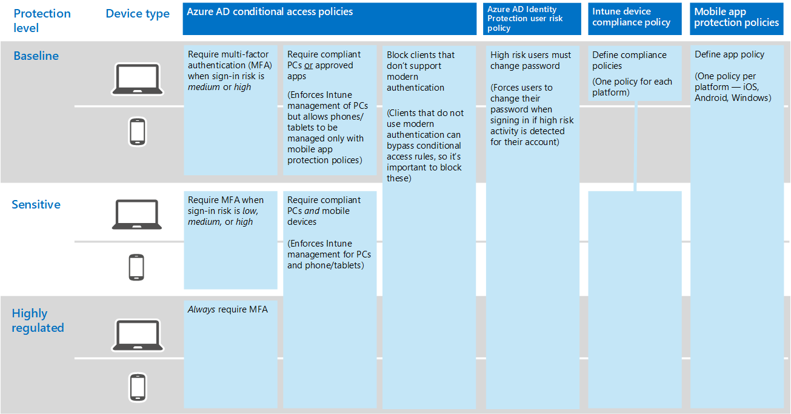

# Common identity and device access policies
This article describes the common recommended policies to help you secure Microsoft 365 Enterprise. 

This guidance discusses how to deploy the recommended policies in a newly provisioned environment. Setting up these policies in a separate lab environment allows you to understand and evaluate the recommended policies before staging the rollout to your pre-production and production environments. Your newly provisioned environment may be cloud-only or Hybrid.  

##Policy set 

The following diagram illustrates the recommended set of policies. It shows which tier of protections each policy applies to and whether the policies apply to PCs, phones and tablets, or both categories of devices. It also indicates where these policies are configured.

The rest of this article describes how to configure these policies. 

Using multi-factor authentication is recommended before enrolling devices into Intune for assurance that the device is in the possession of the intended user. And you must enroll devices into Intune before enforcing device compliance policies.

To give you time to accomplish these tasks, we recommend implementing the baseline policies in the order listed in this table. However, the MFA policies for sensitive and highly regulated protection can be implemented at any time.

|Protection level|Policies|
|:---------------|:-------|
|**Baseline**|[Require MFA when sign-in risk is *medium* or *high*](#require-mfa-when-sign-in-risk-is-medium-or-high)|
|        |[Block clients that don't support modern authentication](#block-clients-that-dont-support-modern-authentication)|
|        |[High risk users must change password](#high-risk-users-must-change-password)|
|        |[Define app protection policies](#define-app-protection-policies)|
|        |[Define compliance policies](#define-compliance-policies)|
|        |[Require compliant PCs *or* approved apps](#require-compliant-pcs-or-approved-apps)|
|**Sensitive**|[Require MFA when sign-in risk is *low*, *medium* or *high*](#require-mfa-when-sign-in-risk-is-low-medium-or-high)|
|         |[Require compliant PCs *and* mobile devices](#require-compliant-pcs-and-mobile-devices)|
|**Highly regulated**|[*Always* requrie MFA](#always-require-mfa)|
| | |

##Assigning policies to users
Before configuring policies, identify the Azure AD groups you are using for each tier of protection. Typically, baseline protection applies to everybody in the organization. A user who is included for both baseline and sensitive protection will have all the baseline policies applied plus the sensitive policies. Protection is cumulative and the most restrictive policy is enforced. 

A recommended practice is to create an Azure AD group for conditional access exclusion. Add this group to all of your conditional access rules under "Exlude." This gives you a method to provide access to a user while you troubleshoot access issues. This is recommended as a temporary solution only. Monitor this group for changes and be sure the exclusion group is being used only as intended. 

The following diagram provides an example of user assignment and exclusions.

In the illustration the "Top secret project X team" is assigned a conditional access policy that requires MFA *always*. Be judicious when applying higher levels of protection to users. Members of this project team will be required to provide two forms of authentication every time they log on, even if they are not viewing highly regulated content.  

 All security groups created as part of these recommendations must be created with Office features enabled. This is specifically important for the deployment of Azure Information Protection (AIP) when securing documents in SharePoint Online.

## Require MFA when sign-in risk is *medium* or *high*
Before requiring MFA, first use an Identity Protection MFA registration policy to register users for MFA. After users are registered you can enforce MFA for sign-in. The [prerequisite work](identity-access-prerequisites.md) includes registering all users with MFA.

To create a new conditional access policy: 

1. Go to the [Azure portal](https://portal.azure.com), and sign in with your credentials. After you've successfully signed in, you see the Azure Dashboard.

2. Choose **Azure Active Directory** from the left menu.

3. Under the **Security** section, choose **Conditional access**.

4. Choose **New policy** as shown in the screen-shot below:

 The following tables describes the conditional access policy settings to implement for this policy.

**Assignments**
|Type|Properties|Values|Notes|
|:---|:---------|:-----|:----|
|Users and groups|Include|Select users and groups – Select specific security group containing targeted users|Start with security group including pilot users.|
||Exclude|Exception security group; service accounts (app identities)|Membership modified on an as needed temporary basis|
|Cloud apps|Include|Select the apps you want this rule to apply to. For example, select Office 365 Exchange Online||
|Conditions|Configured|Yes|Configure specific to your environment and needs|
|Sign-in risk|Risk level|High, medium|Check both|

**Access controls**
|Type|Properties|Values|Notes|
|:---|:---------|:-----|:----|
|Grant|Grant access|True|Selected|
||Require MFA|True|Check|
||Require device to be marked as compliant|False||
||Require Hybrid Azure AD joined device|False||
||Require approved client app|True|Check|
||Require all the selected controls|True|Selected|

> [!NOTE]
> Be sure to enable this policy, by clicking **On**. Also consider using the [What if](https://docs.microsoft.com/en-us/azure/active-directory/active-directory-conditional-access-whatif) tool to test the policy

## Block clients that don't support modern authentication
1. Go to the [Azure portal](https://portal.azure.com), and sign in with your credentials. After you've successfully signed in, you see the Azure Dashboard.

2. Choose **Azure Active Directory** from the left menu.

3. Under the **Security** section, choose **Conditional access**.

4. Choose **New policy**.

The following tables describes the conditional access policy settings to implement for this policy.

**Assignments**
|Type|Properties|Values|Notes|
|:---|:---------|:-----|:----|
|Users and groups|Include|Select users and groups – Select specific security group containing targeted users|Start with security group including pilot users.|
||Exclude|Exception security group; service accounts (app identities)|Membership modified on an as needed temporary basis|
|Cloud apps|Include|Select the apps you want this rule to apply to. For example, select Office 365 Exchange Online||
|Conditions|Configured|Yes|Configure Client apps|
|Client apps|Configured|Yes|Mobile apps and desktop clients, Other clients (select both)|

**Access controls**
|Type|Properties|Values|Notes|
|:---|:---------|:-----|:----|
|Grant|Block access|True|Selected|
||Require MFA|False||
||Require device to be marked as compliant|False||
||Require Hybrid Azure AD joined device|False||
||Require approved client app|False||
||Require all the selected controls|True|Selected|

> [!NOTE]
> Be sure to enable this policy, by clicking **On**. Also consider using the [What if](https://docs.microsoft.com/en-us/azure/active-directory/active-directory-conditional-access-whatif) tool to test the policy

## High risk users must change password
To ensure that all high-risk users compromised accounts are forced to perform a password change when signing-in, you must apply the following policy.

Log in to the [Microsoft Azure portal (http://portal.azure.com)](http://portal.azure.com/) with your administrator credentials, and then navigate to **Azure AD Identity Protection > User Risk Policy**.

**Assignments**
|Type|Properties|Values|Notes|
|:---|:---------|:-----|:----|
|Users|Include|All users|Selected|
||Exclude|None||
|Conditions|User risk|High|Selected|

**Controls**
|Type|Properties|Values|Notes|
|:---|:---------|:-----|:----|
||Access|Allow access|True|Selected|
||Access|Require password change|True|Check|

**Review:** not applicable

> [!NOTE]
> Be sure to enable this policy, by clicking **On**. Also consider using the [What if](https://docs.microsoft.com/en-us/azure/active-directory/active-directory-conditional-access-whatif) tool to test the policy

## Define app protection policies
App protection policies define which apps are allowed and the actions they can take with your organization data. Create Intune app protection policies from within the Azure portal. 

Create a policy for each platform:
- iOS
- Android
- Windows 10

To create a new app protection policy, log in to the Microsoft Azure portal with your administer credentials, and then navigate to **Mobile apps > App protection policies**. Click **Add a policy**.

There are slight differences in the app protection policy options between iOS and Android. The below policy is specifically for Android. Use this as a guide for your other policies.

The recommended list of apps includes the following:
- PowerPoint
- Excel
- Word
- Microsoft Teams
- Microsoft SharePoint
- Microsoft Visio Viewer
- OneDrive
- OneNote
- Outlook

The following tables describe the recommended settings:

|Type|Properties|Values|Notes|
|:---|:---------|:-----|:----|
|Data relocation|Prevent Android backup|Yes|On iOS this will specifically call out iTunes and iCloud|
|||Allow app to transfer data to other apps|Policy managed apps||
||Allow app to receive data to other apps|Policy managed apps||
||Prevent "Save As"|Yes||
||Restrict cut, copy, and paste with other apps|Policy managed apps||
||Restrict web content to display in the managed browser|No||
||Encrypt app data|Yes|On iOS select option: When device is locked|
||Disable app encryption when device is enabled|??|options are yes/no
||Disable contacts sync|No||
||Disable printing|???|yes/no|
|Access|Require PIN for access|Yes||
||Select Type|???|Numeric or Passcode|
||Allow simple PIN|No||
||PIN length|6||
||Allow fingerprint instead of PIN|Yes||
||Require Corporate credentials for access|No||
||Disable app PIN when device PIN is managed|???|yes/no|
||Require corporate credentials for access|???|yes/no|
||Recheck the access requirement after (minutes)|30||
||Block screen capture and Android assistant|No|On iOS this is not an available option|
|Sign-in security requirements|Max PIN attempts|???|Action???Reset Pin or Wipe data|
||Offline grace period|720|Block access|
||Offline interval (days) before app data is wiped|90|???block access or wipe data?
||Jailbroken/rooted devices| |Block access|

When complete, remember to click "Create". Repeat the above steps and replace the selected platform (dropdown) with iOS. This creates two app policies, so once you create the policy, then assign groups to the policy and deploy it.

To edit the policies and assign these policies to users, see [How to create and assign app protection policies](https://docs.microsoft.com/en-us/intune/app-protection-policies). 

## Define compliance policies

Device compliance policies define the requirements that devices must adhere to in order to be marked as compliant. Create Intune device compliance policies from within the Azure portal. 

Create a policy for each platform:
- Android
- Android for Work
- iOS
- macOS
- Windows Phone 8.1
- Windows 8.1 and later
- Windows 10 and later

To create device compliance policies, log in to the Microsoft Azure portal with your administer credentials, and then navigate to **Intune > Device compliance**. Click **Create policy**.

The following settings are recommended. [UPDATE FOR THESE SETTINGS STILL IN PROGRESS]

**Device health**
|Type|Properties|Values|Notes|
|:---|:---------|:-----|:----|
|Windows device health attestation|Require devices to be reported as healthy (Windows 10 Desktop and Mobile and later)|Yes||
|Device security settings|All|Not configured||
|Device threat protection|All|Not configured||
|Jailbreak|Device must not be jailbroken or rooted (iOS 8.0+, Android 4.0+)|Yes||

**Device properties**
|Type|Properties|Values|Notes|
|:---|:---------|:-----|:----|
|Operating system version|All|Not configured||

For all the above policies to be considered deployed, they must be targeted at user groups. You can do this by creating the policy (on Save) or later by selecting Manage Deployment in the Policy section (same level as Add).

**System security**
|Type|Properties|Values|Notes|
|:---|:---------|:-----|:----|
|Password|Require a password to unlock mobile devices (...)|Yes|Selected – Drop down|
||Allow simple passwords (...)|No|Selected – Drop down|
||Minimum password length (...)|6|Selected – List|
|Advanced password settings|All|Not configured||
|Encryption|Require encryption on mobile device (...)|Yes|Selected – Drop down|
|Email profiles|Email account must be managed by Intune (iOS 8.0+)|Yes| Selected  – Drop down|
||Select (#)||Must select Email Configuration Policy for iOS: iOS Email Policy (see configuration policies above)|

## Require compliant PCs *or* approved apps
Before adding a policy to require compliant PCs, be sure to enroll devices for amangement into Intune. Using multi-factor authentication is recommended before enrolling devices into Intune for assurance that the device is in the possession of the intended user. For information on enrolling devices, see ???????? [does fastrack have clear guidance? the Intune library is not prescriptive]

To require compliant PCs or approved apps:

1. Go to the [Azure portal](https://portal.azure.com), and sign in with your credentials. After you've successfully signed in, you see the Azure Dashboard.

2. Choose **Azure Active Directory** from the left menu.

3. Under the **Security** section, choose **Conditional access**.

4. Choose **New policy**.

5. Enter a policy name, then choose the **Users and groups** you want to apply the policy for.

6. Choose **Cloud apps**.

7. Choose **Select apps**, select the desired apps from the **Cloud apps** list. For example, select Office 365 Exchange Online. Click **Select** and **Done**.

8. Choose **Grant** from the **Access controls** section.

9. Choose **Grant access**, select **Require device to be marked as compliant** and **Require approved client app**.  For multiple controls, select **Require one of the selected controls**, then choose **Select**. This configuration applies device commpliance to PCs while enforcing only app protection policies on phones and tablets [REALLY? HOW DOES THIS NOT ALLOW PCS TO ACCESS WITH ONLY APP PROTECTION? --GOT THIS CONFIG FROM CALEB].

10. Click **Create** to create the Exchange Online conditional access policy.

When creating this policy, do not select platforms. This enforces compliant devices. 

## Require MFA when sign-in risk is *low*, *medium* or *high*
Follow the steps earlier in this article for [requiring MFA](#require-mfa-when-sign-in-risk-is-medium-or-high) and set the sign-in risk to high, medium, *and* low.

## Require compliant PCs *and* mobile devices

To require compliant PCs or approved apps:

1. Go to the [Azure portal](https://portal.azure.com), and sign in with your credentials. After you've successfully signed in, you see the Azure Dashboard.

2. Choose **Azure Active Directory** from the left menu.

3. Under the **Security** section, choose **Conditional access**.

4. Choose **New policy**.

5. Enter a policy name, then choose the **Users and groups** you want to apply the policy for.

6. Choose **Cloud apps**.

7. Choose **Select apps**, select the desired apps from the **Cloud apps** list. For example, select Office 365 Exchange Online. Click **Select** and **Done**.

8. Choose **Grant** from the **Access controls** section.

9. Choose **Grant access**, select **Require device to be marked as compliant** and **Require Hybrid Azure AD joined device**.  For multiple controls, select **Require one of the selected controls** [IS THIS RIGHT?], then choose **Select**. 

10. Click **Create** to create the Exchange Online conditional access policy.

When creating this policy, do not select platforms. This enforces compliant devices.

## *Always* require MFA

Follow the steps earlier in this article for [requiring MFA](#require-mfa-when-sign-in-risk-is-medium-or-high) and set the sign-in risk to high, medium, low, *and* no risk. [RIGHT???]

<!---
#### Data loss prevention
The goal for your device and app management policies is to protect data loss in the event of a lost or stolen device. You can do this by ensuring that access to data is protected by a PIN, that the data is encrypted on the device, and that the device is not compromised.

|Policy recommendation|Description|
|:--------------------|:----------|
|**Require user PC management**|Require users to join their Windows PCs to an Active Directory Domain or enroll their PCs into management with Microsoft Intune or System Center Configuration Manager.|
|**Apply security settings via group policy objects (GPO) or Configuration Manager policies for domain joined PCs**|Deploy policies that configure managed PCs to enable BitLocker, enable anti-virus, and enable firewall.|
|**Require user mobile device management**|Require that user devices used to access email are managed by Intune **or** company email is accessed only through mobile email apps protected by Intune App Protection policies such as Outlook for iOS or Android.|
|**Apply an Intune Device Compliance Policy on managed devices**|Apply an Intune Device Compliance Policy for managed corporate mobile devices and Intune-managed PCs that requires: a PIN with minimum length 6, device encryption, a healthy device (is not jailbroken, rooted; passes health attestation), and, if available, require devices that are **low** risk as determined by a third-party MTP like Lookout or SkyCure.|
|**Apply an Intune App Protection Policy for managed apps running on unmanaged devices**|Apply an Intune App Protection Policy for managed apps running on unmanaged, personal mobile devices to require: a PIN with minimum length 6, device encryption, and that the device is healthy (is not jailbroken, rooted; passes health attestation).|

### User impact

For most organizations, it is important to be able to set user expectations around when and for which conditions they will be expected to sign into Office 365 to access their email.  

Users typically benefit from single sign-on (SSO) except during the following situations:
* When requesting authentication tokens for Exchange Online:
  * Users may be asked to MFA whenever a **medium or above** sign-in risk is detected and users has not yet performed MFA in their current sessions.  
  * Users will be required to either use email apps that support the Intune App Protection SDK or access emails from Intune compliant or AD domain-joined devices.
* When users at risk sign-in, and successfully complete MFA, they will be asked to change their password.

## Sensitive
This section describes the recommendations for the sensitive tier of data, identity, and device protection. These recommendations are for customers who have a subset of data that must be protected at higher levels or require all data to be protected at these higher levels.

You can apply increased protection to all or specific data sets in your Office 365 environment. For example, you can apply policies to ensure sensitive data is only shared between protected apps to prevent data loss. We recommend protecting identities and devices that access sensitive data with comparable levels of security.

### Conditional access policy settings
#### Identity protection

You can give users single sign-on (SSO) experience as described in earlier sections. You only need to intervene when necessary based on [risk events](https://docs.microsoft.com/azure/active-directory/active-directory-reporting-risk-events).   

* Require MFA on **low or above** risk sessions
* Require secure password change for high risk users

>[!IMPORTANT]
>[Password synchronization](https://docs.microsoft.com/azure/active-directory/connect/active-directory-aadconnectsync-implement-password-synchronization) and [self-service password reset](https://docs.microsoft.com/azure/active-directory/active-directory-passwords) are required for this policy recommendation.
>

#### Data loss prevention

The goal for these device and app management policies is to protect data loss in the event of a lost or stolen device. You can do this by ensuring that access to data is protected by a PIN, that the data is encrypted on the device, and that the device is not compromised.

|Policy recommendation|Description|
|:--------------------|:----------|
|**Require user PC management**|Require users to join their PCs to an Active Directory Domain or enroll their PCs into management with Intune or Configuration Manager and ensure those devices are compliant with policies before allowing email access.|
|**Apply security settings via group policy objects (GPO) or Configuration Manager policies for domain joined PCs**|Deploy policies that configure managed PCs to enable BitLocker, enable anti-virus, and enable firewall.|
|**Require user mobile device management**|Require that user devices used to access email are managed by Intune **or** company email is accessed only through mobile email apps protected by Intune App Protection policies such as Outlook for iOS or Android.|
|**Apply an Intune Device Compliance Policy on managed devices**|Apply an Intune Device Compliance Policy for managed corporate mobile devices and Intune-managed PCs that requires: a PIN with minimum length 6, device encryption, a healthy device (is not jailbroken, rooted; passes health attestation), and if available, require devices that are **low** risk as determined by a third-party MTP like Lookout or SkyCure.|
|**Apply an Intune App Protection Policy for managed apps running on unmanaged devices**|Apply an Intune App Protection Policy for managed apps running on unmanaged, personal mobile devices to require: a PIN with minimum length 6, device encryption, and that the device is healthy (is not jailbroken, rooted; passes health attestation).|

### User impact
For most organizations, it is important to be able to set expectations for users specific to when and under what conditions they will be expected to sign into Office 365 email.

Users typically benefit from single sign-on (SSO) except under the following situations:
* When requesting authentication tokens for Exchange Online:
  * Users will be asked to MFA whenever a **low or above** sign-in risk is detected and users has not yet performed MFA in their current sessions.  
  * Users will be required to either use email apps that support the Intune App Protection SDK or access emails from Intune compliant or AD domain-joined devices.
* When users at risk sign-in, and successfully complete MFA, they will be asked to change their password.

## Highly regulated
This section describes the recommendations for the highly regulated tier of data, identity, and device protection. These recommendations are for customers who may have a very small amount of data that is highly classified, trade secret, or regulated data. Microsoft provides capabilities to help organizations meet these requirements, including added protection for identities and devices.

### Conditional access policy settings
#### Identity protection

For the highly regulated tier Microsoft recommends enforcing MFA for all new sessions.
* Require MFA for all new sessions
* Require secure password change for **high** risk users

>[!IMPORTANT]
>[Password synchronization](https://docs.microsoft.com/azure/active-directory/connect/active-directory-aadconnectsync-implement-password-synchronization) and [self-service password reset](https://docs.microsoft.com/azure/active-directory/active-directory-passwords) are required for this policy recommendation.
>

#### Data Loss Prevention
The goal for these device and app management policies is to prevent data loss in the event of a lost or stolen device. This is done by ensuring that access to data is protected by a PIN, that the data is encrypted on the device, and that the device is not compromised.

For the highly regulated tier, we recommend requiring apps that support Intune App Protection policy running only on Intune compliant or domain-joined devices.

|Policy recommendation|Description|
|:--------------------|:----------|
|**Require user PC management**|Require users to join their Windows PCs to an Active Directory Domain, **or** enroll their PCs into management with Intune or Configuration Manager and ensure those devices are compliant with policies before allowing email access.|
|**Apply security settings via group policy objects (GPO) or Configuration Manager policies for domain joined PCs**|Deploy policies that configure managed PCs to enable BitLocker, enable anti-virus, and enable firewall.|
|**Require user mobile device management**|Require that devices used to access Office 365 email and files are managed by Intune or company email is accessed only through mobile email apps protected by Intune App Protection policies such as Outlook for iOS or Android.|
|**Apply an Intune Device Compliance Policy on managed devices**|Apply an Intune Device Compliance Policy for managed corporate mobile devices and Intune-managed PCs that requires: a PIN with minimum length 6, device encryption, a healthy device (is not jailbroken, rooted; passes health attestation), and, if available, require devices that are Low risk as determined by a third-party MTP like Lookout or SkyCure.|

### User impact
For most organizations, it is important to be able to set expectations for users specific to when and under what conditions they will be expected to sign into Office 365 files.

* Users configured as highly regulated will be required to re-authenticate with MFA after their session expires.
* When users at risk sign-in they will be asked to change their password after completing MFA.
* When requesting authentication tokens for Exchange Online:
  * Users will be asked to perform MFA whenever they begin a new session.  
  * Users will be required to use email apps that support the Intune App Protection SDK
  * Users will be required to access emails from Intune compliant or AD domain-joined devices.
--->
## Next steps

[Learn about policy recommendations for securing email](secure-email-recommended-policies.md)
