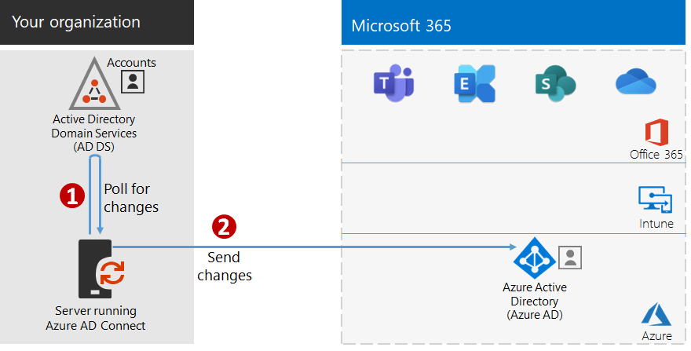

# Step 4: Add your user accounts

## Create your user accounts for cloud-only identity

For cloud-only identity, create your users and groups in Azure Active Directory (Azure AD). You can use:

- The Microsoft 365 admin center
- The Azure portal
- Azure PowerShell

## Synchronize identities for hybrid identity

*This is required for hybrid environments and applies to both the E3 and E5 versions of Microsoft 365 Enterprise*

In this section, you'll synchronize your on-premises Active Directory Domain Services (AD DS) with the Azure AD tenant used by Office 365, Microsoft Intune, and other cloud-based services included with Microsoft 365 Enterprise.

Azure AD Connect is the supported Microsoft tool that guides you through synchronizing only the identities you really need from single or multi-forest AD DS environments to your Azure AD tenant. The following figure shows the basic process for Azure AD Connect synchronization.

1. Azure AD Connect running on a server polls AD DS for changes in accounts, groups, and contacts.
2. Azure AD Connect sends those changes to the Azure AD tenant of your Microsoft 365 subscription.

The first decision in your hybrid identity solution is your authentication requirement. The following options are options:

- With **managed authentication**, Azure AD handles the authentication process for user sign-in. There are two methods for managed authentication: 
    - **Password Hash Sync (PHS)** [Recommended and required for some premium features]. This is the simplest way to enable authentication for on-premises directory objects in Azure AD. Azure AD Connect extracts the hashed password from AD DS, does extra security processing on the password hash, and synchronizes it to Azure AD. For more information, see [Implement password hash synchronization with Azure AD Connect sync](https://docs.microsoft.com/azure/active-directory/hybrid/how-to-connect-password-hash-synchronization).
    - **Pass-through Authentication (PTA)** provides a simple password validation solution for Azure AD-based services. PTA uses an agent running on one or more on-premises servers to validate the user authentications directly with your on-premises AD DS. For more information, see [User sign-in with Azure Active Directory Pass-through Authentication](https://docs.microsoft.com/azure/active-directory/connect/active-directory-aadconnect-pass-through-authentication).
- With **federated authentication**, the authentication process is redirected to another identity provider through an identity federation server, such as Active Directory Federation Services (AD FS), for a user’s sign-in. The identity provider can provide additional authentication methods, such as smartcard-based authentication. For more information, see [Choosing the right authentication method for your Azure Active Directory hybrid identity solution](https://docs.microsoft.com/azure/security/azure-ad-choose-authn).

Watch this video for an overview of identity models and authentication for Microsoft 365 Enterprise.

 

> [!VIDEO https://www.microsoft.com/videoplayer/embed/RE2Pjwu]

After you've determined your hybrid identity solution, download and run the [IdFix Directory Synchronization Error Remediation Tool](https://www.microsoft.com/download/details.aspx?id=36832) to analyze your AD DS for issues.

After resolving all of the issues identified by the IdFix tool, see [Implement password hash synchronization](https://docs.microsoft.com/azure/active-directory/connect/active-directory-aadconnectsync-implement-password-hash-synchronization) for guidance on installing the Azure AD Connect tool and configuring directory synchronization between your on-premises AD DS and the Azure AD tenant for your Microsoft 365 subscription. After synchronization starts, you'll maintain your user accounts and groups with your on-premises identity provider, such as AD DS.

Microsoft provides a set of recommendations for [identity and device access](microsoft-365-policies-configurations.md) to ensure a secure and productive workforce. 

- For recommended requirements for hybrid environments, see the **Active Directory with password hash sync** column in [prerequisites](identity-access-prerequisites.md#prerequisites). 

- For recommended requirements for cloud only environments, see the **Cloud only** column in [prerequisites](identity-access-prerequisites.md#prerequisites).

Once your on-premises users and groups are present in Azure AD, you can start assigning licenses and using productivity workloads such as OneDrive for Business and Exchange Online.

|||
|:-------|:-----|
|| [Test Lab Guide: Password hash synchronization](password-hash-sync-m365-ent-test-environment.md)  [Test Lab Guide: Pass-through authentication](pass-through-auth-m365-ent-test-environment.md) |
|||

As an interim checkpoint, you can see the [exit criteria](identity-exit-criteria.md#crit-identity-sync) corresponding to this section.

## Monitor synchronization health

*This is optional and applies to both the E3 and E5 versions of Microsoft 365*

In this section, you'll install an Azure AD Connect Health agent on each of your on-premises AD DS domain controllers to monitor your identity infrastructure and the synchronization services provided by Azure AD Connect. The monitoring information is made available in an Azure AD Connect Health portal, where you can view alerts, performance monitoring, usage analytics, and other information.

The key design decision of how to use Azure AD Connect Health is based on how you are using Azure AD Connect:

- If you’re using the **managed authentication** option, start with [Using Azure AD Connect Health with sync](https://docs.microsoft.com/azure/active-directory/connect-health/active-directory-aadconnect-health-sync) to understand and configure Azure AD Connect Health.
- If you're synchronizing just the names of the accounts and groups using **federated authentication** with Active Directory Federation Services (AD FS), start with [Using Azure AD Connect Health with AD FS](https://docs.microsoft.com/azure/active-directory/connect-health/active-directory-aadconnect-health-adfs) to understand and configure Azure AD Connect Health.

When you complete this section, you’ll have:

- The Azure AD Connect Health agent installed on your on-premises identity provider servers.
- The Azure AD Connect Health portal displaying the current state of your on-premises infrastructure and synchronization activities with the Azure AD tenant for your Microsoft 365 subscription.

As an interim checkpoint, you can see the [exit criteria](identity-exit-criteria.md#crit-identity-sync-health) for this section.

## Simplify password updates

*This is optional for hybrid environments and applies to both the E3 and E5 versions of Microsoft 365 Enterprise*

In this section, you'll allow users to reset their passwords through Azure Active Directory (Azure AD), which is then replicated to your local Active Directory Domain Services (AD DS). This process is known as password writeback. With password writeback, users don’t need to update their passwords through the on-premises AD DS where user accounts and their attributes are stored. This is valuable to roaming or remote users who do not have a remote access connection to the on-premises network.

Password writeback is required to fully utilize Azure AD Identity Protection capabilities, such as requiring users to change their on-premises passwords when there has been a high risk of account compromise detected.

For additional information and configuration instructions, see [Azure AD SSPR with password writeback](https://docs.microsoft.com/azure/active-directory/active-directory-passwords-writeback).

>[!Note]
>Upgrade to the latest version of Azure AD Connect to ensure the best possible experience and new features as they are released. For more information, see [Custom installation of Azure AD Connect](https://docs.microsoft.com/azure/active-directory/connect/active-directory-aadconnect-get-started-custom).
>

|||
|:-------|:-----|
|| [Test Lab Guide: Password writeback](password-writeback-m365-ent-test-environment.md) |
|||

As an interim checkpoint, you can see the [exit criteria](identity-exit-criteria.md#crit-identity-pw-writeback) for this section.

|||
|:-------|:-----|
|| [Use groups for management](identity-use-group-management.md) |
