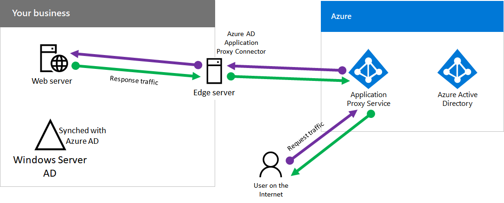

# Step 16: Azure AD Application Proxy

Organizations that have existing on-premises infrastructure typically provide access to intranet resources when they are outside the organization’s intranet. Examples include remote or roaming employees and vendors, contractors, or partners. 

Typical solutions to providing access to intranet resource include deploying a virtual private network (VPN) infrastructure or setting up a demilitarized zone (DMZ) with servers that host or provide access to the intranet resource. However, when you have your on-premises user accounts and groups synchronized with Azure AD, you can use Azure AD Application Proxy to provide secure remote access for web-based applications hosted on intranet servers. Web-based applications include SharePoint sites, Outlook Web Access servers, or any other web-based line of business applications. 

The following figure shows the components of Azure AD Application Proxy and how the request and response traffic flows.

A user’s computer on the Internet sends web request traffic to an Application Proxy service in Azure, which forwards it to an Internet-connected server running an Application Proxy Connector. That server forwards the request traffic to the on-premises server running the web-based application. The response traffic from the on-premises server follows the reverse path back to the user’s computer.

For more information about Azure AD Application Proxy, including links to configuration information, see [How to provide secure remote access to on-premises apps](https://docs.microsoft.com/azure/active-directory/active-directory-application-proxy-get-started).

The results of this step are:

- Deployment and configuration of the Azure Proxy Application service and Application Proxy Connectors to allow users to access on-premises web-based applications.
- 
As an interim checkpoint, you can see the [exit criteria](identity-exit-criteria.md#crit-identity-step16) corresponding to this step.

## Next step

[Identity infrastructure exit criteria](identity-exit-criteria.md)

