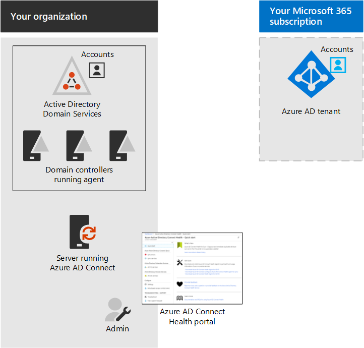

# Step 4: Monitor synchronization health

*This step is optional and applies to both the E3 and E5 versions of Microsoft 365 Enterprise*

In Step 4, you'll install an Azure AD Connect Health agent on each of your on-premises identity servers to monitor your identity infrastructure and the synchronization services provided by Azure AD Connect. The monitoring information is made available in an Azure AD Connect Health portal, where you can view alerts, performance monitoring, usage analytics, and other information.

The key design decision of how to use Azure AD Connect Health is based on how you are using Azure AD Connect:

- If you’re using the **managed authentication** option, start with [Using Azure AD Connect Health with sync](https://docs.microsoft.com/azure/active-directory/connect-health/active-directory-aadconnect-health-sync) to understand and configure Azure AD Connect Health.
- If you're synchronizing just the names of the accounts and groups using **federated authentication** with Active Directory Federation Services (AD FS), start with [Using Azure AD Connect Health with AD FS](https://docs.microsoft.com/azure/active-directory/connect-health/active-directory-aadconnect-health-adfs) to understand and configure Azure AD Connect Health.

When you complete this step, you’ll have:

- The Azure AD Connect Health agent installed on your on-premises identity provider servers.
- The Azure AD Connect Health portal displaying the current state of your on-premises infrastructure and synchronization activities with the Azure AD tenant for your Office 365 and EMS subscriptions.

As an interim checkpoint, you can see the [exit criteria](identity-exit-criteria.md#crit-identity-step4) for this step.

## Next step

|||
|:-------|:-----|
|| [Protect global administrator accounts](identity-designate-protect-admin-accounts.md) |

