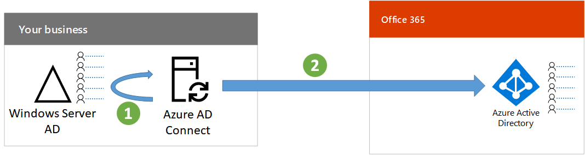

# Step 2: Synchronize identities

*This step is required for hybrid environments and applies to both the E3 and E5 versions of Microsoft 365 Enterprise*

In Step 2, you synchronize your on-premises directory, such as Windows Server Active Directory (AD), with the Azure Active Directory (AD) tenant used by your Office 365 and Enterprise Mobility + Security (EMS) subscriptions.

Azure AD Connect is the supported Microsoft tool that guides you through synchronizing only the identities you really need from single or multi-forest Windows Server AD environments to your Azure AD tenant.

*How Azure AD Connect synchronizes your on-premises directory with Azure AD*

The first decision in your hybrid identity solution is your authentication requirement. The following are options available:

- With **managed authentication**, Azure AD handles the authentication process for user’s sign-in. There are two methods for managed authentication: 
    - **Password Hash Sync (PHS)** [Recommended and required for some premium features]. This is the simplest way to enable authentication for on-premises directory objects in Azure AD. Azure AD Connect extracts the hashed password from Active Directory, does extra security processing on the password, and saves it in Azure AD. For more information, see [Implement password hash synchronization with Azure AD Connect sync](https://docs.microsoft.com/azure/active-directory/connect/active-directory-aadconnectsync-implement-password-synchronization).
    - **Pass-through Authentication (PTA)** provides a simple password validation solution for Azure AD-based services. PTA uses an agent running on one or more on-premises servers to validate the user authentications directly with your on-premises Windows Server AD. For more information, see [User sign-in with Azure Active Directory Pass-through Authentication](https://docs.microsoft.com/azure/active-directory/connect/active-directory-aadconnect-pass-through-authentication).
- With **federated authentication**, the authentication process is redirected to another authentication system, for example, Active Directory Federation Services (AD FS) for a user’s sign-in. The authentication system can provide additional authentication methods, such as smartcard-based authentication. For more information, see [Deploying Active Directory Federation Services](https://docs.microsoft.com/windows-server/identity/ad-fs/deployment/windows-server-2012-r2-ad-fs-deployment-guide).

After you have determined your hybrid identity solution, download and run the [IdFix Directory Synchronization Error Remediation Tool](https://www.microsoft.com/download/details.aspx?id=36832) to analyze your Windows Server AD for issues.

After resolving all of the issues identified by the IdFix tool, see [Set up directory synchronization for Office 365](https://support.office.com/article/Set-up-directory-synchronization-for-Office-365-1b3b5318-6977-42ed-b5c7-96fa74b08846) for guidance on installing the Azure AD Connect tool and configuring directory synchronization between your on-premises Windows Server AD and the Azure AD tenant for your Office 365 and EMS subscription. After synchronization starts, you maintain your user accounts and groups with your on-premises identity provider, such as Windows Server AD.

The results of this step are:

- Azure AD Connect is running on a server and is provisioning the user accounts and groups from your on-premises Windows Server AD to your Azure AD tenant.
- Users can use user account names of your on-premises Windows Server AD to successfully sign in to Office 365.

As an interim checkpoint, you can see the [exit criteria](identity-exit-criteria.md#crit-identity-step2) corresponding to this step.

## Next step

[Step 3: Customize the Office 365 sign-in page](identity-customize-office-365-sign-in.md)
