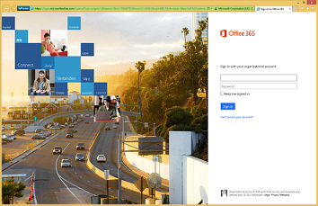
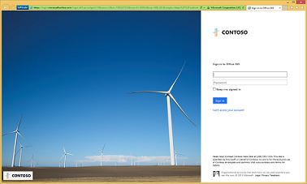

# Step 3: Customize the Office 365 sign-in page

*This step is optional and for both the E3 and E5 versions of Microsoft 365 Enterprise*

In Step 3, you help users recognize your organization’s sign-in page by adding your company name, logo, and other recognizable elements. 

With Microsoft 365 Enterprise, you can customize the appearance of the sign-in and Access Panel pages so they include your company logo, color schemes, and custom user information. 

When a user attempts to sign in from a device, they see something like the following example on the Office 365 sign-in page *before customization*.

*Example of the Office 365 sign-in page before customization*

And here is what the same user of the Contoso Corporation would see *after customization*.

*Example of the Office 365 sign-in page after customization*

For more information, see [Add your company branding to Office 365 Sign In page](https://support.office.com/article/Add-your-company-branding-to-Office-365-Sign-In-page-a1229cdb-ce19-4da5-90c7-2b9b146aef0a).

For configuration instructions, see [Add company branding to your sign-in and Access Panel pages](http://aka.ms/aadpaddbranding).

As an interim checkpoint, you can see the [exit criteria](identity-exit-criteria.md#crit-identity-step3) for this step.

## Next step

[Step 4: Monitor synchronization health](identity-azure-ad-connect-health.md)
