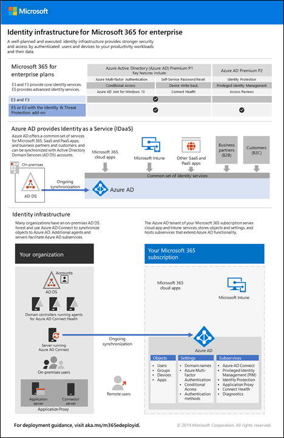

# Identity roadmap for Microsoft 365

In Microsoft 365 Enterprise, a well-planned and executed identity infrastructure paves the way for stronger security and access to your productivity workloads and their data only by authenticated users and devices.

Watch this video for an overview of identity models and authentication for Microsoft 365 Enterprise.

 

> [!VIDEO https://www.microsoft.com/videoplayer/embed/RE2Pjwu]

For the identity features of each Microsoft 365 Enterprise plan, the role of Azure Active Directory (Azure AD), on-premises and cloud-based components, and the most common authentication configurations, see the [Identity Infrastructure poster](../downloads/M365E-ID-Infra.pdf).

This two-page poster is a quick way to ramp up on identity concepts and configurations for Microsoft 365 Enterprise.

You can also [download this poster](https://github.com/MicrosoftDocs/microsoft-365-docs/raw/public/microsoft-365/downloads/M365E-ID-Infra.pdf) and print it in letter, legal, or tabloid (11 x 17) formats.

## Plan, deploy, and manage identity for Microsoft 365

TBD

## Identity and device access recommendations

Microsoft provides a set of recommendations for [identity and device access](microsoft-365-policies-configurations.md) to ensure a secure and productive workforce. For identity, use the recommendations and settings in the following articles along with the steps in this phase:

- [Prerequisites](identity-access-prerequisites.md)
- [Common identity and device access policies](identity-access-policies.md)

## How Microsoft does identity for Microsoft 365

Learn how IT experts at Microsoft [manage identities and secure access](https://www.microsoft.com/en-us/itshowcase/managing-user-identities-and-secure-access-at-microsoft).

>[!Note]
>This IT Showcase resource is only available in English.
>

## How Contoso did identity for Microsoft 365

See how the Contoso Corporation, a fictional but representative multi-national business, [deployed a hybrid identity infrastructure](contoso-identity.md) for Microsoft 365 cloud services.

## Next step

TBD