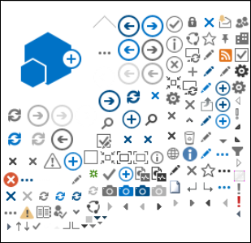
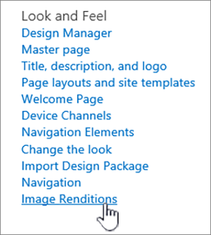
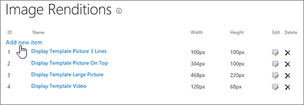
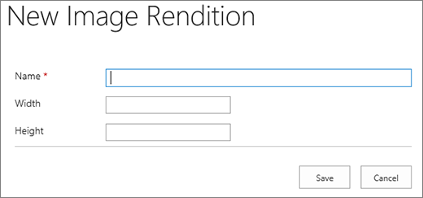

# Image optimization for SharePoint classic publishing sites

The loading speed of a webpage depends on the combined size of all the components required to render the page including images, HTML, JavaScript, and CSS. Images are a great way to make your site more appealing, but their size can affect performance. By optimizing your images with compression and resizing, and using sprites, you can offset the effects of large images. Using SharePoint image renditions, you can upload a single large image, and display sections of the image allowing it to be reused rather than reloaded.

>[!NOTE]
>This topic applies to SharePoint classic publishing sites, not modern portal sites. For information about image optimization in SharePoint modern portal sites, see [Optimize images in SharePoint modern portal pages](modern-image-optimization.md).
  
## Using sprites to speed up image loading

An image sprite contains many smaller images. Using CSS you select a part of the composite image to display on a particular part of the page with absolute positioning. Basically, you move a single image around the page instead of loading multiple images, and make a small part of that image visible through a small window where the required part of the sprite image is shown to the end user. SharePoint uses sprites to display its various icons in the sprite spcommon.png file.

What's covered here:
- Image compression
- Image optimization
- SharePoint image renditions
   
This can increase performance because you download only one image instead of several and then cache and reuse that image. Even if the image doesn't remain cached, by having a single image instead of multiple images, this method reduces the total number of HTTP requests to the server, which will reduce page loading times. This is really a form of image bundling. This is a useful technique if the images aren't changing often, for example, icons, as shown in the SharePoint example provided above. You can see how to use [Web Essentials](https://vswebessentials.com/), a third-party, open-source, community-based project to achieve this easily in Microsoft Visual Studio. For more information, see [Minification and bundling in SharePoint](./minification-and-bundling-in-sharepoint-online.md).
  
## Using image compression and optimization to speed up page loading

Image compression and optimization is about reducing the file size of the images you use on your site. Often, the best technique to reduce the size of an image is to resize the image to the maximum dimensions that it will be viewed on the site. There's no sense in having an image larger than it will ever be viewed. Making sure images are of the correct dimensions using an image editor is a quick and easy way to reduce the size of your page.
  
Once images are the right size, the next step is to optimize the compression of these images. There are various tools available to use for compression and optimization, including Photo Gallery and third-party tools. The key to compression is to reduce the file size as much as possible without losing any discernible quality for end users. Make sure you test your compressed files on a high-definition display to ensure they'll still look good.
  
## Speed up page downloads by using SharePoint image renditions

Image renditions are a feature in SharePoint that allows you to serve up different versions of images based on pre-defined image dimensions. This is especially important when there's user-generated image content or the image dimensions such as width and height are fixed by the CSS on the site. Even if an image is fixed by CSS, the full resolution image is still loaded. In this case, the file size can be reduced by using image renditions.
  
> [!NOTE]
> Renditions are only available for SharePoint when publishing is enabled. You can enable publishing under Settings \> Site Settings \> Manage site features \> SharePoint Server Publishing. The option will not appear otherwise.
  
The image rendition resizing works by taking the smallest dimension you define, either width or height, and then resizing the image so that the other dimension is automatically resized based on the locked aspect ratio. By default, it will crop the image from the center by the remaining dimensions. For example, if you define a rendition of 100px wide and 50px high and your original image is 1000px wide and 800px high, it will be resized so that the 800px dimension is now 50px and the 1000px dimension (now 62.5px) is cropped from the center of the image.
  
The steps are relatively simple but for images to use the renditions, the renditions need to be on the SharePoint site before you add the images. In addition, you also need to have the SharePoint Server Publishing Infrastructure (Site Collection Level) and SharePoint Server Publishing (Site Level) features turned on.
  
### Add an image rendition to speed up page loading
  
1. Verify that the user account that is performing this procedure has, at minimum, Design permissions to the top-level site of the site collection, and that the site is being published to a webpage.

2. In a web browser, go to the top-level site of the publishing site collection.

3. Choose the **Settings** icon.

4. On the **Site Settings** page, in the **Look and Feel** section, you'll see the built-in image renditions.

    You can use the out of the box renditions or choose **Image Renditions** to create a new one.

    
  
5. On the **Image Renditions** page, choose **Add new item**.

    
  
6. On the **New Image Rendition** page, in the **Name** box, enter a name for the rendition.

7. In the **Width** and **Height** text boxes, enter the width and height, in pixels, of the rendition, and then choose **Save**.

    
  
## Custom cropping with image renditions

By default, an image rendition is generated from the center of the image. You can adjust the image rendition for individual images by cropping the portion of the image that you want to use. You can crop the images on an individual basis, per rendition. Cropping the images speeds up page loading by using SharePoint's blob cache to create a version of the image for each rendition. This way the server load is reduced because the image is only resized once and is then ready to serve to end users multiple times. For more information on how to crop an image rendition, see [Crop an image rendition](/sharepoint/dev/general-development/sharepoint-design-manager-device-channels).
