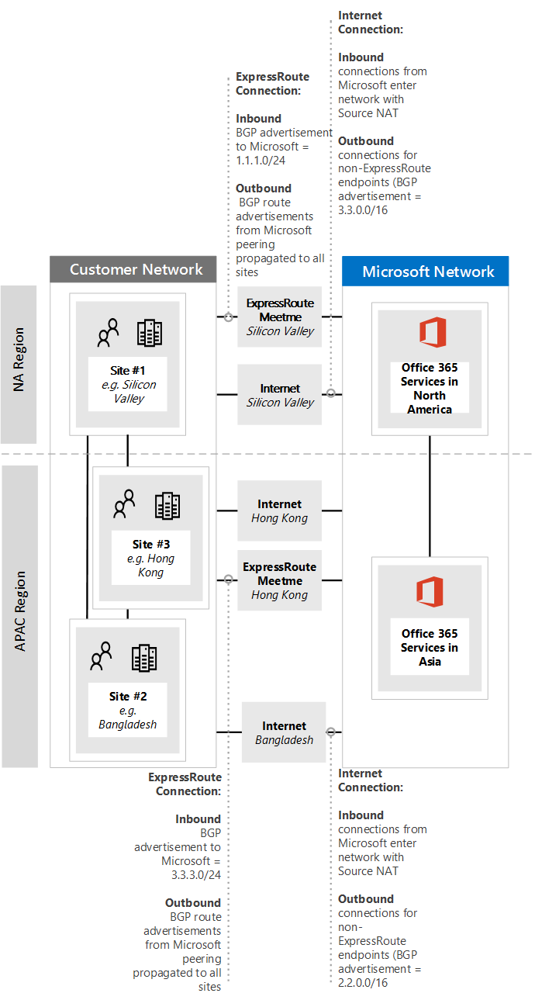
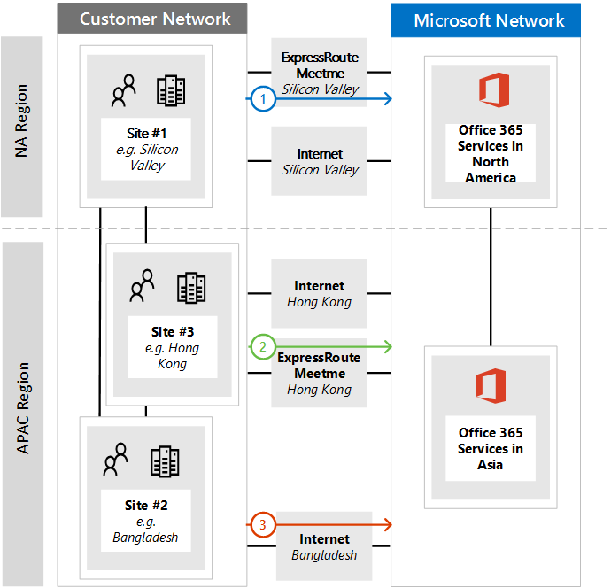
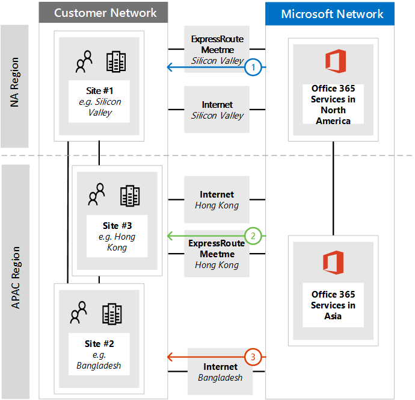
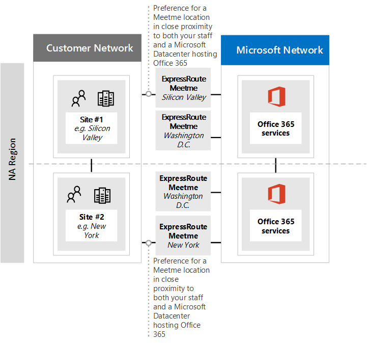
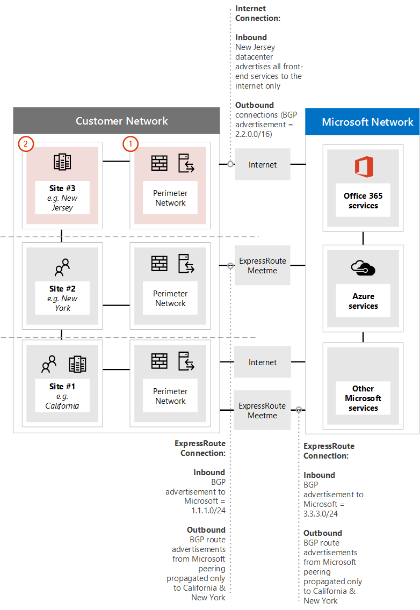
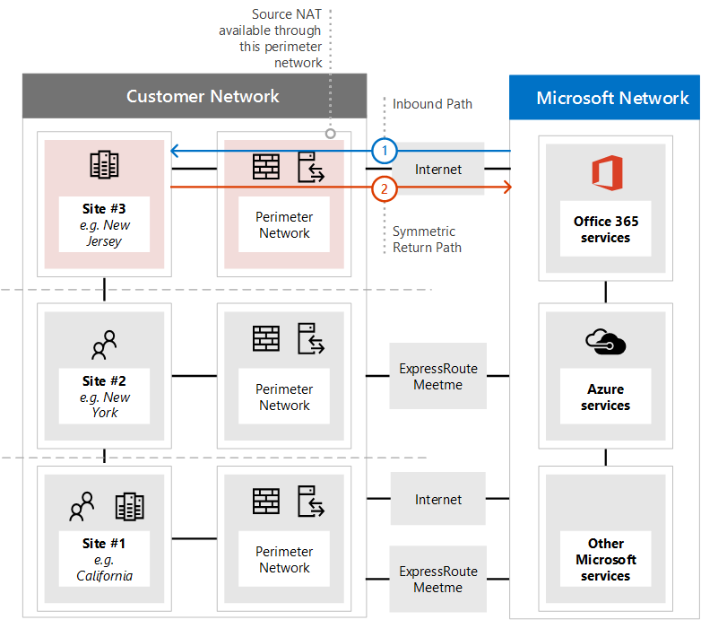
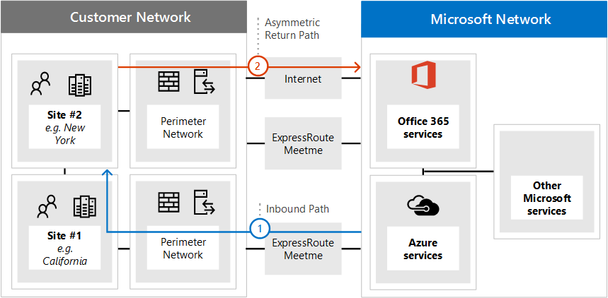
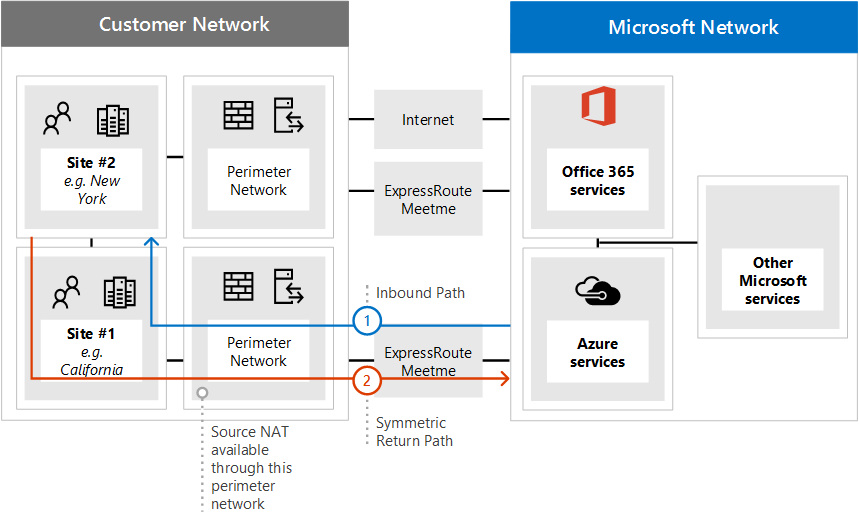
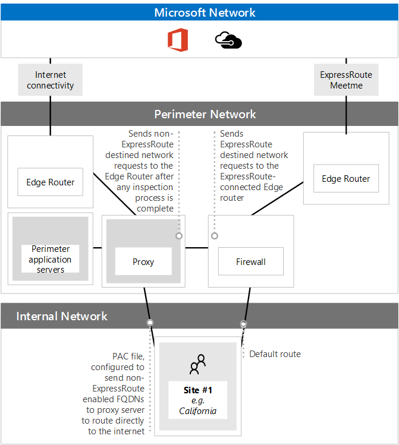

# Implementing ExpressRoute for Microsoft 365

*This article applies to Microsoft 365 Enterprise.*

ExpressRoute for Microsoft 365 provides an alternate routing path to many internet facing Microsoft 365 services. The architecture of ExpressRoute for Microsoft 365 is based on advertising public IP prefixes of Microsoft 365 services that are already accessible over the Internet into your provisioned ExpressRoute circuits for subsequent redistribution of those IP prefixes into your network. With ExpressRoute you effectively enable several different routing paths, through the internet and through ExpressRoute, for many Microsoft 365 services. This state of routing on your network may represent a significant change to how your internal network topology is designed.
  
> [!NOTE]
> We **do not recommend** ExpressRoute for Microsoft 365 because it does not provide the best connectivity model for the service in most circumstances. As such, Microsoft authorization is required to use this connectivity model. We review every customer request and authorize ExpressRoute for Microsoft 365 only in the rare scenarios where it is necessary. Please read the [ExpressRoute for Microsoft 365 guide](https://aka.ms/erguide) for more information and following a comprehensive review of the document with your productivity, network, and security teams, work with your Microsoft account team to submit an exception if needed. Unauthorized subscriptions trying to create route filters for Microsoft 365 will receive an [error message](https://support.microsoft.com/kb/3181709).
  
You have to carefully plan your ExpressRoute for Microsoft 365 implementation to accommodate for the network complexities of having routing available via both a dedicated circuit with routes injected into your core network and the internet. If you and your team don't perform the detailed planning and testing in this guide, there is a high risk you'll experience intermittent or a total loss of connectivity to Microsoft 365 services when the ExpressRoute circuit is enabled.
  
To have a successful implementation, you will need to analyze your infrastructure requirements, go through detailed network assessment and design, carefully plan the rollout in a staged and controlled manner, and build a detailed validation and testing plan. For a large, distributed environment it's not uncommon to see implementations span several months. This guide is designed to help you plan ahead.
  
Large successful deployments may take six months in planning and often include team members from many areas in the organization including networking, Firewall and Proxy server administrators, Microsoft 365 administrators, security, end-user support, project management, and executive sponsorship. Your investment in the planning process will reduce the likelihood that you'll experience deployment failures resulting in downtime or complex and expensive troubleshooting.
  
We expect the following pre-requisites to be completed before this implementation guide is started.
  
1. You've completed a network assessment to determine if ExpressRoute is recommended and approved.

2. You've selected an ExpressRoute network service provider. Find details about the [ExpressRoute partners and peering locations](/azure/expressroute/expressroute-locations).

3. You've already read and understand the [ExpressRoute documentation](/azure/expressroute/) and your internal network is able to meet ExpressRoute pre-requisites end to end.

4. Your team has read all of the public guidance and documentation at [https://aka.ms/expressrouteoffice365](./azure-expressroute.md), [https://aka.ms/ert](https://aka.ms/ert), and watched the [Azure ExpressRoute for Microsoft 365 Training](https://channel9.msdn.com/series/aer) series on Channel 9 to gain an understanding of critical technical details including:

      - The internet dependencies of SaaS services.

      - How to avoid asymmetric routes and handle complex routing.

      - How to incorporate perimeter security, availability, and application level controls.

## Begin by gathering requirements
<a name="requirements"> </a>

Start by determining which features and services you plan to adopt within your organization. You need to determine which features of the different Microsoft 365 services will be used and which locations on your network will host people using those features. With the catalog of scenarios, you need to add the network attributes that each of those scenarios require; such as inbound and outbound network traffic flows and if the Microsoft 365 endpoints are available over ExpressRoute or not.
  
To gather your organization's requirements:
  
- Catalog the inbound and outbound network traffic for the Microsoft 365 services your organization is using. Consult Microsoft 365 URLs and IP address ranges page for the description of flows that different Microsoft 365 scenarios require.

- Gather documentation of existing network topology showing details of your internal WAN backbone and topology, connectivity of satellite sites, last mile user connectivity, routing to network perimeter egress points, and proxy services.

  - Identify inbound service endpoints on the network diagrams that Microsoft 365 and other Microsoft services will connect to, showing both internet and proposed ExpressRoute connection paths.

  - Identify all geographic user locations and WAN connectivity between locations along with which locations currently have an egress to the internet and which locations are proposed to have an egress to an ExpressRoute peering location.

  - Identify all edge devices, such as proxies, firewalls, and so on, and catalog their relationship to flows going over the Internet and ExpressRoute.

  - Document whether end users will access Microsoft 365 services via Direct Routing or indirect application proxy for both Internet and ExpressRoute flows.

- Add the location of your tenant and meet-me locations to your network diagram.

- Estimate the expected and observed network performance and latency characteristics from major user locations to Microsoft 365. Keep in mind that Microsoft 365 is a global and distributed set of services and users will be connecting to locations that may be different from the location of their tenant. For this reason, it is recommended to measure and optimize for latency between the user and the closest edge of Microsoft global network over ExpressRoute and Internet connections. You can use your findings from the network assessment to aid with this task.

- List company network security and high availability requirements that need to be met with the new ExpressRoute connection. For example, how do users continue to get access to Microsoft 365 in the event of the Internet egress or ExpressRoute circuit failure.

- Document which inbound and outbound Microsoft 365 network flows will use the Internet path and which will use ExpressRoute. The specifics of geographical locations of your users and details of your on-premises network topology may require the plan to be different from one user location to another.

### Catalog your outbound and inbound network traffic
<a name="trafficCatalog"> </a>

To minimize routing and other network complexities, we recommend that you only use ExpressRoute for Microsoft 365 for the network traffic flows that are required to go over a dedicated connection due to regulatory requirements or as the result of the network assessment. Additionally, we recommend that you stage the scope of ExpressRoute routing and approach outbound and inbound network traffic flows as different and distinct stages of the implementation project. Deploy ExpressRoute for Microsoft 365 for just user initiated outbound network traffic flows and leave inbound network traffic flows across the Internet can help to control the increase in topological complexity and risks of introducing additional asymmetric routing possibilities.
  
Your network traffic catalog should contain listings of all the inbound and outbound network connections that you'll have between your on-premises network and Microsoft.
  
- Outbound network traffic flows are any scenarios where a connection is initiated from your on-premises environment, such as from internal clients or servers, with a destination of the Microsoft services. These connections may be direct to Microsoft 365 or indirect, such as when the connection goes through proxy servers, firewalls, or other networking devices on the path to Microsoft 365.

- Inbound network traffic flows are any scenarios where a connection is initiated from the Microsoft cloud to an on-premises host. These connections typically need to go through firewall and other security infrastructure that customer security policy requires for externally originated flows.

Read the [Ensuring route symmetry](#ensuring-route-symmetry) section to determine which services will send inbound traffic and look for the column marked **ExpressRoute for Microsoft 365** in the [Microsoft 365 endpoints](https://support.office.com/article/Office-365-URLs-and-IP-address-ranges-8548a211-3fe7-47cb-abb1-355ea5aa88a2) reference article to determine the rest of the connectivity information.
  
For each service that requires an outbound connection, you'll want to describe the planned connectivity for the service including network routing, proxy configuration, packet inspection, and bandwidth needs.
  
For each service that requires an inbound connection, you'll need some additional information. Servers in the Microsoft cloud will establish connections to your on-premises network. To ensure the connections are made correctly, you'll want to describe all aspects of this connectivity, including; the public DNS entries for the services that will accept these inbound connections, the CIDR formatted IPv4 IP addresses, which ISP equipment is involved, and how inbound NAT or source NAT is handled for these connections.
  
Inbound connections should be reviewed regardless of whether they're connecting over the internet or ExpressRoute to ensure asymmetric routing hasn't been introduced. In some cases, on-premises endpoints that Microsoft 365 services initiate inbound connections to may also need to be accessed by other Microsoft and non-Microsoft services. It is paramount that enabling ExpressRoute routing to these services for Microsoft 365 purposes doesn't break other scenarios. In many cases, customers may need to implement specific changes to their internal network, such as source-based NAT, to ensure that inbound flows from Microsoft remain symmetric after ExpressRoute is enabled.
  
Here's a sample of the level of detail required. In this case Exchange Hybrid would route to the on-premises system over ExpressRoute. 

|Connection property   |Value  |
|----------|-----------|
|**Network traffic direction** <br/> |Inbound  <br/> |
|**Service** <br/> |Exchange Hybrid  <br/> |
|**Public Microsoft 365 endpoint (source)** <br/> |Exchange Online (IP addresses)  <br/> |
|**Public On-Premises Endpoint (destination)** <br/> |5.5.5.5  <br/> |
|**Public (Internet) DNS entry** <br/> |Autodiscover.contoso.com  <br/> |
|**Will this on-premises endpoint be used for by other (non-Microsoft 365) Microsoft services** <br/> |No  <br/> |
|**Will this on-premises endpoint be used by users/systems on the Internet** <br/> |Yes  <br/> |
|**Internal systems published through public endpoints** <br/> |Exchange Server client access role (on-premises) 192.168.101, 192.168.102, 192.168.103  <br/> |
|**IP advertisement of the public endpoint** <br/> |**To Internet**: 5.5.0.0/16 **To ExpressRoute**: 5.5.5.0/24  <br/> |
|**Security/Perimeter Controls** <br/> |**Internet path**: DeviceID_002  **ExpressRoute path**: DeviceID_003  <br/> |
|**High Availability** <br/> |Active/Active across 2 geo-redundant / ExpressRoute circuits - Chicago and Dallas  <br/> |
|**Path symmetry control** <br/> |**Method**: Source NAT **Internet path**: Source NAT inbound connections to 192.168.5.5 **ExpressRoute path**: Source NAT connections to 192.168.1.0 (Chicago) and 192.168.2.0 (Dallas)  <br/> |

Here's a sample of a service that is outbound only:

|**Connection property**|**Value**|
|----------|-----------|
|**Network traffic direction** <br/> |Outbound  <br/> |
|**Service** <br/> |SharePoint Online  <br/> |
|**On-premises endpoint (source)** <br/> |User workstation  <br/> |
|**Public Microsoft 365 endpoint (destination)** <br/> |SharePoint Online (IP addresses)  <br/> |
|**Public (Internet) DNS entry** <br/> |\*.sharepoint.com (and more FQDNs)  <br/> |
|**CDN Referrals** <br/> |cdn.sharepointonline.com (and more FQDNs) - IP addresses maintained by CDN providers)  <br/> |
|**IP advertisement and NAT in use** <br/> |**Internet path/Source NAT**: 1.1.1.0/24  <br/> **ExpressRoute path/Source NAT**: 1.1.2.0/24 (Chicago) and 1.1.3.0/24 (Dallas)  <br/> |
|**Connectivity method** <br/> |**Internet**: via layer 7 proxy (.pac file)  <br/> **ExpressRoute**: direct routing (no proxy)  <br/> |
|**Security/Perimeter Controls** <br/> |**Internet path**: DeviceID_002  <br/> **ExpressRoute path**: DeviceID_003  <br/> |
|**High Availability** <br/> |**Internet path**: Redundant internet egress  <br/> **ExpressRoute path**: Active/Active 'hot potato' routing across 2 geo-redundant ExpressRoute circuits - Chicago and Dallas  <br/> |
|**Path symmetry control** <br/> |**Method**: Source NAT for all connections  <br/> |

### Your network topology design with regional connectivity
<a name="topology"> </a>

Once you understand the services and their associated network traffic flows, you can create a network diagram that incorporates these new connectivity requirements and illustrates the changes you'll make to use ExpressRoute for Microsoft 365. Your diagram should include:
  
1. All user locations where Microsoft 365 and other services will be accessed from.

2. All internet and ExpressRoute egress points.

3. All outbound and inbound devices that manage connectivity in and out of the network, including routers, firewalls, application proxy servers, and intrusion detection/prevention.

4. Internal destinations for all inbound traffic, such as internal ADFS servers that accept connections from the ADFS web application proxy servers.

5. Catalog of all IP subnets that will be advertised

6. Identify each location where people will access Microsoft 365 from and list the meet-me locations that will be used for ExpressRoute.

7. Locations and portions of your internal network topology, where Microsoft IP prefixes learned from ExpressRoute will be accepted, filtered, and propagated to.

8. The network topology should illustrate the geographic location of each network segment and how it connects to the Microsoft network over ExpressRoute and/or the Internet.

The diagram below shows each location where people will be using Microsoft 365 from along with the inbound and outbound routing advertisements to Microsoft 365.
  

  
For outbound traffic, the people access Microsoft 365 in one of three ways:
  
1. Through a meet-me location in North America for the people in California.

2. Through a meet-me location in Hong Kong Special Administrative Region for the people in Hong Kong SAR.

3. Through the internet in Bangladesh where there are fewer people and no ExpressRoute circuit provisioned.


  
Similarly, the inbound network traffic from Microsoft 365 returns in one of three ways:
  
1. Through a meet-me location in North America for the people in California.

2. Through a meet-me location in Hong Kong Special Administrative Region for the people in Hong Kong SAR.

3. Through the internet in Bangladesh where there are fewer people and no ExpressRoute circuit provisioned.


  
### Determine the appropriate meet-me location

The selection of meet-me locations, which are the physical location where your ExpressRoute circuit connects your network to the Microsoft network, is influenced by the locations where people will access Microsoft 365 from. As a SaaS offering, Microsoft 365 does not operate under the IaaS or PaaS regional model in the same way Azure does. Instead, Microsoft 365 is a distributed set of collaboration services, where users may need to connect to endpoints across multiple datacenters and regions, which may not necessarily be in the same location or region where the user's tenant is hosted.
  
This means the most important consideration you need to make when selecting meet-me locations for ExpressRoute for Microsoft 365 is where the people in your organization will be connecting from. The general recommendation for optimal Microsoft 365 connectivity is implement routing, so that user requests to Microsoft 365 services are handed off into the Microsoft network over the shortest network path, this is also often being referred to as 'hot potato' routing. For example, if most of the Microsoft 365 users are in one or two locations, selecting meet-me locations that are in the closest proximity to the location of those users will create the optimal design. If your company has large user populations in many different regions, you may want to consider having multiple ExpressRoute circuits and meet-me locations. For some of your user locations, the shortest/most optimal path into Microsoft network and Microsoft 365, may not be through your internal WAN and ExpressRoute meet-me points, but via the Internet.
  
Often, there are multiple meet-me locations that could be selected within a region with relative proximity to your users. Fill out the following table to guide your decisions.

#### Planned ExpressRoute meet-me locations in California and New York

|Location  <br/> |Number of people  <br/> |Expected latency to Microsoft network over Internet egress  <br/> |Expected latency to Microsoft network over ExpressRoute  <br/> |
|----------|-----------|----------|-----------|
|Los Angeles  <br/> |10,000  <br/> |~15ms  <br/> |~10ms (via Silicon Valley)  <br/> |
|Washington DC  <br/> |15,000  <br/> |~20ms  <br/> |~10ms (via New York)  <br/> |
|Dallas  <br/> |5,000  <br/> |~15ms  <br/> |~40ms (via New York)  <br/> |

Once the global network architecture showing the Microsoft 365 region, ExpressRoute network service provider meet-me locations, and the quantity of people by location has been developed, it can be used to identify if any optimizations can be made. It may also show global hairpin network connections where traffic routes to a distant location in order to get the meet-me location. If a hairpin on the global network is discovered, it should be remediated before continuing. Either find another meet-me location, or use selective Internet breakout egress points to avoid the hairpin.
  
The first diagram, shows an example of a customer with two physical locations in North America. You can see the information about office locations, Microsoft 365 tenant locations, and several choices for ExpressRoute meet-me locations. In this example, the customer has selected the meet-me location based on two principles, in order:
  
1. Closest proximity to the people in their organization.

2. Closest in proximity to a Microsoft datacenter where Microsoft 365 is hosted.


  
Expanding this concept slightly further, the second diagram shows an example multi-national customer faced with similar information and decision making. This customer has a small office in Bangladesh with only a small team of ten people focused on growing their footprint in the region. There is a meet-me location in Chennai and a Microsoft datacenter with Microsoft 365 hosted in Chennai so a meet-me location would make sense; however, for ten people, the expense of the extra circuit is burdensome. As you look at your network, you'll need to determine if the latency involved in sending your network traffic across your network is more effective than spending the capital to acquire another ExpressRoute circuit.
  
Alternatively, the ten people in Bangladesh may experience better performance with their network traffic sent over the internet to the Microsoft network than they would routing on their internal network as we showed in the introductory diagrams and reproduced below.
  

  
## Create your ExpressRoute for Microsoft 365 implementation plan
<a name="implementation"> </a>

Your implementation plan should encompass both the technical details of configuring ExpressRoute and the details of configuring all the other infrastructure on your network, such as the following.
  
- Plan which services split between ExpressRoute and Internet.

- Plan for bandwidth, security, high availability, and failover.

- Design inbound and outbound routing, including proper routing path optimizations for different locations

- Decide how far ExpressRoute routes will be advertised into your network and what is the mechanism for clients to select Internet or ExpressRoute path; for example, direct routing or application proxy.

- Plan DNS record changes, including [Sender Policy Framework](../security/office-365-security/email-authentication-spf-configure.md) entries.

- Plan NAT strategy including outbound and inbound source NAT.

### Plan your routing with both internet and ExpressRoute network paths
<a name="paths"> </a>

- For your initial deployment, all inbound services, such as inbound email or hybrid connectivity, are recommended to use the internet.

- Plan end-user client LAN routing, such as [configuring a PAC/WPAD file](./managing-office-365-endpoints.md), default route, proxy servers, and BGP route advertisements.

- Plan perimeter routing, including proxy servers, firewalls, and cloud proxies.

### Plan your bandwidth, security, high availability, and failover
<a name="availability"> </a>

Create a plan for bandwidth required for each major Microsoft 365 workload. Separately estimate Exchange Online, SharePoint Online, and Skype for Business Online bandwidth requirements. You can use the estimation calculators we've provided for Exchange Online and Skype for Business as a starting place; however, a pilot test with a representative sample of the user profiles and locations is required to fully understand the bandwidth needs of your organization.
  
Add how security is handled at each internet and ExpressRoute egress location to your plan, remember all ExpressRoute connections to Microsoft 365 use public peering and must still be secured in accordance with your company security policies of connecting to external networks.
  
Add details to your plan about which people will be affected by what type of outage and how those people will be able to perform their work at full capacity in the simplest manner.
  
#### Plan bandwidth requirements including Skype for Business requirements on Jitter, Latency, Congestion, and Headroom
  
Skype for Business Online also has specific extra network requirements, which are detailed in the article [Media Quality and Network Connectivity Performance in Skype for Business Online](https://support.office.com/article/Media-Quality-and-Network-Connectivity-Performance-in-Skype-for-Business-Online-5fe3e01b-34cf-44e0-b897-b0b2a83f0917).
  
Read the section [Bandwidth planning for Azure ExpressRoute](#bandwidth-planning-for-azure-expressroute). When performing a bandwidth assessment with your pilot users, you can use our guide [Microsoft 365 performance tuning using baselines and performance history](https://support.office.com/article/Office-365-performance-tuning-using-baselines-and-performance-history-1492cb94-bd62-43e6-b8d0-2a61ed88ebae).
  
#### Plan for high availability requirements
  
Create a plan for high availability to meet your needs and incorporate this into your updated network topology diagram. Read the section [High availability and failover with Azure ExpressRoute](#high-availability-and-failover-with-azure-expressroute).
  
#### Plan for network security requirements
  
Create a plan to meet your network security requirements and incorporate this into your updated network topology diagram. Read the section [Applying security controls to Azure ExpressRoute for Microsoft 365 scenarios](#applying-security-controls-to-azure-expressroute-for-microsoft-365-scenarios).
  
### Design outbound service connectivity
<a name="outbound"> </a>

ExpressRoute for Microsoft 365 has *outbound* network requirements that may be unfamiliar. Specifically, the IP addresses that represent your users and networks to Microsoft 365 and act as the source endpoints for outbound network connections to Microsoft must follow specific requirements outlined below.
  
1. The endpoints must be public IP addresses, that are registered to your company or to carrier providing ExpressRoute connectivity to you.

2. The endpoints must be advertised to Microsoft and validated/accepted by ExpressRoute.

3. The endpoints must not be advertised to the Internet with the same or more preferred routing metric.

4. The endpoints must not be used for connectivity to Microsoft services that are not configured over ExpressRoute.

If your network design doesn't meet these requirements, there is a high risk your users will experience connectivity failures to Microsoft 365 and other Microsoft services due to route black holing or asymmetric routing. This occurs when requests to Microsoft services are routed over ExpressRoute, but responses are routed back across the internet, or vice versa, and the responses are dropped by stateful network devices such as firewalls.
  
The most common method you can use to meet the above requirements is to use source NAT, either implemented as a part of your network or provided by your ExpressRoute carrier. Source NAT allows you to abstract the details and private IP addressing of your internet network from ExpressRoute and; coupled with proper IP route advertisements, provide an easy mechanism to ensure path symmetry. If you're using stateful network devices that are specific to ExpressRoute peering locations, you must implement separate NAT pools for each ExpressRoute peering to ensure path symmetry.
  
Read more about the [ExpressRoute NAT requirements](/azure/expressroute/expressroute-nat).
  
Add the changes for the outbound connectivity to the network topology diagram.
  
### Design inbound service connectivity
<a name="inbound"> </a>

Most enterprise Microsoft 365 deployments assume some form of inbound connectivity from Microsoft 365 to on-premises services, such as for Exchange, SharePoint, and Skype for Business hybrid scenarios, mailbox migrations, and authentication using ADFS infrastructure. When ExpressRoute you enable an extra routing path between your on-premises network and Microsoft for outbound connectivity, these inbound connections may inadvertently be impacted by asymmetric routing, even if you intend to have those flows continue to use the Internet. A few precautions described below are recommended to ensure there is no impact to Internet based inbound flows from Microsoft 365 to on-premises systems.
  
To minimize the risks of asymmetric routing for inbound network traffic flows, all of the inbound connections should use source NAT before they're routed into segments of your network, which have routing visibility into ExpressRoute. If the incoming connections are allowed onto a network segment with routing visibility into ExpressRoute without source NAT, requests originating from Microsoft 365 will enter from the internet, but the response going back to Microsoft 365 will prefer the ExpressRoute network path back to the Microsoft network, causing asymmetric routing.
  
You may consider one of the following implementation patterns to satisfy this requirement:
  
1. Perform source NAT before requests are routed into your internal network using networking equipment such as firewalls or load balancers on the path from the Internet to your on-premises systems.

2. Ensure that ExpressRoute routes are not propagated to the network segments where inbound services, such as front-end servers or reverse proxy systems, handling Internet connections reside.

Explicitly accounting for these scenarios in your network and keeping all inbound network traffic flows over the Internet helps to minimize deployment and operational risk of asymmetric routing.
  
There may be cases where you may choose to direct some inbound flows over ExpressRoute connections. For these scenarios, take the following extra considerations into account.
  
1. Microsoft 365 can only target on-premises endpoints that use public IPs. This means that even if the on-premises inbound endpoint is only exposed to Microsoft 365 over ExpressRoute, it still needs to have public IP associated with it.

2. All DNS name resolution that Microsoft 365 services perform to resolve on-premises endpoints happen using public DNS. This means that you must register inbound service endpoints' FQDN to IP mappings on the Internet.

3. In order to receive inbound network connections over ExpressRoute, the public IP subnets for these endpoints must be advertised to Microsoft over ExpressRoute.

4. Carefully evaluate these inbound network traffic flows to ensure that proper security and network controls are applied to them in accordance with your company security and network policies.

5. Once your on-premises inbound endpoints are advertised to Microsoft over ExpressRoute, ExpressRoute will effectively become the preferred routing path to those endpoints for all Microsoft services, including Microsoft 365. This means that those endpoint subnets must only be used for communications with Microsoft 365 services and no other services on the Microsoft network. Otherwise, your design will cause asymmetric routing where inbound connections from other Microsoft services prefer to route inbound over ExpressRoute, while the return path will use the Internet.

6. In the event an ExpressRoute circuit or meet-me location is down, you'll need to ensure the on-premises inbound endpoints are still available to accept requests over a separate network path. This may mean advertising subnets for those endpoints through multiple ExpressRoute circuits.

7. We recommend applying source NAT for all inbound network traffic flows entering your network through ExpressRoute, especially when these flows cross stateful network devices such as firewalls.

8. Some on-premises services, such as ADFS proxy or Exchange autodiscover, may receive inbound requests from both Microsoft 365 services and users from the Internet. For these requests Microsoft 365 will target the same FQDN as user requests over the Internet. Allowing inbound user connections from the internet to those on-premises endpoints, while forcing Microsoft 365 connections to use ExpressRoute, represents significant routing complexity. For the vast majority of customers implementing such complex scenarios over ExpressRoute is not recommended due to operational considerations. This additional overhead includes, managing risks of asymmetric routing and will require you to carefully manage routing advertisements and policies across multiple dimensions.

### Update your network topology plan to show how you would avoid asymmetric routes
<a name="asymmetric"> </a>

You want to avoid asymmetric routing to ensure people in your organization can seamlessly use Microsoft 365 as well as other important services on the internet. There are two common configurations customers have that cause asymmetric routing. Now's a good time to review the network configuration you're planning to use and check if one of these asymmetric routing scenarios could exist.
  
To begin, we'll examine a few different situations associated with the following network diagram. In this diagram, all servers that receive inbound requests, such as ADFS or on-premises hybrid servers are in the New Jersey data center and are advertised to the internet.
  
1. While the perimeter network is secure, there is no Source NAT available for incoming requests.

2. The servers in the New Jersey data center are able to see both internet and ExpressRoute routes.


  
We also have suggestions on how to fix them.
  
#### Problem 1: Cloud to on-premises connection over the Internet
  
The following diagram illustrates the asymmetric network path taken when your network configuration doesn't provide NAT for inbound requests from the Microsoft cloud over the internet.
  
1. The inbound request from Microsoft 365 retrieves the IP address of the on-premises endpoint from public DNS and sends the request to your perimeter network.

2. In this faulty configuration, there is no Source NAT configured or available at the perimeter network where the traffic is sent resulting in the actual source IP address being used as the return destination.

  - The server on your network routes the return traffic to Microsoft 365 through any available ExpressRoute network connection.

  - The result is an Asymmetric path for that flow to Microsoft 365, resulting in a broken connection.


  
##### Solution 1a: Source NAT
  
Simply adding a source NAT to the inbound request resolves this misconfigured network. In this diagram:
  
1. The incoming request continues to enter through the New Jersey data center's perimeter network. This time Source NAT is available.

2. The response from the server routes back toward the IP associated with the Source NAT instead of the original IP address, resulting in the response returning along the same network path.


  
##### Solution 1b: Route Scoping
  
Alternatively, you can choose to not allow the ExpressRoute BGP prefixes to be advertised, removing the alternate network path for those computers. In this diagram:
  
1. The incoming request continues to enter through the New Jersey data center's perimeter network. This time the prefixes advertised from Microsoft over the ExpressRoute circuit are not available to the New Jersey data center.

2. The response from the server routes back toward the IP associated with the original IP address over the only route available, resulting in the response returning along the same network path.


  
#### Problem 2: Cloud to on-premises connection over ExpressRoute
  
The following diagram illustrates the asymmetric network path taken when your network configuration doesn't provide NAT for inbound requests from the Microsoft cloud over ExpressRoute.
  
1. The inbound request from Microsoft 365 retrieves the IP address from DNS and sends the request to your perimeter network.

2. In this faulty configuration, there is no Source NAT configured or available at the perimeter network where the traffic is sent resulting in the actual source IP address being used as the return destination.

  - The computer on your network routes the return traffic to Microsoft 365 through any available ExpressRoute network connection.

  - The result is an Asymmetric connection to Microsoft 365.


  
##### Solution 2: Source NAT
  
Simply adding a source NAT to the inbound request resolves this misconfigured network. In this diagram:
  
1. The incoming request continues to enter through the New York data center's perimeter network. This time Source NAT is available.

2. The response from the server routes back toward the IP associated with the Source NAT instead of the original IP address, resulting in the response returning along the same network path.


  
### Paper verify that the network design has path symmetry

At this point, you need to verify on paper that your implementation plan offers route symmetry for the different scenarios in which you'll be using Microsoft 365. You'll identify the specific network route that is expected to be taken when a person uses different features of the service. From the on-premises network and WAN routing, to the perimeter devices, to the connectivity path; ExpressRoute or the internet, and on to the connection to the online endpoint.
  
You'll need to do this for all of the Microsoft 365 network services that were previously identified as services that your organization will adopt.
  
It helps to do this paper walk-through of routes with a second person. Explain to them where each network hop is expected to get its next route from and ensure that you're familiar with the routing paths. Remember that ExpressRoute will always provide a more scoped route to Microsoft server IP addresses giving it lower route cost than an Internet default route.
  
### Design Client Connectivity Configuration
<a name="asymmetric"> </a>


  
If you're using a proxy server for internet bound traffic, then you need to adjust any PAC or client configuration files to ensure client computers on your network are correctly configured to send the ExpressRoute traffic you desire to Microsoft 365 without transiting your proxy server, and the remaining traffic, including some Microsoft 365 traffic, is sent to the relevant proxy. Read our guide on [managing Microsoft 365 endpoints](./managing-office-365-endpoints.md), for example, PAC files.
  
> [!NOTE]
> The endpoints change frequently, as often as weekly. You should only make changes based on the services and features your organization has adopted to reduce the number of changes you'll need to make to stay current. Pay close attention to the **Effective Date** in the RSS feed where the changes are announced and a record is kept of all past changes, IP addresses that are announced may not be advertised, or removed from advertisement, until the effective date is reached.

## Ensuring route symmetry

The Microsoft 365 front-end servers are accessible on both the Internet and ExpressRoute. These servers will prefer to route back to on-premises over ExpressRoute circuits when both are available. Because of this, there is a possibility of route asymmetry if traffic from your network prefers to route over your Internet circuits. Asymmetrical routes are a problem because devices that perform stateful packet inspection can block return traffic that follows a different path than the outbound packets followed.
  
Regardless of whether you initiate a connection to Microsoft 365 over the Internet or ExpressRoute, the source must be a publicly routable address. With many customers peering directly with Microsoft, having private addresses where duplication is possible between customers isn't feasible.
  
The following are scenarios where communications from Microsoft 365 to your on-premises network will be initiated. To simplify your network design, we recommend routing the following over the Internet path.
  
- SMTP services such as mail from an Exchange Online tenant to an on-premises host or SharePoint Online Mail sent from SharePoint Online to an on-premises host. SMTP protocol is used more broadly within Microsoft's network than the route prefixes shared over ExpressRoute circuits and advertising on-premises SMTP servers over ExpressRoute will cause failures with these other services.

- ADFS during password validation for signing in.

- [Exchange Server Hybrid deployments](/exchange/exchange-hybrid).

- [SharePoint federated hybrid search](/SharePoint/hybrid/display-hybrid-federated-search-results-in-sharepoint-online).

- [SharePoint hybrid BCS](/SharePoint/hybrid/deploy-a-business-connectivity-services-hybrid-solution).

- [Skype for Business hybrid](/skypeforbusiness/hybrid/plan-hybrid-connectivity?bc=/SkypeForBusiness/breadcrumb/toc.json&toc=/SkypeForBusiness/toc.json) and/or [Skype for Business federation](/office365/servicedescriptions/skype-for-business-online-service-description/skype-for-business-online-features).

- [Skype for Business Cloud Connector](/skypeforbusiness/skype-for-business-hybrid-solutions/plan-your-phone-system-cloud-pbx-solution/plan-skype-for-business-cloud-connector-edition).

For Microsoft to route back to your network for these bi-directional traffic flows, the BGP routes to your on-premises devices must be shared with Microsoft. When you advertise route prefixes to Microsoft over ExpressRoute, you should follow these best practices:

1) Do not advertise the same public IP Address route prefix to the public Internet and over ExpressRoute. It is recommended that the IP BGP Route Prefix advertisements to Microsoft over ExpressRoute are from a range that is not advertised to the internet at all. If this is not possible to achieve due to the available IP Address space, then it is essential to ensure you advertise a more specific range over ExpressRoute than any internet circuits.

2) Use separate NAT IP pools per ExpressRoute circuit and separate to that of your internet circuits.

3) Any route advertised to Microsoft will attract network traffic from any server in Microsoft's network, not only those for which routes are advertised to your network over ExpressRoute. Only advertise routes to servers where routing scenarios are defined and well understood by your team. Advertise separate IP Address route prefixes at each of multiple ExpressRoute circuits from your network.

## High availability and failover with Azure ExpressRoute
<a name="BKMK_high-availability"> </a>

We recommend provisioning at least two active circuits from each egress with ExpressRoute to your ExpressRoute provider. This is the most common place we see failures for customers and you can easily avoid it by provisioning a pair of active/active ExpressRoute circuits. We also recommend at least two active/active Internet circuits because many Microsoft 365 services are only available over the Internet.
  
Inside the egress point of your network are many other devices and circuits that play a critical role in how people perceive availability. These portions of your connectivity scenarios are not covered by ExpressRoute or Microsoft 365 SLAs, but they play a critical role in the end-to-end service availability as perceived by people in your organization.
  
Focus on the people using and operating Microsoft 365, if a failure of any one component would affect peoples' experience using the service, look for ways to limit the total percentage of people affected. If a failover mode is operationally complex, consider the peoples' experience of a long time to recovery and look for operationally simple and automated failover modes.
  
Outside of your network, Microsoft 365, ExpressRoute, and your ExpressRoute provider all have different levels of availability.
  
### Service Availability
  
- Microsoft 365 services are covered by well-defined [service level agreements](/office365/servicedescriptions/office-365-platform-service-description/service-level-agreement), which include uptime and availability metrics for individual services. One reason Microsoft 365 can maintain such high service availability levels is the ability for individual components to seamlessly fail over between the many Microsoft datacenters, using the global Microsoft network. This failover extends from the datacenter and network to the multiple Internet egress points, and enables failover seamlessly from the perspective of the people using the service.

- ExpressRoute [provides a 99.9% availability SLA](https://azure.microsoft.com/support/legal/sla/expressroute/v1_0/) on individual dedicated circuits between the Microsoft Network Edge and the ExpressRoute provider or partner infrastructure. These service levels are applied at the ExpressRoute circuit level, which consists of [two independent interconnects](/azure/expressroute/expressroute-introduction) between the redundant Microsoft equipment and the network provider equipment in each peering location.

### Provider Availability
  
- Microsoft's service level arrangements stop at your ExpressRoute provider or partner. This is also the first place you can make choices that will influence your availability level. You should closely evaluate the architecture, availability, and resiliency characteristics your ExpressRoute provider offers between your network perimeter and your providers connection at each Microsoft peering location. Pay close attention to both the logical and physical aspects of redundancy, peering equipment, carrier provided WAN circuits, and any extra value add services such as NAT services or managed firewalls.

### Designing your availability plan
  
We strongly recommend that you plan and design high availability and resiliency into your end-to-end connectivity scenarios for Microsoft 365. A design should include;
  
- No single points of failure, including both Internet and ExpressRoute circuits.

- Minimizing the number of people affected and duration of that impact for most anticipated failure modes.

- Optimizing for simple, repeatable, and automatic recovery process from most anticipated failure modes.

- Supporting the full demands of your network traffic and functionality through redundant paths, without substantial degradation.

Your connectivity scenarios should include a network topology that is optimized for multiple independent and active network paths to Microsoft 365. This will yield a better end-to-end availability than a topology that is optimized only for redundancy at the individual device or equipment level.
  
> [!TIP]
> If your users are distributed across multiple continents or geographic regions and each of those locations connects over redundant WAN circuits to a single on-premises location where a single ExpressRoute circuit is located, your users will experience less end-to-end service availability than a network topology design that includes independent ExpressRoute circuits that connect the different regions to the nearest peering location.
  
We recommend provisioning at least two ExpressRoute circuits with each circuit connecting to with a different geographic peering location. You should provision this active-active pair of circuits for every region where people will use ExpressRoute connectivity for Microsoft 365 services. This allows each region to remain connected during a disaster that affects a major location such as a datacenter or peering location. Configuring them in as active/active allows end user traffic to be distributed across multiple network paths. This reduces the scope of people affected during device or network equipment outages.
  
We don't recommend using a single ExpressRoute circuit with the Internet as a backup.
  
### Example: Failover and High Availability
  
Contoso's multi-geographic design has undergone a review of routing, bandwidth, security, and now must go through a high availability review. Contoso thinks about high availability as covering three categories; resiliency, reliability, and redundancy.
  
Resiliency allows Contoso to recover from failures quickly. Reliability allows Contoso to offer a consistent outcome within the system. Redundancy allows Contoso to a move between one or more mirrored instances of infrastructure.
  
Within each edge configuration, Contoso has redundant Firewalls, Proxies, and IDS. For North America, Contoso has one edge configuration in their Dallas datacenter and another edge configuration in their Virginia datacenter. The redundant equipment at each location offers resiliency to that location.
  
The network configuration at Contoso is built based on a few key principles:
  
- Within each geographic region, there are multiple Azure ExpressRoute circuits.

- Each circuit within a region can support all of the network traffic within that region.

- Routing will clearly prefer one or the other path depending on availability, location, and so on.

- Failover between Azure ExpressRoute circuits happens automatically without additional configuration or action required by Contoso.

- Failover between Internet circuits happens automatically without additional configuration or action required by Contoso.

In this configuration, with redundancy at the physical and virtual level, Contoso is able to offer local resiliency, regional resiliency, and global resiliency in a reliable way. Contoso elected this configuration after evaluating a single Azure ExpressRoute circuit per region as well as the possibility of failing over to the internet.
  
If Contoso was unable to have multiple Azure ExpressRoute circuits per region, routing traffic originating in North America to the Azure ExpressRoute circuit in Asia Pacific would add an unacceptable level of latency and the required DNS forwarder configuration adds complexity.
  
Using the internet as a backup configuration isn't recommended. This breaks Contoso's reliability principle, resulting in an inconsistent experience using the connection. Additionally, manual configuration would be required to fail over considering the BGP advertisements that have been configured, NAT configuration, DNS configuration, and the proxy configuration. This added failover complexity increases the time to recover and decreases their ability to diagnose and troubleshoot the steps involved.
  
Still have questions about how to plan for and implement traffic management or Azure ExpressRoute? Read the rest of our [network and performance guidance](./network-planning-and-performance.md) or the [Azure ExpressRoute FAQ](/azure/expressroute/expressroute-faqs).

## Applying security controls to Azure ExpressRoute for Microsoft 365 scenarios

Securing Azure ExpressRoute connectivity starts with the same principles as securing Internet connectivity. Many customers choose to deploy network and perimeter controls along the ExpressRoute path connecting their on-premises network to Microsoft 365 and other Microsoft clouds. These controls may include firewalls, application proxies, data leakage prevention, intrusion detection, intrusion prevention systems, and so on. In many cases customers apply different levels of controls to traffic initiated from on-premises going to Microsoft, versus traffic initiated from Microsoft going to customer on-premises network, versus traffic initiated from on-premises going to a general Internet destination.
  
Here's a few examples of integrating security with the [ExpressRoute connectivity model](/azure/expressroute/expressroute-connectivity-models) you choose to deploy.

|**ExpressRoute integration option**|**Network security perimeter model**|
|:-----|:-----|
|Colocated at a cloud exchange  <br/> |Install new or use existing security/perimeter infrastructure in the colocation facility where the ExpressRoute connection is established.  <br/> Use colocation facility purely for routing/interconnect purposes and back haul connections from colocation facility into the on-premises security/perimeter infrastructure.  <br/> |
|Point-to-Point Ethernet  <br/> |Terminate the Point-to-Point ExpressRoute connection in the existing on-premises security/perimeter infrastructure location.  <br/> Install new security/perimeter infrastructure specific to the ExpressRoute path and terminate the Point-to-Point connection there.  <br/> |
|Any-to-Any IPVPN  <br/> |Use an existing on-premises security/perimeter infrastructure at all locations that egress into the IPVPN used for ExpressRoute for Microsoft 365 connectivity.  <br/> Hairpin the IPVPN used for ExpressRoute for Microsoft 365 to specific on-premises locations designated to serve as the security/perimeter.  <br/> |

Some service providers also offer managed security/perimeter functionality as a part of their integration solutions with Azure ExpressRoute.
  
When considering the topology placement of the network/security perimeter options used for ExpressRoute for Microsoft 365 connections, following are extra considerations
  
- The depth and type network/security controls may have impact on the performance and scalability of the Microsoft 365 user experience.

- Outbound (on-premises-\>Microsoft) and inbound (Microsoft-\>on-premises) [if enabled] flows may have different requirements. These are likely different than Outbound to general Internet destinations.

- Microsoft 365 requirements for ports/protocols and necessary IP subnets are the same, whether traffic is routed through ExpressRoute for Microsoft 365 or through the Internet.

- Topological placement of the customer network/security controls determines the ultimate end to end network between the user and Microsoft 365 service and can have a substantial impact on network latency and congestion.

- Customers are encouraged to design their security/perimeter topology for use with ExpressRoute for Microsoft 365 in accordance with best practices for redundancy, high availability, and disaster recovery.

Here's an example of Contoso that compares the different Azure ExpressRoute connectivity options with the perimeter security models discussed above.
  
### Example: Securing Azure ExpressRoute
  
Contoso is considering implementing Azure ExpressRoute and after planning the optimal architecture for ExpressRoute for Microsoft 365 and after using the above guidance to understand bandwidth requirements, they're determining the best method for securing their perimeter.
  
For Contoso, a multi-national organization with locations in multiple continents, security must span all perimeters. The optimal connectivity option for Contoso is a multi-point connection with multiple peering locations around the globe to service the needs of their employees in each continent. Each continent includes redundant Azure ExpressRoute circuits within the continent and security must span all of these.
  
Contoso's existing infrastructure is reliable and can handle the extra work, as a result, Contoso is able to use the infrastructure for their Azure ExpressRoute and internet perimeter security. If this weren't the case, Contoso could choose to purchase more equipment to supplement their existing equipment or to handle a different type of connection.

## Bandwidth planning for Azure ExpressRoute

Every Microsoft 365 customer has unique bandwidth needs depending on the number of people at each location, how active they are with each Microsoft 365 application, and other factors such as the use of on-premises or hybrid equipment and network security configurations.
  
Having too little bandwidth will result in congestion, retransmissions of data, and unpredictable delays. Having too much bandwidth will result in unnecessary cost. On an existing network, bandwidth is often referred to in terms of the amount of available headroom on the circuit as a percentage. Having 10% headroom will likely result in congestion and having 80% headroom generally means unnecessary cost. Typical headroom target allocations are 20% to 50%.
  
To find the right level of bandwidth, the best mechanism is to test your existing network consumption. This is the only way to get a true measure of usage and need as every network configuration and applications are in some ways unique. When measuring, you'll want to pay close attention to the total bandwidth consumption, latency, and TCP congestion to understand your network needs.
  
Once you have an estimated baseline that includes all network applications, pilot Microsoft 365 with a small group that comprises the different profiles of people in your organization to determine actual usage, and use the two measurements to estimate the amount of bandwidth you'll require for each office location. If there are any latency or TCP congestion issues found in your testing, you may need to move the egress closer to the people using Microsoft 365 or remove intensive network scanning such as SSL decryption/inspection.
  
All of our recommendations on what type of network processing is recommended applies to both ExpressRoute and Internet circuits. The same is true for the rest of the guidance on our [performance tuning site](./network-planning-and-performance.md).
  
## Build your deployment and testing procedures
<a name="testing"> </a>

Your implementation plan should include both testing and rollback planning. If your implementation isn't functioning as expected, the plan should be designed to affect the least number of people before problems are discovered. The following are some high-level principles your plan should consider.
  
1. Stage the network segment and user service onboarding to minimize disruption.

2. Plan for testing routes with traceroute and TCP connect from a separate internet connected host.

3. Preferably, testing of inbound and outbound services should be done on an isolated test network with a test Microsoft 365 tenant.

      - Alternatively, testing can be performed on a production network if the customer is not yet using Microsoft 365 or is in pilot.

      - Alternatively, testing can be performed during a production outage that is set aside for test and monitoring only.

      - Alternatively, testing can be done by checking routes for each service on each layer 3 router node. This fall back should only be used if no other testing is possible since a lack of physical testing introduces risk.

### Build your deployment procedures

Your deployment procedures should roll out to small groups of people in stages to allow for testing before deploying to larger groups of people. The following are several ways to stage the deployment of ExpressRoute.
  
1. Set up ExpressRoute with Microsoft peering and have the route advertisements forwarded to a single host only for staged testing purposes.

2. Advertise routes to the ExpressRoute network to a single network segment at first and expand route advertisements by network segment or region.

3. If deploying Microsoft 365 for the first time, use the ExpressRoute network deployment as a pilot for a few people.

4. If using proxy servers, you can alternatively configure a test PAC file to direct a few people to ExpressRoute with testing and feedback before adding more.

Your implementation plan should list each of the deployment procedures that must be taken or commands that need to be used to deploy the networking configuration. When the network outage time arrives, all of the changes being made should be from the written deployment plan that was written in advance and peer reviewed. See our guidance on the technical configuration of ExpressRoute.
  
- Updating your SPF TXT records if you've changed IP addresses for any on-premises servers that will continue to send email.

- Updating any DNS entries for on-premises servers if you've changed IP addresses to accommodate a new NAT configuration.

- Ensure you've subscribed to the RSS feed for Microsoft 365 endpoint notifications to maintain any routing or proxy configurations.

After your ExpressRoute deployment is complete, the procedures in the test plan should be executed. Results for each procedure should be logged. You must include procedures for rolling back to the original production environment in the event the test plan results indicate the implementation was not successful.
  
### Build your test procedures

Your testing procedures should include tests for each outbound and inbound network service for Microsoft 365 both that will be using ExpressRoute and ones that will not. The procedures should include testing from each unique network location including users who are not on-premises in the corporate LAN.
  
Some examples of test activities include the following.
  
1. Ping from your on-premises router to your network operator router.

2. Validate the 500+ Microsoft 365 and CRM Online IP address advertisements are received by your on-premises router.

3. Validate your inbound and outbound NAT is operating between ExpressRoute and the internal network.

4. Validate that routes to your NAT are being advertised from your router.

5. Validate that ExpressRoute has accepted your advertised prefixes.

      - Use the following cmdlet to verify peering advertisements:

      ```PowerShell
      Get-AzureRmExpressRouteCircuitRouteTable -DevicePath Primary -ExpressRouteCircuitName TestER -ResourceGroupName RG -PeeringType MicrosoftPeering
      ```

6. Validate your public NAT IP range is not advertised to Microsoft through any other ExpressRoute or public Internet network circuit unless it is a specific subset of a larger range as in the previous example.

7. ExpressRoute circuits are paired, validate that both BGP sessions are running.

8. Set up a single host on the inside of your NAT and use ping, tracert, and tcpping to test connectivity across the new circuit to the host outlook.office365.com. Alternatively, you could use a tool such as Wireshark or Microsoft Network Monitor 3.4 on a mirrored port to the MSEE to validate you're able to connect to the IP address associated with outlook.office365.com.

9. Test application level functionality for Exchange Online.

  - Test Outlook is able to connect to Exchange Online and send/receive email.

  - Test Outlook is able to use online-mode.

  - Test smartphone connectivity and send/receive capability.

10. Test application level functionality for SharePoint Online

  - Test OneDrive for Business sync client.

  - Test SharePoint Online web access.

11. Test application level functionality for Skype for Business calling scenarios:

  - Join to conference call as authenticated user [invite initiated by end user].

  - Invite user to conference call [invite sent from MCU].

  - Join conference as anonymous user using the Skype for Business web application.

  - Join call from your wired PC connection, IP phone, and mobile device.

  - Call to federated user o Call to PSTN Validation: call is completed, call quality is acceptable, connection time is acceptable.

  - Verify presence status for contacts is updated for both members of the tenant and federated users.

### Common problems

Asymmetric routing is the most common implementation problem. Here are some common sources to look for:
  
- Using an open or flat network routing topology without source NAT in place.

- Not using SNAT to route to inbound services through both the internet and ExpressRoute connections.

- Not testing inbound services on ExpressRoute on a test network prior to deploying broadly.

## Deploying ExpressRoute connectivity through your network
<a name="testing"> </a>

Stage your deployment to one segment of the network at a time, progressively rolling out the connectivity to different parts of the network with a plan to roll back for each new network segment. If your deployment is aligned with an Microsoft 365 deployment, deploy to your Microsoft 365 pilot users first and extend from there.
  
First for your test and then for production:
  
- Run the deployment steps to enable ExpressRoute.

- Test your seeing the network routes are as expected.

- Perform testing on each inbound and outbound service.

- Rollback if you discover any issues.

### Set up a test connection to ExpressRoute with a test network segment

Now that you have the completed plan on paper it is time to test at a small scale. In this test you will establish a single ExpressRoute connection with Microsoft Peering to a test subnet on your on-premises network. You can configure a [trial Microsoft 365 tenant](https://go.microsoft.com/fwlink/p/?LinkID=403802) with connectivity to and from the test subnet and include all outbound and inbound services that you will be using in production in the test subnet. Set up DNS for the test network segment and establish all inbound and outbound services. Execute your test plan and ensure that you are familiar with the routing for each service and the route propagation.
  
### Execute the deployment and test plans

As you complete the items described above, check off the areas you've completed and ensure you and your team have reviewed them before executing your deployment and testing plans.
  
- List of outbound and inbound services that are involved in the network change.

- Global network architecture diagram showing both internet egress and ExpressRoute meet-me locations.

- Network routing diagram demonstrating the different network paths used for each service deployed.

- A deployment plan with steps to implement the changes and rollback if needed.

- A test plan for testing each Microsoft 365 and network service.

- Completed paper validation of production routes for inbound and outbound services.

- A completed test across a test network segment including availability testing.

Choose an outage window that is long enough to run through the entire deployment plan and the test plan, has some time available for troubleshooting and time for rolling back if necessary.
  
> [!CAUTION]
> Due to the complex nature of routing over both the internet and ExpressRoute, it is recommended that additional buffer time is added to this window to handle troubleshooting complex routing.
  
### Configure QoS for Skype for Business Online

QoS is necessary to obtain voice and meeting benefits for Skype for Business Online. You can configure QoS after you have ensured that the ExpressRoute network connection does not block any of your other Microsoft 365 service access. Configuration for QoS is described in the article [ExpressRoute and QoS in Skype for Business Online](https://support.office.com/article/ExpressRoute-and-QoS-in-Skype-for-Business-Online-20c654da-30ee-4e4f-a764-8b7d8844431d) .
  
## Troubleshooting your implementation
<a name="troubleshooting"> </a>

The first place to look is at the steps in this implementation guide, were any missed in your implementation plan? Go back and run further small network testing if possible to replicate the error and debug it there.
  
Identify which inbound or outbound services failed during testing. Get specifically the IP addresses and subnets for each of the services that failed. Go ahead and walk the network topology diagram on paper and validate the routing. Validate specifically where the ExpressRoute routing is advertised to, Test that routing during the outage if possible with traces.
  
Run PSPing with a network trace to each customer endpoint and evaluate source and destination IP addresses to validate that they are as expected. Run telnet to any mail host that you expose on port 25 and verify that SNAT is hiding the original source IP address if this is expected.
  
Keep in mind that while deploying Microsoft 365 with an ExpressRoute connection you'll need to ensure both the network configuration for ExpressRoute is optimally designed and you've also optimized the other components on your network such as client computers. In addition to using this planning guide to troubleshoot the steps you may have missed, we also have written a [Performance troubleshooting plan for Microsoft 365](https://support.office.com/article/Performance-troubleshooting-plan-for-Office-365-e241e5d9-b1d8-4f1d-a5c8-4106b7325f8c) .
  
Here's a short link you can use to come back: [https://aka.ms/implementexpressroute365](https://aka.ms/implementexpressroute365)
  
## Related Topics

[Assessing Microsoft 365 network connectivity](assessing-network-connectivity.md)
  
[Azure ExpressRoute for Microsoft 365](azure-expressroute.md)
  
[Media Quality and Network Connectivity Performance in Skype for Business Online](https://support.office.com/article/5fe3e01b-34cf-44e0-b897-b0b2a83f0917)
  
[Optimizing your network for Skype for Business Online](https://support.office.com/article/b363bdca-b00d-4150-96c3-ec7eab5a8a43)
  
[ExpressRoute and QoS in Skype for Business Online](https://support.office.com/article/20c654da-30ee-4e4f-a764-8b7d8844431d)
  
[Call flow using ExpressRoute](https://support.office.com/article/413acb29-ad83-4393-9402-51d88e7561ab)
  
[Microsoft 365 performance tuning using baselines and performance history](performance-tuning-using-baselines-and-history.md)
  
[Performance troubleshooting plan for Microsoft 365](performance-troubleshooting-plan.md)
  
[Microsoft 365 URLs and IP address ranges](https://support.office.com/article/8548a211-3fe7-47cb-abb1-355ea5aa88a2)
  
[Microsoft 365 network and performance tuning](network-planning-and-performance.md)
