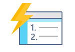
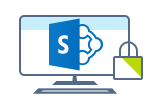

--- 
layout: HubPage
hide_bc: true
author: CelesteDG
ms.author: celested
ms.topic: hub-page
keywords: Microsoft 365, Microsoft 365 Enterprise, Microsoft 365 documentation, Office 365, Windows 10 Enterprise, EMS, Enterprise Mobility + Security, enterprise
localization_priority: Normal
audience: microsoft-business
ms.prod: microsoft-365-enterprise
ms.date: 01/29/2018
title: Microsoft 365 Enterprise documentation and resources
description: Learn about the product documentation and resources available for Microsoft 365 Enterprise IT admins, information workers, and partners.
---

    <!-- Hiding
    

        <ul class="cardsY panelContent featuredContent">
            <li>
                <a href="http://www.microsoft.com/microsoft-365/enterprise" target="_blank">
                    

                        

                            

                                

                                    

                                        
                                    

                                

                                

                                    Learn about Microsoft 365 Enterprise
                                

                            

                        

                    

                </a>
            </li>
            <li>
                <a href="https://fasttrack.microsoft.com/microsoft365" target="_blank">
                    

                        

                            

                                

                                    

                                        
                                    

                                

                                

                                    For IT admins: Start FastTrack for Microsoft 365
                                

                            

                        

                    

                </a>
            </li>
        </ul>
    

    -->
    

        <h1>Microsoft 365 Enterprise documentation and resources</h1>
        <ul class="pivots">
            <li>
                <a href="#itadmin">IT admin</a>
                <ul id="itadmin">
                    <li>
                        <a data-default="true" href="#getstarted">Get started</a>
                        <ul id="getstarted" class="cardsG">
                            <li class="fullSpan">
                                

                                    
Get started here with resources and tools for maximizing your success with Office 365, Windows 10, and Enterprise Mobility + Security.

                                

                            </li>
                            <li>
                                <a href="http://www.microsoft.com/microsoft-365/enterprise" target="_blank">
                                    

                                        

                                            

                                                

                                                    

                                                        
                                                    

                                                

                                                

                                                    <h3>Why Microsoft 365 Enterprise?</h3>
                                                    
Find out how Microsoft 365 Enterprise can help your organization provide a broad set of apps and services, simplify IT by unifying management across users, devices, apps, and services, and help safeguard customer data, company data, and intellectual property.

                                                

                                            

                                        

                                    

                                </a>
                            </li>
                            <li>
                                <a href="services-overview.md" target="_blank">
                                    

                                        

                                            

                                                

                                                    

                                                        
                                                    

                                                

                                                

                                                    <h3>Services and concepts</h3>
                                                    
Learn about the services that comprise Microsoft 365 Enterprise, important concepts to understand, and security best practices and recommendations.

                                                

                                            

                                        

                                    

                                </a>
                            </li>
                            <li>
                                <a href="https://docs.microsoft.com/office365/enterprise/microsoft-cloud-it-architecture-resources" target="_blank">
                                    

                                        

                                            

                                                

                                                    

                                                        
                                                    

                                                

                                                

                                                    <h3>Architecture models and posters</h3>
                                                    
Thinking about adopting enterprise cloud capabilities and want to learn about recommended capabilities and architectures? Select and download architecture models and posters&mdash;you can even modify them for your own use.

                                                

                                            

                                        

                                    

                                </a>
                            </li>
                            <li>
                                <a href="https://fasttrack.microsoft.com/microsoft365" target="_blank">
                                    

                                        

                                            

                                                

                                                    

                                                        
                                                    

                                                

                                                

                                                    <h3>FastTrack for Microsoft 365</h3>
                                                    
Find best practices, tools, resources, and experts who work closely with your internal teams and Microsoft partners, and can help you move to Microsft 365 completely, and at your own pace.

                                                

                                            

                                        

                                    

                                </a>
                            </li>
                        </ul>
                    </li>
                    <li>
                        <a data-default="true" href="#deploy">Deploy</a>
                        <ul id="deploy" class="cardsG">
                            <li class="fullSpan">
                                

                                    
Get step-by-step guidance on how to plan for and deploy Office 365, Windows 10 Enterprise, and Enterprise Mobility + Security together for an integrated and secure infrastructure that enables teamwork and unlocks creativity.

                                

                            </li>
                            <li>
                                <a href="deploy-with-existing-infrastructure.md" target="_blank">
                                    

                                        

                                            

                                                

                                                    

                                                        
                                                    

                                                

                                                

                                                    <h3>My company already uses Microsoft technologies</h3>
                                                    
We’re glad you’re already familiar with our products. We want to help you understand changes you might need to make for Microsoft 365 Enterprise.

                                                

                                            

                                        

                                    

                                </a>
                            </li>
                            <li>
                                <a href="deploy-microsoft-365-enterprise.md" target="_blank">
                                    

                                        

                                            

                                                

                                                    

                                                        
                                                    

                                                

                                                

                                                    <h3>My company is new to Microsoft 365</h3>
                                                    
Welcome! We want you to get the most out of your investment. To get started, follow the steps to deploy Microsoft 365 Enterprise.

                                                

                                            

                                        

                                    

                                </a>
                            </li>
                        </ul>
                    </li>
                    <li>
                        <a href="#it-collab">Collaboration</a>
                        <ul id="it-collab" class="cardsG">
                            <li class="fullSpan">
                                

                                    
Office 365

                                

                            </li>
                            <li class="fullSpan">
                                

                                    
Use these resources to set up Office 365 services and empower teams in your organization to collaborate more effectively with tools like team chat, online meetings, co-authoring and secure file sharing, and group email.

                                

                            </li>
                            <li>
                                <a href="https://support.office.com/article/6a3a29a0-e616-4713-99d1-15eda62d04fa" target="_blank">
                                    

                                        

                                            

                                                

                                                    

                                                        
                                                    

                                                

                                                

                                                    <h3>Office 365 setup guide</h3>
                                                    
Follow this guide to ensure a smooth deployment of Office 365 for business.

                                                

                                            

                                        

                                    

                                </a>
                            </li>
                            <li>
                                <a href="https://portal.office.com/adminportal/home?ref=FindWizards" target="_blank">
                                    

                                        

                                            

                                                

                                                    

                                                        
                                                    

                                                

                                                

                                                    <h3>Office 365 setup wizard</h3>
                                                    
Log in to the Office 365 admin portal and get guided assistance through the first steps of the setup.

                                                

                                            

                                        

                                    

                                </a>
                            </li>
                            <li>
                                <a href="https://support.office.com/article/05cbe533-2181-4e95-a4b0-52cd7695fafc" target="_blank">
                                    

                                        

                                            

                                                

                                                    

                                                        
                                                    

                                                

                                                

                                                    <h3>Admin Help: Microsoft Teams FAQ</h3>
                                                    
Got questions about Microsoft Teams administration? Start here.

                                                

                                            

                                        

                                    

                                </a>
                            </li>
                            <!-- These are collaboration workloads that still need to be developed. Commenting out for now.
                            <li>
                                <a href="collaboration-exchange-online.md" target="_blank">
                                    

                                        

                                            

                                                

                                                    

                                                        
                                                    

                                                

                                                

                                                    <h3>Exchange Online</h3>
                                                    
Follow the documentation here to understand, plan, and configure Exchange Online.

                                                

                                            

                                        

                                    

                                </a>
                            </li>
                            <li>
                                <a href="collaboration-sharepoint-online.md" target="_blank">
                                    

                                        

                                            

                                                

                                                    

                                                        
                                                    

                                                

                                                

                                                    <h3>SharePoint Online</h3>
                                                    
Use this documentation to plan for SharePoint Online sites and files.

                                                

                                            

                                        

                                    

                                </a>
                            </li>
                            -->
                            <li class="fullSpan">
                                

                                    
Office 365 ProPlus

                                

                            </li>
                            <li class="fullSpan">
                                

                                    
Office 365 ProPlus is the latest version of the Microsoft Office, downloaded and installed on devices and kept current by ongoing updates from the Microsoft cloud.

                                

                            </li>
                            <li>
                                <a href="https://aka.ms/oppdeployguide" target="_blank">
                                    

                                        

                                            

                                                

                                                    

                                                        
                                                    

                                                

                                                

                                                    <h3>Office 365 ProPlus deployment guide</h3>
                                                    
Microsoft 365 Enterprise includes an enterprise edition of Office apps through Office 365 ProPlus. See the guide to plan, deploy, and manage Office 365 ProPlus.

                                                

                                            

                                        

                                    

                                </a>
                            </li>
                            <li>
                                <a href="https://support.office.com/article/31a384ca-650c-4265-b76c-a87b414fd8b8" target="_blank">
                                    

                                        

                                            

                                                

                                                    

                                                        
                                                    

                                                

                                                

                                                    <h3>Best practices for deploying Office 365 ProPlus in the enterprise</h3>
                                                    
Learn about recommendations and real-world examples from the Office 365 Product Group and delivery experts from Microsoft Services.

                                                

                                            

                                        

                                    

                                </a>
                            </li>
                            <li>
                                <a href="https://docs.microsoft.com/intune/apps-add-office365" target="_blank">
                                    

                                        

                                            

                                                

                                                    

                                                        
                                                    

                                                

                                                

                                                    <h3>Assign Office 365 ProPlus apps to Windows 10 devices with Intune</h3>
                                                    
Learn to configure the app suite, info, and settings when deploying Office 365 ProPlus apps to devices using Intune.

                                                

                                            

                                        

                                    

                                </a>
                            </li>
                            <li>
                                <a href="https://docs.microsoft.com/en-us/sccm/sum/deploy-use/manage-office-365-proplus-updates" target="_blank">
                                    

                                        

                                            

                                                

                                                    

                                                        
                                                    

                                                

                                                

                                                    <h3>Manage Office 365 ProPlus with Configuration Manager</h3>
                                                    
Learn about the client management dashboard, deploying apps and updates, changing the update channel, and more.

                                                

                                            

                                        

                                    

                                </a>
                            </li>
                            <li>
                                <a href="https://support.office.com/article/9ccf0f13-28ff-4975-9bd2-7e4ea2fefef4" target="_blank">
                                    

                                        

                                            

                                                

                                                    

                                                        
                                                    

                                                

                                                

                                                    <h3>Overview of update channels for Office 365 ProPlus</h3>
                                                    
Learn about the options you have to control how often Office 365 ProPlus is updated with new features.

                                                

                                            

                                        

                                    

                                </a>
                            </li>
                            <li class="fullSpan">
                                

                                    
Resources

                                

                            </li>
                            <li>
                                <a href="http://aka.ms/myadvisor" target="_blank">
                                    

                                        

                                            

                                                

                                                    

                                                        
                                                    

                                                

                                                

                                                    <h3>My Advisor</h3>
                                                    
Take advantage of the Practical Guidance available through My Advisor&mdash;a comprehensive self-service guide and toolset for planning and managing Microsoft Teams and Skype for Business Online.

                                                

                                            

                                        

                                    

                                </a>
                            </li>
                            <li>
                                <a href="https://fasttrack.microsoft.com/microsoft365/capabilities?view=collaboration" target="_blank">
                                    

                                        

                                            

                                                

                                                    

                                                        
                                                    

                                                

                                                

                                                    <h3>FastTrack for collaboration</h3>
                                                    
Get practices, tools, resources, and experts for the Microsoft 365 collaboration capabilities.

                                                

                                            

                                        

                                    

                                </a>
                            </li>
                        </ul>
                    </li>
                    <li>
                        <a href="#it-security">Security</a>
                        <ul id="it-security" class="cardsG">
                            <li class="fullSpan">
                                

                                    
Microsoft's leading Enterprise Mobility + Security (EMS) offerings combined with Windows 10 Enterprise and Office 365 security capabilities provide identity and access management, threat protection, information protection, and security management.

                                    
See these resources for security-related recommendations and guidance.

                                

                            </li>
                            <li>
                                <a href="https://support.office.com/article/dcb83b2c-ac66-4ced-925d-50eb9698a0b2" target="_blank">
                                    

                                        

                                            

                                                

                                                    

                                                        
                                                    

                                                

                                                

                                                    <h3>Security and compliance in Office 365</h3>
                                                    
Learn how to protect your data, comply with legal or regulatory standards, and monitor your security stature with Office 365.

                                                

                                            

                                        

                                    

                                </a>
                            </li>
                            <li>
                                <a href="https://docs.microsoft.com/windows/threat-protection" target="_blank">
                                    

                                        

                                            

                                                

                                                    

                                                        
                                                    

                                                

                                                

                                                    <h3>Threat protection and security for enterprise</h3>
                                                    
Learn how you can help protect your organization against threats in Windows 10.

                                                

                                            

                                        

                                    

                                </a>
                            </li>
                            <!-- Replace the one above when this page goes live
                            <li>
                                <a href="https://docs.microsoft.com/en-us/windows/security/" target="_blank">
                                    

                                        

                                            

                                                

                                                    

                                                        
                                                    

                                                

                                                

                                                    <h3>Windows 10 Enterprise Security</h3>
                                                    
Learn about the security features built into Windows 10 Enterprise and how you can use these to secure corproate data and manage risk.

                                                

                                            

                                        

                                    

                                </a>
                            </li>
                            -->
                            <li>
                                <a href="microsoft-365-policies-configurations.md" target="_blank">
                                    

                                        

                                            

                                                

                                                    

                                                        
                                                    

                                                

                                                

                                                    <h3>Identity and device access configurations</h3>
                                                    
Learn about general Microsoft recommendations and best practices on how to apply policy and configuration to ensure that your employees are both secure and productive.

                                                

                                            

                                        

                                    

                                </a>
                            </li>
                            <li>
                                <a href="secure-email-recommended-policies.md" target="_blank">
                                    

                                        

                                            

                                                

                                                    

                                                        
                                                    

                                                

                                                

                                                    <h3>Exchange Online access policies</h3>
                                                    
Learn about the policies to help you secure organizational email and email clients that support Modern Authentical and Conditional Access.

                                                

                                            

                                        

                                    

                                </a>
                            </li>
                            <li>
                                <a href="sharepoint-file-access-policies.md" target="_blank">
                                    

                                        

                                            

                                                

                                                    

                                                        
                                                    

                                                

                                                

                                                    <h3>SharePoint Online access policies</h3>
                                                    
Learn about the policies to help you secure organizational SharePoint Online files based on three levels of security and protection.

                                                

                                            

                                        

                                    

                                </a>
                            </li>
                            <li>
                                <a href="https://fasttrack.microsoft.com/microsoft365/capabilities?view=security" target="_blank">
                                    

                                        

                                            

                                                

                                                    

                                                        
                                                    

                                                

                                                

                                                    <h3>FastTrack for security</h3>
                                                    
Get practices, tools, resources, and experts for the Microsoft 365 security capabilities.

                                                

                                            

                                        

                                    

                                </a>
                            </li>
                        </ul>
                    </li>
                    <li>
                        <a href="#it-devices">Devices</a>
                        <ul id="it-devices" class="cardsG">
                            <li class="fullSpan">
                                

                                    
A Microsoft 365 powered device is a PC with Windows 10 Enterprise and Office 365 ProPlus, managed with Enterprise Mobility + Security (EMS). It is a fully configured device for users, ready for business, and with built-in security.

                                    
See these resources to make the most out of your Microsoft 365 powered devices.

                                

                            </li>
                            <li>
                                <a href="https://docs.microsoft.com/windows/deployment/planning/" target="_blank">
                                    

                                        

                                            

                                                

                                                    

                                                        
                                                    

                                                

                                                

                                                    <h3>Plan for Windows 10 deployment</h3>
                                                    
Check the FAQ for IT professionals, learn about deployment considerations, plan for infrastructure requirements, and more.

                                                

                                            

                                        

                                    

                                </a>
                            </li>
                            <li>
                                <a href="https://www.microsoft.com/en-us/itpro/windows-10/windows-as-a-service" target="_blank">
                                    

                                        

                                            

                                                

                                                    

                                                        
                                                    

                                                

                                                

                                                    <h3>Windows as a service</h3>
                                                    
Simplify management and maintain a consistent experience for your users. Learn the new way to build, deploy, and service Windows through Windows as a service.

                                                

                                            

                                        

                                    

                                </a>
                            </li>
                            <li>
                                <a href="https://support.microsoft.com/help/4018124" target="_blank">
                                    

                                        

                                            

                                                

                                                    

                                                        
                                                    

                                                

                                                

                                                    <h3>Windows 10 update history</h3>
                                                    
Get more information about the improvements and fixes that were included with each Windows 10 update.

                                                

                                            

                                        

                                    

                                </a>
                            </li>
                            <li>
                                <a href="https://docs.microsoft.com/intune/windows-update-for-business-configure" target="_blank">
                                    

                                        

                                            

                                                

                                                    

                                                        
                                                    

                                                

                                                

                                                    <h3>Manage software updates with Intune</h3>
                                                    
Find out how to configure update settings on devices and defer update installation.

                                                

                                            

                                        

                                    

                                </a>
                            </li>
                            <li>
                                <a href="https://docs.microsoft.com/windows/deployment/update/waas-manage-updates-configuration-manager" target="_blank">
                                    

                                        

                                            

                                                

                                                    

                                                        
                                                    

                                                

                                                

                                                    <h3>Deploy Windows 10 updates using Configuration Manager</h3>
                                                    
Using System Center Configuration Manager for Windows update management? Get info on managing Windows 10 updates.

                                                

                                            

                                        

                                    

                                </a>
                            </li>
                            <li>
                                <a href="https://fasttrack.microsoft.com/microsoft365/capabilities?view=devices" target="_blank">
                                    

                                        

                                            

                                                

                                                    

                                                        
                                                    

                                                

                                                

                                                    <h3>FastTrack for devices</h3>
                                                    
Get practices, tools, resources, and experts for the Microsoft 365 powered device capabilities.

                                                

                                            

                                        

                                    

                                </a>
                            </li>
                        </ul>
                    </li>
                    <li>
                        <a href="#it-voice">Voice</a>
                        <ul id="it-voice" class="cardsG">
                            <li class="fullSpan">
                                

                                    
Voice capabilities in Microsoft 365 can help your users be more productive by enabling audio and video collaboration from virtually any device in real time.

                                    
There's a wide range of business scenarios to consider when you're starting to plan. Start with these resources to get going.

                                

                            </li>
                            <li>
                                <a href="http://aka.ms/myadvisor" target="_blank">
                                    

                                        

                                            

                                                

                                                    

                                                        
                                                    

                                                

                                                

                                                    <h3>My Advisor</h3>
                                                    
Take advantage of the Practical Guidance for Cloud Voice available through My Advisor&mdash;a comprehensive self-service guide and toolset for planning and managing Microsoft 365 Cloud Voice.

                                                

                                            

                                        

                                    

                                </a>
                            </li>
                            <li>
                                <a href="https://fasttrack.microsoft.com/microsoft365/capabilities?view=voice" target="_blank">
                                    

                                        

                                            

                                                

                                                    

                                                        
                                                    

                                                

                                                

                                                    <h3>FastTrack for voice</h3>
                                                    
Get practices, tools, resources, and experts for the Microsoft 365 voice capabilities.

                                                

                                            

                                        

                                    

                                </a>
                            </li>
                        </ul>
                    </li>
                </ul>
            </li>
            <li>
                <a href="#end-user-pro">End user professional</a>
                <ul id="end-user-pro">
                    <li>
                        <a data-default="true" href="#end-user-pro-1">Product Help</a>
                        <ul id="end-user-pro-1" class="cardsG">
                            <li class="fullSpan">
                                

                                    
When you're using Office 365 or Windows 10, or your devices are managed by your company, and you have a question about how to do something, you can search the product Help for info, get training and tips, and watch short videos and tutorials. 

                                

                            </li>
                            <li>
                                <a href="https://support.office.com/article/396b8d9e-e118-42d0-8a0d-87d1f2f055fb" target="_blank">
                                    

                                        

                                            

                                                

                                                    
 
                                                        
                                                    

                                                

                                                

                                                    <h3>Get started with Office</h3>
                                                    
Short videos and tutorials to get you up and running fast.

                                                

                                            

                                        

                                    

                                </a>
                            </li>
                            <li>
                                <a href="https://support.office.com/en-us/office-training-center " target="_blank">
                                    

                                        

                                            

                                                

                                                    
 
                                                        
                                                    

                                                

                                                

                                                    <h3>Office Training Center</h3>
                                                    
Training and tips on how to get the most out of Office.

                                                

                                            

                                        

                                    

                                </a>
                            </li>
                            <li>
                                <a href="http://support.office.com" target="_blank">
                                    

                                        

                                            

                                                

                                                    
 
                                                        
                                                    

                                                

                                                

                                                    <h3>Office Help</h3>
                                                    
The best help and support resources for all the Office apps.

                                                

                                            

                                        

                                    

                                </a>
                            </li>
                            <li>
                                <a href="http://support.microsoft.com/products/windows" target="_blank">
                                    

                                        

                                            

                                                

                                                    
 
                                                        
                                                    

                                                

                                                

                                                    <h3>Windows 10 help</h3>
                                                    
Help, how-to, and other info for all things Windows 10.

                                                

                                            

                                        

                                    

                                </a>
                            </li>
                            <li>
                                <a href="https://technet.microsoft.com/windows/dn621092.aspx" target="_blank">
                                    

                                        

                                            

                                                

                                                    

                                                        
                                                    

                                                

                                                

                                                    <h3>Windows 10 end user readiness</h3>
                                                    
Guides and tutorials to help you get familiar with the basic and advanced features and capabilities of Windows 10 in a business environment.

                                                

                                            

                                        

                                    

                                </a>
                            </li>
                            <li>
                                <a href="ms-get-started://">
                                    

                                        

                                            

                                                

                                                    

                                                        
                                                    

                                                

                                                

                                                    <h3>Windows 10 Tips</h3>
                                                    
Looking for how to do other things on Windows 10? Launch the Tips app!

                                                

                                            

                                        

                                    

                                </a>
                            </li>
                            <li>
                                <a href="https://docs.microsoft.com/en-us/intune-user-help/use-managed-devices-to-get-work-done" target="_blank">
                                    

                                        

                                            

                                                

                                                    
 
                                                        
                                                    

                                                

                                                

                                                    <h3>Microsoft Intune</h3>
                                                    
Learn how your company manages your devices, what info your company sees when you enroll your device in Intune, and more.

                                                

                                            

                                        

                                    

                                </a>
                            </li>
                            <li>
                                <a href="https://www.microsoft.com/microsoft-365/success/" target="_blank">
                                    

                                        

                                            

                                                

                                                    

                                                        
                                                    

                                                

                                                

                                                    <h3>Microsoft 365 Enterprise Productivity Library</h3>
                                                    
Get curated training, watch videos, read recommendations, and more.

                                                

                                            

                                        

                                    

                                </a>
                            </li>
                        </ul>
                    </li>
                    <!--
                    <li>
                        <a data-default="true" href="#end-user-pro-2">Productivity Library</a>
                        <ul id="end-user-pro-2" class="cardsG">
                            <li class="fullSpan">
                                

                                    
Employees and other users can get curated training, watch videos, read recommendations, and more from the <a href="https://www.microsoft.com/microsoft-365/success/" target="_blank">Microsoft 365 Enterprise Productivity Library</a>.

                                    
Here are some links to help you get started.

                                

                            </li>
                            <li>
                                <a href="https://www.microsoft.com/en-US/microsoft-365/success/productivitylibrary/work-more-securely-from-anywhere-on-almost-any-device" target="_blank">
                                    

                                        

                                            

                                                

                                                    

                                                        
                                                    

                                                

                                                

                                                    <h3>Work more securely from anywhere, on almost any device</h3>
                                                    
Use Office 365 mobile apps to protect business and client information.

                                                

                                            

                                        

                                    

                                </a>
                            </li>
                            <li>
                                <a href="https://www.microsoft.com/en-US/microsoft-365/success/productivitylibrary/meet-and-collaborate-with-ease" target="_blank">
                                    

                                        

                                            

                                                

                                                    

                                                        Meet and collaborate with ease" />
                                                    

                                                

                                                

                                                    <h3>Meet and collaborate with ease</h3>
                                                    
Learn how to use Skype for Business to start an ad-hoc conversation, make an audio or video call, share and collaborate, and schedule an online meeting.

                                                

                                            

                                        

                                    

                                </a>
                            </li>
                            <li>
                                <a href="https://www.microsoft.com/en-US/microsoft-365/success/productivitylibrary/work-in-email-solo-or-as-a-group" target="_blank">
                                    

                                        

                                            

                                                

                                                    

                                                        
                                                    

                                                

                                                

                                                    <h3>Work in email, solo or as a group</h3>
                                                    
Find out how you can use Exchange Online to personalize your inbox, manage versioning for email attachments, and use groups to collaborate with people.

                                                

                                            

                                        

                                    

                                </a>
                            </li>
                            <li>
                                <a href="https://www.microsoft.com/en-US/microsoft-365/success/productivitylibrary/choose-the-right-collaboration-tool-for-your-group" target="_blank">
                                    

                                        

                                            

                                                

                                                    

                                                        
                                                    

                                                

                                                

                                                    <h3>Choose the right collaboration tool for your group</h3>
                                                    
Office 365 has you covered&mdash;Outlook for email-based collaboration, Yammer to create communities of interest, Microsoft Teams for chat, or Skype for Business for voice and video meetings on any device.

                                                

                                            

                                        

                                    

                                </a>
                            </li>
                            <li>
                                <a href="https://www.microsoft.com/en-US/microsoft-365/success/productivitylibrary/create-impactful-content-together" target="_blank">
                                    

                                        

                                            

                                                

                                                    

                                                        
                                                    

                                                

                                                

                                                    <h3>Create impactful content together</h3>
                                                    
Use Office integration with OneDrive and SharePoint to access, share, and coauthor documents. And download Office mobile apps to help you access everything you need while you're on the move.

                                                

                                            

                                        

                                    

                                </a>
                            </li>
                            <li>
                                <a href="https://www.microsoft.com/en-US/microsoft-365/success/productivitylibrary/share-sites-and-content" target="_blank">
                                    

                                        

                                            

                                                

                                                    

                                                        
                                                    

                                                

                                                

                                                    <h3>Share sites and content</h3>
                                                    
Use SharePoint to power sharing and collaboration on your company's intranet&mdash;create a team site, share files and collaborating, create lists, and stay in-the-know using the mobile app.

                                                

                                            

                                        

                                    

                                </a>
                            </li>
                            <li>
                                <a href="https://www.microsoft.com/en-US/microsoft-365/success/productivitylibrary/gain-insight-into-your-work-habits-to-manage-your-time-better" target="_blank">
                                    

                                        

                                            

                                                

                                                    

                                                        
                                                    

                                                

                                                

                                                    <h3>Gain insight into your work habits</h3>
                                                    
Learn how to manage your time effectively, improve productivity, and surface content that other team members are working on through MyAnalytics.

                                                

                                            

                                        

                                    

                                </a>
                            </li>
                            <li>
                                <a href="https://www.microsoft.com/en-US/microsoft-365/success/productivitylibrary/communicate-with-your-team-in-real-time-to-gain-input-and-consensus" target="_blank">
                                    

                                        

                                            

                                                

                                                    

                                                        
                                                    

                                                

                                                

                                                    <h3>Communicate with your team in real time</h3>
                                                    
Find out how you can use Microsoft Teams to find and collaborate with colleagues through chat, access content and tools in a centralized repository, share info and get input, and more.

                                                

                                            

                                        

                                    

                                </a>
                            </li>
                            <li>
                                <a href="https://www.microsoft.com/en-US/microsoft-365/success/productivitylibrary/provide-a-chat-based-workspace" target="_blank">
                                    

                                        

                                            

                                                

                                                    

                                                        
                                                    

                                                

                                                

                                                    <h3>Provide a chat-based workspace</h3>
                                                    
Find out how you can combine chat, documents, people, and tools in one secure place.

                                                

                                            

                                        

                                    

                                </a>
                            </li>
                            <li>
                                <a href="https://www.microsoft.com/en-US/microsoft-365/success/productivitylibrary/create-and-impress-loyal-customers-by-understanding-their-preferences" target="_blank">
                                    

                                        

                                            

                                                

                                                    

                                                        
                                                    

                                                

                                                

                                                    <h3>Create and impress customers by understanding their preferences</h3>
                                                    
Use Delve Boards to know how customers feel, get feedback directly through Yammer posts, visualize trends with Power BI, and use Sway to create and share reports and presentations.

                                                

                                            

                                        

                                    

                                </a>
                            </li>
                            <li>
                                <a href="https://www.microsoft.com/en-US/microsoft-365/success/productivitylibrary/help-employees-filter-relevant-information-and-find-answers-faster" target="_blank">
                                    

                                        

                                            

                                                

                                                    

                                                        
                                                    

                                                

                                                

                                                    <h3>Help employees filter relevant information and find answers faster</h3>
                                                    
See how you can use Yammer Activity Report to understand your organization's level of engagement, use SharePoint to provide info such as news and training, and more.

                                                

                                            

                                        

                                    

                                </a>
                            </li>
                        </ul>
                    </li>
                    -->
                </ul>
            </li>
            <li>
                <a href="#partner">Partner</a>
                <ul id="partner">
                    <li>
                        <a data-default="true" href="#partner">Get started</a>
                        <ul id="partner" class="cardsW">
                            <li class="fullSpan">
                                

                                    
Looking for resources available to Microsoft 365 Enterprise partners? Start here.

                                

                            </li>
                            <li>
                                <a href="https://partners.office.com/enterprise" target="_blank">
                                    

                                        

                                            

                                                

                                                    
 
                                                        
                                                    

                                                

                                                

                                                    <h3>Enterprise resources and training</h3>
                                                    
Find the latest training offerings and updates, and other resources.

                                                

                                            

                                        

                                    

                                </a>
                            </li>
                            <li>
                                <a href="https://partners.office.com/news" target="_blank">
                                    

                                        

                                            

                                                

                                                    
 
                                                        
                                                    

                                                

                                                

                                                    <h3>News articles</h3>
                                                    
Read the latest news articles on Office 365 and Microsoft 365.

                                                

                                            

                                        

                                    

                                </a>
                            </li>
                            <li>
                                <a href="https://partners.office.com/fasttrack-and-partners" target="_blank">
                                    

                                        

                                            

                                                

                                                    
 
                                                        
                                                    

                                                

                                                

                                                    <h3>FastTrack and partners</h3>
                                                    
Get the full suite of best practices, tools, remote assistance, and resources to help you and your customers move to Microsoft 365.

                                                

                                            

                                        

                                    

                                </a>
                            </li>
                        </ul>
                    </li>
                </ul>
            </li>
            <li>
                <a href="#developer">Developer</a>
                <ul id="developer">
                    <li>
                        <a data-default="true" href="#developer">Get started</a>
                        <ul id="developer" class="cardsW">
                            <li class="fullSpan">
                                

                                    
Are you an app developer looking for information about developing enterprise apps? Start here.

                                

                            </li>
                            <li>
                                <a href="https://developer.microsoft.com/office" target="_blank">
                                    

                                        

                                            

                                                

                                                    
 
                                                        
                                                    

                                                

                                                

                                                    <h3>Office Dev Center</h3>
                                                    
Find guidance for developing solutions on Office products and services.

                                                

                                            

                                        

                                    

                                </a>
                            </li>
                            <li>
                                <a href="https://developer.microsoft.com/graph" target="_blank">
                                    

                                        

                                            

                                                

                                                    
 
                                                        
                                                    

                                                

                                                

                                                    <h3>Microsoft Graph</h3>
                                                    
Learn how to build smarter productivity apps with Microsoft Graph. Find examples, documentation, quick start, samples & SDKs, and more.

                                                

                                            

                                        

                                    

                                </a>
                            </li>
                            <li>
                                <a href="https://developer.microsoft.com/windows/enterprise" target="_blank">
                                    

                                        

                                            

                                                

                                                    
 
                                                        
                                                    

                                                

                                                

                                                    <h3>Windows Dev Center</h3>
                                                    
Get an overview of key enterprise features for Windows 10 and find resources for developing Universal Windows Platform (UWP) apps.

                                                

                                            

                                        

                                    

                                </a>
                            </li>
                        </ul>
                    </li>
                </ul>
            </li>
        </ul>
    

