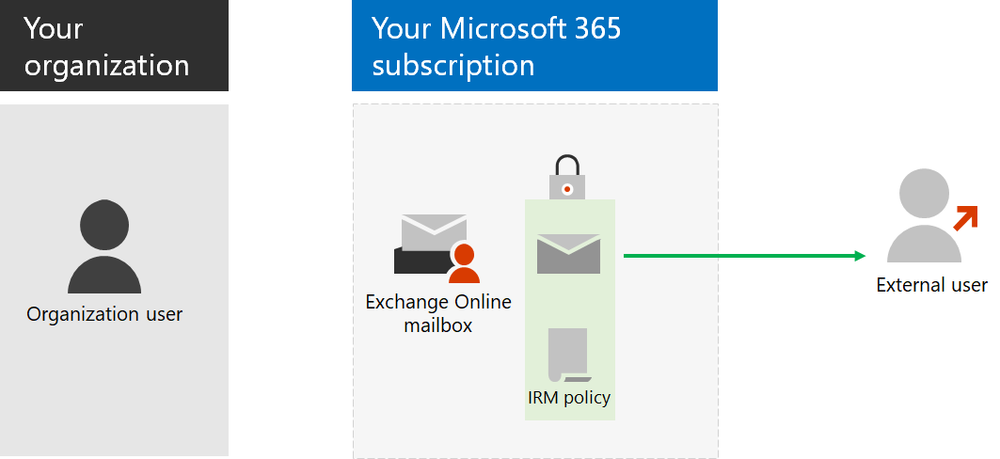

# Step 6: Configure email encryption

*This step is optional and applies to both the E3 and E5 versions of Microsoft 365 Enterprise*

There are three types of email encryption in Microsoft 365.

|||
|:-------|:-----|
| Office Message Encryption (OME) | Encryption for Exchange Online email sent outside your organization. |
| Information Rights Management (IRM) | Encryption and permissions that travel with the email. |
| Secure/Multipurpose Internet Mail Extensions (S/MIME) | Email protection with encryption and digital signatures. |
|||

## Office 365 Message Encryption

With OME, your organization can send and receive encrypted email messages between people inside and outside your organization. OME works with Outlook.com, Yahoo!, Gmail, and other email services. Email message encryption helps ensure that only intended recipients can view the message.

You set up transport rules that define the conditions for encryption. When a user sends a message that matches a rule, encryption is applied automatically.

To view encrypted messages, recipients can either get a one-time passcode, sign in with a Microsoft account, or sign in with a work or school account associated with Microsoft 365. Recipients can also send encrypted replies. They don't need their own Microsoft 365 subscription to view encrypted messages or send encrypted replies.

For more information, see [Office 365 Message Encryption](https://docs.microsoft.com/Office365/SecurityCompliance/ome).

## IRM

IRM in Microsoft 365 helps you secure your information with additional encryption and by applying an intelligent policy that specifies who has access what they can do. For email messages, you can use IRM for encryption and to apply usage restrictions. For example, you can specify that some recipients have all abilities to manage the email and some do not have the ability to print or forward the email. 

IRM policies are configured within Microsoft 365 and can apply to documents in SharePoint Online and email messages. An IRM-protected email includes the applied policy settings applied and travel with it. 

When the recipient opens the email with the included policy, the policy settings are used to decrypt the message and determine what the recipient can do with it. 

For more information, see [Information Rights Management in Exchange Online]( https://docs.microsoft.com/office365/SecurityCompliance/information-rights-management-in-exchange-online).

## S/MIME

S/MIME is a digital certificate-based email-based protection solution that allows you to both encrypt and digitally sign a message. The message encryption helps ensure that only the intended recipient can open and read the message. A digital signature helps the recipient validate the identity of the sender and determine that only the sender could have sent it.

S/MIME can be used for email to other mailboxes in your Microsoft 365 subscription or to external users.
Both message encryption and digital signatures are made possible through the use of digital certificates that contain the public and private keys for encrypting or decrypting messages and creating and verifying digital signatures.
To use S/MIME, you must have the public keys for each recipient. Recipients maintain their own private keys, which must remain secure. If your private key is compromised, you need to get a new digital certificate and redistribute public keys to all potential senders.

For more information, see [S/MIME for message signing and encryption](https://docs.microsoft.com/Exchange/policy-and-compliance/smime).

As an interim checkpoint, see the [exit criteria](infoprotect-exit-criteria.md#crit-infoprotect-step6) corresponding to this step.

## Next step

|||
|:-------|:-----|
||[Configure privileged access management for Office 365](infoprotect-configure-privileged-access-management.md)|
