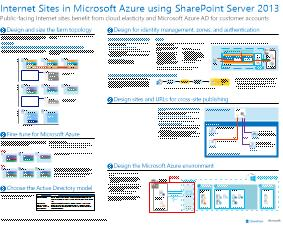
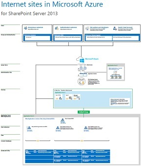

# Internet Sites in Microsoft Azure using SharePoint Server 2013

 Internet sites that use SharePoint Server 2013 benefit by being hosted in Azure Infrastructure Services. This article provides resources for designing and implementing this solution.

## Using Azure Infrastructure Services for Internet sites

Microsoft Azure provides a compelling option for hosting Internet sites based on SharePoint Server 2013. Advantages include the following:

- Focus on developing a great site instead of building infrastructure.

- Flexibility to scale your solution based on demand by scaling out and in.

- Pay only for the resources that you need and use.

- Take advantage of Azure Active Directory for customer accounts.

- Add features that are not currently available in Microsoft 365, such as deep reporting and analytics.

## Resources

The following technical illustrations and articles provide information about how to design and implement Internet sites in Azure by using SharePoint Server 2013.

|Resource|More information|
|---|---|
|**SharePoint Server 2013 Internet sites in Azure**      [PDF](https://go.microsoft.com/fwlink/p/?LinkId=392552) \| [Visio](https://go.microsoft.com/fwlink/p/?LinkId=392551)|This architecture model outlines key design activities and recommended architecture choices for Internet sites in Azure.|
|**Design sample: Internet Sites in Azure for SharePoint Server 2013**   []   [PDF](https://go.microsoft.com/fwlink/p/?LinkId=392549)  \| [Visio](https://go.microsoft.com/fwlink/p/?LinkId=392548)|Use this design sample as a starting point for your own architecture.|
|**[Microsoft Azure Architectures for SharePoint 2013](microsoft-azure-architectures-for-sharepoint-2013.md)**   |This article describes how to design Azure architectures to host SharePoint solutions.|
|

## See Also

[Microsoft 365 solution and architecture center](../solutions/index.yml)