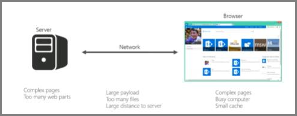
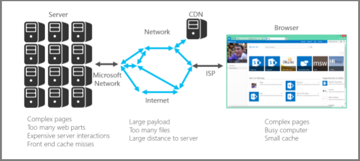

# Introduction to performance tuning for SharePoint Online

This article explains what specific aspects you need to consider when designing pages for best performance in SharePoint Online.
     
## SharePoint Online metrics

The following broad metrics for SharePoint Online provide real world data about performance:
  
- How fast pages load
    
- How many round trips required per page
    
- Issues with the service
    
- Other things that cause performance degradation
    
### Conclusions reached because of the data

The data tells us:
  
- Most of the pages perform well on SharePoint Online.
    
- Non-customized pages load very quickly.
    
- OneDrive for Business, team sites and system pages, such as _layouts, etc., are all quick to load.
    
- The slowest 1% of SharePoint Online pages take more than 5,000 milliseconds to load.
    
One simple benchmark test you can use would be to measure performance by comparing the load time of your own portal against the load time of the OneDrive for Business home page as it uses few customized features. This will often be the first step Support will ask you to complete when troubleshooting network performance issues.
  
## Use a standard user account when checking performance

A Site Collection Administrator, Site Owner, Editor, or Contributor belong to additional security groups, have additional permissions, and therefore have additional elements that SharePoint loads on a page.
  
This is applicable to SharePoint on-premises and SharePoint Online but in an on-premises scenario the differences will not be as easily noticed as in SharePoint Online.
  
In order to correctly evaluate how a page will perform for users, you should use a standard user account to avoid loading the authoring controls and additional traffic related to security groups.
  
## Connection categories for performance tuning

You can categorize the connections between the server and the user into three main components. Consider these when designing SharePoint Online pages for insight into load times.
  
- **Server** The servers that Microsoft hosts in datacenters.
    
- **Network** The Microsoft network, the Internet, and your on-premises network between the datacenter and your users.
    
- **Browser** Where the page is loaded.
    
Within these three connections there are typically five reasons that cause 95% of slow pages. Each of these reasons is discussed in this article:
  
- Navigation issues
    
- Content roll up
    
- Large files
    
- Many requests to the server
    
- Web Part processing
    
### Server connection

Many of the issues that affect performance with SharePoint on-premises also apply to SharePoint Online.
  
As you would expect, you have far more control over how servers perform with on-premises SharePoint. With SharePoint Online things are a little different. The more work you make a server do, the longer it takes to render a page. With SharePoint, the biggest culprit in this respect are complex pages with multiple web parts.
  
SharePoint Server on-premises
  

  
SharePoint Online
  

  
With SharePoint Online, certain page requests may actually end up calling multiple servers. You could end up with a matrix of requests between servers for an individual request. These interactions are expensive from a page load perspective and will make things slow.
  
Examples of these server to server interactions are:
  
- Web to SQL Servers
    
- Web to application servers
    
The other thing that can slow down server interactions is cache misses. Unlike on-premises SharePoint, there is a very slim chance that you will hit the same server for a page that you have visited previously; this makes object caching obsolete.
  
### Network connection

With on-premises SharePoint that doesn't make use of a WAN, you may use a high-speed connection between datacenter and end-users. Generally, things are easy to manage from a network perspective.
  
With SharePoint Online, there are a few more factors to consider; for example:
  
- The Microsoft network
    
- The Internet
    
- The ISP
    
Regardless of which version of SharePoint (and which network) you are using, things that will typically cause the network to be busy include:
  
- Large payload
    
- Many files
    
- Large physical distance to the server
    
One feature that you can leverage in SharePoint Online is the Microsoft CDN (Content Delivery Network). A CDN is basically a distributed collection of servers deployed across multiple datacenters. With a CDN, content on pages can be hosted on a server close to the client even if the client is far away from the originating SharePoint Server. Microsoft will be using this more in the future to store local instances of pages which cannot be customized, for example the SharePoint Online admin home page. For more information about CDNs, see [Content delivery networks](content-delivery-networks.md).
  
Something that you need to be aware of but may not be able to do much about is the connection speed of your ISP. A simple speed test tool will tell you the connection speed.
  
### Browser connection

There are a few factors to consider with web browsers from a performance perspective.
  
Visiting complex pages will affect performance. Most browsers only have a small cache (around 90MB), while the average web page is typically around 1.6MB. This doesn't take long to get used up.
  
Bandwidth may also be an issue. For example, if a user is watching videos in another session, this will affect the performance of your SharePoint page. While you can't prevent users from streaming media, you can control the way a page will load for users.
  
Check out the following articles for different SharePoint Online page customization techniques and other best practices to help you achieve optimal performance.
  
- [Navigation options for SharePoint Online](navigation-options-for-sharepoint-online.md)
    
- [Use the Page Diagnostics tool for SharePoint Online](page-diagnostics-for-spo.md)
    
- [Image optimization for SharePoint Online](image-optimization-for-sharepoint-online.md)
    
- [Delay loading images and JavaScript in SharePoint Online](delay-loading-images-and-javascript-in-sharepoint-online.md)
    
- [Minification and bundling in SharePoint Online](minification-and-bundling-in-sharepoint-online.md)
    
- [Use the Office 365 Content Delivery Network (CDN) with SharePoint Online](use-microsoft-365-cdn-with-spo.md)
    
- [Using Content Search Web Part instead of Content Query Web Part to improve performance in SharePoint Online](using-content-search-web-part-instead-of-content-query-web-part-to-improve-perfo.md)
    
- [Capacity planning and load testing SharePoint Online](capacity-planning-and-load-testing-sharepoint-online.md)
    
- [Diagnosing performance issues with SharePoint Online](diagnosing-performance-issues-with-sharepoint-online.md)
    
- [Using the object cache with SharePoint Online](using-the-object-cache-with-sharepoint-online.md)
    
- [How to: Avoid getting throttled or blocked in SharePoint Online](/sharepoint/dev/general-development/how-to-avoid-getting-throttled-or-blocked-in-sharepoint-online)
