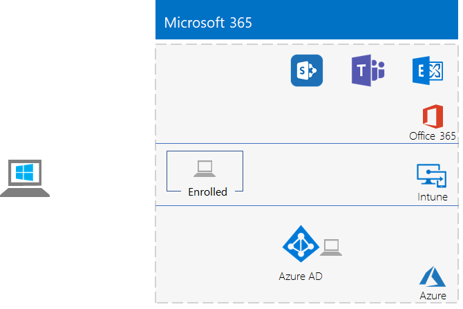
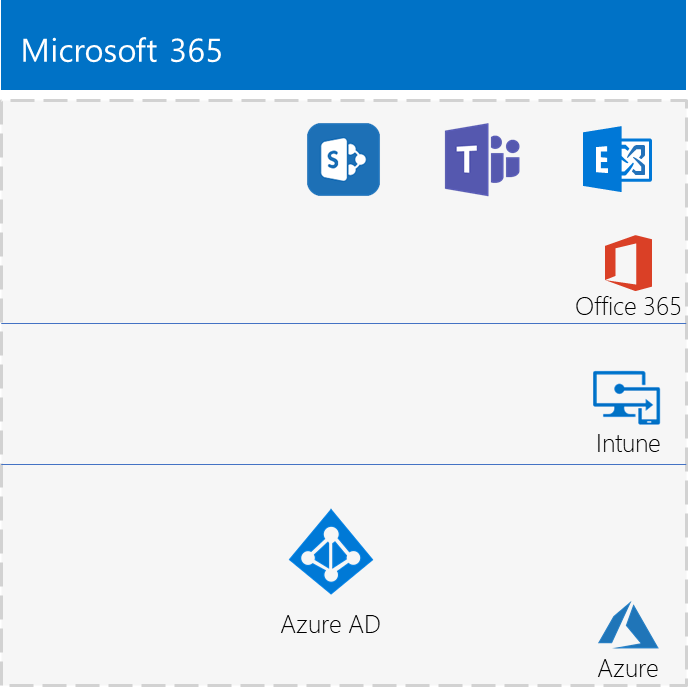

# The lightweight base configuration

*This Test Lab Guide can be used for both Microsoft 365 Enterprise and Office 365 Enterprise test environments.*

This article provides you with step-by-step instructions to create a simplified environment with a Microsoft 365 E5 subscription and a computer running Windows 10 Enterprise. 



Use the resulting environment to test the features and functionality of [Microsoft 365 Enterprise](https://www.microsoft.com/microsoft-365/enterprise).


  
> [!TIP]
> Click [here](media/m365-enterprise-test-lab-guides/Microsoft365EnterpriseTLGStack.pdf) for a visual map to all the articles in the Microsoft 365 Enterprise Test Lab Guide stack.

## Phase 1: Create your Office 365 E5 subscription

We start with an Office 365 E5 trial subscription and then add the Microsoft 365 E5 subscription to it.

To start your Office 365 E5 trial subscription, you first need a fictitious company name and a new Microsoft account.
  
1. We recommend that you use a variant of the company name Contoso for your company name, which is a fictitious company used in Microsoft sample content, but it isn't required. Record your fictitious company name here: 
    
2. To sign up for a new Microsoft account, go to [https://outlook.com](https://outlook.com) and create an account with a new email account and address. You will use this account to sign up for Office 365.
    
  - Record the first and last name of your new account here: 
    
  - Record the new email account address here: @outlook.com
    
### Sign up for an Office 365 E5 trial subscription

1. Open the Internet browser on your computer and go to [https://aka.ms/e5trial](https://aka.ms/e5trial).
    
2. On the **Thank you for choosing Office 365 E5** page, specify, your new email account address in step 1.
3. In step 2 of the trail subscription process, type the requested information, and then perform the verification.
4. In step 3, type an organization name and then an account name that will be the global admin for the subscription. 
5. For step 4, record the sign-in page here (select and copy):  
6. Record the user ID here: .onmicrosoft.com  
   Record the password that you typed in a secure location.
   This value will be referred to as the **Office 365 global administrator name**.
8. Click **Go to Setup**.
9. In Office 365 E5 Setup, click **Continue using *your organization*.onmicrosoft.com for email and signing in**, and then click **Exit and continue later**.

You should see the Microsoft 365 admin center.
  
We have you create a trial subscription of Office 365 so that your test environment has a separate Azure AD tenant from any paid subscriptions you currently have. This separation means you can add and remove users and groups in the test tenant without affecting your production subscriptions.
    
## Phase 2: Configure your Office 365 trial subscription

In this phase, you configure your Office 365 subscription with additional users and assign them Office 365 E5 licenses.
  
Use the instructions in [Connect to Office 365 PowerShell](https://docs.microsoft.com/office365/enterprise/powershell/connect-to-office-365-powershell#connect-with-the-azure-active-directory-powershell-for-graph-module) to connect to your Office 365 subscription with the Azure Active Directory PowerShell for Graph module from your computer.
    
In the **Windows PowerShell Credential Request** dialog box, type the Office 365 global administrator name (example: jdoe@contosotoycompany.onmicrosoft.com) and password.
  
Fill in your organization name (example: contosotoycompany), the two-character country code for your location, a common account password, and then run the following commands from the PowerShell prompt:

```powershell
$orgName="<organization name>"
$loc="<two-character country code, such as US>"
$commonPW="<common user account password>"
$PasswordProfile=New-Object -TypeName Microsoft.Open.AzureAD.Model.PasswordProfile
$PasswordProfile.Password=$commonPW

$userUPN= "user2@" + $orgName + ".onmicrosoft.com"
New-AzureADUser -DisplayName "User 2" -GivenName User -SurName 2 -UserPrincipalName $userUPN -UsageLocation $loc -AccountEnabled $true -PasswordProfile $PasswordProfile -MailNickName "user2"
$License = New-Object -TypeName Microsoft.Open.AzureAD.Model.AssignedLicense
$License.SkuId = (Get-AzureADSubscribedSku | Where-Object -Property SkuPartNumber -Value "ENTERPRISEPREMIUM" -EQ).SkuID
$LicensesToAssign = New-Object -TypeName Microsoft.Open.AzureAD.Model.AssignedLicenses
$LicensesToAssign.AddLicenses = $License
Set-AzureADUserLicense -ObjectId $userUPN -AssignedLicenses $LicensesToAssign

$userUPN= "user3@" + $orgName + ".onmicrosoft.com"
New-AzureADUser -DisplayName "User 3" -GivenName User -SurName 3 -UserPrincipalName $userUPN -UsageLocation $loc -AccountEnabled $true -PasswordProfile $PasswordProfile -MailNickName "user3"
$License = New-Object -TypeName Microsoft.Open.AzureAD.Model.AssignedLicense
$License.SkuId = (Get-AzureADSubscribedSku | Where-Object -Property SkuPartNumber -Value "ENTERPRISEPREMIUM" -EQ).SkuID
$LicensesToAssign = New-Object -TypeName Microsoft.Open.AzureAD.Model.AssignedLicenses
$LicensesToAssign.AddLicenses = $License
Set-AzureADUserLicense -ObjectId $userUPN -AssignedLicenses $LicensesToAssign

$userUPN= "user4@" + $orgName + ".onmicrosoft.com"
New-AzureADUser -DisplayName "User 4" -GivenName User -SurName 4 -UserPrincipalName $userUPN -UsageLocation $loc -AccountEnabled $true -PasswordProfile $PasswordProfile -MailNickName "user4"
$License = New-Object -TypeName Microsoft.Open.AzureAD.Model.AssignedLicense
$License.SkuId = (Get-AzureADSubscribedSku | Where-Object -Property SkuPartNumber -Value "ENTERPRISEPREMIUM" -EQ).SkuID
$LicensesToAssign = New-Object -TypeName Microsoft.Open.AzureAD.Model.AssignedLicenses
$LicensesToAssign.AddLicenses = $License
Set-AzureADUserLicense -ObjectId $userUPN -AssignedLicenses $LicensesToAssign
```
> [!NOTE]
> The use of a common password here is for automation and ease of configuration for a test environment. Obviously, this is highly discouraged for production subscriptions. 

### Record key information for future reference

You might want to print this article to record the specific information that you will need for this environment over the 30 days of the Office 365 trial subscription. You can easily extend the trail subscription for another 30 days. For a permanent test environment, create a new paid subscription with a separate Azure AD tenant and a small number of licenses.

Record these values:
  
- Office 365 global administrator name: .onmicrosoft.com (from step 6 of Phase 1)
    
    Also record the password for this account in a secure location.
    
- Your trial subscription organization name:  (from step 4 of Phase 1)
    
- To list the accounts for User 2, User 3, User 4, and User 5, run the following command from the Windows Azure Active Directory Module for Windows PowerShell prompt:
    
  ```powershell
  Get-AzureADUser | Sort UserPrincipalName | Select UserPrincipalName
  ```

    Record the account names here:
    
  - User 2 account name: user2@.onmicrosoft.com
    
  - User 3 account name: user3@.onmicrosoft.com
    
  - User 4 account name: user4@.onmicrosoft.com
    
  - User 5 account name: user5@.onmicrosoft.com
    
    Also record the common password for these accounts in a secure location.
   

### Using an Office 365 test environment

If all you need is an Office 365 test environment, you can stop here. 

See [Microsoft 365 Enterprise Test Lab Guides](m365-enterprise-test-lab-guides.md) for additional Test Lab Guides that apply to both Office 365 and Microsoft 365.
  
## Phase 3: Add a Microsoft 365 E5 trial subscription

In this phase, you sign up for the Microsoft 365 E5 trial subscription and add it to the same organization as your Office 365 E5 trial subscription.
  
First, add the Microsoft 365 E5 trial subscription and assign the new Microsoft 365 license to your global administrator account.
  
1. With a private instance of an Internet browser, sign in to the Microsoft 365 admin center at [https://admin.microsoft.com](https://admin.microsoft.com) with your global administrator account credentials.
    
2. On the **Microsoft 365 admin center** page, in the left navigation, click **Billing > Purchase services**.
    
3. On the **Purchase services** page, click **Microsoft 365 E5**, and then click **Get free trial**.

4. On the **Microsoft 365 E5 Trial** page, choose to receive a text or a call, enter your phone number, then click **Text me** or **Call me**. Perform the verification.

5. On the **Confirm your order** page, click **Try now**.

6. On the **Order receipt** page, click **Continue**.

7. In the Microsoft 365 admin center, click **Users > Active users**.

8. In **Active users**, click your administrator account.

9. Click **Licenses and apps**.

10. Disable the license for Office 365 Enterprise E5 and enable the license for Microsoft 365 E5.

11. Click **Save changes** and then close the user account information pane.

Next, repeat steps 8 through 11 of the previous procedure for all of your other accounts (User 2, User 3, User 4, and User 5).
  
> [!NOTE]
> The Microsoft 365 E5 trial subscription is 30 days. For a permanent test environment, convert this trial subscription into a paid subscription with a small number of licenses. 
  
Your test environment now has:
  
- A Microsoft 365 E5 trial subscription.
- All your appropriate user accounts (either just the global administrator or all five user accounts) are enabled to use Microsoft 365 E5.
    
Here is your resulting configuration, which adds Microsoft 365 E5, which includes both Office 365 and Enterprise Security + Management (EMS).
  

  
## Phase 4: Create a Windows 10 Enterprise computer

In this phase, you create a standalone computer running Windows 10 Enterprise as either a physical computer, a virtual machine, or an Azure virtual machine.
  
### Physical computer

Obtain a personal computer and install Windows 10 Enterprise on it. You can download the Windows 10 Enterprise trial [here](https://www.microsoft.com/evalcenter/evaluate-windows-10-enterprise).
  
### Virtual machine

Create a virtual machine using the hypervisor of your choice and install Windows 10 Enterprise on it. You can download the Windows 10 Enterprise trial [here](https://www.microsoft.com/evalcenter/evaluate-windows-10-enterprise).
  
### Virtual machine in Azure

To create a Windows 10 virtual machine in Microsoft Azure, ***you must have a Visual Studio-based subscription***, which has access to the image for Windows 10 Enterprise. Other types of Azure subscriptions, such as trial and paid subscriptions, do not have access to this image. For the latest information, see [Use Windows client in Azure for dev/test scenarios](https://docs.microsoft.com/azure/virtual-machines/windows/client-images).
  
> [!NOTE]
> The following command sets use the latest version of Azure PowerShell. See [Get started with Azure PowerShell cmdlets](https://docs.microsoft.com/powershell/azureps-cmdlets-docs/). These command sets build a Windows 10 Enterprise virtual machine named WIN10 and all of its required infrastructure, including a resource group, a storage account, and a virtual network. If you are already familiar with Azure infrastructure services, please adapt these instructions to suit your currently deployed infrastructure. 
  
First, start a Microsoft PowerShell prompt.
  
Sign in to your Azure account with the following command.
  
```powershell
Connect-AzAccount
```

Get your subscription name using the following command.
  
```powershell
Get-AzSubscription | Sort Name | Select Name
```

Set your Azure subscription. Replace everything within the quotes, including the \< and > characters, with the correct name.
  
```powershell
$subscr="<subscription name>"
Get-AzSubscription -SubscriptionName $subscr | Select-AzSubscription
```

Next, create a new resource group. To determine a unique resource group name, use this command to list your existing resource groups.
  
```powershell
Get-AzResourceGroup | Sort ResourceGroupName | Select ResourceGroupName
```

Create your new resource group with these commands. Replace everything within the quotes, including the \< and > characters, with the correct names.
  
```powershell
$rgName="<resource group name>"
$locName="<location name, such as West US>"
New-AzResourceGroup -Name $rgName -Location $locName
```

Next, you create a new virtual network and the WIN10 virtual machine with these commands. When prompted, provide the name and password of the local administrator account for WIN10 and store these in a secure location.
  
```powershell
$corpnetSubnet=New-AzVirtualNetworkSubnetConfig -Name Corpnet -AddressPrefix 10.0.0.0/24
New-AzVirtualNetwork -Name "M365Ent-TestLab" -ResourceGroupName $rgName -Location $locName -AddressPrefix 10.0.0.0/8 -Subnet $corpnetSubnet
$rule1=New-AzNetworkSecurityRuleConfig -Name "RDPTraffic" -Description "Allow RDP to all VMs on the subnet" -Access Allow -Protocol Tcp -Direction Inbound -Priority 100 -SourceAddressPrefix Internet -SourcePortRange * -DestinationAddressPrefix * -DestinationPortRange 3389
New-AzNetworkSecurityGroup -Name Corpnet -ResourceGroupName $rgName -Location $locName -SecurityRules $rule1
$vnet=Get-AzVirtualNetwork -ResourceGroupName $rgName -Name "M365Ent-TestLab"
$nsg=Get-AzNetworkSecurityGroup -Name Corpnet -ResourceGroupName $rgName
Set-AzVirtualNetworkSubnetConfig -VirtualNetwork $vnet -Name Corpnet -AddressPrefix "10.0.0.0/24" -NetworkSecurityGroup $nsg
$vnet | Set-AzVirtualNetwork
$pip=New-AzPublicIpAddress -Name WIN10-PIP -ResourceGroupName $rgName -Location $locName -AllocationMethod Dynamic
$nic=New-AzNetworkInterface -Name WIN10-NIC -ResourceGroupName $rgName -Location $locName -SubnetId $vnet.Subnets[0].Id -PublicIpAddressId $pip.Id
$vm=New-AzVMConfig -VMName WIN10 -VMSize Standard_A2_V2
$cred=Get-Credential -Message "Type the name and password of the local administrator account for WIN10."
$vm=Set-AzVMOperatingSystem -VM $vm -Windows -ComputerName WIN10 -Credential $cred -ProvisionVMAgent -EnableAutoUpdate
$vm=Set-AzVMSourceImage -VM $vm -PublisherName MicrosoftWindowsDesktop -Offer Windows-10 -Skus RS3-Pro -Version "latest"
$vm=Add-AzVMNetworkInterface -VM $vm -Id $nic.Id
$vm=Set-AzVMOSDisk -VM $vm -Name WIN10-TestLab-OSDisk -DiskSizeInGB 128 -CreateOption FromImage
New-AzVM -ResourceGroupName $rgName -Location $locName -VM $vm
```

## Phase 5: Join your Windows 10 computer to Azure AD

After the physical or virtual machine with Windows 10 Enterprise is created, sign in with a local administrator account.
  
> [!NOTE]
> For a virtual machine in Azure, connect to it using [these instructions](https://docs.microsoft.com/azure/virtual-machines/windows/connect-logon).
  
Next, join the WIN10 computer to the Azure AD tenant of your Microsoft 365 E5 subscription.
  
1. At the desktop of the WIN10 computer, click **Start > Settings > Accounts > Access work or school > Connect**.
    
2. In the **Set up a work or school account** dialog box, click **Join this device to Azure Active Directory**.
    
3. In **Work or school account**, type the global administrator account name of your Microsoft 365 E5 subscription, and then click **Next**.
    
4. In **Enter password**, type the password for your global administrator account, and then click **Sign in**.
    
5. When prompted to make sure this is your organization, click **Join**, and then click **Done**.
    
6. Close the settings window.
    
Next, install Office 365 ProPlus on the WIN10 computer.
  
1. Open the Microsoft Edge browser and sign in to the Office portal with your global administrator account credentials. For help, see [Where to sign in to Office 365](https://support.office.com/Article/Where-to-sign-in-to-Office-365-e9eb7d51-5430-4929-91ab-6157c5a050b4).
    
2. On the **Microsoft Office Home** tab, click **Install Office**.
    
3. When prompted with what to do, click **Run**, and then click **Yes** for **User Account Control**.
    
4. Wait for Office to complete its installation. When you see **You're all set!**, click **Close** twice.
    
Here is your resulting environment.


This includes the WIN10 computer that has:

- Joined the Azure AD tenant of your Microsoft 365 E5 subscription.
- Enrolled as an Azure AD device in Microsoft Intune (EMS).
- Has Office 365 ProPlus installed.
  
You are now ready to experiment with additional features of [Microsoft 365 Enterprise](https://www.microsoft.com/microsoft-365/enterprise).
  
## Next steps

Explore these additional sets of Test Lab Guides:
  
- [Identity](m365-enterprise-test-lab-guides.md#identity)
- [Mobile device management](m365-enterprise-test-lab-guides.md#mobile-device-management)
- [Information protection](m365-enterprise-test-lab-guides.md#information-protection)
   

## See also

[Microsoft 365 Enterprise Test Lab Guides](m365-enterprise-test-lab-guides.md)

[Deploy Microsoft 365 Enterprise](deploy-microsoft-365-enterprise.md)

[Microsoft 365 Enterprise documentation](https://docs.microsoft.com/microsoft-365-enterprise/)
