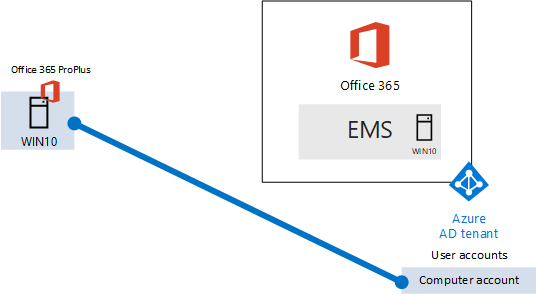

# The lightweight base configuration

This article provides you with step-by-step instructions to create a simplified environment that includes Office 365 E5, Enterprise Mobility + Security (EMS) E5, and a computer running Windows 10 Enterprise. 



Use the resulting environment to test the features and functionality of [Microsoft 365 Enterprise](https://www.microsoft.com/microsoft-365/enterprise).


  
> [!TIP]
> Click [here](https://aka.ms/m365etlgstack) for a visual map to all the articles in the Microsoft 365 Enterprise Test Lab Guide stack.

## Phase 1: Create your Office 365 E5 subscription

Follow the steps in Phase 2 and Phase 3 of the [Office 365 dev/test environment](https://docs.microsoft.com/office365/enterprise/office-365-dev-test-environment) to create a lightweight Office 365 dev/test environment, as shown in Figure 1.
  
**Figure 1: Your Office 365 E5 subscription with its Azure Active Directory (AD) tenant and user accounts**


> [!NOTE]
> The Office 365 E5 trial subscription is 30 days, which can be easily extended to 60 days. For a permanent test environment, create a new paid subscription with a small number of licenses. 
  
## Phase 2: Add EMS

In this phase, you sign up for the EMS E5 trial subscription and add it to the same organization as your Office 365 E5 trial subscription.
  
First, add the EMS E5 trial subscription and assign an EMS license to your global administrator account.
  
1. With a private instance of an Internet browser, sign in to the Office portal with your global administrator account credentials. For help, see [Where to sign in to Office 365](https://support.office.com/Article/Where-to-sign-in-to-Office-365-e9eb7d51-5430-4929-91ab-6157c5a050b4).
    
2. Click the **Admin** tile.
    
3. On the **Office Admin center** tab in your browser, in the left navigation, click **Billing > Purchase services**.
    
4. On the **Purchase services** page, find the **Enterprise Mobility + Security E5** item. Hover your mouse pointer over it and click **Start free trial**.
    
5. On the **Confirm your order** page, click **Try now**.
    
6. On the **Order receipt** page, click **Continue**.
    
7. On the **Office 365 Admin center** tab in your browser, in the left navigation, click **Users > Active users**.
    
8. Click your global administrator account, and then click **Edit** for **Product licenses**.
    
9. On the **Product licenses** pane, turn the product license for **Enterprise Mobility + Security E5** to **On**, click **Save,** and then click **Close** twice.
    
> [!NOTE]
> The Enterprise Mobility + Security E5 trial subscription is 90 days. For a permanent test environment, create a new paid subscription with a small number of licenses. 
  
 ***If you completed Phase 3 of the*** [Office 365 dev/test environment](https://docs.microsoft.com/office365/enterprise/office-365-dev-test-environment), repeat steps 8 and 9 of the previous procedure for all of your other accounts (User 2, User 3, User 4, and User 5).
  
Your test environment now has:
  
- Office 365 E5 Enterprise and EMS E5 trial subscriptions sharing the same Azure AD tenant with your list of user accounts.
- All your appropriate user accounts (either just the global administrator or all five user accounts) are enabled to use Office 365 E5 and EMS E5.
    
Figure 2 shows your resulting configuration, which adds EMS.
  
**Figure 2: Adding the EMS trial subscription**


  
## Phase 3: Create a Windows 10 Enterprise computer

In this phase, you create a standalone computer running Windows 10 Enterprise as either a physical computer, a virtual machine, or an Azure virtual machine.
  
### Physical computer

Obtain a personal computer and install Windows 10 Enterprise on it. You can download the Windows 10 Enterprise trial [here](https://www.microsoft.com/evalcenter/evaluate-windows-10-enterprise).
  
### Virtual machine

Create a virtual machine using the hypervisor of your choice and install Windows 10 Enterprise on it. You can download the Windows 10 Enterprise trial [here](https://www.microsoft.com/evalcenter/evaluate-windows-10-enterprise).
  
### Virtual machine in Azure

To create a Windows 10 virtual machine in Microsoft Azure, ***you must have a Visual Studio-based subscription***, which has access to the image for Windows 10 Enterprise. Other types of Azure subscriptions, such as trial and paid subscriptions, do not have access to this image. For the latest information, see [Use Windows client in Azure for dev/test scenarios](https://docs.microsoft.com/azure/virtual-machines/windows/client-images).
  
> [!NOTE]
> The following command sets use the latest version of Azure PowerShell. See [Get started with Azure PowerShell cmdlets](https://docs.microsoft.com/powershell/azureps-cmdlets-docs/). These command sets build a Windows 10 Enterprise virtual machine named WIN10 and all of its required infrastructure, including a resource group, a storage account, and a virtual network. If you are already familiar with Azure infrastructure services, please adapt these instructions to suit your currently deployed infrastructure. 
  
First, start a Microsoft PowerShell prompt.
  
Sign in to your Azure account with the following command.
  
```
Login-AzureRMAccount
```

Get your subscription name using the following command.
  
```
Get-AzureRMSubscription | Sort Name | Select Name
```

Set your Azure subscription. Replace everything within the quotes, including the \< and > characters, with the correct name.
  
```
$subscr="<subscription name>"
Get-AzureRmSubscription -SubscriptionName $subscr | Select-AzureRmSubscription
```

Next, create a new resource group. To determine a unique resource group name, use this command to list your existing resource groups.
  
```
Get-AzureRMResourceGroup | Sort ResourceGroupName | Select ResourceGroupName
```

Create your new resource group with these commands. Replace everything within the quotes, including the \< and > characters, with the correct names.
  
```
$rgName="<resource group name>"
$locName="<location name, such as West US>"
New-AzureRMResourceGroup -Name $rgName -Location $locName
```

Next, you create a new virtual network and the WIN10 virtual machine with these commands. When prompted, provide the name and password of the local administrator account for WIN10 and store these in a secure location.
  
```
$corpnetSubnet=New-AzureRMVirtualNetworkSubnetConfig -Name Corpnet -AddressPrefix 10.0.0.0/24
New-AzureRMVirtualNetwork -Name "M365Ent-TestLab" -ResourceGroupName $rgName -Location $locName -AddressPrefix 10.0.0.0/8 -Subnet $corpnetSubnet
$rule1=New-AzureRMNetworkSecurityRuleConfig -Name "RDPTraffic" -Description "Allow RDP to all VMs on the subnet" -Access Allow -Protocol Tcp -Direction Inbound -Priority 100 -SourceAddressPrefix Internet -SourcePortRange * -DestinationAddressPrefix * -DestinationPortRange 3389
New-AzureRMNetworkSecurityGroup -Name Corpnet -ResourceGroupName $rgName -Location $locName -SecurityRules $rule1
$vnet=Get-AzureRMVirtualNetwork -ResourceGroupName $rgName -Name "M365Ent-TestLab"
$nsg=Get-AzureRMNetworkSecurityGroup -Name Corpnet -ResourceGroupName $rgName
Set-AzureRMVirtualNetworkSubnetConfig -VirtualNetwork $vnet -Name Corpnet -AddressPrefix "10.0.0.0/24" -NetworkSecurityGroup $nsg
$pip=New-AzureRMPublicIpAddress -Name WIN10-PIP -ResourceGroupName $rgName -Location $locName -AllocationMethod Dynamic
$nic=New-AzureRMNetworkInterface -Name WIN10-NIC -ResourceGroupName $rgName -Location $locName -SubnetId $vnet.Subnets[0].Id -PublicIpAddressId $pip.Id
$vm=New-AzureRMVMConfig -VMName WIN10 -VMSize Standard_D1_V2
$cred=Get-Credential -Message "Type the name and password of the local administrator account for WIN10."
$vm=Set-AzureRMVMOperatingSystem -VM $vm -Windows -ComputerName WIN10 -Credential $cred -ProvisionVMAgent -EnableAutoUpdate
$vm=Set-AzureRMVMSourceImage -VM $vm -PublisherName MicrosoftWindowsDesktop -Offer Windows-10 -Skus RS3-Pro -Version "latest"
$vm=Add-AzureRMVMNetworkInterface -VM $vm -Id $nic.Id
$vm=Set-AzureRmVMOSDisk -VM $vm -Name WIN10-TestLab-OSDisk -DiskSizeInGB 128 -CreateOption FromImage -StorageAccountType "Standard_LRS"
New-AzureRMVM -ResourceGroupName $rgName -Location $locName -VM $vm
```

## Phase 4: Join your Windows 10 computer to Azure AD

After the physical or virtual machine with Windows 10 Enterprise is created, sign in with a local administrator account.
  
> [!NOTE]
> For a virtual machine in Azure, connect to it using [these instructions](https://docs.microsoft.com/azure/virtual-machines/windows/connect-logon).
  
Next, join the WIN10 computer to the Azure AD tenant of your Office 365 and EMS subscriptions.
  
1. At the desktop of the WIN10 computer, click **Start > Settings > Accounts > Access work or school > Connect**.
    
2. In the **Set up a work or school account** dialog box, click **Join this device to Azure Active Directory**.
    
3. In **Work or school account**, type the global administrator account name of your Office 365 subscription, and then click **Next**.
    
4. In **Enter password**, type the password for your global administrator account, and then click **Sign in**.
    
5. When prompted to make sure this is your organization, click **Join**, and then click **Done**.
    
6. Close the settings window.
    
Next, install Office 365 ProPlus on the WIN10 computer.
  
1. Open the Microsoft Edge browser and sign in to the Office portal with your global administrator account credentials. For help, see [Where to sign in to Office 365](https://support.office.com/Article/Where-to-sign-in-to-Office-365-e9eb7d51-5430-4929-91ab-6157c5a050b4).
    
2. On the **Microsoft Office Home** tab, click **Install Office 2016**.
    
3. When prompted with what to do, click **Run**, and then click **Yes** for **User Account Control**.
    
4. Wait for Office to complete its installation. When you see **You're all set!**, click **Close** twice.
    
Figure 3 shows your resulting environment, which includes the WIN10 computer that has:

- Joined the Azure AD tenant of your Office 365 and EMS subscriptions.
- Enrolled as an Azure AD device in Intune (EMS).
- Has Office 365 ProPlus installed.
  
**Figure 3: The final configuration of the Microsoft 365 test environment**


  
You are now ready to experiment with additional features of [Microsoft 365 Enterprise](https://www.microsoft.com/microsoft-365/enterprise).
  
## Next steps

Explore these additional sets of Test Lab Guides:
  
- [Identity](m365-enterprise-test-lab-guides.md#identity)
- [Mobile device management](m365-enterprise-test-lab-guides.md#mobile-device-management)
- [Information protection](m365-enterprise-test-lab-guides.md#information-protection)
   

## See also

[Microsoft 365 Enterprise Test Lab Guides](m365-enterprise-test-lab-guides.md)

[Deploy Microsoft 365 Enterprise](deploy-microsoft-365-enterprise.md)

[Microsoft 365 Enterprise documentation](https://docs.microsoft.com/microsoft-365-enterprise/)
