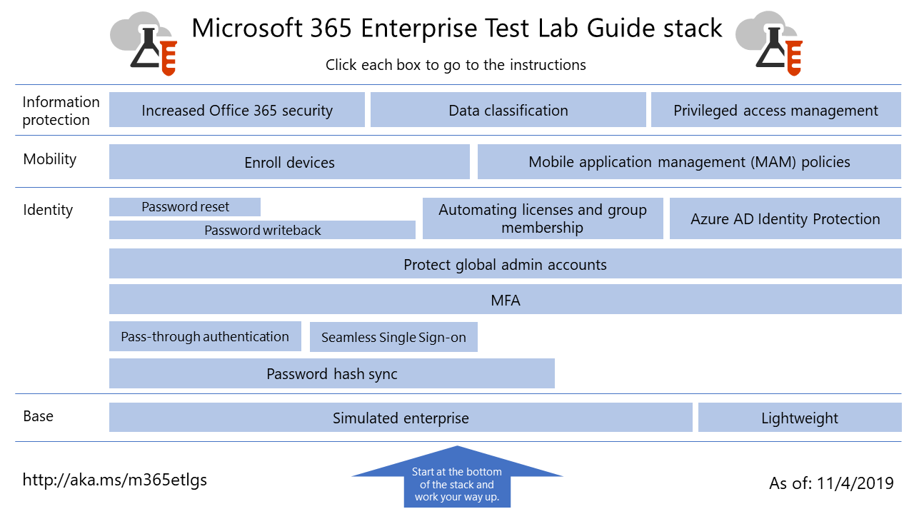

# Microsoft 365 for enterprise Test Lab Guides

*This applies to both Microsoft 365 for enterprise and Office 365 Enterprise.*

Test Lab Guides (TLGs) help you quickly learn about Microsoft products. They provide prescriptive instructions to configure simplified but representative test environments. You can use these environments for demonstration, customization, or creation of complex proofs of concept for the duration of a trial or paid subscription.

TLGs are designed to be modular. They build upon each other to create multiple configurations that more closely match your learning or test configuration needs. The "I built it out myself and it works" hands-on experience helps you understand the deployment requirements of a new product or scenario, so that you can better plan for hosting it in production.

You can also use TLGs to create representative environments to develop and test applications, also known as dev/test environments.
  

For a visual map to all the articles in the Microsoft 365 for enterprise Test Lab Guide stack, expand the following graphic or go to [Microsoft 365 for enterprise Test Lab Guide Stack](../downloads/Microsoft365EnterpriseTLGStack.pdf).

## Base configuration

First, create a test environment for [Microsoft 365 for enterprise](/microsoft-365-enterprise/). You can create two different types of base configurations:

- [Lightweight base configuration](lightweight-base-configuration-microsoft-365-enterprise.md) - Use this when you want to configure and demonstrate Microsoft 365 for enterprise features and capabilities in a cloud-only environment, which does not include any on-premises components.

- [Simulated enterprise base configuration](simulated-ent-base-configuration-microsoft-365-enterprise.md) - Use this when you want to configure and demonstrate Microsoft 365 for enterprise features and capabilities in a hybrid cloud environment, which uses on-premises components such as an Active Directory Domain Services (AD DS) domain.

You can also create test environments for Office 365 E5 by not adding the Microsoft 365 E5 license to your trial or production test environment.
    
## Identity

To demonstrate identity-related features and capabilities, see:

- [Password hash synchronization](password-hash-sync-m365-ent-test-environment.md)
  
   Enable and test password hash-based directory synchronization from an AD DS domain controller.

- [Pass-through authentication](pass-through-auth-m365-ent-test-environment.md)
  
   Enable and test pass-through authentication to an AD DS domain controller.

- [Federated authentication](federated-identity-for-your-microsoft-365-dev-test-environment.md)
  
   Enable and test federated authentication to an AD DS domain controller.

- [Azure AD Seamless Single Sign-on](single-sign-on-m365-ent-test-environment.md)
  
   Enable and test Azure AD Seamless Single Sign-on (Seamless SSO) with an AD DS domain controller.

- [Multi-factor authentication](multi-factor-authentication-microsoft-365-test-environment.md)
  
   Enable and test smart phone-based multi-factor authentication for a specific user account.

- [Protect global administrator accounts](protect-global-administrator-accounts-microsoft-365-test-environment.md)

   Lock down your global administrator accounts with conditional access policies.

- [Password writeback](password-writeback-m365-ent-test-environment.md)

   Use password writeback to change the password on your AD DS user account from Azure AD.

- [Password reset](password-reset-m365-ent-test-environment.md)

   Use self-service password reset to reset your password.

- [Automatic licensing and group membership](automate-licenses-group-membership-microsoft-365-test-environment.md)

   Make administering new accounts easier than ever with automatic licensing and dynamic group membership.

- [Azure AD Identity Protection](azure-ad-identity-protection-microsoft-365-test-environment.md)

   Scan your current user accounts for vulnerabilities.

- [Identity and device access](identity-device-access-m365-test-environment.md)

   Create an environment to test recommended identity and device access configurations and conditional access policies.

## Mobile device management

To demonstrate mobile device management-related features and capabilities, see:

- [Device compliance policies](mam-policies-for-your-microsoft-365-enterprise-dev-test-environment.md)
    
   Create a user group and a device compliance policy for Windows 10 devices.
    
- [Enroll iOS and Android devices](enroll-ios-and-android-devices-in-your-microsoft-enterprise-365-dev-test-environ.md)
   
   Enroll iOS or Android devices and manage them remotely.

## Information protection

To demonstrate information protection-related features and capabilities, see:

- [Increased Microsoft 365 security](increased-o365-security-microsoft-365-enterprise-dev-test-environment.md)
    
   Configure settings for increased Microsoft 365 security and investigate built-in security tools.
  
- [Data classification](data-classification-microsoft-365-enterprise-dev-test-environment.md)
    
   Configure and apply labels to a document in a SharePoint Online team site.
    
- [Privileged access management](privileged-access-microsoft-365-enterprise-dev-test-environment.md)
    
   Configure privileged access management for just-in-time access to elevated and privileged tasks in your organization.