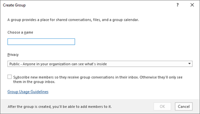
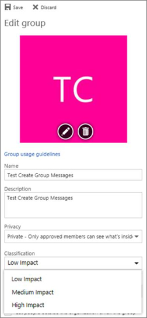

# Manage Microsoft 365 Groups with PowerShell

*This article applies to both Microsoft 365 Enterprise and Office 365 Enterprise.*

This article provides the steps for doing common management tasks for Groups in Microsoft PowerShell. It also lists the PowerShell cmdlets for Groups. For info about managing SharePoint sites, see [Manage SharePoint Online sites using PowerShell](/sharepoint/manage-team-and-communication-sites-in-powershell).

## Link to your Microsoft 365 Groups usage guidelines
<a name="BK_LinkToGuideLines"> </a>

When users [create or edit a group in Outlook](https://support.office.com/article/04d0c9cf-6864-423c-a380-4fa858f27102.aspx), you can show them a link to your organization's usage guidelines. For example, if you require a specific prefix or suffix to be added to a group name.

Use the Azure Active Directory (Azure AD) PowerShell to point your users to your organization's usage guidelines for Microsoft 365 groups. Check out [Azure Active Directory cmdlets for configuring group settings](/azure/active-directory/enterprise-users/groups-settings-cmdlets) and follow the steps in the **Create settings at the directory level** to define the usage guideline hyperlink. Once you run the AAD cmdlet, user's will see the link to your guidelines when they create or edit a group in Outlook.




## Allow users to Send as the Microsoft 365 Group
<a name="BK_LinkToGuideLines"> </a>

If you want to enable your Microsoft 365 groups to "Send As", use the [Add-RecipientPermission](/powershell/module/exchange/add-recipientpermission) and [Get-RecipientPermission](/powershell/module/exchange/get-recipientpermission) cmdlets to configure this. Once you enable this setting, Microsoft 365 group users can use Outlook or Outlook on the web to send and reply to email as the Microsoft 365 group. Users can go to the group, create a new email, and change the "Send As" field to the group's email address.

([You can also do this in the Exchange Admin Center](/office365/admin/create-groups/allow-members-to-send-as-or-send-on-behalf-of-group).)

Use the following script, replacing *\<GroupAlias\>* with the alias of the group that you want to update, and *\<UserAlias\>* with the alias of the user to whom you want to grant permissions. [Connect to Exchange Online PowerShell](/powershell/exchange/connect-to-exchange-online-powershell) to run this script.

```PowerShell
$groupAlias = "<GroupAlias>"
$userAlias = "<UserAlias>"
$groupsRecipientDetails = Get-Recipient -RecipientTypeDetails groupmailbox -Identity $groupAlias

Add-RecipientPermission -Identity $groupsRecipientDetails.Name -Trustee $userAlias -AccessRights SendAs
```

Once the cmdlet is executed, users can go to Outlook or Outlook on the web to send as the group, by adding the group email address to the **From** field.

## Create classifications for Microsoft 365 Groups in your organization

You can create sensitivity labels that the users in your organization can set when they create a Microsoft 365 Group. If you want to classify groups, we recommend using sensitivity labels instead of the previous groups classification feature. For information about using sensitivity labels, see [Use sensitivity labels to protect content in Microsoft Teams, Microsoft 365 groups, and SharePoint sites](../compliance/sensitivity-labels-teams-groups-sites.md).

> [!IMPORTANT]
> If you are currently using classification labels, they will no longer be available to users who create groups once sensitivity labels are enabled.

You can still use the previous groups classification feature. You can create classifications that the users in your organization can set when they create an Microsoft 365 Group. For example, you can allow users to set "Standard", "Secret", and "Top Secret" on groups they create. Group classifications aren't set by default and you need to create it in order for your users to set it. Use Azure Active Directory PowerShell to point your users to your organization's usage guidelines for Microsoft 365 Groups.

Check out [Azure Active Directory cmdlets for configuring group settings](/azure/active-directory/users-groups-roles/groups-settings-cmdlets) and follow the steps in the **Create settings at the directory level** to define the classification for Microsoft 365 Groups.

```powershell
$setting["ClassificationList"] = "Low Impact, Medium Impact, High Impact"
```

In order to associate a description to each classification you can use the settings attribute  *ClassificationDescriptions* to define.

```powershell
$setting["ClassificationDescriptions"] ="Classification:Description,Classification:Description"
```

where Classification matches the strings in the ClassificationList.

Example:

```powershell
$setting["ClassificationDescriptions"] = "Low Impact: General communication, Medium Impact: Company internal data , High Impact: Data that has regulatory requirements"
```

After you run the above Azure Active Directory cmdlet to set your classification, run the [Set-UnifiedGroup](/powershell/module/exchange/Set-UnifiedGroup) cmdlet if you want to set the classification for a specific group.

```powershell
Set-UnifiedGroup <LowImpactGroup@constoso.com> -Classification <LowImpact>
```

Or create a new group with a classification.

```powershell
New-UnifiedGroup <HighImpactGroup@constoso.com> -Classification <HighImpact> -AccessType <Public>
```

Check out [Using PowerShell with Exchange Online](/powershell/exchange/exchange-online-powershell) and [Connect to Exchange Online PowerShell](/powershell/exchange/connect-to-exchange-online-powershell) for more details on using Exchange Online PowerShell.

Once these settings are enabled, the group owner will be able to choose a classification from the drop down menu in Outlook on the Web and Outlook, and save it from the **Edit** group page.



## Hide Microsoft 365 Groups from the global address list.
<a name="BKMK_CreateClassification"> </a>

You can specify whether a Microsoft 365 Group appears in the global address list (GAL) and other lists in your organization. For example, if you have a legal department group that you don't want to show up in the address list, you can stop that group from appearing in the GAL. Run the Set-Unified Group cmdlet to hide the group from the address list like this:

```powershell
Set-UnifiedGroup -Identity "Legal Department" -HiddenFromAddressListsEnabled $true
```

## Allow only internal users to send message to Microsoft 365 Groups
<a name="BKMK_CreateClassification"> </a>

If you don't want users from other organizations to send emails to a Microsoft 365 Group, you can change the settings for that group. It will allow only internal users to send an email to your group. If an external user tries to send a message to that group, it will be rejected.

Run the Set-UnifiedGroup cmdlet to update this setting, like this:

```powershell
Set-UnifiedGroup -Identity "Internal senders only" -RequireSenderAuthenticationEnabled $true
```

## Add MailTips to Microsoft 365 Groups
<a name="BKMK_CreateClassification"> </a>

Whenever a sender tries to send an email to a Microsoft 365 Group, a MailTip can be shown to them.

Run the Set-Unified Group cmdlet to add a mailTip to the group:

```powershell
Set-UnifiedGroup -Identity "MailTip Group" -MailTip "This group has a MailTip"
```

Along with MailTip, you can also set MailTipTranslations, which specifies additional languages for the MailTip. Suppose you want to have the Spanish translation, then run the following command:

```powershell
Set-UnifiedGroup -Identity "MailaTip Group" -MailTip "This group has a MailTip" -MailTipTranslations "@{Add="ES:Esta caja no se supervisa."
```

## Change the display name of the Microsoft 365 Group

The display name specifies the name of the Microsoft 365 Group. You can see this name in your exchange admin center or Microsoft 365 admin center. You can edit the display name of the group or assign a display name to an existing Microsoft 365 Group by running the Set-UnifiedGroup command:

```powershell
Set-UnifiedGroup -Identity "mygroup@contoso.com" -DisplayName "My new group"
```

## Change the default setting of Microsoft 365 Groups for Outlook to Public or Private
<a name="BKMK_CreateClassification"> </a>

Microsoft 365 Groups in Outlook are created as Private by default. If your organization wants Microsoft 365 Groups to be created as Public by default (or back to Private), use this PowerShell cmdlet syntax:

 `Set-OrganizationConfig -DefaultGroupAccessType Public`

To set to Private:

 `Set-OrganizationConfig -DefaultGroupAccessType Private`

To verify the setting:

 `Get-OrganizationConfig | ft DefaultGroupAccessType`

To learn more, see [Set-OrganizationConfig](/powershell/module/exchange/set-organizationconfig) and [Get-OrganizationConfig](/powershell/module/exchange/get-organizationconfig).

## Microsoft 365 Groups cmdlets

The following cmdlets can be used with Microsoft 365 Groups.

|**Cmdlet name**|**Description**|
|:-----|:-----|
|[Get-UnifiedGroup](/powershell/module/exchange/get-unifiedgroup) <br/> |Use this cmdlet to look up existing Microsoft 365 Groups, and to view properties of the group object  <br/> |
|[Set-UnifiedGroup](/powershell/module/exchange/set-unifiedgroup) <br/> |Update the properties of a specific Microsoft 365 Group  <br/> |
|[New-UnifiedGroup](/powershell/module/exchange/new-unifiedgroup) <br/> |Create a new Microsoft 365 Group. This cmdlet provides a minimal set of parameters. To set values for extended properties, use Set-UnifiedGroup after creating the new group  <br/> |
|[Remove-UnifiedGroup](/powershell/module/exchange/remove-unifiedgroup) <br/> |Delete an existing Microsoft 365 Group  <br/> |
|[Get-UnifiedGroupLinks](/powershell/module/exchange/get-unifiedgrouplinks) <br/> |Retrieve membership and owner information for a Microsoft 365 Group  <br/> |
|[Add-UnifiedGroupLinks](/powershell/module/exchange/add-unifiedgrouplinks) <br/> |Add members, owners, and subscribers to an existing Microsoft 365 Group <br/> |
|[Remove-UnifiedGroupLinks](/powershell/module/exchange/remove-unifiedgrouplinks) <br/> |Remove owners and members from an existing Microsoft 365 Group  <br/> |
|[Get-UserPhoto](/powershell/module/exchange/get-userphoto) <br/> |Used to view information about the user photo associated with an account. User photos are stored in Active Directory  <br/> |
|[Set-UserPhoto](/powershell/module/exchange/set-userphoto) <br/> |Used to associate a user photo with an account. User photos are stored in Active Directory  <br/> |
|[Remove-UserPhoto](/powershell/module/exchange/remove-userphoto) <br/> |Remove the photo for an Microsoft 365 Group  <br/> |

## Related topics

[Upgrade distribution lists to Microsoft 365 Groups](/office365/admin/manage/upgrade-distribution-lists)

[Manage who can create Microsoft 365 Groups](/office365/admin/create-groups/manage-creation-of-groups)

[Manage guest access to Microsoft 365 Groups](https://support.office.com/article/bfc7a840-868f-4fd6-a390-f347bf51aff6)

[Change static group membership to dynamic in](/azure/active-directory/users-groups-roles/groups-change-type)