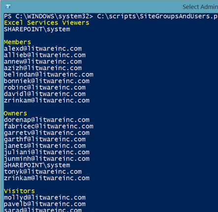

# Manage SharePoint site groups with PowerShell

*This article applies to both Microsoft 365 Enterprise and Office 365 Enterprise.*

Although you can use the Microsoft 365 admin center, you can also use PowerShell for Microsoft 365 to manage your SharePoint site groups.

## Before you begin

The procedures in this article require you to connect to SharePoint. For instructions, see [Connect to SharePoint PowerShell](/powershell/sharepoint/sharepoint-online/connect-sharepoint-online).

## View SharePoint with PowerShell for Microsoft 365

The SharePoint admin center has some easy-to-use methods for managing site groups. For example, suppose you want to look at the groups, and the group members, for the `https://litwareinc.sharepoint.com/sites/finance` site. Here's what you have to do to:

1. From the SharePoint admin center, select <a href="https://go.microsoft.com/fwlink/?linkid=2185220" target="_blank">**Active sites**</a>, and then select the URL of the site.
2. On the site page, select <a href="https://go.microsoft.com/fwlink/?linkid=2185072" target="_blank">**Settings**</a> (located in the upper right-hand corner of the page), and then select **Site permissions**.

And then repeat the process for the next site you want to look at.

To get a list of the groups with PowerShell for Microsoft 365, you can use the following commands:

```powershell
$siteURL = "https://litwareinc.sharepoint.com/sites/finance"
$x = Get-SPOSiteGroup -Site $siteURL
foreach ($y in $x)
    {
        Write-Host $y.Title -ForegroundColor "Yellow"
        Get-SPOSiteGroup -Site $siteURL -Group $y.Title | Select-Object -ExpandProperty Users
        Write-Host
    }
```

There are two ways to run this command set in the SharePoint Management Shell command prompt:

- Copy the commands into Notepad (or another text editor), modify the value of the **$siteURL** variable, select the commands, and then paste them into the SharePoint Management Shell command prompt. When you do, PowerShell stops at a **>>** prompt. Press Enter to execute the `foreach` command.<br/>
- Copy the commands into Notepad (or another text editor), modify the value of the **$siteURL** variable, and then save this text file with a name and the .ps1 extension in a suitable folder. Next, run the script from the SharePoint Management Shell command prompt by specifying its path and file name. Here's an example command:

```powershell
C:\Scripts\SiteGroupsAndUsers.ps1
```

In both cases, you should see something similar to this:



These are all the groups that were created for the site `https://litwareinc.sharepoint.com/sites/finance`, and all the users assigned to those groups. The group names are in yellow to help you separate group names from their members.

As another example, here's a command set that lists the groups, and all the group memberships, for all of your SharePoint sites.

```powershell
$x = Get-SPOSite
foreach ($y in $x)
    {
        Write-Host $y.Url -ForegroundColor "Yellow"
        $z = Get-SPOSiteGroup -Site $y.Url
        foreach ($a in $z)
            {
                 $b = Get-SPOSiteGroup -Site $y.Url -Group $a.Title
                 Write-Host $b.Title -ForegroundColor "Cyan"
                 $b | Select-Object -ExpandProperty Users
                 Write-Host
            }
    }
```

## See also

[Connect to SharePoint PowerShell](/powershell/sharepoint/sharepoint-online/connect-sharepoint-online)

[Create SharePoint sites and add users with PowerShell](create-sharepoint-sites-and-add-users-with-powershell.md)

[Manage SharePoint users and groups with PowerShell](manage-sharepoint-users-and-groups-with-powershell.md)

[Manage Microsoft 365 with PowerShell](manage-microsoft-365-with-microsoft-365-powershell.md)

[Getting started with PowerShell for Microsoft 365](getting-started-with-microsoft-365-powershell.md)
