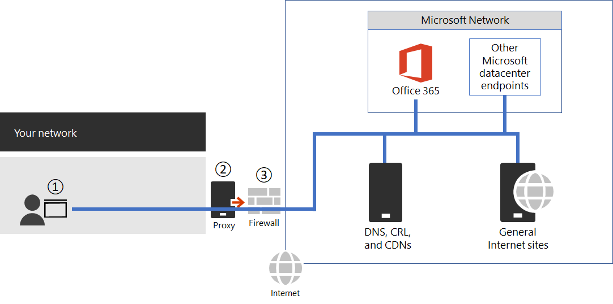

# Managing Office 365 endpoints

Most enterprise organizations that have multiple office locations and a connecting WAN will need configuration for Office 365 network connectivity. You can optimize your network by sending all trusted Office 365 network requests directly through your firewall, bypassing all additional packet level inspection or processing. This reduces latency and your perimeter capacity requirements. Identifying Office 365 network traffic is the first step in providing optimal performance for your users. For more information, see [Office 365 Network Connectivity Principles](microsoft-365-network-connectivity-principles.md).

Microsoft recommends you access the Office 365 network endpoints and ongoing changes to them using the [Office 365 IP Address and URL Web Service](microsoft-365-ip-web-service.md).

Regardless of how you manage vital Office 365 network traffic, Office 365 requires Internet connectivity. Other network endpoints where connectivity is required are listed at [Additional endpoints not included in the Office 365 IP Address and URL Web service](additional-office365-ip-addresses-and-urls.md).

How you use the Office 365 network endpoints will depend on your enterprise organization network architecture. This article outlines several ways that enterprise network architectures can integrate with Office 365 IP addresses and URLs. The easiest way to choose which network requests to trust is to use SD-WAN devices that support automated Office 365 configuration at each of your office locations.

## SD-WAN for local branch egress of vital Office 365 network traffic

At each branch office location, you can provide an SD-WAN device that is configured to route traffic for Office 365 Optimize category of endpoints, or Optimize and Allow categories, directly to Microsoft's network. Other network traffic including on-premises datacenter traffic, general Internet web sites traffic, and traffic to Office 365 Default category endpoints is sent to another location where you have a more substantial network perimeter.

Microsoft is working with SD-WAN providers to enable automated configuration. For more information, see [Office 365 Networking Partner Program](microsoft-365-networking-partner-program.md).

<a name="pacfiles"> </a>
## Use a PAC file for direct routing of vital Office 365 traffic

Use PAC or WPAD files to manage network requests that are associated with Office 365 but don't have an IP address. Typical network requests that are sent through a proxy or perimeter device increase latency. While SSL Break and Inspect creates the largest latency, other services such as proxy authentication and reputation lookup can cause poor performance and a bad user experience. Additionally, these perimeter network devices need enough capacity to process all of the network connection requests. We recommend bypassing your proxy or inspection devices for direct Office 365 network requests.
  
[PowerShell Gallery Get-PacFile](https://www.powershellgallery.com/packages/Get-PacFile) is a PowerShell script that reads the latest network endpoints from the Office 365 IP Address and URL Web service and creates a sample PAC file. You can modify the script so that it integrates with your existing PAC file management.



**Figure 1 - Simple enterprise network perimeter**

The PAC file is deployed to web browsers at point 1 in Figure 1. When using a PAC file for direct egress of vital Office 365 network traffic, you also need to allow connectivity to the IP addresses behind these URLs on your network perimeter firewall. This is done by fetching the IP addresses for the same Office 365 endpoint categories as specified in the PAC file and creating firewall ACLs based on those addresses. The firewall is point 3 in Figure 1.

Separately if you choose to only do direct routing for the Optimize category endpoints, any required Allow category endpoints that you send to the proxy server will need to be listed in the proxy server to bypass further processing. For example, SSL break and Inspect and Proxy Authentication are incompatible with both the Optimize and Allow category endpoints. The proxy server is point 2 in Figure 1.

The common configuration is to permit without processing all outbound traffic from the proxy server for the destination IP addresses for Office 365 network traffic that hits the proxy server. For information about issues with SSL Break and Inspect, see [Using third-party network devices or solutions on Office 365 traffic](https://support.microsoft.com/help/2690045/using-third-party-network-devices-or-solutions-with-office-365).

There are two types of PAC files that the Get-PacFile script will generate.

| Type | Description |
|:-----|:-----|
|**1** <br/> |Send Optimize endpoint traffic direct and everything else to the proxy server. <br/> |
|**2** <br/> |Send Optimize and Allow endpoint traffic direct and everything else to the proxy server. This type can also be used to send all supported ExpressRoute for Office 365 traffic to ExpressRoute network segments and everything else to the proxy server. <br/> |

Here's a simple example of calling the PowerShell script:

```powershell
Get-PacFile -ClientRequestId b10c5ed1-bad1-445f-b386-b919946339a7
```

There are many parameters you can pass to the script:

| Parameter | Description |
|:-----|:-----|
|**ClientRequestId** <br/> |This is required and is a GUID passed to the web service that represents the client machine making the call. <br/> |
|**Instance** <br/> |The Office 365 service instance, which defaults to Worldwide. This is also passed to the web service. <br/> |
|**TenantName** <br/> |Your Office 365 tenant name. Passed to the web service and used as a replaceable parameter in some Office 365 URLs. <br/> |
|**Type** <br/> |The type of the proxy PAC file that you want to generate. <br/> |

Here's another example of calling the PowerShell script with additional parameters:

```powershell
Get-PacFile -Type 2 -Instance Worldwide -TenantName Contoso -ClientRequestId b10c5ed1-bad1-445f-b386-b919946339a7
```

## Proxy server bypass processing of Office 365 network traffic

Where PAC files are not used for direct outbound traffic, you still want to bypass processing on your network perimeter by configuring your proxy server. Some proxy server vendors have enabled automated configuration of this as described in the [Office 365 Networking Partner Program](microsoft-365-networking-partner-program.md).

If you are doing this manually, you will need to get the Optimize and Allow endpoint category data from the Office 365 IP Address and URL Web Service and configure your proxy server to bypass processing for these. It is important to avoid SSL Break and Inspect and Proxy Authentication for the Optimize and Allow category endpoints.
  
<a name="bkmk_changes"> </a>
## Change management for Office 365 IP addresses and URLs

In addition to selecting appropriate configuration for your network perimeter, it is critical that you adopt a change management process for Office 365 endpoints. These endpoints change regularly and if you do not manage the changes, you can end up with users blocked or with poor performance after a new IP address or URL is added.

Changes to the Office 365 IP addresses and URLs are usually published near the last day of each month. Sometimes a change will be published outside of that schedule due to operational, support, or security requirements.

When a change is published that requires you to act because an IP address or URL was added, you should expect to receive 30 days notice from the time we publish the change until there is an Office 365 service on that endpoint. Although we aim for this notification period, it may not always be possible due to operational, support, or security requirements. Changes that do not require immediate action to maintain connectivity, such as removed IP addresses or URLs or less significant changes, do not include advance notification. Regardless of what notification is provided, we list the expected service active date for each change.

### Change notification using the Web Service

You can use the Office 365 IP Address and URL Web Service to get change notification. We recommend you call the **/version** web method once an hour to check the version of the endpoints that you are using to connect to Office 365. If this version changes when compared to the version that you have in use, then you should get the latest endpoint data from the **/endpoints** web method and optionally get the differences from the **/changes** web method. It is not necessary to call the **/endpoints** or **/changes** web methods if there has not been any change to the version you found.

For more information, see [Office 365 IP Address and URL Web Service](microsoft-365-ip-web-service.md).

### Change notification using RSS feeds

The Office 365 IP Address and URL Web Service provides an RSS feed that you can subscribe to in Outlook. There are links to the RSS URLs on each of the Office 365 service instance-specific pages for the IP addresses and URLs. For more information, see [Office 365 IP Address and URL Web Service](microsoft-365-ip-web-service.md).

### Change notification and approval review using Microsoft Flow

We understand that you might still require manual processing for network endpoint changes that come through each month. You can use Microsoft Flow to create a flow that notifies you by email and optionally runs an approval process for changes when Office 365 network endpoints have changes. Once review is completed, you can have the flow automatically email the changes to your firewall and proxy server management team.

For information about a Microsoft Flow sample and template, see [Use Microsoft Flow to receive an email for changes to Office 365 IP addresses and URLs](https://techcommunity.microsoft.com/t5/Office-365-Networking/Use-Microsoft-Flow-to-receive-an-email-for-changes-to-Office-365/td-p/240651).
  
<a name="FAQ"> </a>
## Office 365 network endpoints FAQ

See these frequently asked questions about Office 365 network connectivity.
  
### How do I submit a question?

Click the link at the bottom to indicate if the article was helpful or not and submit any additional questions. We monitor the feedback and update the questions here with the most frequently asked.
  
### How do I determine the location of my tenant?

 **Tenant location** is best determined using our [datacenter map](./o365-data-locations.md).
  
### Am I peering appropriately with Microsoft?

 **Peering locations** are described in more detail in [peering with Microsoft](https://www.microsoft.com/peering).
  
With over 2500 ISP peering relationships globally and 70 points of presence, getting from your network to ours should be seamless. It can't hurt to spend a few minutes making sure your ISP's peering relationship is the most optimal, [here's a few examples](/archive/blogs/onthewire/__guidance) of good and not so good peering hand-offs to our network.
  
<a name="bkmk_MissingIP"> </a>
### I see network requests to IP addresses not on the published list, do I need to provide access to them?

We only provide IP addresses for the Office 365 servers you should route directly to. This isn't a comprehensive list of all IP addresses you'll see network requests for. You will see network requests to Microsoft and third-party owned, unpublished, IP addresses. These IP addresses are dynamically generated or managed in a way that prevents timely notice when they change. If your firewall can't allow access based on the FQDNs for these network requests, use a PAC or WPAD file to manage the requests.
  
See an IP associated with Office 365 that you want more information on?
  
1. Check if the IP address is included in a larger published range using a CIDR calculator, such as these for [IPv4](https://www.ipaddressguide.com/cidr) or [IPv6](https://www.ipaddressguide.com/ipv6-cidr). For example, 40.96.0.0/13 includes the IP Address 40.103.0.1 despite 40.96 not matching 40.103.
2. See if a partner owns the IP with a [whois query](https://dnsquery.org/). If it's Microsoft owned, it may be an internal partner. Many partner network endpoints are listed as belonging to the _default_ category, for which IP addresses are not published.
3. The IP address may not be part of Office 365 or a dependency. Office 365 network endpoint publishing does not include all of Microsoft network endpoints.
4. Check the certificate. With a browser, connect to the IP address using  *HTTPS://\<IP_ADDRESS\>* and check the domains listed on the certificate to understand what domains are associated with the IP address. If it's a Microsoft-owned IP address and not on the list of Office 365 IP addresses, it's likely the IP address is associated with a Microsoft CDN such as  *MSOCDN.NET*  or another Microsoft domain without published IP information. If you do find the domain on the certificate is one where we claim to list the IP address, please let us know.

<a name="bkmk_cname"> </a>
### Some Office 365 URLs point to CNAME records instead of A records in the DNS. What do I have to do with the CNAME records?

Client computers need a DNS A or AAAA record t)hat includes one or more IP address(es) to connect to a cloud service. Some URLs included in Office 365 show CNAME records instead of A or AAAA records. These CNAME records are intermediary and there may be several in a chain. They will always eventually resolve to an A or AAAA record for an IP Address. For example, consider the following series of DNS records, which ultimately resolves to the IP address _IP_1_:

```console
serviceA.office.com -> CNAME: serviceA.domainA.com -> CNAME: serviceA.domainB.com -> A: IP_1
```

These CNAME redirects are a normal part of the DNS and are transparent to the client computer and transparent to proxy servers. They are used for load balancing, content delivery networks, high availability, and service incident mitigation. Microsoft does not publish the intermediary CNAME records, they are subject to change at any time, and you should not need to configure them as allowed in your proxy server.

A proxy server validates the initial URL, which in the above example is serviceA.office.com, and this URL would be included in Office 365 publishing. The proxy server requests DNS resolution of that URL to an IP Address and will receive back IP_1. It does not validate the intermediary CNAME redirection records.

Hard-coded configurations or whitelisting based on indirect Office 365 FQDNs are not recommended, not supported by Microsoft, and are known to cause customer connectivity issues. DNS solutions that block on CNAME redirection, or that otherwise incorrectly resolve Office 365 DNS entries, can be solved via DNS forwarders with DNS recursion enabled or by using DNS root hints. Many third-party network perimeter products natively integrate recommended Office 365 endpoint whitelisting in their configuration using the [Office 365 IP Address and URL Web service](microsoft-365-ip-web-service.md).

<a name="bkmk_akamai"> </a>
### Why do I see names such as nsatc.net or akadns.net in the Microsoft domain names?

Office 365 and other Microsoft services use several third-party services such as Akamai and MarkMonitor to improve your Office 365 experience. To keep giving you the best experience possible, we may change these services in the future. Third-party domains may host content, such as a CDN, or they may host a service, such as a geographical traffic management service. Some of the services currently in use include:
  
[MarkMonitor](https://www.markmonitor.com/) is in use when you see requests that include  *\*.nsatc.net*. This service provides domain name protection and monitoring to protect against malicious behavior.
  
[ExactTarget](https://www.marketingcloud.com/) is in use when you see requests to  *\*.exacttarget.com*. This service provides email link management and monitoring against malicious behavior.
  
[Akamai](https://www.akamai.com/) is in use when you see requests that include one of the following FQDNs. This service offers geo-DNS and content delivery network services.
  
```console
*.akadns.net
*.akam.net
*.akamai.com
*.akamai.net
*.akamaiedge.net
*.akamaihd.net
*.akamaized.net
*.edgekey.net
*.edgesuite.net
```

<a name="bkmk_thirdparty"> </a>
### I have to have the minimum connectivity possible for Office 365

As Office 365 is a suite of services built to function over the internet, the reliability and availability promises are based on many standard internet services being available. For example, standard internet services such as DNS, CRL, and CDNs must be reachable to use Office 365 just as they must be reachable to use most modern internet services.

The Office 365 suite is broken down into major service areas. These can be selectively enabled for connectivity and there is a Common area, which is a dependency for all and is always required.

| Service Area | Description |
|:-----|:-----|
|**Exchange** <br/> |Exchange Online and Exchange Online Protection <br/> |
|**SharePoint** <br/> |SharePoint Online and OneDrive for Business <br/> |
|**Skype for Business Online and Microsoft Teams** <br/> |Skype for Business and Microsoft Teams <br/> |
|**Common** <br/> |Office 365 Pro Plus, Office in a browser, Azure AD, and other common network endpoints <br/> |

In addition to basic internet services, there are third-party services that are only used to integrate functionality. While these are needed for integration, they're marked as optional in the Office 365 endpoints article, which means core functionality of the service will continue to function if the endpoint isn't accessible. Any network endpoint that is required will have the required attribute set to true. Any network endpoint that is optional will have the required attribute set to false and the notes attribute will detail the missing functionality you should expect if connectivity is blocked.
  
If you're trying to use Office 365 and are finding third-party services aren't accessible, you'll want to [ensure all FQDNs marked required or optional in this article are allowed through the proxy and firewall](urls-and-ip-address-ranges.md).
  
<a name="bkmk_consumer"> </a>
### How do I block access to Microsoft's consumer services?

Restricting access to our consumer services should be done at your own risk. The only reliable way to block consumer services is to restrict access to the  *login.live.com*  FQDN. This FQDN is used by a broad set of services including non-consumer services such as MSDN, TechNet, and others. This FQDN is also used by Microsoft Support's Secure File Exchange program and is necessary to transfer files to facilitate troubleshooting for Microsoft products.  Restricting access to this FQDN may result in the need to also include exceptions to the rule for network requests associated with these services.
  
Keep in mind that blocking access to the Microsoft consumer services alone won't prevent the ability for someone on your network to exfiltrate information using an Office 365 tenant or other service.

<a name="bkmk_IPOnlyFirewall"> </a>
### My firewall requires IP Addresses and cannot process URLs. How do I configure it for Office 365?

Office 365 does not provide IP addresses of all required network endpoints. Some are provided as URLs only and are categorized as default. URLs in the default category that are required should be allowed through a proxy server. If you don't have a proxy server, look at how you have configured web requests for URLs that users type into the address bar of a web browser; the user doesn’t provide an IP address either. The Office 365 default category URLs that do not provide IP addresses should be configured in the same way.

## Related topics

[Office 365 IP Address and URL Web service](microsoft-365-ip-web-service.md)

[Microsoft Azure Datacenter IP Ranges](https://www.microsoft.com/download/details.aspx?id=41653)
  
[Microsoft Public IP Space](https://www.microsoft.com/download/details.aspx?id=53602)
  
[Network infrastructure requirements for Microsoft Intune](/intune/get-started/network-infrastructure-requirements-for-microsoft-intune)
  
[ExpressRoute and Power BI](https://powerbi.microsoft.com/documentation/powerbi-admin-power-bi-expressroute/)
  
[Office 365 URLs and IP address ranges](urls-and-ip-address-ranges.md)
  
[Managing ExpressRoute for Office 365 connectivity](managing-expressroute-for-connectivity.md)
  
[Office 365 Network Connectivity Principles](microsoft-365-network-connectivity-principles.md)