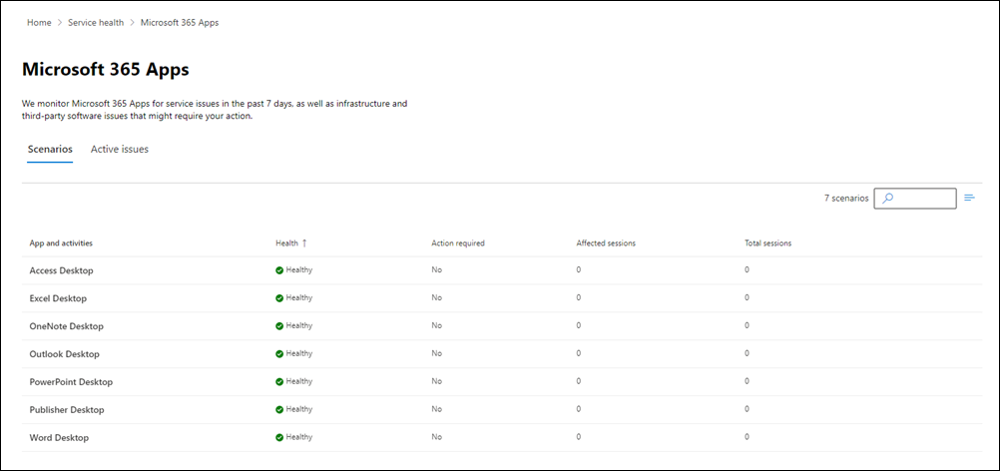

# Microsoft 365 Apps monitoring

Microsoft 365 Apps monitoring supports the following organizational-level scenarios for these desktop Office applications: Access, Excel, OneNote, Outlook, PowerPoint, Publisher, and Word.

- **Excessive Client Runtime Errors**. The runtime error rate of specific Office application has increased significantly over the last 24 hours.

- **Long Local File Load Time**. The average file load time from local storage has exceeded the recommended threshold over the last 24 hours.

- **Long Application Load Time**. The average application load time has exceeded the recommended threshold over the last 24 hours.

- **Excessive Macro Errors**. The macro error rate has exceeded the recommended threshold over the last 24 hours.

- **Excessive Add-in Errors**. The add-in error rate has exceeded the recommended threshold over the last 24 hours.

- **Long SharePoint File Load Time**. The average file load time from SharePoint has exceeded the recommended threshold over the last 24 hours.

Here's an example of the Apps monitoring dashboard

When Microsoft detects an error condition, a post is created to notify the tenant admin to go to the Microsoft 365 App Health dashboard for further information to remediate issues. For more information, see [Microsoft 365 Apps health](/deployoffice/admincenter/microsoft-365-apps-health).
