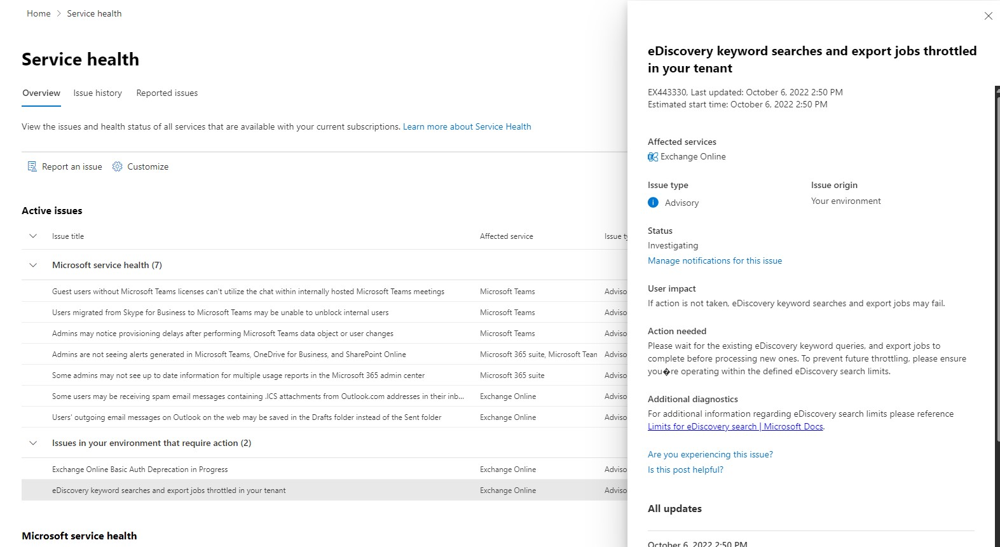

# Service advisories for eDiscovery throttling in Exchange Online monitoring

We've released a new Exchange Online service advisory that informs you of eDiscovery being throttled. These service advisories provide visibility into the instances when the user is unable to submit Search and Export because of throttling.

These service advisories are displayed in the Microsoft 365 admin center. To view these service advisories, go to  **Health**  | **[Service health](https://go.microsoft.com/fwlink/p/?linkid=842900)** | **Exchange Online**. Here's an example of an eDiscovery service advisory.

## What does this service advisory indicate?

The service advisories for eDiscovery throttling inform admins about their tenant being throttled due to number of Search and Export jobs exceeding the limit set by Microsoft. Various limits are applied to eDiscovery search tools in the [Microsoft Purview](~/compliance/index.yml) compliance portal. This includes searches run on the [Content Search](~/compliance/search-for-content.md) page and searches that are associated with an eDiscovery case on the [eDiscovery (Standard)](~/compliance/get-started-core-ediscovery.md) page. These limits help to maintain the health and quality of services provided to organizations. These advisories provide awareness so that you can take these limits into consideration when planning, running, and troubleshooting eDiscovery searches and exports.

For limits related to the Microsoft Purview eDiscovery (Standard) tool, see [Limits for Content search and eDiscovery (Standard) in the compliance center](~/compliance/limits-for-content-search.md?viewFallbackFrom=o365-worldwide%20for%20service%20limits).

### How often will I see these service advisories?

You can expect to see this type of advisory until the time where the Search and Export jobs are within the defined limit.

## More information

- For information about troubleshooting and resolving eDiscovery compliance issues, see [Microsoft Purview troubleshooting](/microsoft-365/troubleshoot/microsoft-365-compliance-welcome).
- For information about Microsoft Purview, see [What is Microsoft Purview?](/purview/purview)
- To learn more about Microsoft Purview eDiscovery solutions, see [Microsoft Purview eDiscovery solutions](~/compliance/ediscovery.md)
