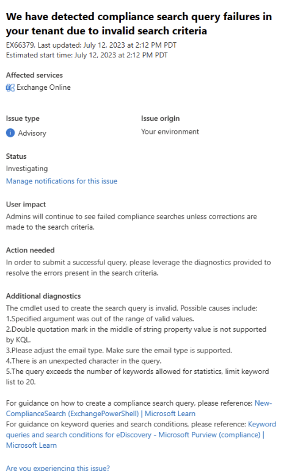

# Service advisories for eDiscovery cmdlet exception spike in Exchange Online monitoring

We've released a new Exchange Online service advisory that informs you regarding spike in eDiscovery cmdlet exceptions. The purpose of these advisories is to provide visibility into reasons behind user difficulties in submitting Compliance Search PowerShell cmdlets.

These service advisories are displayed in the Microsoft 365 admin center. To view these service advisories, go to **Health** > **Service health** > **Exchange Online**. Here's an example of eDiscovery service advisory.

## What does this service advisory indicate?

The advisory informs administrators about the issue and its potential impact on eDiscovery operations. It highlights that users encounter errors when executing Compliance Search cmdlets due to invalid search queries which can hinder their ability to perform necessary eDiscovery tasks effectively.

For guidance on how to create a compliance search query, please reference: [New-ComplianceSearch (ExchangePowerShell) | Microsoft Learn](/powershell/module/exchange/new-compliancesearch?view=exchange-ps&preserve-view=true)

For guidance on keyword queries and search conditions, please reference: [Keyword queries and search conditions for eDiscovery - Microsoft Purview (compliance) | Microsoft Learn](/purview/ediscovery-keyword-queries-and-search-conditions)

## How often will I see these service advisories?

Once the spike in eDiscovery cmdlet exceptions is resolved, the advisory will be updated accordingly or removed from the service health dashboard.
