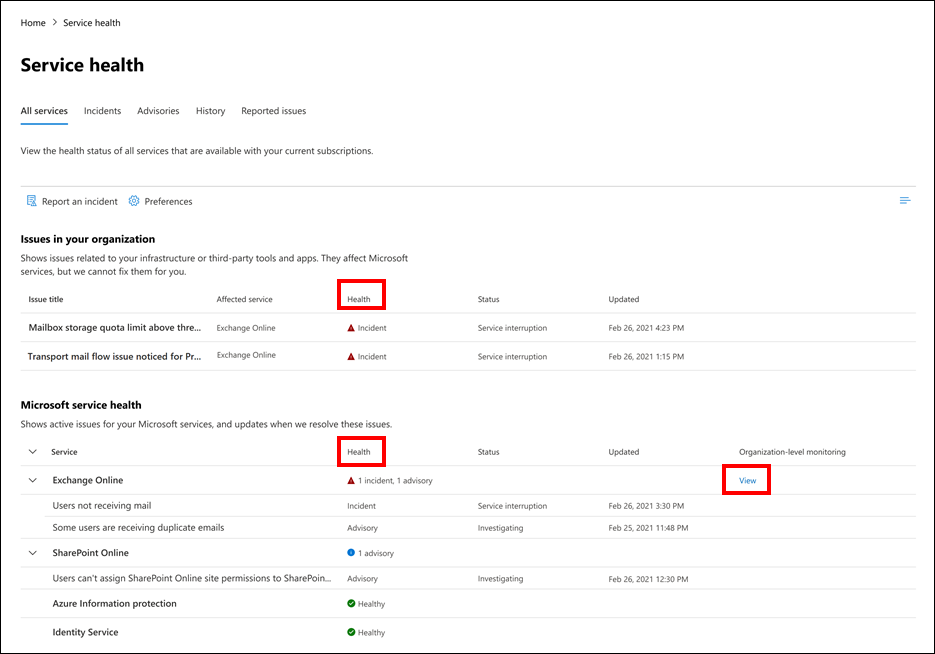
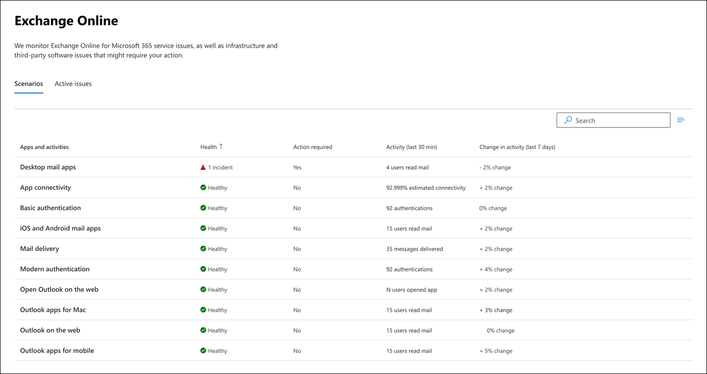

# Exchange Online monitoring for Microsoft 365

You can use Exchange Online monitoring in the <a href="https://go.microsoft.com/fwlink/p/?linkid=2024339" target="_blank">Microsoft 365 admin center</a> to monitor the health of the Exchange service for your organization's Microsoft 365 subscription. Exchange Online monitoring provides you with information about incidents and advisories that are collected in these categories:

- **Infrastructure**: Issue is detected in the Microsoft 365 infrastructure that Microsoft owns for providing regular updates and resolving the issue. For example, users cannot access Exchange Online because of issues with Exchange or other Microsoft 365 cloud infrastructure.
- **Third-party infrastructure**: Issue is detected in third-party infrastructure on which your organization has taken a dependency and requires action from your organization for resolution. For example, user authentication transactions are getting throttled by a third-party security token service (STS) provider that prevents users from connecting to Exchange Online.
- **Customer infrastructure**: Issue is detected in your organization's infrastructure and requires action from your organization for resolution. For example, users cannot access Exchange Online because they are unable to obtain an authentication token from STS provider hosted by your organization because of an expired certificate.

Here is an example of the **Service health** page in the Microsoft 365 admin center, available from **Health > Service health** for organization and [priority account](../admin/setup/priority-accounts.md) scenarios.

**Issues in your organization** will be identified and used by organizational-level monitoring and priority account monitoring.

The value of the **Health** column under **Issues in your organization** indicates whether your organization's infrastructure or third-party software affects the service health experience of your organization's users and/or priority accounts in Exchange Online. Advisories or incidents require *your* actions to resolve.

The value of the **Health** column under **Microsoft service health** indicates that the service is healthy or has advisories or incidents based on the cloud services that Microsoft maintains.

Here is an example of the Exchange Online monitoring page in the Microsoft 365 admin center that shows the health of organization-level and priority account scenarios available from **Health > Service health > Exchange Online**.

With the **Exchange Online** monitoring page, you can see whether the Exchange Online service is healthy or not and whether there are any associated incidents or advisories. With Exchange Online monitoring, you can look at the service health for specific email scenarios and view near real-time signals to determine the impact by organization-level scenario. You can also see health of priority account scenarios.

## Requirements

This preview is enabled for customers who meet these requirements:

- Your organization needs to have a license count of at least 5,000 from one or a combination of these products: Office 365 E3, Microsoft 365 E3, Office 365 E5, Microsoft 365 E5.

  For example, your organization can have 3,000 Office 365 E3 licenses and 2,500 Microsoft 365 E5, for a total of 5,500 licenses from the qualifying products.

- Your organization needs to have at least 50 monthly active users for one or more core Microsoft 365 services, which include Microsoft Teams, OneDrive for Business, SharePoint Online, Exchange Online, and Office apps.

- Any role with Service Health Dashboard level permissions can access Exchange Online Monitoring. For more information, see [How to check Microsoft 365 service health](view-service-health.md).

## Organization-level scenarios

With Exchange Online monitoring supports the following scenarios:

- **Email clients**: You can view the health for the following email clients based on email read activity:

  - Outlook desktop
  - Outlook on the web
  - Native mail clients of iOS and Android
  - Outlook Mobile app in iOS and Android
  - Outlook Mac client
  - Open Outlook on the web

   For these clients, you can see the number of active users in the last 30 minutes based on users reading an email, along with number of incidents and advisories in the dashboard. This data is compared to the same interval for the previous week to see if there's an issue.

   >[!Note]
   > Active user count is measured by a single activity, for example, when a user reads an email. It only accounts for the last 30 minutes of activity.

- **App connectivity**: Estimated connectivity is based on the percentage of successful, synthetic connections between your organization's devices and Exchange Online, and may include issues outside of Microsoft's control. To learn more, see [Microsoft 365 Connectivity Optics](microsoft-365-connectivity-optics.md).

- **Basic Authentication and Modern Authentication**: The number of users successfully validated in the Exchange Online service.

- **Mail flow**: The number of messages successfully delivered to a mailbox without any delay after the message reached the Microsoft 365 network.

  

For these scenarios, the key numbers are for the last 30 minutes in the main dashboard. Detailed views for each of these scenarios show the near real-time trend for seven days with the 30-minute aggregate compared with the previous week.

## Priority accounts monitoring scenarios

With Exchange Online priority account monitoring, you can view the health for the following scenarios after configuring [priority accounts](/microsoft-365/admin/setup/priority-accounts):

- Exchange licensing

- Mailbox storage

- Message limit

- Subfolders per folder

- Folder hierarchy

- Recoverable items

The Exchange licensing scenario checks if the priority account is not able to log in due to invalid license issues, which can be addressed by the tenant admin.

The remaining five scenarios above check if your priority account’s mailbox is close to reaching or has reached the limits described in [Exchange Online limits](/office365/servicedescriptions/exchange-online-service-description/exchange-online-limits#mailbox-storage-limits).

For these scenarios, you can see active and resolved advisories and incidents affecting your priority accounts. Identifiable information for the priority accounts will be displayed in the advisory or incident details along with recommendations. Here is an example from the page at **Health > Service health > Exchange Online**.

:::image type="content" source="../media/microsoft-365-exchange-monitoring/exchange-priority-accounts-example.png" alt-text="Example of active and resolved advisories and incidents affecting your priority accounts":::

In the affected account pane, the **Status** column has these values:

- Fixed: The issue causing the advisory or incident has been addressed for the priority account. There is no longer an issue. 

- Active: The issue causing the advisory or incident is ongoing for the priority account. The issue remains. 

- Delayed: The issue causing the advisory or incident has not been addressed for the priority account in 96 hours, so it is suspended. The issue remains. 

Here is an example.

:::image type="content" source="../media/microsoft-365-exchange-monitoring/exchange-status-column-example.png" alt-text="Example of the status column in the affected account pane":::

An advisory or incident will be resolved after no accounts remain in the **Active** state. 

## Send us feedback

There are two ways you can provide feedback:

- Use the **Give feedback** option available on every page of the Microsoft 365 admin center.

- Submit feedback using the **Is this post helpful?** link for a specific incident or advisory.

  

## Frequently asked questions

#### 1. Why don't I see "Exchange Online monitoring" under Health in the Microsoft 365 admin center? 

First, make sure you've enabled the new admin center on the **Home** page of the <a href="https://go.microsoft.com/fwlink/p/?linkid=2024339" target="_blank">Microsoft 365 admin center</a>.

Then make sure you meet both of the following requirements:

- Your organization needs to have a license count of at least 5,000, from one or a combination of these products: Office 365 E3, Microsoft 365 E3, Office 365 E5, Microsoft 365 E5.

- Your organization needs to have at least 50 monthly active users for one or more core Microsoft 365 services, which include Microsoft Teams, OneDrive for Business, SharePoint Online, Exchange Online, and Office apps.

If the license count for your organization falls below 5,000 users and the monthly active users falls below 50 users in the core services, Exchange Online monitoring won't be enabled until these requirements are met.

#### 2. The active user count in the dashboard for each client appears to be low. We have a lot of active licenses assigned to users. What does this mean?

The active user count shown in monitoring is based on a 30-minute window where users have performed the activity called out in the feature. This shouldn't be confused with usage numbers. To view usage numbers, use activity reports in the Microsoft 365 admin center (**Reports** > <a href="https://go.microsoft.com/fwlink/p/?linkid=2074756" target="_blank">**Usage**</a>).

#### 3. Will there be other monitoring scenarios for other services such as Teams and SharePoint?

Microsoft is integrating this experience directly inside the Service Health dashboard in the Microsoft 365 admin center. This will provide opportunities for Microsoft to extend monitoring scenarios for other services, which will be announced when there is news to share.

#### 4. What is the plan for general availability of this experience?

Microsoft has integrated Exchange Online monitoring directly on the <a href="https://go.microsoft.com/fwlink/p/?linkid=842900" target="_blank">**Service Health** dashboard</a> in the Microsoft 365 admin center.

With this new integrated experience, Microsoft's plan is to collect your feedback and then define our plan for general availability.

#### 5. Is this a free (included) or paid (extra) feature? 

This is a free feature that is in preview and only available for customers that meet the requirements in question 1. There isn't a paid option to receive this content.

#### 6. How do I provide feedback?

For general feedback, use the **Give feedback** icon on the bottom-right corner of the **Exchange Online** monitoring page. 

For feedback on incidents or advisories, use the **Is this post helpful?** link.

#### 7. Where is the data instrumented for the scenarios that show activity trends?

The data is instrumented in the Exchange Online service. If there is a failure that happens before the request reaches Exchange Online or there is a failure in Exchange Online, you will see a drop in the activity signal.

#### 8. Are there any privacy concerns?

Monitoring focuses on service metadata and user content is not monitored.

## See also

- [How to check Microsoft 365 service health](view-service-health.md) 

- [Exchange Online limits](/office365/servicedescriptions/exchange-online-service-description/exchange-online-limits#mailbox-storage-limits)

- [Manage and monitor priority accounts](/microsoft-365/admin/setup/priority-accounts)

- [Using Priority Accounts in Microsoft 365](https://techcommunity.microsoft.com/t5/microsoft-365-blog/using-priority-accounts-in-microsoft-365/ba-p/1873314)
