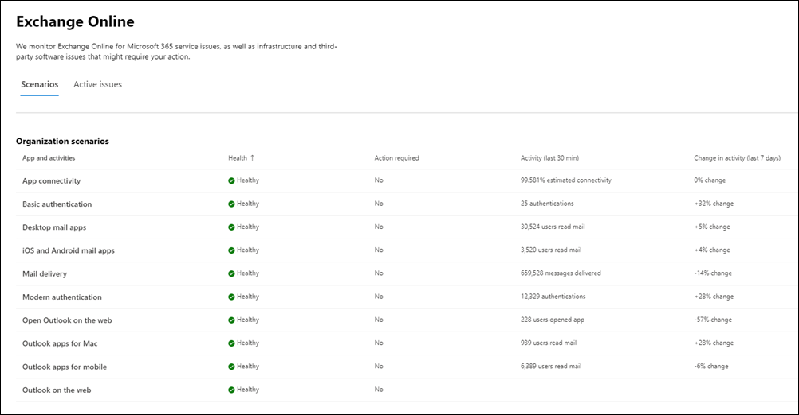

# Exchange Online monitoring for Microsoft 365

Exchange Online monitoring supports the following organization-level scenarios:

- **Email clients**: You can view the health for the following email clients based on email read activity:

  - Outlook desktop
  - Outlook on the web
  - Native mail clients of iOS and Android
  - Outlook Mobile app in iOS and Android
  - Outlook Mac client

   For these clients, you can see the number of active users in the last 30 minutes based on users reading an email, along with number of incidents and advisories in the dashboard. This data is compared to the same interval for the previous week to see if there's an issue.

   >[!Note]
   > Active user count is measured by a single activity, for example, when a user reads an email. It only accounts for the last 30 minutes of activity.

- **App connectivity**: Estimated connectivity is based on the percentage of successful, synthetic connections between your organization's devices and Exchange Online, and may include issues outside of Microsoft's control. To learn more, see [Microsoft 365 Connectivity Optics](microsoft-365-connectivity-optics.md).

- **Basic Authentication and Modern Authentication**: The number of users successfully validated in the Exchange Online service.

- **Mail flow**: The number of messages successfully delivered to a mailbox without any delay after the message reached the Microsoft 365 network.

- **Open Outlook for the Web**: The number of users successfully signed in and started Outlook on the web.
  
Here's an example of the organization-level scenarios for Exchange Online in the main dashboard.

For these scenarios, the key numbers are for the last 30 minutes in the main dashboard. Detailed views for each of these scenarios show the near real-time trend for seven days with the 30-minute aggregate compared with the previous week.

You'll notice incidents or advisories created for your organization with "Issue origin" in the communication tagged as "Your org". These are notifications individually targeted to your organization with issues that require your attention for mitigation and resolution. For more information about various types of issues that are created and communicated in service health to inform your organization about the potential impact, see the following articles:

- [Service alerts for mailbox utilization](microsoft-365-mailbox-utilization-service-alerts.md)

- [Service alerts for MRS source delays](microsoft-365-mrs-source-delays-service-alerts.md)

- [Service alerts for messages pending delivery to external recipients](microsoft-365-external-recipient-service-alerts.md)

## Priority accounts monitoring scenarios

With Exchange Online priority account monitoring, you can view the health for the following scenarios after configuring [priority accounts](/microsoft-365/admin/setup/priority-accounts):

- Exchange licensing

- Mailbox storage

- Message limit

- Subfolders per folder

- Folder hierarchy

- Recoverable items

The Exchange licensing scenario checks if the priority account isn't able to log in due to invalid license issues, which can be addressed by the tenant admin.

The remaining five scenarios above check if your priority account’s mailbox is close to reaching or has reached the limits described in [Exchange Online limits](/office365/servicedescriptions/exchange-online-service-description/exchange-online-limits#mailbox-storage-limits).

For these scenarios, you can see active and resolved advisories and incidents affecting your priority accounts. Identifiable information for the priority accounts will be displayed in the advisory or incident details along with recommendations. Here's an example from the page at **Health > Service health > Exchange Online**.

:::image type="content" source="../media/microsoft-365-exchange-monitoring/exchange-priority-accounts-example.png" alt-text="Example of active and resolved advisories and incidents affecting your priority accounts":::

In the affected account pane, the **Status** column has these values:

- Fixed: The issue causing the advisory or incident has been addressed for the priority account. There's no longer an issue. 

- Active: The issue causing the advisory or incident is ongoing for the priority account. The issue remains. 

- Delayed: The issue causing the advisory or incident hasn't been addressed for the priority account in 96 hours, so it's suspended. The issue remains. 

Here's an example.

:::image type="content" source="../media/microsoft-365-exchange-monitoring/exchange-status-column-example.png" alt-text="Example of the status column in the affected account pane":::

An advisory or incident will be resolved after no accounts remain in the **Active** state.

## Frequently asked questions

### 1. The active user count in the dashboard for each client appears to be low. We have a lot of active licenses assigned to users. What does this mean?

The active user count shown in monitoring is based on a 30-minute window where users have performed the activity called out in the feature. This shouldn't be confused with usage numbers. To view usage numbers, use activity reports in the Microsoft 365 admin center (**Reports** > <a href="https://go.microsoft.com/fwlink/p/?linkid=2074756" target="_blank">**Usage**</a>).

### 2. Where is the data instrumented for the scenarios that show activity trends?

The data is instrumented in the Exchange Online service. If there's a failure that happens before the request reaches Exchange Online or there's a failure in Exchange Online, you'll see a drop in the activity signal.
