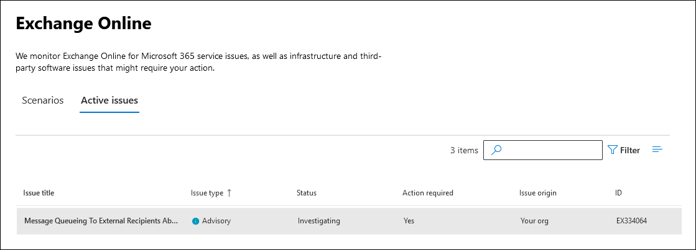
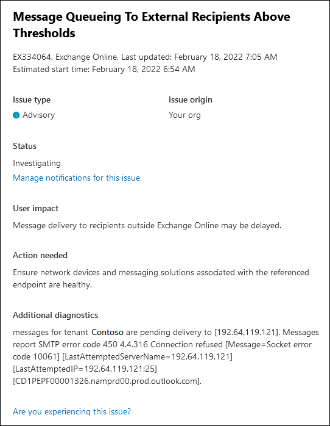

# Messages Pending Delivery to External Recipients Outside of Exchange Online

This advisory informs you of mail queuing to external recipients outside of Exchange Online. Many of these advisories require actions outside of Microsoft and provide administrators with the information needed to remediate.

These advisories are displayed in the Microsoft 365 admin center. To view these advisories, go to **Health** > <a href="https://go.microsoft.com/fwlink/p/?linkid=842900" target="_blank">**Service health**</a> > **Exchange Online** and then select the **Active issues** tab. The name for these service alerts is "Message Queueing to External Recipients Above Thresholds".

When you double-click the service alert, a flyout page similar to the following is displayed.

## What do these service advisories indicate?

This service advisory informs you of messages destined to recipients outside Exchange Online might be delayed. Queueing might be caused by your on-premises environment or third-party messaging\journaling solution. Reasons for queueing might be, but aren't limited to:

- DNS changes

- Excessive sending rates

- MTA\journaling solutions with low to no free disk space  

- Certificate issues

Each service advisory contains high level recommendations for administrators in remediating the issue. We also provide the number of messages queued at the time of alert, the domain where the messages are queued to, and the SMTP error code associated with most messages.

For more information for determining the root cause for these service alerts, see [Mail flow intelligence in Exchange Online](../security/office-365-security/connectors-mail-flow-intelligence.md). This article also includes suggested actions to fix the root cause.

> [!NOTE]
> As Microsoft cannot account for every SMTP error code provided by third-party vendors, administrators may be required to investigate these errors codes specific to their Message Transfer Agent (MTA) or journaling solutions.

## More information

If your organization has recently created or changed mail flow connectors in your on-premises or Exchange Online organization, see the following articles for more information.

- [Queued messages report in the new EAC in Exchange Online](/exchange/monitoring/mail-flow-reports/mfr-queued-messages-report#queues)

- [Mail flow insights in the EAC](/exchange/monitoring/mail-flow-insights/mail-flow-insights)

- [Trace an email message in Exchange Online](/exchange/monitoring/trace-an-email-message/trace-an-email-message)

- [Configure mail flow using connectors in Exchange Online](/exchange/mail-flow-best-practices/use-connectors-to-configure-mail-flow/use-connectors-to-configure-mail-flow)

- [Set up connectors to route mail](/exchange/mail-flow-best-practices/use-connectors-to-configure-mail-flow/set-up-connectors-to-route-mail)

- [Mail flow best practices](/exchange/mail-flow-best-practices/mail-flow-best-practices)

- [Mail flow reports in the EAC](/exchange/monitoring/mail-flow-reports/mail-flow-reports)

- [Queued messages report in the EAC](/exchange/monitoring/mail-flow-reports/mfr-queued-messages-report)
