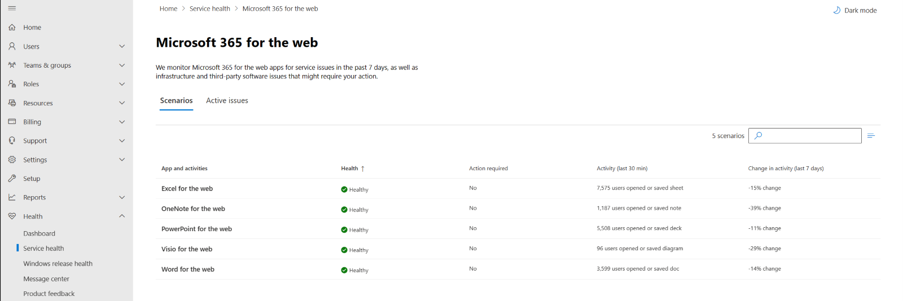
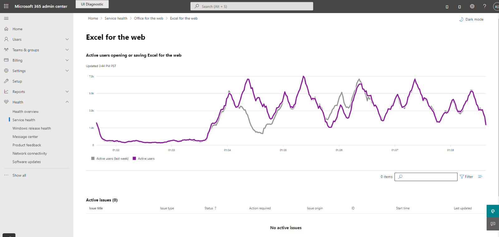
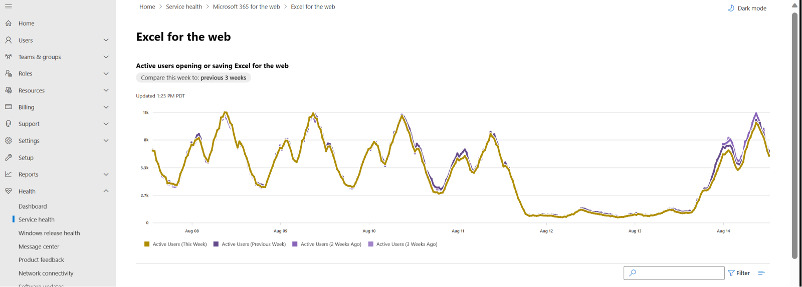

# Microsoft 365 for the web monitoring

You can use Microsoft 365 for the web monitoring in the [Microsoft 365 admin center](https://go.microsoft.com/fwlink/p/?linkid=2024339) to monitor the health of the Microsoft 365 for the web service for your organization's Microsoft 365 subscription. Microsoft 365 for the web monitoring provides you with information about incidents and advisories related to any issue detected in the Microsoft 365 infrastructure that Microsoft owns for providing regular updates and resolving the issue. For example, users cannot open or save Excel for the web application because of issues with Excel or the Microsoft 365 cloud infrastructure. 

To go to the **Service health** dashboard in the Microsoft 365 admin center, select **Health > Service health**. 

Issues in your organization are identified and used by organizational-level monitoring. The value in the **Health** column under **Microsoft service health** indicates that the service is healthy or has advisories or incidents based on the cloud services that Microsoft maintains. 

Here’s an example of the Microsoft 365 for the web monitoring page in the Microsoft 365 admin center that shows the health of organization-level scenarios available by going to **Health > Service health > Microsoft 365 for the web**. 

 

 

 

With the **Microsoft 365 for the web** monitoring page, you can see whether the Microsoft 365 for the web service is healthy or not and whether there are any associated incidents or advisories for any underlying Microsoft 365 for the web apps. With Microsoft 365 for the web monitoring, you can look at the service health for specific app scenarios and view near real-time signals to determine the impact by organization-level scenario. 

 

## Organization-level scenarios 

Microsoft 365 for the web monitoring supports the following scenarios: 

- **Word for the web**: View the health for “Document Open” and “Document Save” scenarios. 

- **Excel for the web**: View the health for “Sheet Open” and “Sheet Save” scenarios. 

- **PowerPoint for the web**: View the health for Deck Open” and “Deck Save” scenarios. 

- **OneNote for the web**: View the health for “Note Open” and “Note Save” scenarios. 

- **Visio for the web**: View the health for “Diagram Open” and “Diagram Save” scenarios. 

Detailed views for each of these scenarios show the near real-time trend for the past seven days with the 60-minute aggregate compared with the previous week. 

 

 

## Send us feedback 

Use the **Give feedback** option available on every page of the Microsoft 365 admin center. 

 
