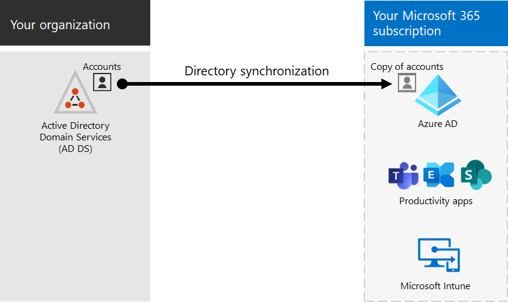
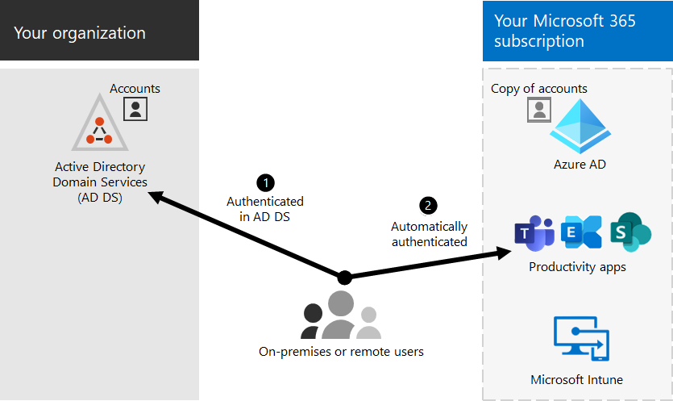

# Microsoft 365 integration with on-premises environments

*This article applies to both Microsoft 365 Enterprise and Office 365 Enterprise.*

You can integrate Microsoft 365 with your existing on-premises Active Directory Domain Services (AD DS) and with on-premises installations of Exchange Server, Skype for Business Server 2015, or SharePoint Server.
  
- When you integrate AD DS, you can synchronize and manage user accounts for both environments. You can also add _password hash synchronization_ (PHS) or _single sign-on_ (SSO) so users can sign in both environments with their on-premises credentials.
- When you integrate with on-premises server products, you create a hybrid environment. A hybrid environment can help as you migrate users or information to Microsoft 365, or you can continue to have some users or some information on-premises and some in the cloud. For more information about hybrid environments, see [hybrid cloud](../solutions/cloud-architecture-models.md#hybrid).

You can also use the Microsoft Entra advisors for customized setup guidance in the Microsoft 365 admin center (you must be signed in to Microsoft 365):

- [Microsoft Entra setup guide](https://aka.ms/aadpguidance)
- [Sync users from your org's directory](https://aka.ms/aadconnectpwsync)
- [Active Directory Federation Services (AD FS) deployment advisor](https://aka.ms/adfsguidance)

## Before you begin

Before you integrate Microsoft 365 and an on-premises environment, you also need to do [network planning and performance tuning](network-planning-and-performance.md). You want to understand the available [identity models](deploy-identity-solution-identity-model.md).

See [manage Microsoft 365 accounts](manage-microsoft-365-accounts.md) for a list of tools you can use to manage Microsoft 365 user accounts.
  
## Integrate Microsoft 365 with AD DS

If you have existing user accounts in AD DS, you don't want to re-create all of those accounts in Microsoft 365 and risk introducing differences or errors between the environments. Directory synchronization helps you mirror those accounts between your on-premises and online environments. With directory synchronization, your users don't have to remember new information for each environment, and you don't have to create or update accounts twice. You need to [prepare your on-premises directory](prepare-for-directory-synchronization.md) for directory synchronization.
  

  
If you want users to be able to sign in to Microsoft 365 with their on-premises credentials, you can also configure SSO. With SSO, Microsoft 365 is configured to trust the on-premises environment for user authentication.
  

### Directory synchronization with or without password hash synchronization or pass-through authentication (PTA)

A user signs in to their on-premises environment with their user account (domain\username). When they go to Microsoft 365, they must sign in again with their work or school account (user@domain.com). The user name is the same in both environments. When you add PHS or PTA, the user has the same password for both environments.  The user has to provide those credentials again when logging on to Microsoft 365. Directory synchronization with PHS is the most commonly used directory synchronization.

To set up directory synchronization, use Microsoft Entra Connect. For instructions, see [Set up directory synchronization for Microsoft 365](set-up-directory-synchronization.md) and [Microsoft Entra Connect with express settings](/azure/active-directory/hybrid/how-to-connect-install-express).

Learn more about [preparing for directory synchronization to Microsoft 365](prepare-for-directory-synchronization.md).

### Directory synchronization with SSO

A user signs in to their on-premises environment with their user account. When they go to Microsoft 365, they're either logged on automatically, or they sign in using the same credentials they use for their on-premises environment (domain\username).

To set up SSO, you also use Microsoft Entra Connect. For instructions, see [Custom installation of Microsoft Entra Connect](/azure/active-directory/hybrid/how-to-connect-install-custom).

For more information, see [single sign-on](/azure/active-directory/manage-apps/what-is-single-sign-on).

## Microsoft Entra Connect

Microsoft Entra Connect replaces older versions of identity integration tools such as DirSync and Azure AD Sync. If you want to update from Azure Active Directory Sync to Microsoft Entra Connect, see [the upgrade instructions](/azure/active-directory/hybrid/how-to-dirsync-upgrade-get-started). 

## See also

[Microsoft 365 Enterprise overview](microsoft-365-overview.md)
