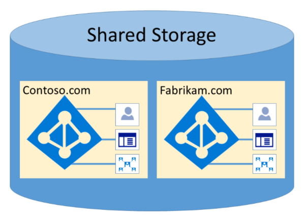

# Microsoft 365 Isolation and Access Control in Azure Active Directory

Azure Active Directory (Azure AD) was designed to host multiple tenants in a highly secure way through logical data isolation. Access to Azure AD is gated by an authorization layer. Azure AD isolates customers using tenant containers as security boundaries to safeguard a customer's content so that the content cannot be accessed or compromised by co-tenants. Three checks are performed by Azure AD's authorization layer:

- Is the principal enabled for access to Azure AD tenant?
- Is the principal enabled for access to data in this tenant?
- Is the principal's role in this tenant authorized for the type of data access requested?

No application, user, server, or service can access Azure AD without the proper authentication and token or certificate. Requests are rejected if they are not accompanied by proper credentials.

Effectively, Azure AD hosts each tenant in its own protected container, with policies and permissions to and within the container solely owned and managed by the tenant.
 

The concept of tenant containers is deeply ingrained in the directory service at all layers, from portals all the way to persistent storage. Even when multiple Azure AD tenant metadata is stored on the same physical disk, there is no relationship between the containers other than what is defined by the directory service, which in turn is dictated by the tenant administrator. There can be no direct connections to Azure AD storage from any requesting application or service without first going through the authorization layer.

In the example below, Contoso and Fabrikam both have separate, dedicated containers, and even though those containers may share some of the same underlying infrastructure, such as servers and storage, they remain separate and isolated from each other, and gated by layers of authorization and access control.
 

In addition, there are no application components that can execute from within Azure AD, and it is not possible for one tenant to forcibly breach the integrity of another tenant, access encryption keys of another tenant, or read raw data from the server.

By default, Azure AD disallows all operations issued by identities in other tenants. Each tenant is logically isolated within Azure AD through claims-based access controls. Reads and writes of directory data are scoped to tenant containers, and gated by an internal abstraction layer and a role-based access control (RBAC) layer, which together enforce the tenant as the security boundary. Every directory data access request is processed by these layers and every access request in Microsoft 365 is policed by the logic above.

Azure AD has North America, U.S. Government, European Union, Germany, and World Wide partitions. A tenant exists in a single partition, and partitions can contain multiple tenants. Partition information is abstracted away from users. A given partition (including all the tenants within it) is replicated to multiple datacenters. The partition for a tenant is chosen based on properties of the tenant (e.g., the country code). Secrets and other sensitive information in each partition is encrypted with a dedicated key. The keys are generated automatically when a new partition is created.

Azure AD system functionalities are a unique instance to each user session. In addition, Azure AD uses encryption technologies to provide isolation of shared system resources at the network level to prevent unauthorized and unintended transfer of information.
