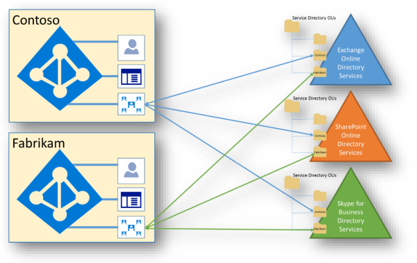

# Isolation and Access Control in Microsoft 365

Azure Active Directory (Azure AD) and Microsoft 365 use a highly complex data model that includes tens of services, hundreds of entities, thousands of relationships, and tens of thousands of attributes. At a high level, Azure AD and the service directories are the containers of tenants and recipients kept in sync using state-based replication protocols. In addition to the directory information held within Azure AD, each of the service workloads have their own directory services infrastructure.
 

Within this model, there’s no single source of directory data. Specific systems own individual pieces of data, but no single system holds all the data. Microsoft 365 services cooperate with Azure AD in this data model. Azure AD is the "system of truth" for shared data, which is typically small and static data used by every service. The federated model used within Microsoft 365 and Azure AD provides the shared view of the data.

Microsoft 365 uses both physical storage and Azure cloud storage. Exchange Online (including Exchange Online Protection) and Skype for Business use their own storage for customer data. SharePoint Online uses both SQL Server storage and Azure Storage, hence the need for extra isolation of customer data at the storage level.

## Exchange Online

Exchange Online stores customer data within mailboxes. Mailboxes are hosted within Extensible Storage Engine (ESE) databases called mailbox databases. This includes user mailboxes, linked mailboxes, shared mailboxes, and public folder mailboxes. User mailboxes include saved Skype for Business content, such as conversation histories.

User mailbox content includes:

- Emails and email attachments
- Calendaring and free/busy information
- Contacts
- Tasks
- Notes
- Groups
- Inference data

Each mailbox database within Exchange Online contains mailboxes from multiple tenants. An authorization code secures each mailbox, including within a tenancy. By default, only the assigned user has access to a mailbox. The access control list (ACL) that secures a mailbox contains an identity authenticated by Azure AD at the tenant level. The mailboxes for each tenant are limited to identities authenticated against the tenant's authentication provider, which includes only users from that tenant. Content in tenant A can’t in any way be obtained by users in tenant B, unless explicitly approved by tenant A.

## Skype for Business

Skype for Business stores data in various places:

- User and account information, which includes connection endpoints, tenant IDs, dial plans, roaming settings, presence state, contact lists, etc., is stored in the Skype for Business Active Directory servers, and in various Skype for Business database servers. Contact lists are stored in the user's Exchange Online mailbox if the user is enabled for both products, or on Skype for Business servers if the user isn’t. Skype for Business database servers isn’t partitioned per-tenant, but multi-tenancy isolation of data is enforced through Role-based access control (RBAC).
- Meeting content and uploaded-data is stored on Distributed File System (DFS) shares. This content can also be archived in Exchange Online if enabled. The DFS shares are not partitioned per-tenant. the content is secured with ACLs and multi-tenancy is enforced through RBAC.
- Call detail records, which are the activity history, such as call history, IM sessions, application sharing, IM history, etc., can also be stored in Exchange Online, but most call detail records are temporarily stored on call detail record (CDR) servers. Content isn’t partitioned per tenant, but multi-tenancy is enforced through RBAC.

## SharePoint Online

SharePoint Online has several independent mechanisms that provide data isolation. It stores objects as abstracted code within application databases. For example, when a user uploads a file to SharePoint Online, the file is disassembled, translated into application code, and stored in multiple tables across multiple databases.

If a user could gain direct access to the storage containing the data, the content isn’t interpretable to a human or any system other than SharePoint Online. These mechanisms include security access control and properties. All SharePoint Online resources are secured by the authorization code and RBAC policy, including within a tenancy. The access control list (ACL) that secures a resource contains an identity authenticated at the tenant level. SharePoint Online data for a tenant is limited to identities authenticated by the authentication provider for the tenant.

In addition to the ACLs, a tenant level property that specifies the authentication provider (which is the tenant-specific Azure AD), is written once and can’t be changed once set. Once the authentication provider tenant property has been set for a tenant, it cannot be changed using any APIs exposed to a tenant.

A unique *SubscriptionId* is used for each tenant. All customer sites are owned by a tenant and assigned a *SubscriptionId* unique to the tenant. The *SubscriptionId* property on a site is written once and is permanent. Once assigned to a tenant, a site can’t be moved to a different tenant. The *SubscriptionId* is the key used to create the security scope for the authentication provider and is tied to the tenant.

SharePoint Online uses SQL Server and Azure Storage for content metadata storage. The partition key for the content store is *SiteId* in SQL. When running a SQL query, SharePoint Online uses a *SiteId* verified as part of a tenant-level *SubscriptionId* check.

SharePoint Online stores encrypted file content in Microsoft Azure blobs. Each SharePoint Online farm has its own Microsoft Azure account and all the blobs saved in Azure are encrypted individually with a key stored in the SQL content store. The encryption key protected in code by the authorization layer and not exposed directly to the end user. SharePoint Online has real-time monitoring to detect when an HTTP request reads or writes data for more than one tenant. The request identity *SubscriptionId* is tracked against the *SubscriptionId* of the accessed resource. Requests to access resources of more than one tenant should never happen by end users. Service requests in a multi-tenant environment are the only exception. For example, the search crawler pulls content changes for an entire database all at once. This usually involves querying sites of more than one tenant in a single service request, which is done for efficiency reasons.

## Teams

Your Teams data is stored differently, depending on the content type. 

Check out the [Ignite breakout session on Microsoft Teams architecture](https://channel9.msdn.com/Events/Ignite/Microsoft-Ignite-Orlando-2017/BRK3071) for an in-depth discussion.

### Core Teams customer data

If your tenant is provisioned in Australia, Canada, the European Union, France, Germany, India, Japan, South Africa, South Korea, Switzerland (which includes Liechtenstein), the United Arab Emirates, the United Kingdom, or the United States, Microsoft stores the following customer data at rest only within that location:

- Teams chats, team and channel conversations, images, voicemail messages, and contacts.
- SharePoint Online site content and the files stored within that site.
- Files uploaded to OneDrive for work or school.

#### Chat, channel messages, team structure

Every team in Teams is backed by a Microsoft 365 Group and its SharePoint site and Exchange mailbox. Private chats (including group chats), messages sent as part of a conversation in a channel, and the structure of teams and channels are stored in a chat service running in Azure. The data is also stored in a hidden folder in the user and group mailboxes to enable Information Protection features.

#### Voicemail and contacts

Voicemails are stored in Exchange. Contacts are stored in Exchange-based cloud data store. Exchange and the Exchange-based cloud store already provide data residency in each of the worldwide datacenter geos. For all teams, voicemail and contacts are stored in-country for Australia, Canada, France, Germany, India, Japan, the United Arab Emirates, the United Kingdom, South Africa, South Korea, Switzerland (which includes Liechtenstein), and the United States. For all other countries/regions, files are stored in the US, Europe, or Asia-Pacific location based on tenant affinity.

#### Images and media

Media used in chats (except for Giphy GIFs that aren't stored but are a reference link to the original Giphy service URL, Giphy is a non-Microsoft service) is stored in an Azure-based media service that is deployed to the same locations as the chat service.

#### Files

Files (including OneNote and Wiki) that somebody shares in a channel are stored in the team’s SharePoint site. Files shared in a private chat or a chat during a meeting or call are uploaded and stored in the OneDrive for work or school account of the user who shares the file. Exchange, SharePoint, and OneDrive already provide data residency in each of the worldwide datacenter geos. So, for existing customers, all files, OneNote notebooks, Teams wiki content, and mailboxes that are part of the Teams experience are already stored in the location based on your tenant affinity. Files are stored in-country for Australia, Canada, France, Germany, India, Japan, the United Arab Emirates, the United Kingdom, South Africa, South Korea, and Switzerland (which includes Liechtenstein). For all other countries/regions, files are stored in the US, Europe, or Asia Pacific location based on tenant affinity.
