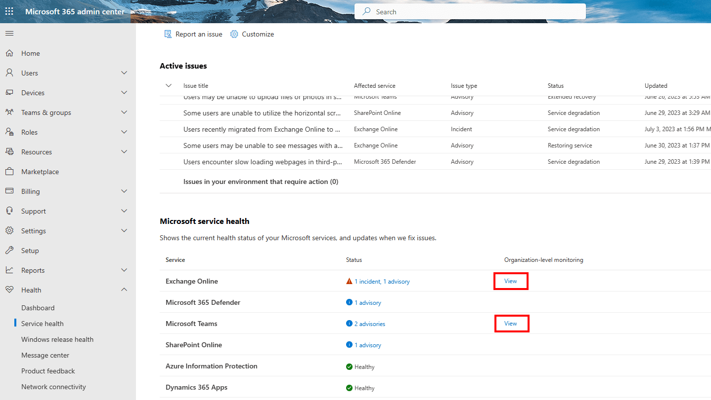
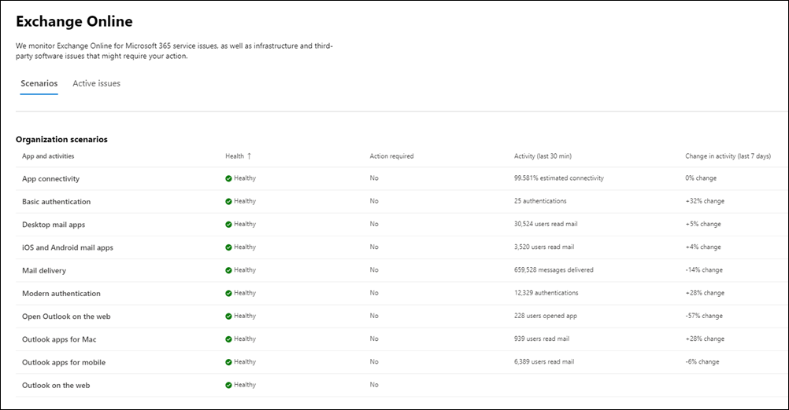
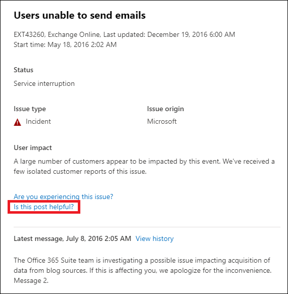

# Learn about Microsoft 365 monitoring

You can use dashboards in the [Microsoft 365 admin center](https://go.microsoft.com/fwlink/p/?linkid=2024339) to monitor the health of various Microsoft services for your organization's Microsoft 365 subscription. This capability began with Exchange Online and has been expanded to other Microsoft services such as Microsoft Teams and Microsoft 365 Apps, with more services being added in the future.

Microsoft 365 Monitoring increases observability and minimizes downtime through providing near real-time user telemetry data with enriched alerts in the Microsoft 365 admin center's Service Health dashboard.

Monitoring provides you with information about incidents and advisories that are collected in these categories:

- **Infrastructure**. Issue is detected in the Microsoft 365 infrastructure that Microsoft owns for providing regular updates and resolving the issue. For example, users can't access Exchange Online because of issues with Exchange or other Microsoft 365 cloud infrastructure.

- **Third-party infrastructure**. Issue is detected in third-party infrastructure on which your organization has taken a dependency and requires action from your organization for resolution. For example, user authentication transactions are getting throttled by a third-party security token service (STS) provider that prevents users from connecting to Exchange Online.

- **Customer infrastructure**. Issue is detected in your organization's infrastructure and requires action from your organization for resolution. For example, users can't access Exchange Online because they are unable to obtain an authentication token from STS provider hosted by your organization because of an expired certificate.

Here's an example of the **Service health** page in the Microsoft 365 admin center, which is available at **Health** > **Service health** for organization scenarios and [priority account](../admin/setup/priority-accounts.md) scenarios.

If Microsoft 365 monitoring discovers issues that need your attention, these will be show under the **Issues in your environment that require action** in the Active Issues section of the page.

To access detailed monitoring pages for specific services, select **View** under **Organizational-level monitoring** on the service health page.

Here's an example of the Exchange Online monitoring page in the Microsoft 365 admin center that shows the health of organization-level and priority account scenarios available from **Health** > **Service health** > **Exchange Online**.

With the scenario list page, you can see whether the Microsoft service is healthy or not and whether there are any associated incidents or advisories. For example, with Exchange Online monitoring, you can look at the service health for specific email scenarios and view near real-time signals to determine the impact by organization-level scenario. You can also see health of priority account scenarios, if available.

## Requirements for monitoring

This preview is enabled for customers who meet the following requirements:

- Your organization needs to have a license count of at least 5,000 from one or a combination of these products: Office 365 E3, Microsoft 365 E3, Office 365 E5, or Microsoft 365 E5.

   For example, your organization can have 3,000 Office 365 E3 licenses and 2,500 Microsoft 365 E5, for a total of 5,500 licenses from the qualifying products.

- Your organization needs to have at least 50 monthly active users for one or more core Microsoft 365 services, which include Microsoft Teams, OneDrive for Business, SharePoint Online, Exchange Online, and Office apps.

- Any role with Service Health Dashboard level permissions can access Exchange Online Monitoring. For more information, see [How to check Microsoft 365 service health](view-service-health.md).

## Additional monitoring for Microsoft services

Service-specific monitoring is also enable for the following Microsoft services. Select the corresponding link to learn more about monitoring for that service.

- [Exchange Online](microsoft-365-exchange-monitoring.md)

- [Microsoft 365 Apps](microsoft-365-apps-monitoring.md)

- [Microsoft Teams](microsoft-365-teams-monitoring.md)

## Send us feedback

There are two ways you can provide feedback:

- Use the **Give feedback** option available on every page of the Microsoft 365 admin center.

- Submit feedback using the **Is this post helpful? link for a specific incident or advisory.

  

## Frequently asked questions

### 1. Why don't I see "view" link under Organizational monitoring column in the Microsoft 365 admin center inside Service Health?

First, make sure you've enabled the new admin center on the **Home** page of the [Microsoft 365 admin center](https://go.microsoft.com/fwlink/p/?linkid=2024339).

Then make sure you meet both of the following requirements:

- Your organization needs to have a license count of at least 5,000, from one or a combination of these products: Office 365 E3, Microsoft 365 E3, Office 365 E5, or Microsoft 365 E5.

- Your organization needs to have at least 50 monthly active users for one or more core Microsoft 365 services, which include Microsoft Teams, OneDrive for Business, SharePoint Online, Exchange Online, and Office apps.

If the license count for your organization falls below 5,000 users and the monthly active users falls below 50 users in the core services, Exchange Online monitoring won't be enabled until these requirements are met.

### 2. Will there be other monitoring scenarios for other services in future?

Yes. We have a few more services in public preview now. We'll continue to work on expanding the footprint to other services.

### 3. What is the plan for general availability of this experience?

Microsoft's plan is to collect your feedback on the preview experience and then define our plan for general availability.

### 4. Is this a free (included) or paid (extra) feature?

Microsoft 365 Monitoring features are in preview for eligible customers. While in preview, this feature is available at no additional charge for customers that meet the eligibility requirements.

### 5. How do I provide feedback?

For general feedback, use the **Give feedback** icon on the bottom-right corner of the monitoring page.

For feedback on incidents or advisories, use the **Is this post helpful? link.

### 6. Are there any privacy concerns?

Monitoring focuses on service metadata and user content isn't monitored.
