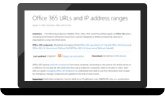
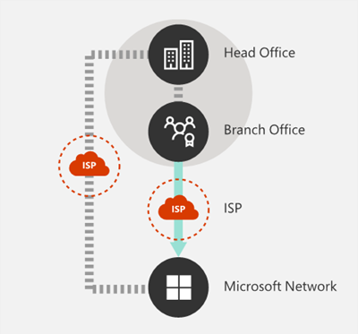
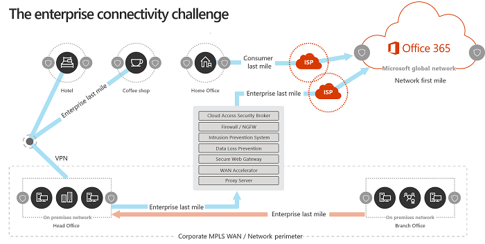
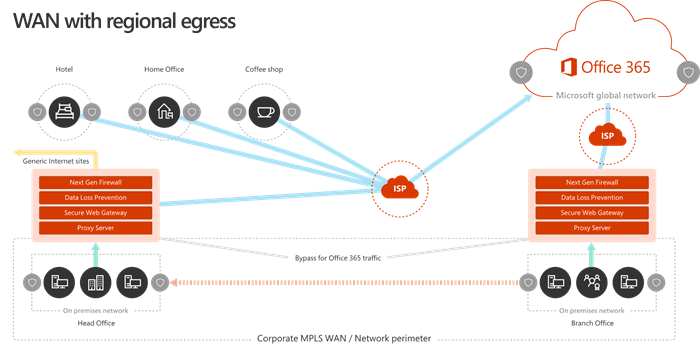
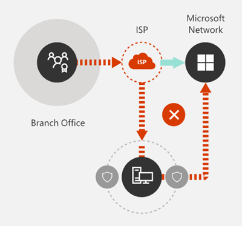
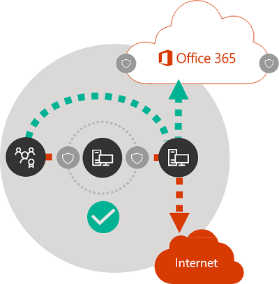

# Microsoft 365 network connectivity principles

*This article applies to both Microsoft 365 Enterprise and Office 365 Enterprise.*

Before you begin planning your network for Microsoft 365 network connectivity, it's important to understand the connectivity principles for securely managing Microsoft 365 traffic and getting the best possible performance. This article helps you understand the most recent guidance for securely optimizing Microsoft 365 network connectivity.
  
Traditional enterprise networks are designed primarily to provide users access to applications and data hosted in company operated datacenters with strong perimeter security. The traditional model assumes that users will access applications and data from inside the corporate network perimeter, over WAN links from branch offices, or remotely over VPN connections.
  
Adoption of SaaS applications like Microsoft 365 moves some combination of services and data outside the network perimeter. Without optimization, traffic between users and SaaS applications is subject to latency introduced by packet inspection, network hairpins, inadvertent connections to geographically distant endpoints and other factors. You can ensure the best Microsoft 365 performance and reliability by understanding and implementing key optimization guidelines.
  
In this article, you'll learn about:
  
- [Microsoft 365 architecture](microsoft-365-network-connectivity-principles.md#BKMK_Architecture) as it applies to customer connectivity to the cloud
- Updated [Microsoft 365 connectivity principles](microsoft-365-network-connectivity-principles.md#BKMK_Principles) and strategies for optimizing network traffic and the end-user experience
- The [Office 365 Endpoints web service](microsoft-365-network-connectivity-principles.md#BKMK_WebSvc), which allows network administrators to consume a structured list of endpoints for use in network optimization
- Guidance for [optimizing connectivity to Microsoft 365 services](#BKMK_OptmizeConnectivity)
- [Comparing network perimeter security with endpoint security](microsoft-365-network-connectivity-principles.md#BKMK_SecurityComparison)
- [Incremental optimization](microsoft-365-network-connectivity-principles.md#BKMK_IncOpt) options for Microsoft 365 traffic
- The [Microsoft 365 connectivity test](https://aka.ms/netonboard), a new tool for testing basic connectivity to Microsoft 365

## Microsoft 365 architecture

Microsoft 365 is a distributed Software-as-a-Service (SaaS) cloud that provides productivity and collaboration scenarios through a diverse set of micro-services and applications. Examples include Exchange Online, SharePoint Online, Microsoft Teams, Exchange Online Protection, Office in a browser, and many others. While specific Microsoft 365 applications might have their unique features as it applies to customer network and connectivity to the cloud, they all share some key principals, goals, and architecture patterns. These principles and architecture patterns for connectivity are typical for many other SaaS clouds. At the same time, they're different from the typical deployment models of Platform-as-a-Service and Infrastructure-as-a-Service clouds, such as Microsoft Azure.

One of the most significant architectural features of Microsoft 365 (that is often missed or misinterpreted by network architects) is that it's a truly global distributed service, in the context of how users connect to it. The location of the target Microsoft 365 tenant is important to understand the locality of where customer data is stored within the cloud. However, the user experience with Microsoft 365 doesn't involve connecting directly to disks containing the data. The user experience with Microsoft 365 (including performance, reliability, and other important quality characteristics) involves connectivity through highly distributed service front doors that are scaled out across hundreds of Microsoft locations worldwide. In most cases, the best user experience is achieved by allowing the customer network to route user requests to the closest Microsoft 365 service entry point. This is preferable rather than connecting to Microsoft 365 through an egress point in a central location or region.
  
For most customers, Microsoft 365 users are distributed across many locations. To achieve the best results, the principles outlined in this document should be looked at from the scale-out (not scale-up) point of view. While also focusing on optimizing connectivity to the nearest point of presence in the Microsoft Global Network, not to the geographic location of the Microsoft 365 tenant. In essence, this means that even though Microsoft 365 tenant data might be stored in a specific geographic location, Microsoft 365 experience for that tenant remains distributed. It can be present in very close (network) proximity to every end-user location that the tenant has.
  
## Microsoft 365 connectivity principles

Microsoft recommends the following principles to achieve optimal Microsoft 365 connectivity and performance. Use these Microsoft 365 connectivity principles to manage your traffic and get the best performance when connecting to Microsoft 365.
  
The primary goal in the network design should be to minimize latency by reducing the round-trip time (RTT) from your network into the Microsoft Global Network, Microsoft's public network backbone that interconnects all of Microsoft's datacenters with low latency and cloud application entry points spread around the world. You can learn more about the Microsoft Global Network at [How Microsoft builds its fast and reliable global network](https://azure.microsoft.com/blog/how-microsoft-builds-its-fast-and-reliable-global-network/).
  

### Identify and differentiate Microsoft 365 traffic

  
Identifying Microsoft 365 network traffic is the first step in being able to differentiate that traffic from generic Internet-bound network traffic. Microsoft 365 connectivity can be optimized by implementing a combination of approaches like network route optimization, firewall rules, browser proxy settings. Additionally, bypassing of network inspection devices for certain endpoints is also beneficial.
  
For more information on Microsoft 365 optimization methods, see the [optimizing connectivity to Microsoft 365 services](#BKMK_OptmizeConnectivity) section.
  
Microsoft now publishes all Microsoft 365 endpoints as a web service and provides guidance on how best to use this data. For more information on how to fetch and work with Microsoft 365 endpoints, see the article [Office 365 URLs and IP address ranges](https://support.office.com/article/office-365-urls-and-ip-address-ranges-8548a211-3fe7-47cb-abb1-355ea5aa88a2?ui=en-US&amp;rs=en-US&amp;ad=US).
  

### Egress network connections locally

  
Local DNS and Internet egress is of critical importance for reducing connection latency and ensuring that user connections are made to the nearest point of entry to Microsoft 365 services. In a complex network topology, it's important to implement both local DNS and local Internet egress together. For more information about how Microsoft 365 routes client connections to the nearest point of entry, see the article [Client Connectivity](https://support.office.com/article/client-connectivity-4232abcf-4ae5-43aa-bfa1-9a078a99c78b).
  
Prior to the advent of cloud services such as Microsoft 365, end-user Internet connectivity as a design factor in network architecture was relatively simple. When Internet services and web sites are distributed around the globe, latency between corporate egress points and any given destination endpoint is largely a function of geographical distance.
  
In a traditional network architecture, all outbound Internet connections traverse the corporate network, and egress from a central location. As Microsoft's cloud offerings have matured, a distributed Internet-facing network architecture has become critical for supporting latency-sensitive cloud services. The Microsoft Global Network was designed to accommodate latency requirements with the Distributed Service Front Door infrastructure, a dynamic fabric of global entry points that routes incoming cloud service connections to the closest entry point. This is intended to reduce the length of the "last mile" for Microsoft cloud customers by effectively shortening the route between the customer and the cloud.
  
Enterprise WANs are often designed to backhaul network traffic to a central company head office for inspection before egress to the Internet, usually through one or more proxy servers. The following diagram illustrates such a network topology.
  

  
Because Microsoft 365 runs on the Microsoft Global Network, which includes front-end servers around the world, there's often a front-end server close to the user's location. By providing local Internet egress and by configuring internal DNS servers to provide local name resolution for Microsoft 365 endpoints, network traffic destined for Microsoft 365 can connect to Microsoft 365 front end servers as close as possible to the user. The following diagram shows an example of a network topology that allows users connecting from main office, branch office, and remote locations to follow the shortest route to the closest Microsoft 365 entry point.
  

  
Shortening the network path to Microsoft 365 entry points in this way can improve connectivity performance and the end-user experience in Microsoft 365. It can also help to reduce the effect of future changes to the network architecture on Microsoft 365 performance and reliability.
  
Also, DNS requests can introduce latency if the responding DNS server is distant or busy. You can minimize name resolution latency by provisioning local DNS servers in branch locations and making sure they're configured to cache DNS records appropriately.
  
While regional egress can work well for Microsoft 365, the optimum connectivity model would be to always provide network egress at the user's location, regardless of whether it is on the corporate network or remote locations such as homes, hotels, coffee shops, and airports. This local direct egress model is represented in the following diagram.
  

  
Enterprises who have adopted Microsoft 365 can take advantage of the Microsoft Global Network's Distributed Service Front Door architecture by ensuring that user connections to Microsoft 365 take the shortest possible route to the nearest Microsoft Global Network entry point. The local egress network architecture does this by allowing Microsoft 365 traffic to be routed over the nearest egress, regardless of user location.
  
The local egress architecture has the following benefits over the traditional model:
  
- Provides optimal Microsoft 365 performance by optimizing route length. end-user connections are dynamically routed to the nearest Microsoft 365 entry point by the Distributed Service Front Door infrastructure.
- Reduces the load on corporate network infrastructure by allowing local egress.
- Secures connections on both ends by using client endpoint security and cloud security features.

### Avoid network hairpins

  
As a general rule of thumb, the shortest, most direct route between user and closest Microsoft 365 endpoint offers the best performance. A network hairpin happens when WAN or VPN traffic bound for a particular destination is first directed to another intermediate location (such as security stack, cloud access broker, or cloud-based web gateway), introducing latency and potential redirection to a geographically distant endpoint. Network hairpins are also caused by routing/peering inefficiencies or suboptimal (remote) DNS lookups.
  
To ensure that Microsoft 365 connectivity isn't subject to network hairpins even in the local egress case, check whether the ISP that is used to provide Internet egress for the user location has a direct peering relationship with the Microsoft Global Network in close proximity to that location. You might also want to configure egress routing to send trusted Microsoft 365 traffic directly. This is as opposed to proxying or tunneling through a third-party cloud or cloud-based network security vendor that processes your Internet-bound traffic. Local DNS name resolution of Microsoft 365 endpoints helps to ensure that in addition to direct routing, the closest Microsoft 365 entry points are being used for user connections.
  
If you use cloud-based network or security services for your Microsoft 365 traffic, ensure that the result of the hairpin is evaluated and its effect on Microsoft 365 performance is understood. This can be done by examining the number and locations of service provider locations through which the traffic is forwarded in relationship to number of your branch offices and Microsoft Global Network peering points, quality of the network peering relationship of the service provider with your ISP and Microsoft, and the performance effect of backhauling in the service provider infrastructure.
  
Due to the large number of distributed locations with Microsoft 365 entry points and their proximity to end-users, routing Microsoft 365 traffic to any third-party network or security provider can have an adverse effect on Microsoft 365 connections if the provider network isn't configured for optimal Microsoft 365 peering.
  

### Assess bypassing proxies, traffic inspection devices, and duplicate security technologies

  
Enterprise customers should review their network security and risk reduction methods specifically for Microsoft 365 bound traffic and use Microsoft 365 security features to reduce their reliance on intrusive, performance impacting, and expensive network security technologies for Microsoft 365 network traffic.
  
Most enterprise networks enforce network security for Internet traffic using technologies like proxies, TLS inspection, packet inspection, and data loss prevention systems. These technologies provide important risk mitigation for generic Internet requests but can dramatically reduce performance, scalability, and the quality of end user experience when applied to Microsoft 365 endpoints.
  

#### Office 365 Endpoints web service

Microsoft 365 administrators can use a script or REST call to consume a structured list of endpoints from the Office 365 Endpoints web service and update the configurations of perimeter firewalls and other network devices. This ensures that traffic bound for Microsoft 365 is identified, treated appropriately and managed differently from network traffic bound for generic and often unknown Internet web sites. For more information on how to use the Office 365 Endpoints web service, see the article [Office 365 URLs and IP address ranges](https://support.office.com/article/office-365-urls-and-ip-address-ranges-8548a211-3fe7-47cb-abb1-355ea5aa88a2?ui=en-US&amp;rs=en-US&amp;ad=US).
  
#### PAC (Proxy Automatic Configuration) scripts

Microsoft 365 administrators can create PAC (Proxy Automatic Configuration) scripts that can be delivered to user computers via WPAD or GPO. PAC scripts can be used to bypass proxies for Microsoft 365 requests from WAN or VPN users, allowing Microsoft 365 traffic to use direct Internet connections rather than traversing the corporate network.
  
#### Microsoft 365 security features

Microsoft is transparent about datacenter security, operational security, and risk reduction around Microsoft 365 servers and the network endpoints that they represent. Microsoft 365 built-in security features are available for reducing network security risk, such as Microsoft Purview Data Loss Prevention, antivirus, Multifactor Authentication, Customer Lockbox, Defender for Office 365, Microsoft 365 Threat Intelligence, Microsoft 365 Secure Score, Exchange Online Protection, and Network DDOS Security.

For more information on Microsoft datacenter and Global Network security, see the [Microsoft Trust Center](https://www.microsoft.com/trustcenter/security).
  
## Optimizing connectivity to Microsoft 365 services

Microsoft 365 services are a collection of dynamic, interdependent, and deeply integrated products, applications, and services.  When configuring and optimizing connectivity to Microsoft 365 services, it is not feasible to link specific endpoints (domains) with a few Microsoft 365 scenarios to implement allow-listing at the network level. Microsoft does not support selective allow-listing as it causes connectivity and service incidents for users. Network administrators should therefore always apply Microsoft 365 guidelines for network allow-listing and common network optimizations to the full set of required network endpoints (domains) that are [published](microsoft-365-ip-web-service.md) and updated regularly. While we are simplifying Microsoft 365 network endpoints in response to customer feedback, network administrators should be aware of the following core patterns in the existing set of endpoints today: 
- Where possible, the published domain endpoints will include wildcards to significantly lower the network configuration effort for customers.
  - Microsoft 365 announced a domain consolidation initiative (cloud.microsoft), providing customers a way to simplify their network configurations and automatically accrue network optimizations for this domain to many current and future Microsoft 365 services.
  - Exclusive use of cloud.microsoft root domain  for security isolation and specific functions. This enables customer network and security teams to trust Microsoft 365 domains, while improving connectivity to those endpoints and avoiding unnecessary network security processing. 
  - Certain endpoint definitions specify unique IP prefixes corresponding to their domains. This feature supports customers with intricate network structures, enabling them to apply precise network optimizations by utilizing IP prefix details.

The following network configurations are recommended for all **“Required”** Microsoft 365 network endpoints (domains) and categories:
- Explicitly permitting Microsoft 365 network endpoints in the network devices and services that user connections go through (e.g., network perimeter security devices like proxies, firewalls, DNS, cloud-based network security solutions, etc.)
  - Bypass Microsoft 365 domains from TLS decryption, traffic interception, deep packet inspection, and network packet and content filtering. Note that many outcomes that customers are using these network technologies for in the context of untrusted/unmanaged applications can be achieved by Microsoft 365 security features natively.
  - Direct internet access should be prioritized for the Microsoft 365 domains by reducing reliance on wide area network (WAN) backhauling, avoiding network hairpins, and enabling a more efficient internet egress local to the users and directly to the Microsoft network.
  - Ensure that DNS name resolution occurs close to the network egress to ensure that connections are served through the most optimal Microsoft 365 front door.
  - Prioritize Microsoft 365 connections along the network path, ensuring capacity and quality of service for Microsoft 365 experiences.
  - Bypass traffic intermediation devices such as proxies and VPN services.

Customers with complex network topologies, implementing network optimizations like custom routing, IP based proxy bypass, and split tunnel VPN may require IP prefix information in addition to domains. To facilitate these customer scenarios Microsoft 365 network endpoints are grouped into categories to prioritize and ease the configuration of these additional network optimizations. Network endpoints classified under the **“Optimize”** and **“Allow”** categories carry high traffic volumes and are sensitive to network latency and performance, and customers may want to optimize connectivity to those first. Network endpoints under the **“Optimize”** and **“Allow”** categories have IP addresses listed along with domains. Network endpoints classified under the **“Default”** category do not have IP addresses associated with them as they are more dynamic in nature and IP addresses change over time.

### Additional network considerations
When optimizing connectivity to Microsoft 365, certain network configurations may have a negative impact on Microsoft 365 availability, interoperability, performance, and user experience. Microsoft has not tested the following network scenarios with our services, and they are known to cause connectivity issues.
- TLS termination or deep packet inspection of any M365 domains with customer proxies or other types of network devices or services.
  - Blocking specific protocols or protocol versions such as QUIC, WebSocket’s, etc. by intermediate network infrastructure or service. 
  - Forcing downgrade or failover of protocols (such as UDP --> TCP, TLS1.3 --> TLS1.2 --> TLS1.1) used between client applications and Microsoft 365 services.
  - Routing connections through network infrastructure applying its own authentication such as proxy authentication.

We recommend that customers avoid using these network techniques to traffic destined to Microsoft 365 domains and bypass these for Microsoft 365 connections.

Microsoft recommends setting up an automated system to download and apply the M365 network endpoint list regularly. Please refer to [Change management for Microsoft 365 IP addresses and URLs for more information](managing-office-365-endpoints.md#change-management-for-microsoft-365-ip-addresses-and-urls). 

## Comparing network perimeter security with endpoint security

The goal of traditional network security is to harden the corporate network perimeter against intrusion and malicious exploits. As organizations adopt Microsoft 365, some network services and data are partly or completely migrated to the cloud. As for any fundamental change to network architecture, this process requires a reevaluation of network security that takes emerging factors into account:
  
- As cloud services are adopted, network services and data are distributed between on-premises datacenters and the cloud, and perimeter security is no longer adequate on its own.
- Remote users connect to corporate resources both in on-premises datacenters and in the cloud from uncontrolled locations such as homes, hotels, and coffee shops.
- Purpose-built security features are increasingly built into cloud services and can potentially supplement or replace existing security systems.

Microsoft offers a wide range of Microsoft 365 security features and provides prescriptive guidance for employing security best practices that can help you to ensure data and network security for Microsoft 365. Recommended best practices include:
  
- **Use multi-factor authentication (MFA)**
    MFA adds an extra layer of protection to a strong password strategy by requiring users to acknowledge a phone call, text message, or an app notification on their smart phone after correctly entering their password.

- **Use Microsoft Defender for Cloud Apps**
    Configure policies to track anomalous activity and act on it. Set up alerts with Microsoft Defender for Cloud Apps so that admins can review unusual or risky user activity, such as downloading large amounts of data, multiple failed sign-in attempts, or connections from an unknown or dangerous IP addresses.

- **Configure Data Loss Prevention (DLP)**
    DLP allows you to identify sensitive data and create policies that help prevent your users from accidentally or intentionally sharing the data. DLP works across Microsoft 365 including Exchange Online, SharePoint Online, and OneDrive so that your users can stay compliant without interrupting their workflow.

- **Use Customer Lockbox**
    As a Microsoft 365 admin, you can use Customer Lockbox to control how a Microsoft support engineer accesses your data during a help session. In cases where the engineer requires access to your data to troubleshoot and fix an issue, Customer Lockbox allows you to approve or reject the access request.

- **Use Secure Score**
A security analytics tool that recommends what you can do to further reduce risk. Secure Score looks at your Microsoft 365 settings and activities and compares them to a baseline established by Microsoft. You get a score based on how aligned you are with best security practices.

A holistic approach to enhanced security should include consideration of the following:
  
- Shift emphasis from perimeter security towards endpoint security by applying cloud-based and Office client security features.
  - Shrink the security perimeter to the datacenter
  - Enable equivalent trust for user devices inside the office or at remote locations
  - Focus on securing the data location and the user location
  - Managed user machines have higher trust with endpoint security
- Manage all information security holistically, not focusing solely on the perimeter
  - Redefine WAN and building perimeter network security by allowing trusted traffic to bypass security devices and separating unmanaged devices to guest Wi-Fi networks
  - Reduce network security requirements of the corporate WAN edge
  - Some network perimeter security devices such as firewalls are still required, but load is decreased
  - Ensures local egress for Microsoft 365 traffic
- Improvements can be addressed incrementally as described in the [Incremental optimization](microsoft-365-network-connectivity-principles.md#BKMK_IncOpt) section. Some optimization techniques might offer better cost/benefit ratios depending on your network architecture, and you should choose optimizations that make the most sense for your organization.

For more information on Microsoft 365 security and compliance, see the articles [Microsoft 365 security](../security/index.yml) and [Microsoft Purview](../compliance/index.yml).
  
## Incremental optimization

We have represented the ideal network connectivity model for SaaS earlier in this article, but for many large organizations with historically complex network architectures, it isn't practical to directly make all of these changes. In this section, we discuss many incremental changes that can help to improve Microsoft 365 performance and reliability.
  
The methods you'll use to optimize Microsoft 365 traffic varies depending on your network topology and the network devices you have implemented. Large enterprises with many locations and complex network security practices need to develop a strategy that includes most or all of the principles listed in the [Microsoft 365 connectivity principles](microsoft-365-network-connectivity-principles.md#BKMK_Principles) section, while smaller organizations might only need to consider one or two.
  
You can approach optimization as an incremental process, applying each method successively. The following table lists key optimization methods in order of their effect on latency and reliability for the largest number of users.
  
| Optimization method | Description | Impact |
|:-----|:-----|:-----|
|Local DNS resolution and Internet egress |Provision local DNS servers in each location and ensure that Microsoft 365 connections egress to the Internet as close as possible to the user's location. | Minimize latency     Improve reliable connectivity to the closest Microsoft 365 entry point |
|Add regional egress points |If your corporate network has multiple locations but only one egress point, add regional egress points to enable users to connect to the closest Microsoft 365 entry point. | Minimize latency     Improve reliable connectivity to the closest Microsoft 365 entry point |
|Bypass proxies and inspection devices |Configure browsers with PAC files that send Microsoft 365 requests directly to egress points.    Configure edge routers and firewalls to permit Microsoft 365 traffic without inspection. | Minimize latency     Reduce load on network devices |
|Enable direct connection for VPN users |For VPN users, enable Microsoft 365 connections to connect directly from the user's network rather than over the VPN tunnel by implementing split tunneling. | Minimize latency     Improve reliable connectivity to the closest Microsoft 365 entry point |
|Migrate from traditional WAN to SD-WAN |SD-WANs (Software Defined Wide Area Networks) simplify WAN management and improve performance by replacing traditional WAN routers with virtual appliances, similar to the virtualization of compute resources using virtual machines (VMs). | Improve performance and manageability of WAN traffic     Reduce load on network devices |

## Related articles

[Microsoft 365 Network Connectivity Overview](microsoft-365-networking-overview.md)

[Managing Office 365 endpoints](managing-office-365-endpoints.md)

[Office 365 URLs and IP address ranges](urls-and-ip-address-ranges.md)

[Office 365 IP Address and URL Web service](microsoft-365-ip-web-service.md)

[Assessing Microsoft 365 network connectivity](assessing-network-connectivity.md)

[Network planning and performance tuning for Microsoft 365](network-planning-and-performance.md)

[Office 365 performance tuning using baselines and performance history](performance-tuning-using-baselines-and-history.md)

[Performance troubleshooting plan for Office 365](performance-troubleshooting-plan.md)

[Content Delivery Networks](content-delivery-networks.md)

[Microsoft 365 connectivity test](https://aka.ms/netonboard)

[How Microsoft builds its fast and reliable global network](https://azure.microsoft.com/blog/how-microsoft-builds-its-fast-and-reliable-global-network/)

[Office 365 Networking blog](https://techcommunity.microsoft.com/t5/Office-365-Networking/bd-p/Office365Networking)
