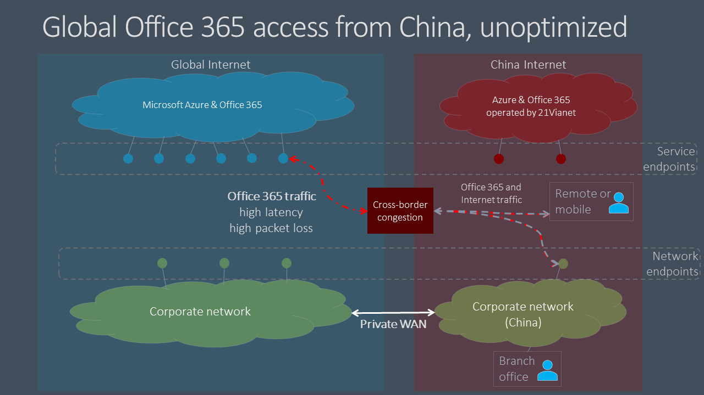
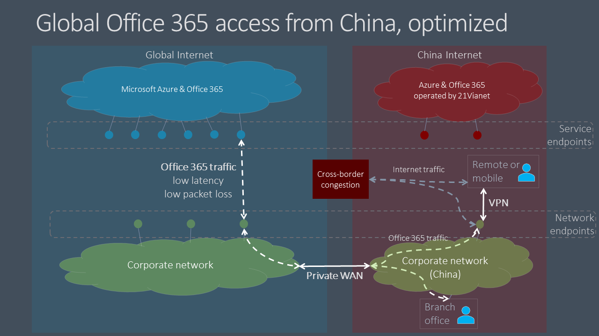

# Microsoft 365 global tenant performance optimization for China users

>[!IMPORTANT]
>This guidance is specific to usage scenarios in which **enterprise Microsoft 365 users located in China** connect to a **global Microsoft 365 tenant**. This guidance does **not** apply to tenants in Office 365 operated by 21Vianet.

For enterprises with global Microsoft 365 tenants and a corporate presence in China, Microsoft 365 client performance for China-based users can be complicated by factors unique to China Telco's Internet architecture.

China ISPs have regulated offshore connections to the global public Internet that go through perimeter devices that are prone to high-levels of cross-border network congestion. This congestion creates packet loss and latency for all Internet traffic going into and out of China.

Packet loss and latency are detrimental to the performance of network services, especially services that require large data exchanges (such as large file transfers) or requiring near real-time performance (audio and video applications).

The goal of this topic is to provide best practices for mitigating the impact of China cross-border network congestion on Microsoft 365 services. This topic does not address other common last-mile performance issues such as issues of high packet latency due to complex routing within China carriers.

## Corporate network best practices

Many enterprises with global Microsoft 365 tenants and users in China have implemented private networks that carry corporate network traffic between China office locations and offshore locations around the world. These enterprises can leverage this network infrastructure to avoid cross-border network congestion and optimize their Microsoft 365 service performance in China.

>[!IMPORTANT]
>As with all private WAN implementations, you should always consult regulatory requirements for your country and/or region to ensure that your network configuration is in compliance.

As a first step, it is crucial that you follow our benchmark network guidance at [Network planning and performance tuning for Microsoft 365](./network-planning-and-performance.md). The primary goal should be to avoid accessing global Microsoft 365 services from the Internet in China if possible.

- Leverage your existing private network to carry Microsoft 365 network traffic between China office networks and offshore locations that egress on the public Internet outside China. Almost any location outside China will provide a clear benefit. Network administrators can further optimize by egressing in areas with low-latency interconnect with the [Microsoft global network](https://docs.microsoft.com/azure/networking/microsoft-global-network). Hong Kong, Japan, and South Korea are examples.
- Configure user devices to access the corporate network over a VPN connection to allow Microsoft 365 traffic to transit the corporate network's private offshore link. Ensure that VPN clients are either not configured to use split tunneling, or that user devices are configured to ignore split tunneling for Microsoft 365 traffic. For additional information on optimizing VPN connectivity for Teams and real-time media traffic, see [this section](#optimizing-microsoft-teams-meetings-network-performance-for-users-in-china).
- Configure your network to route all Microsoft 365 traffic across your private offshore link. If you must minimize the volume of traffic on your private link, you can choose to only route endpoints in the **Optimize** category, and allow requests to **Allow** and **Default** endpoints to transit the Internet. This will improve performance and minimize bandwidth consumption by limiting optimized traffic to critical services that are most sensitive to high latency and packet loss.
- If possible, use UDP instead of TCP for live media streaming traffic, such as for Teams. UDP offers better live media streaming performance than TCP.

For information about how to selectively route Microsoft 365 traffic, see [Managing Office 365 endpoints](managing-office-365-endpoints.md). For a list of all worldwide Office 365 URLs and IP addresses, see [Office 365 URLs and IP address ranges](urls-and-ip-address-ranges.md).

## User best practices

Users in China who connect to global Microsoft 365 tenants from remote locations such as homes, coffee shops, hotels, and branch offices with no connection to enterprise networks can experience poor network performance because traffic between their devices and Microsoft 365 must transit China's congested cross-border network circuits.

If cross-border private networks and/or VPN access into the corporate network are not an option, per-user performance issues can still be mitigated by training your China-based users to follow these best practices.

- Utilize rich Office clients that support caching (e.g. Outlook, Teams, OneDrive, etc.), and avoid web-based clients. Office client caching and offline access features can dramatically reduce the impact of network congestion and latency.
- If your Microsoft 365 tenant has been configured with the _Audio Conferencing_ feature, Teams users can join meetings via the public switched telephone network (PSTN). For more information, see [Audio Conferencing in Office 365](/microsoftteams/audio-conferencing-in-office-365).
- If users experience network performance issues, they should report to their IT department for troubleshooting, and escalate to Microsoft support if trouble with Microsoft 365 services is suspected. Not all issues are caused by cross-border network performance.

## Optimizing Microsoft Teams meetings network performance for users in China  

For organizations with global Microsoft 365 tenants and a presence in China, Microsoft 365 client performance for China-based users can be complicated by factors unique to the China Internet architecture. Many companies and schools have reported good results by following this guidance. However, the scope is limited to user network locations that are under control of the IT networking setup, for example, office locations or home/mobile endpoints with VPN connectivity. Microsoft Teams calls and meetings are often used from external locations, such as home offices, mobile locations, on the road, and coffee shops. Because calls and meetings rely on real-time media traffic, these Teams experiences are particularly sensitive to network congestion.

As a result, Microsoft has partnered with telecommunications providers to carry Teams and Skype for Business Online real-time media traffic using a higher-quality, preferential network path between domestic and public internet connections in China and the Teams and Skype services in the Microsoft 365 global cloud. This capability has resulted in a more than ten-fold improvement in packet loss and other key metrics impacting your user's experience.

>[!IMPORTANT]
>Currently, these improvements do not address attending Microsoft Live Events meetings such as large broadcast or “town hall” style meetings using Teams or Microsoft Stream. To view a Live Events meeting, users in China need to use a private network or SDWAN/VPN solution. However, the network improvements will benefit users who are presenting or producing a Live Events meeting, because that experience acts as a regular Teams meeting for the producer or presenter.

### Organization network best practices for Teams meetings

You need to consider how to leverage these network improvements, given that the previous guidance to consider a private network extension to avoid cross-border network congestion. There are two general options for organization office networks:

1.	Do nothing new. Continue to follow the earlier guidance around private network bypass to avoid cross-border congestion. Teams real-time media traffic will leverage that setup, as before.
2.	Implement a split/hybrid pattern. 

  - Use the previous guidance for all traffic flagged for optimization except Teams meetings and calling real-time media traffic.

  -	Route Teams meeting and calling real-time media traffic over the public internet. See the following information for specifics on identifying the real-time media network traffic.

Sending Teams real-time media audio and video traffic over the public internet, which uses the higher quality connectivity, can result in considerable cost savings, because it is free versus paying to send that traffic over a private network. There may be similar additional benefits if users are also using SDWAN or VPN clients. Some organizations may also prefer to have more of their data traverse public internet connections as a general practice.

The same options could apply to SDWAN or VPN configurations. For example, a user is using an SDWAN or VPN to route Microsoft 365 traffic to the corporate network and then leveraging the private extension of that network to avoid cross-border congestion. The user’s SDWAN or VPN can now be configured to exclude Teams meeting and calling real-time traffic from the VPN routing. This VPN configuration is referred to as split tunneling. See [VPN split tunneling for Office 365](https://docs.microsoft.com/microsoft-365/enterprise/microsoft-365-vpn-implement-split-tunnel) for more information.

You can also continue to use your SDWAN or VPN for all Microsoft 365 traffic, including for Microsoft Teams real-time traffic. Microsoft has no recommendations on the use of SDWAN or VPN solutions.

### Home, mobile, and user network best practices for Teams meetings

Users in China can take advantage of these improvements simply by connecting to the public internet service in China with a landline or mobile connection. Teams real-time media audio and video traffic on the public internet directly benefits from improved connectivity and quality.

However, data from other Microsoft 365 services—and other traffic in Teams, such as chat or files—will not directly benefit from these improvements. Users outside the organization network may still experience poor network performance for this traffic. As discussed in this article, you can mitigate these effects by using a VPN or SDWAN. You can also have your users use rich desktop clients over web clients, which support in-app caching to mitigate network issues.

### Identifying Teams real-time media network traffic

For configuring a network device or a VPN/SDWAN setup, you need to exclude only the Teams real-time media audio and video traffic. The traffic details can be found  for ID 11 on the official list of [Office 365 URLs and IP address ranges](https://docs.microsoft.com/microsoft-365/enterprise/urls-and-ip-address-ranges#skype-for-business-online-and-microsoft-teams). All other network configurations should remain as-is.

Microsoft is continually working to improve the Microsoft 365 user experience and the performance of clients over the widest possible range of network architectures and characteristics. Visit the [Office 365 Networking Tech Community]( https://techcommunity.microsoft.com/t5/office-365-networking/bd-p/Office365Networking) to start or join a conversation, find resources, and submit feature requests and suggestions

## Related topics

[Network planning and performance tuning for Microsoft 365](./network-planning-and-performance.md)

[Microsoft 365 network connectivity principles](microsoft-365-network-connectivity-principles.md)

[Managing Office 365 endpoints](managing-office-365-endpoints.md)

[Office 365 URLs and IP address ranges](urls-and-ip-address-ranges.md)

[Microsoft global network](/azure/networking/microsoft-global-network)