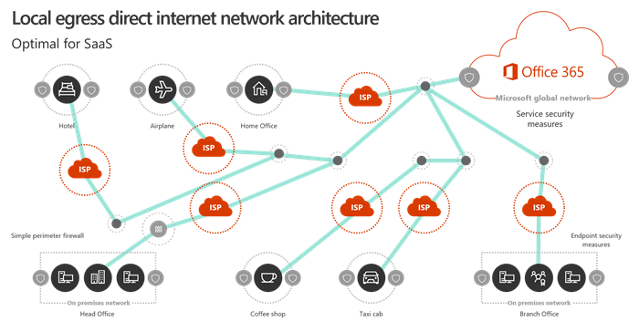

# Microsoft 365 network connectivity overview

*This article applies to both Microsoft 365 Enterprise and Office 365 Enterprise.*

Microsoft 365 is a distributed Software-as-a-Service (SaaS) cloud that provides productivity and collaboration scenarios through a diverse set of micro-services and applications. Client components of Microsoft 365 such as Outlook, Word and PowerPoint run on user computers and connect to other components of Microsoft 365 that run in Microsoft datacenters. The most significant factor that determines the quality of the Microsoft 365 end user experience is network reliability and low latency between Microsoft 365 clients and Microsoft 365 service front doors.

In this article, you will learn about the goals of Microsoft 365 networking, and why Microsoft 365 networking requires a different approach to optimization than generic Internet traffic.

## Microsoft 365 networking goals

The ultimate goal of Microsoft 365 networking is to optimize the end user experience by enabling the least restrictive access between clients and the closest Microsoft 365 endpoints. The quality of end user experience is directly related to the performance and responsiveness of the application that the user is using. For example, Microsoft Teams relies on low latency so that user phone calls, conferences and shared screen collaborations are glitch-free, and Outlook relies on great networking connectivity for instant search features that leverage server-side indexing and AI capabilities.

The primary goal in the network design should be to minimize latency by reducing the round-trip time (RTT) from client machines to the Microsoft Global Network, Microsoft's public network backbone that interconnects all of Microsoft's datacenters with low latency, high availability cloud application entry points spread around the world. You can learn more about the Microsoft Global Network at [How Microsoft builds its fast and reliable global network](https://azure.microsoft.com/blog/how-microsoft-builds-its-fast-and-reliable-global-network/).

Optimizing Microsoft 365 network performance doesn't need to be complicated. You can get the best possible performance by following a few key principles:

- Identify Microsoft 365 network traffic
- Allow local branch egress of Microsoft 365 network traffic to the internet from each location where users connect to Microsoft 365
- Allow Microsoft 365 traffic to bypass proxies and packet inspection devices

For more information on Microsoft 365 network connectivity principles, see [Microsoft 365 Network Connectivity Principles](microsoft-365-network-connectivity-principles.md).

## Traditional network architectures and SaaS

Traditional network architecture principles for client/server workloads are designed around the assumption that traffic between clients and endpoints does not extend outside the corporate network perimeter. Also, in many enterprise networks, all outbound Internet connections traverse the corporate network, and egress from a central location.

In traditional network architectures, higher latency for generic Internet traffic is a necessary tradeoff in order to maintain network perimeter security, and performance optimization for Internet traffic typically involves upgrading or scaling out the equipment at network egress points. However, this approach does not address the requirements for optimum network performance of SaaS services such as Microsoft 365.

## Identifying Microsoft 365 network traffic

We're making it easier to identify Microsoft 365 network traffic and making it simpler to manage the network identification.

- New categories of network endpoints to differentiate highly critical network traffic from network traffic which is not impacted by Internet latencies. There are just a handful of URLs and supporting IP Addresses in the most critical “Optimize” category.
- Web services for script usage or direct device configuration and change management of Microsoft 365 network identification. Changes are available from the web service, or in RSS format, or on email using a Microsoft Flow template.
- [Office 365 Network partner program](./microsoft-365-networking-partner-program.md) with Microsoft partners who provide devices or services that follow Microsoft 365 network connectivity principles and have simple configuration.

## Securing Microsoft 365 connections

The goal of traditional network security is to harden the corporate network perimeter against intrusion and malicious exploits. Most enterprise networks enforce network security for Internet traffic using technologies like proxy servers, firewalls, SSL break and inspect, deep packet inspection, and data loss prevention systems. These technologies provide important risk mitigation for generic Internet requests but can dramatically reduce performance, scalability, and the quality of end user experience when applied to Microsoft 365 endpoints.

Microsoft 365 helps meet your organization's needs for content security and data usage compliance with built-in security and governance features designed specifically for Microsoft 365 features and workloads. For more information about Microsoft 365 security and compliance, see the [Office 365 security roadmap](/office365/securitycompliance/security-roadmap). For more information about Microsoft’s recommendations and support position on advanced network solutions that perform advanced-level processing on Microsoft 365 traffic, see [Using third-party network devices or solutions on Office 365 traffic](https://support.microsoft.com/help/2690045).

## Why is Microsoft 365 networking different?

Microsoft 365 is designed for optimal performance using endpoint security and encrypted network connections, reducing the need for perimeter security enforcement. Microsoft 365 datacenters are located across the world and the service is designed to use various methods for connecting clients to best available service endpoints. Since user data and processing is distributed between many Microsoft datacenters, there is no single network endpoint to which client machines can connect. In fact, data and services in your Microsoft 365 tenant are dynamically optimized by the Microsoft Global Network to adapt to the geographic locations from which they are accessed by end users.

Certain common performance issues are created when Microsoft 365 traffic is subject to packet inspection and centralized egress:

- High latency can cause extremely poor performance of video and audio streams, and slow response of data retrieval, searches, real-time collaboration, calendar free/busy information, in-product content and other services
- Egressing connections from a central location defeats the dynamic routing capabilities of the Microsoft 365 global network, adding latency and round-trip time
- Decrypting SSL secured Microsoft 365 network traffic and re-encrypting it can cause protocol errors and has security risk

Shortening the network path to Microsoft 365 entry points by allowing client traffic to egress as close as possible to their geographic location can improve connectivity performance and the end user experience in Microsoft 365. It can also help to reduce the impact of future changes to the network architecture on Microsoft 365 performance and reliability. The optimum connectivity model is to always provide network egress at the user's location, regardless of whether this is on the corporate network or remote locations such as home, hotels, coffee shops and airports. Generic Internet traffic and WAN based corporate network traffic would be separately routed and not use the local direct egress model. This local direct egress model is represented in the diagram below.

The local egress architecture has the following benefits for Microsoft 365 network traffic over the traditional model:
  
- Provides optimal Microsoft 365 performance by optimizing route length. End user connections are dynamically routed to the nearest Microsoft 365 entry point by the Microsoft Global Network's _Distributed Service Front Door_ infrastructure, and traffic is then routed internally to data and service endpoints over Microsoft's ultra-low latency high availability fiber.
- Reduces the load on corporate network infrastructure by allowing local egress for Microsoft 365 traffic, bypassing proxies and traffic inspection devices.
- Secures connections on both ends by leveraging client endpoint security and cloud security features, avoiding application of redundant network security technologies.

> [!NOTE]
> The _Distributed Service Front Door_ infrastructure is the Microsoft Global Network's highly available and scalable network edge with geographically distributed locations. It terminates end user connections and efficiently routes them within the Microsoft Global Network. You can learn more about the Microsoft Global Network at [How Microsoft builds its fast and reliable global network](https://azure.microsoft.com/blog/how-microsoft-builds-its-fast-and-reliable-global-network/).

For more information on understanding and applying Microsoft 365 network connectivity principles, see [Microsoft 365 Network Connectivity Principles](microsoft-365-network-connectivity-principles.md).

## Conclusion

Optimizing Microsoft 365 network performance really comes down to removing unnecessary impediments. By treating Microsoft 365 connections as trusted traffic, you can prevent latency from being introduced by packet inspection and competition for proxy bandwidth. Allowing local connections between client machines and Office 365 endpoints enables traffic to be dynamically routed through the Microsoft Global Network.

## Related Topics

[Microsoft 365 Network Connectivity Principles](microsoft-365-network-connectivity-principles.md)

[Managing Office 365 endpoints](managing-office-365-endpoints.md)

[Office 365 URLs and IP address ranges](urls-and-ip-address-ranges.md)

[Office 365 IP Address and URL Web service](microsoft-365-ip-web-service.md)

[Assessing Microsoft 365 network connectivity](assessing-network-connectivity.md)

[Network planning and performance tuning for Microsoft 365](network-planning-and-performance.md)

[Office 365 performance tuning using baselines and performance history](performance-tuning-using-baselines-and-history.md)

[Performance troubleshooting plan for Office 365](performance-troubleshooting-plan.md)

[Content Delivery Networks](content-delivery-networks.md)

[Microsoft 365 connectivity test](https://aka.ms/netonboard)

[How Microsoft builds its fast and reliable global network](https://azure.microsoft.com/blog/how-microsoft-builds-its-fast-and-reliable-global-network/)

[Office 365 Networking blog](https://techcommunity.microsoft.com/t5/Office-365-Networking/bd-p/Office365Networking)