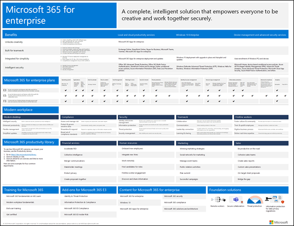
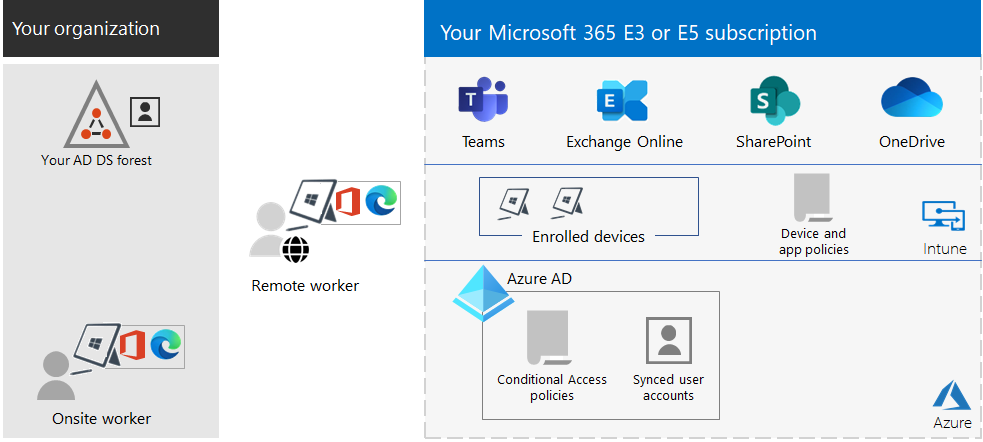
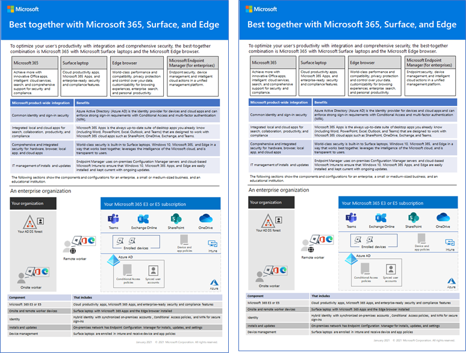

# Microsoft 365 for enterprise overview

Microsoft 365 for enterprise is a complete, intelligent solution that empowers everyone to be creative and work together securely.

Microsoft 365 for enterprise is designed for large organizations, but it can also be used for medium-sized and small businesses that need the most advanced security and productivity capabilities.

## Components

Microsoft 365 for enterprise consists of:

|Services|Description|
|---|---|
|Local apps and cloud-based apps and productivity services|Includes both Microsoft 365 Apps for enterprise, the latest Office apps for your PC and Mac (such as Word, Excel, PowerPoint, Outlook, and others), and a full suite of online services for email, file storage and collaboration, meetings, and more.|
|Windows 10 Enterprise|Meets the needs of both large and midsize organizations. It's the most productive and secure version of Windows for users. For IT professionals, it also provides comprehensive deployment, device, and app management.|
|Device management and advanced security services|Includes Microsoft Intune, which is a cloud-based enterprise mobility management service that helps enable your workforce to be productive while protecting your organization data.|
|||

## Plans

Microsoft 365 for enterprise is available in three plans.

|Plan name|Capabilities|
|---|---|
|E3|Access the Microsoft 365 core products and features to securely enhance workplace productivity and drive innovation.|
|E5|Access the Microsoft 365 latest products and features. These include Defender for Office 365, security tools, and collaboration tools. This plan includes all E3 capabilities, plus advanced security, voice, and data analysis tools.|
|F3|Connect with your first-line workers through purpose-built tools and resources that they can use to help them do their best work.|
|||

If you have Microsoft 365 E3, you can also get these add-ons:

- Identity & Threat Protection
- Information Protection & Compliance
- [Microsoft 365 E5 Compliance](https://www.microsoft.com/microsoft-365/business/e5-compliance)
- Microsoft 365 E5 Insider Risk

Microsoft 365 E3 users can use these add-ons to take advantage of some of the additional features Microsoft 365 E5 includes.

For more information, see [Features and capabilities for each plan](https://www.microsoft.com/microsoft-365/compare-all-microsoft-365-plans).

## Get the big picture

The [Microsoft 365 for enterprise poster](../downloads/Microsoft365Enterprise.pdf) is a central location for you to view:

- The benefits of Microsoft 365 for enterprise, and how apps and services map to its value pillars.
- Microsoft 365 for enterprise plans and which components they contain.
- The key components of the Microsoft modern workplace, which Microsoft 365 for enterprise enables.
- The [Microsoft 365 Productivity Library](https://www.microsoft.com/microsoft-365/success/) and representative scenarios for some common organization departments.

You can also [download a copy of the poster](https://github.com/MicrosoftDocs/microsoft-365-docs/raw/public/microsoft-365/downloads/Microsoft365Enterprise.pdf).

## Transition your entire organization

To get a better picture about how to move your entire organization to the products and services in Microsoft 365 for enterprise, see the [transition poster](https://download.microsoft.com/download/2/c/7/2c7bcc04-aae3-4604-9707-1ffff66b9851/transition-org-to-m365.pdf).

This two-page poster is a quick way to inventory your existing infrastructure. It helps you to find guidance and move to the corresponding product or service in Microsoft 365 for enterprise. It includes Windows and Office products and other infrastructure and security elements, such as device management, identity, and information and threat protection.

## End of support for Windows 7 and Office 2010 clients and servers

[Windows 7](https://aka.ms/win7upgrade) reached end of support on **January 14, 2020**.

These products reached end of support on **October 13, 2020**:

- [Office 2010](/DeployOffice/office-2010-end-support-roadmap)
- [Exchange Server 2010](exchange-2010-end-of-support.md)

[SharePoint Server 2010](upgrade-from-sharepoint-2010.md) will reach end of support on **April 13, 2021**.

For a visual summary of the upgrade, migrate, and move-to-the-cloud options for these products, see the [end of support poster](../downloads/Office2010Windows7EndOfSupport.pdf).

This one-page poster is a quick way to understand the various paths you can take to prevent Windows 7 and Office 2010 client and server products from reaching end of support, with preferred paths and support in Microsoft 365 for enterprise highlighted.

You can also [download this poster](https://github.com/MicrosoftDocs/microsoft-365-docs/raw/public/microsoft-365/downloads/Office2010Windows7EndOfSupport.pdf) and print it in letter, legal, or tabloid (11 x 17) formats.

## Plan for and deploy

There are three ways to plan for and deploy the products, features, and components of Microsoft 365 for enterprise:

- In partnership with FastTrack

   With FastTrack, Microsoft engineers help you move to the cloud at your own pace. See [FastTrack for Microsoft 365](https://fasttrack.microsoft.com/microsoft365).

- With the help of Microsoft Consulting Services or a [Microsoft partner](https://partner.microsoft.com/)

   Consultants can analyze your current infrastructure and help you develop a plan to incorporate all the software and services of Microsoft 365 for enterprise.

- Do it yourself

   Start with the [Networking roadmap](networking-roadmap-microsoft-365.md) to build out or verify your existing infrastructure and productivity workloads.

For an example of how a fictional but representative multinational organization has deployed Microsoft 365 for enterprise, see the [Contoso Corporation case study](contoso-overview.md).

## Additional Microsoft 365 products

- [Microsoft 365 Business Premium](../business/index.yml)

  Bring together the best-in-class productivity and collaboration capabilities with device management and security solutions to safeguard business data for small and midsize businesses.

- [Microsoft 365 Education](/education)

  Empower educators to unlock creativity, promote teamwork, and provide a simple and safe experience in a single, affordable solution built for education.

- [Microsoft 365 Government](https://www.microsoft.com/microsoft-365/government)

  Empower United States public sector employees to work together, securely.

## Best together with Surface and the Edge browser

Optimize your user’s integrated and secure productivity with the best-together combination of Microsoft 365 for enterprise, Microsoft Surface devices, and the Microsoft Edge browser. This cross-product integration provides:

- A common identity and sign-in security infrastructure.
- Integrated local and cloud apps for search, collaboration, productivity, and compliance.
- Comprehensive and integrated security for hardware, browser, local app, and cloud apps.
- A common infrastructure for IT management of installs and updates.

Here is an example for an enterprise organization.

For more information and configuration examples for a small and medium business and an educational institution, download the [Best together poster](https://download.microsoft.com/download/2/8/d/28db0cf9-2f5a-4f63-91e2-46ff5c4d3baf/microsoft-best-together-poster.pdf).

## Microsoft 365 training

To learn more about Microsoft 365 and work toward a Microsoft 365 certification, you can start with [Microsoft 365 Certified: Fundamentals](/learn/paths/m365-fundamentals/).

## See also

[Microsoft 365 for enterprise product page](https://www.microsoft.com/microsoft-365/enterprise)