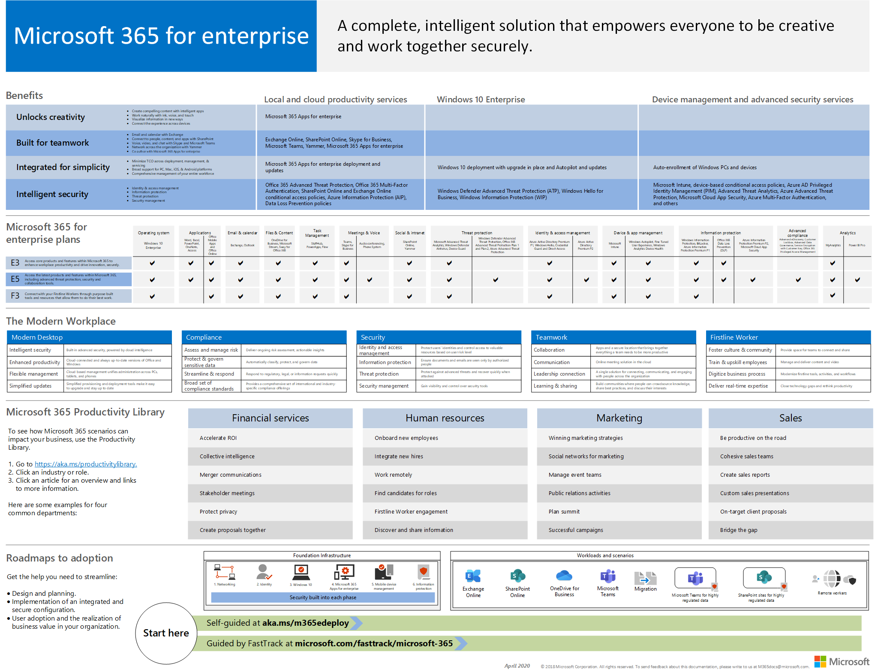
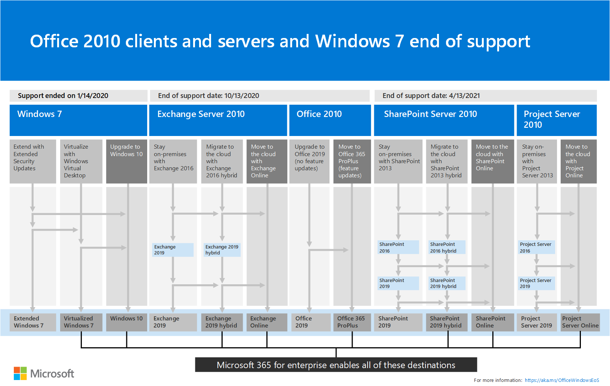

# Microsoft 365 for enterprise overview

Microsoft 365 for enterprise is a complete, intelligent solution that empowers everyone to be creative and work together securely. 

Although designed for large organizations, Microsoft 365 for enterprise can also be used for medium-sized and small businesses that need the most advanced security and productivity capabilities. 

## Components

Microsoft 365 for enterprise consists of:

|||
|:-------|:-----|
| Local and cloud-based apps and productivity services | Includes both Microsoft 365 Apps for enterprise, the latest Office apps for your PC and Mac (such as Word, Excel, PowerPoint, Outlook, and others), and a full suite of online services for email, file storage and collaboration, meetings, and more. |
| Windows 10 Enterprise | Addresses the needs of both large and midsize organizations, providing users with the most productive and secure version of Windows and IT professionals with comprehensive deployment, device, and app management. |
| Device management and advanced security services | Includes Microsoft Intune, which is a cloud-based enterprise mobility management (EMM) service that helps enable your workforce to be productive while keeping your corporate data protected. |
|||

## Plans

Microsoft 365 for enterprise is available in three plans.

|||
|:-------|:-----|
| E3 | Access core products and features within Microsoft 365 to enhance workplace productivity and drive innovation, securely. |
| E5 | Access the latest products and features within Microsoft 365, including advanced threat protection, security and collaboration tools.. Includes all of E3's capabilities plus advanced security, voice, and data analysis tools. |
| F1 | Connect with your Firstline Workers through purpose-built tools and resources that allow them to do their best work. |
|||

If you have Microsoft 365 E3, you can also get these [offerings](https://www.microsoft.com/microsoft-365/blog/2019/01/02/introducing-new-advanced-security-and-compliance-offerings-for-microsoft-365/):

- Identity & Threat Protection
- Information Protection & Compliance

These offerings contain additional features that are included with Microsoft 365 E5.

For more information, see [Features and capabilities for each plan](https://www.microsoft.com/microsoft-365/compare-all-microsoft-365-plans).

## Get the big picture

The [Microsoft 365 for enterprise poster](../media/m365-poster/Microsoft365Enterprise.pdf) is a central location for you to view:

- The benefits of Microsoft 365 for enterprise and how apps and services map to its value pillars
- Microsoft 365 for enterprise plans and which components they contain 
- The key components of the Modern Workplace, which Microsoft 365 for enterprise enables
- The [Microsoft 365 Productivity Library](https://www.microsoft.com/microsoft-365/success/) and representative scenarios for some common organization departments
- The adoption roadmap that highlights the Microsoft 365 for enterprise [Deployment Guide](deploy-microsoft-365-enterprise.md)

To download a copy of the poster, click [here](https://github.com/MicrosoftDocs/microsoft-365-docs/raw/public/microsoft-365/enterprise/media/m365-poster/Microsoft365Enterprise.pdf).

## Transition your entire organization

To get a better picture of how to move your entire organization to the products and services in Microsoft 365 for enterprise, download the [transition poster](../media/deploy-microsoft-365-enterprise/transition-org-to-m365.pdf).

This two-page poster is a quick way to inventory your existing infrastructure and get to the guidance for moving to the corresponding product or service in Microsoft 365 for enterprise. It includes Windows and Office products and other infrastructure and security elements such as device management, identity, and information and threat protection.

You can also [download this poster](https://github.com/MicrosoftDocs/microsoft-365-docs/raw/public/microsoft-365/enterprise/media/deploy-microsoft-365-enterprise/transition-org-to-m365.pdf) and print it in letter, legal, or tabloid (11 x 17) formats.

## Avoid end of support for Windows 7 and Office 2010 clients and servers

The following products reach end of support on **January 14, 2020**:

- [Windows 7](https://aka.ms/win7upgrade)

The following products reach end of support on  **October 13, 2020**:

- [Office 2010](https://docs.microsoft.com/DeployOffice/office-2010-end-support-roadmap)
- [Exchange Server 2010](https://docs.microsoft.com/office365/enterprise/exchange-2010-end-of-support)
- [SharePoint Server 2010](https://docs.microsoft.com/office365/enterprise/upgrade-from-sharepoint-2010)

For a visual summary of the upgrade, migrate, and move-to-the-cloud options for these products, see the [end of support poster](../media/migration-microsoft-365-enterprise-workload/Office2010Windows7EndOfSupport.pdf).

This one-page poster is a quick way to understand the various paths you can take to prevent Windows 7 and Office 2010 client and server products from reaching end of support, with preferred paths and support in Microsoft 365 for enterprise highlighted.

You can also [download this poster](https://github.com/MicrosoftDocs/microsoft-365-docs/raw/public/microsoft-365/enterprise/media/migration-microsoft-365-enterprise-workload/Office2010Windows7EndOfSupport.pdf) and print it in letter, legal, or tabloid (11 x 17) formats.

## Deploy

There are three ways to deploy the products, features, and components of Microsoft 365 for enterprise:

1. In partnership with FastTrack
  
   With FastTrack, Microsoft engineers help you move to the cloud at your own pace. See [FastTrack for Microsoft 365](https://fasttrack.microsoft.com/microsoft365).
  
2. With the help of Microsoft Consulting Services or a [Microsoft partner](https://partner.microsoft.com/).

   Consultants can analyze your current infrastructure and help you develop a plan to incorporate all of the software and services of Microsoft 365 for enterprise.

3. Do it yourself

   The [Microsoft 365 for enterprise deployment guide](deploy-microsoft-365-enterprise.md) takes you step by step through building out the infrastructure and productivity workloads. 

For more deployment information, see how:

- [Customers](deploy-microsoft-365-enterprise.md#how-customers-use-microsoft-365-for-enterprise)  use Microsoft 365 for enterprise.
- [Microsoft](deploy-microsoft-365-enterprise.md#how-microsoft-uses-microsoft-365-for-enterprise) uses Microsoft 365 for enterprise.
- [The Contoso Corporation](contoso-overview.md), a fictional but representative multinational organization, has deployed Microsoft 365 for enterprise.

## Additional Microsoft 365 solutions

- [Microsoft 365 Business Premium](https://docs.microsoft.com/microsoft-365/business/)
 
  Bring together the best-in-class productivity and collaboration capabilities of Office 365 with device management and security solutions to safeguard business data for small and midsize businesses (SMB).

- [Microsoft 365 Education](https://docs.microsoft.com/education)
 
  Empower educators to unlock creativity, promote teamwork, and provide a simple and safe experience in a single, affordable solution built for education.

- [Microsoft 365 Government](https://www.microsoft.com/microsoft-365/government)
 
  Empower United States public sector employees to work together, securely.

## Microsoft 365 training

|||
|:-------|:-----|
| Get yourself trained and work towards a Microsoft 365 certification.   Start with [Microsoft 365 Fundamentals](https://docs.microsoft.com/learn/paths/m365-fundamentals/).
|||

## Next step

If you're doing the deployment yourself, start your [Microsoft 365 for enterprise deployment journey](deploy-microsoft-365-enterprise.md).

## See also

[Microsoft 365 for enterprise product page](https://www.microsoft.com/microsoft-365/enterprise)
