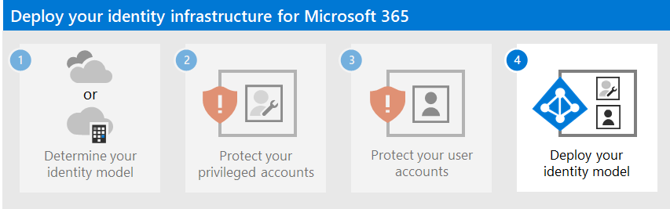

# Step 3: Protect your Microsoft 365 user accounts

Check out all of our small business content on [Small business help & learning](https://go.microsoft.com/fwlink/?linkid=2224585).

To increase the security of user sign-ins:

- Use Windows Hello for Business
- Use Azure Active Directory (Azure AD) Password Protection
- Use multi-factor authentication (MFA)
- Deploy identity and device access configurations
- Protect against credential compromise with Azure AD Identity Protection

## Windows Hello for Business

Windows Hello for Business in Windows 10 Enterprise replaces passwords with strong two-factor authentication when signing on a Windows device. The two factors are a new type of user credential that is tied to a device and a biometric or PIN.

For more information, see [Windows Hello for Business Overview](/windows/security/identity-protection/hello-for-business/hello-overview).

## Azure AD Password Protection

Azure AD Password Protection detects and blocks known weak passwords and their variants and can also block additional weak terms that are specific to your organization. Default global banned password lists are automatically applied to all users in an Azure AD tenant. You can define additional entries in a custom banned password list. When users change or reset their passwords, these banned password lists are checked to enforce the use of strong passwords.

For more information, see [Configure Azure AD password protection](/azure/active-directory/authentication/concept-password-ban-bad).

## MFA

MFA requires that user sign-ins be subject to an additional verification beyond the user account password. Even if a malicious user determines a user account password, they must also be able to respond to an additional verification, such as a text message sent to a smartphone before access is granted.

Your first step in using MFA is to [require it for all administrator accounts](protect-your-global-administrator-accounts.md), also known as privileged accounts. Beyond this first step, Microsoft recommends MFA For all users.

There are three ways to require your users to use MFA based on your Microsoft 365 plan.

| Plan | Recommendation |
|---------|---------|
|All Microsoft 365 plans (without Azure AD Premium P1 or P2 licenses)     |[Enable security defaults in Azure AD](/azure/active-directory/fundamentals/concept-fundamentals-security-defaults). Security defaults in Azure AD include MFA for users and administrators.   |
|Microsoft 365 E3 (includes Azure AD Premium P1 licenses)     | Use the [common Conditional Access policies](/azure/active-directory/conditional-access/concept-conditional-access-policy-common) to configure the following policies:  - [Require MFA for administrators](/azure/active-directory/conditional-access/howto-conditional-access-policy-admin-mfa)  - [Require MFA for all users](/azure/active-directory/conditional-access/howto-conditional-access-policy-all-users-mfa)   - [Block legacy authentication](/azure/active-directory/conditional-access/howto-conditional-access-policy-block-legacy)       |
|Microsoft 365 E5 (includes Azure AD Premium P2 licenses)     | Taking advantage of Azure AD Identity Protection, begin to implement Microsoft's recommended set of Conditional Access and related policies by creating these two policies:  - [Require MFA when sign-in risk is medium or high](/azure/active-directory/conditional-access/howto-conditional-access-policy-risk)  - [High risk users must change password](/azure/active-directory/conditional-access/howto-conditional-access-policy-risk-user)       |
| | |

### Security defaults

Security defaults is a new feature for Microsoft 365 and Office 365 paid or trial subscriptions created after October 21, 2019. These subscriptions have security defaults turned on, which ***requires all of your users to use MFA with the Microsoft Authenticator app***.
 
Users have 14 days to register for MFA with the Microsoft Authenticator app from their smart phones, which begins from the first time they sign in after security defaults has been enabled. After 14 days have passed, the user won't be able to sign in until MFA registration is completed.

Security defaults ensure that all organizations have a basic level of security for user sign-in that is enabled by default. You can disable security defaults in favor of MFA with Conditional Access policies or for individual accounts.

For more information, see the [overview of security defaults](/azure/active-directory/fundamentals/concept-fundamentals-security-defaults).

### Conditional Access policies

Conditional Access policies are a set of rules that specify the conditions under which sign-ins are evaluated and access is granted. For example, you can create a Conditional Access policy that states:

- If the user account name is a member of a group for users that are assigned the Exchange, user, password, security, SharePoint, **Exchange admin**, **SharePoint admin**, or **Global admin** roles, require MFA before allowing access.

This policy allows you to require MFA based on group membership, rather than trying to configure individual user accounts for MFA when they are assigned or unassigned from these administrator roles.

You can also use Conditional Access policies for more advanced capabilities, such as requiring that the sign-in is done from a compliant device, such as your laptop running Windows 10.

Conditional Access requires Azure AD Premium P1 licenses, which are included with Microsoft 365 E3 and E5.

For more information, see the [overview of Conditional Access](/azure/active-directory/conditional-access/overview).

### Using these methods together

Keep the following in mind:

- You cannot enable security defaults if you have any Conditional Access policies enabled.
- You cannot enable any Conditional Access policies if you have security defaults enabled.

If security defaults are enabled, all new users are prompted for MFA registration and the use of the Microsoft Authenticator app. 

This table shows the results of enabling MFA with security defaults and Conditional Access policies.

| Method | Enabled | Disabled | Additional authentication method |
|:-------|:-----|:-------|:-------|
| **Security defaults**  | Can’t use Conditional Access policies | Can use Conditional Access policies | Microsoft Authenticator app |
| **Conditional Access policies** | If any are enabled, you can’t enable security defaults | If all are disabled, you can enable security defaults  | User specifies during MFA registration  |
||||

## Zero Trust identity and device access configurations

Zero Trust identity and device access settings and policies are recommended prerequisite features and their settings combined with Conditional Access, Intune, and Azure AD Identity Protection policies that determine whether a given access request should be granted and under what conditions. This determination is based on the user account of the sign-in, the device being used, the app the user is using for access, the location from which the access request is made, and an assessment of the risk of the request. This capability helps ensure that only approved users and devices can access your critical resources.

>[!Note]
>Azure AD Identity Protection requires Azure AD Premium P2 licenses, which are included with Microsoft 365 E5.
>

Identity and device access policies are defined to be used in three tiers: 

- Baseline protection is a minimum level of security for your identities and devices that access your apps and data.
- Sensitive protection provides additional security for specific data. Identities and devices are subject to higher levels of security and device health requirements.
- Protection for environments with highly regulated or classified data is for typically small amounts of data that are highly classified, contain trade secrets, or is subject to data regulations. Identities and devices are subject to much higher levels of security and device health requirements. 

These tiers and their corresponding configurations provide consistent levels of protection across your data, identities, and devices.

Microsoft highly recommends configuring and rolling out Zero Trust identity and device access policies in your organization, including specific settings for Microsoft Teams, Exchange Online, and SharePoint. For more information, see [Zero Trust identity and device access configurations](../security/office-365-security/microsoft-365-policies-configurations.md).

## Azure AD Identity Protection

In this section, you'll learn how to configure policies that protect against credential compromise, where an attacker determines a user’s account name and password to gain access to an organization’s cloud services and data. Azure AD Identity Protection provides a number of ways to help prevent an attacker from compromising a user account's credentials.

With Azure AD Identity Protection, you can:

|Capability|Description|
|:---------|:---------|
| Determine and address potential vulnerabilities in your organization’s identities | Azure AD uses machine learning to detect anomalies and suspicious activity, such as sign-ins and post-sign-in activities. Using this data, Azure AD Identity Protection generates reports and alerts that help you evaluate the issues and take action.|
|Detect suspicious actions that are related to your organization’s identities and respond to them automatically|You can configure risk-based policies that automatically respond to detected issues when a specified risk level has been reached. These policies, in addition to other Conditional Access controls provided by Azure AD and Microsoft Intune, can either automatically block access or take corrective actions, including password resets and requiring Azure AD Multi-Factor Authentication for subsequent sign-ins. |
| Investigate suspicious incidents and resolve them with administrative actions | You can investigate risk events using information about the security incident. Basic workflows are available to track investigations and initiate remediation actions, such as password resets. |
|||

See [more information about Azure AD Identity Protection](/azure/active-directory/identity-protection/overview-identity-protection).

See the [steps to enable Azure AD Identity Protection](/azure/active-directory/identity-protection/howto-identity-protection-configure-risk-policies).

## Admin technical resources for MFA and secure sign-ins

- [MFA for Microsoft 365](../admin/security-and-compliance/multi-factor-authentication-microsoft-365.md)
- [Deploy identity for Microsoft 365](deploy-identity-solution-overview.md)
- [Azure Academy Azure AD training videos](https://www.youtube.com/watch?v=pN8o0owHfI0&list=PL-V4YVm6AmwUFpC3rXr2i2piRQ708q_ia)
- [Configure the Azure AD Multi-Factor Authentication registration policy](/azure/active-directory/identity-protection/howto-identity-protection-configure-mfa-policy)
- [Identity and device access configurations](../security/office-365-security/microsoft-365-policies-configurations.md)

## Next step

Continue with Step 4 to deploy the identity infrastructure based on your chosen identity model:

- [Cloud-only identity](cloud-only-identities.md)
- [Hybrid identity](prepare-for-directory-synchronization.md)
