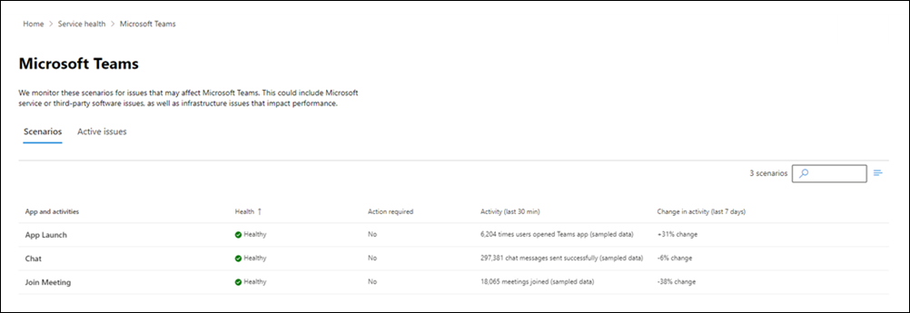
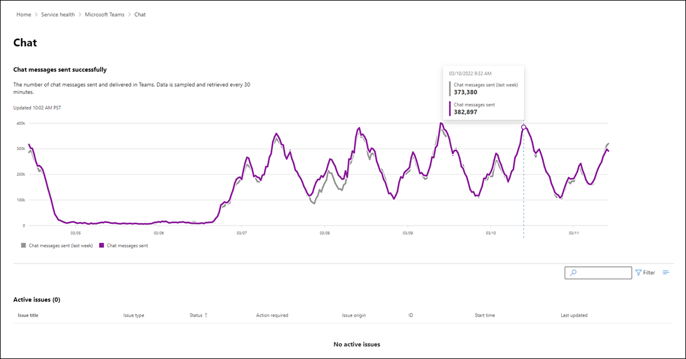

# Microsoft 365 Teams monitoring

Microsoft Teams monitoring supports the following organizational scenarios with near real-time information:

- **App Launch**. The number of times users opened the Teams client without errors. Data is sampled and retrieved every 30 minutes.

- **Chat**. The number of chat messages sent and delivered in Teams. Data is sampled and retrieved every 30 minutes.

- **Join Meeting**. The number of times users joined Teams meetings without errors. Data is sampled and retrieved every 30 minutes.

- **Quality of Experience**. The percentage of audio streams for which Quality of Experience (QoE) telemetry was received by the Teams service. Data can be received up to 3 days after call completion. If the rate drops, investigate your network configuration to ensure that the Microsoft Teams telemetry URLs are not being blocked. The telemetry URLs can be found here: [Office 365 URLs and IP address ranges - Microsoft 365 Common and Office Online](urls-and-ip-address-ranges.md?view=o365-worldwide#microsoft-365-common-and-office-online)

- **UDP Stream Establishment**. The percentage of audio streams established over UDP (User Datagram Protocol). Real-time media established over UDP is more efficient and provides better call quality. If the rate drops, investigate your network configuration to ensure that the ports and protocols required by Microsoft Teams are not being blocked. The required IP addresses, hostnames, ports, and protocols can be found here: [Office 365 URLs and IP address ranges - Skype for Business Online and Microsoft Teams](urls-and-ip-address-ranges.md?view=o365-worldwide#skype-for-business-online-and-microsoft-teams)

Admins can use the information to correlate any Microsoft-reported issues with the usage data to confirm any actual impact to their organization. Also, admins can view any usage from the last two weeks of usage data to identify any  anomalies.

