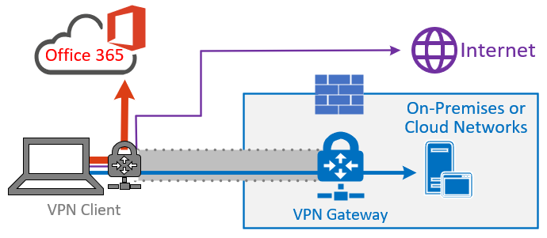
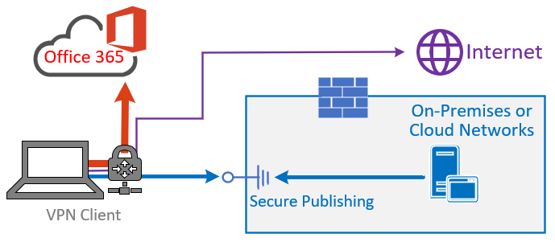

# Common VPN split tunneling scenarios for Microsoft 365

In the list below, you'll see the most common VPN scenarios seen in enterprise environments. Most customers traditionally operate model 1 (VPN Forced Tunnel). This section will help you to quickly and securely transition to **model 2**, which is achievable with relatively little effort, and has enormous benefits to network performance and user experience.

| Model | Description |
| --- | --- |
| [1. VPN Forced Tunnel](#1-vpn-forced-tunnel) | 100% of traffic goes into VPN tunnel, including on-premise, Internet, and all O365/M365 |
| [2. VPN Forced Tunnel with few exceptions](#2-vpn-forced-tunnel-with-a-small-number-of-trusted-exceptions) | VPN tunnel is used by default (default route points to VPN), with few, most important exempt scenarios that are allowed to go direct |
| [3. VPN Forced Tunnel with broad exceptions](#3-vpn-forced-tunnel-with-broad-exceptions) | VPN tunnel is used by default (default route points to VPN), with broad exceptions that are allowed to go direct (such as all Microsoft 365, All Salesforce, All Zoom) |
| [4. VPN Selective Tunnel](#4-vpn-selective-tunnel) | VPN tunnel is used only for corpnet-based services. Default route (Internet and all Internet-based services) goes direct. |
| [5. No VPN](#5-no-vpn) | A variation of #2. Instead of legacy VPN, all corpnet services are published through modern security approaches (like Zscaler ZPA, Azure Active Directory (Azure AD) Proxy/MCAS, etc.) |

### 1. VPN Forced Tunnel

The most common starting scenario for most enterprise customers. A forced VPN is used, which means 100% of traffic is directed into the corporate network whether the endpoint resides within the corporate network or not. Any external (Internet) bound traffic such as Microsoft 365 or Internet browsing is then hair-pinned back out of the on-premises security equipment such as proxies. In the current climate with nearly 100% of users working remotely, this model therefore puts high load on the VPN infrastructure and is likely to significantly hinder performance of all corporate traffic and thus the enterprise to operate efficiently at a time of crisis.

### 2. VPN Forced Tunnel with a small number of trusted exceptions

Significantly more efficient for an enterprise to operate under. This model allows a few controlled and defined endpoints that are high load and latency sensitive to bypass the VPN tunnel and go direct to the Microsoft 365 service. This significantly improves the performance for the offloaded services, and also decreases the load on the VPN infrastructure, thus allowing elements that still require it to operate with lower contention for resources. It's this model that this article concentrates on assisting with the transition to as it allows for simple, defined actions to be taken quickly with numerous positive outcomes.

### 3. VPN Forced Tunnel with broad exceptions

Broadens the scope of model 2. Rather than just sending a small group of defined endpoints direct, it instead sends all traffic directly to trusted services such Microsoft 365 and SalesForce. This further reduces the load on the corporate VPN infrastructure and improves the performance of the services defined. As this model is likely to take more time to assess the feasibility of and implement, It's likely a step that can be taken iteratively at a later date once model two is successfully in place.

### 4. VPN selective Tunnel

Reverses the third model in that only traffic identified as having a corporate IP address is sent down the VPN tunnel and thus the Internet path is the default route for everything else. This model requires an organization to be well on the path to [Zero Trust](https://www.microsoft.com/security/zero-trust?rtc=1) in able to safely implement this model. It should be noted that this model or some variation thereof will likely become the necessary default over time as more services move away from the corporate network and into the cloud.

Microsoft uses this model internally. You can find more information on Microsoft's implementation of VPN split tunneling at [Running on VPN: How Microsoft is keeping its remote workforce connected](https://www.microsoft.com/itshowcase/blog/running-on-vpn-how-microsoft-is-keeping-its-remote-workforce-connected/?elevate-lv).

### 5. No VPN

A more advanced version of model number 2, whereby any internal services are published through a modern security approach or SDWAN solution such as Azure AD Proxy, Defender for Cloud Apps, Zscaler ZPA, etc.

