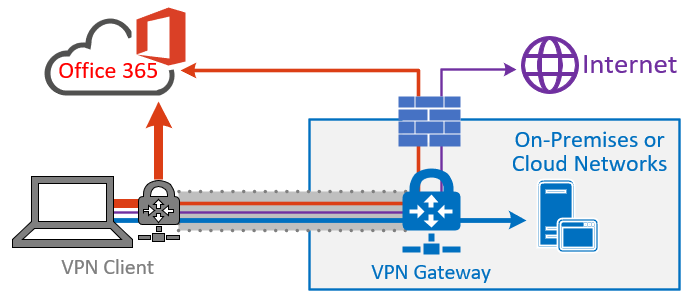
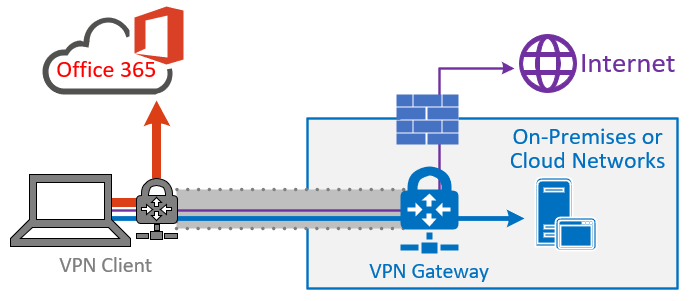

# Implementing VPN split tunneling for Microsoft 365

>[!NOTE]
>This article is part of a set of articles that address Microsoft 365 optimization for remote users.

>- For an overview of using VPN split tunneling to optimize Microsoft 365 connectivity for remote users, see [Overview: VPN split tunneling for Microsoft 365](microsoft-365-vpn-split-tunnel.md).
>- For information about optimizing Microsoft 365 worldwide tenant performance for users in China, see [Microsoft 365 performance optimization for China users](microsoft-365-networking-china.md).

For many years, enterprises have been using VPNs to support remote experiences for their users. While core workloads remained on-premises, a VPN from the remote client routed through a datacenter on the corporate network was the primary method for remote users to access corporate resources. To safeguard these connections, enterprises build layers of network security solutions along the VPN paths. This security was built to protect internal infrastructure and to safeguard mobile browsing of external web sites by rerouting traffic into the VPN and then out through the on-premises Internet perimeter. VPNs, network perimeters, and associated security infrastructure were often purpose-built and scaled for a defined volume of traffic, typically with most connectivity being initiated from within the corporate network, and most of it staying within the internal network boundaries.

For quite some time, VPN models where all connections from the remote user device are routed back into the on-premises network (known as _forced tunneling_) were largely sustainable as long as the concurrent scale of remote users was modest and the traffic volumes traversing VPN were low.  Some customers continued to use VPN force tunneling as the status quo even after their applications moved from inside the corporate perimeter to public SaaS clouds.

The use of forced tunneled VPNs for connecting to distributed and performance-sensitive cloud applications is suboptimal, but the negative effects have been accepted by some enterprises so as to maintain the security status quo. An example diagram of this scenario can be seen below:


This problem has been growing for many years, with many customers reporting a significant shift of network traffic patterns. Traffic that used to stay on premises now connects to external cloud endpoints. Many Microsoft customers report that previously, around 80% of their network traffic was to some internal source (represented by the dotted line in the above diagram). In 2020 that number is now around 20% or lower as they have shifted major workloads to the cloud, these trends aren't uncommon with other enterprises. Over time, as the cloud journey progresses, the above model becomes increasingly cumbersome and unsustainable, preventing an organization from being agile as they move into a cloud-first world.

The worldwide COVID-19 crisis has escalated this problem to require immediate remediation. The need to ensure employee safety has generated unprecedented demands on enterprise IT to support work-from-home productivity at a massive scale. Microsoft 365 is well positioned to help customers fulfill that demand, but high concurrency of users working from home generates a large volume of Microsoft 365 traffic which, if routed through forced tunnel VPN and on-premises network perimeters, causes rapid saturation and runs VPN infrastructure out of capacity. In this new reality, using VPN to access Microsoft 365 is no longer just a performance impediment, but a hard wall that not only impacts Microsoft 365 but critical business operations that still have to rely on the VPN to operate.

Microsoft has been working closely with customers and the wider industry for many years to provide effective, modern solutions to these problems from within our own services, and to align with industry best practice. [Connectivity principles](./microsoft-365-network-connectivity-principles.md) for the Microsoft 365 service have been designed to work efficiently for remote users while still allowing an organization to maintain security and control over their connectivity. These solutions can also be implemented quickly with limited work yet achieve a significant positive effect on the problems outlined above.

Microsoft's recommended strategy for optimizing remote worker's connectivity is focused on rapidly mitigating problems and providing high performance with a few simple steps. These steps adjust the legacy VPN approach for a few defined endpoints that bypass bottlenecked VPN servers. An equivalent or even superior security model can be applied at different layers to remove the need to secure all traffic at the egress of the corporate network. In most cases, this can be effectively achieved within hours and is then scalable to other workloads as requirements demand and time allows.

## Common VPN scenarios

In the list below, you'll see the most common VPN scenarios seen in enterprise environments. Most customers traditionally operate model 1 (VPN Forced Tunnel). This section will help you to quickly and securely transition to **model 2**, which is achievable with relatively little effort, and has enormous benefits to network performance and user experience.

| Model | Description |
| --- | --- |
| [1. VPN Forced Tunnel](#1-vpn-forced-tunnel) | 100% of traffic goes into VPN tunnel, including on-premise, Internet, and all O365/M365 |
| [2. VPN Forced Tunnel with few exceptions](#2-vpn-forced-tunnel-with-a-small-number-of-trusted-exceptions) | VPN tunnel is used by default (default route points to VPN), with few, most important exempt scenarios that are allowed to go direct |
| [3. VPN Forced Tunnel with broad exceptions](#3-vpn-forced-tunnel-with-broad-exceptions) | VPN tunnel is used by default (default route points to VPN), with broad exceptions that are allowed to go direct (such as all Microsoft 365, All Salesforce, All Zoom) |
| [4. VPN Selective Tunnel](#4-vpn-selective-tunnel) | VPN tunnel is used only for corpnet-based services. Default route (Internet and all Internet-based services) goes direct. |
| [5. No VPN](#5-no-vpn) | A variation of #2. Instead of legacy VPN, all corpnet services are published through modern security approaches (like Zscaler ZPA, Azure Active Directory (Azure AD) Proxy/MCAS, etc.) |

### 1. VPN Forced Tunnel

The most common starting scenario for most enterprise customers. A forced VPN is used, which means 100% of traffic is directed into the corporate network whether the endpoint resides within the corporate network or not. Any external (Internet) bound traffic such as Microsoft 365 or Internet browsing is then hair-pinned back out of the on-premises security equipment such as proxies. In the current climate with nearly 100% of users working remotely, this model therefore puts high load on the VPN infrastructure and is likely to significantly hinder performance of all corporate traffic and thus the enterprise to operate efficiently at a time of crisis.


### 2. VPN Forced Tunnel with a small number of trusted exceptions

Significantly more efficient for an enterprise to operate under. This model allows a few controlled and defined endpoints that are high load and latency sensitive to bypass the VPN tunnel and go direct to the Microsoft 365 service. This significantly improves the performance for the offloaded services, and also decreases the load on the VPN infrastructure, thus allowing elements that still require it to operate with lower contention for resources. It's this model that this article concentrates on assisting with the transition to as it allows for simple, defined actions to be taken quickly with numerous positive outcomes.



### 3. VPN Forced Tunnel with broad exceptions

Broadens the scope of model 2. Rather than just sending a small group of defined endpoints direct, it instead sends all traffic directly to trusted services such Microsoft 365 and SalesForce. This further reduces the load on the corporate VPN infrastructure and improves the performance of the services defined. As this model is likely to take more time to assess the feasibility of and implement, It's likely a step that can be taken iteratively at a later date once model two is successfully in place.



### 4. VPN selective Tunnel

Reverses the third model in that only traffic identified as having a corporate IP address is sent down the VPN tunnel and thus the Internet path is the default route for everything else. This model requires an organization to be well on the path to [Zero Trust](https://www.microsoft.com/security/zero-trust?rtc=1) in able to safely implement this model. It should be noted that this model or some variation thereof will likely become the necessary default over time as more services move away from the corporate network and into the cloud.

Microsoft uses this model internally. You can find more information on Microsoft's implementation of VPN split tunneling at [Running on VPN: How Microsoft is keeping its remote workforce connected](https://www.microsoft.com/itshowcase/blog/running-on-vpn-how-microsoft-is-keeping-its-remote-workforce-connected/?elevate-lv).


### 5. No VPN

A more advanced version of model number 2, whereby any internal services are published through a modern security approach or SDWAN solution such as Azure AD Proxy, Defender for Cloud Apps, Zscaler ZPA, etc.


## Implement VPN split tunneling

In this section, you'll find the simple steps required to migrate your VPN client architecture from a _VPN forced tunnel_ to a _VPN forced tunnel with a few trusted exceptions_, [VPN split tunnel model #2](#2-vpn-forced-tunnel-with-a-small-number-of-trusted-exceptions) in [Common VPN scenarios](#common-vpn-scenarios).

The diagram below illustrates how the recommended VPN split tunnel solution works:


### 1. Identify the endpoints to optimize

In the [Microsoft 365 URLs and IP address ranges](urls-and-ip-address-ranges.md) article, Microsoft clearly identifies the key endpoints you need to optimize and categorizes them as **Optimize**. There are currently just four URLS and 20 IP subnets that need to be optimized. This small group of endpoints accounts for around 70% - 80% of the volume of traffic to the Microsoft 365 service including the latency sensitive endpoints such as those for Teams media. Essentially this is the traffic that we need to take special care of and is also the traffic that will put incredible pressure on traditional network paths and VPN infrastructure.

URLs in this category have the following characteristics:

- Are Microsoft owned and managed endpoints, hosted on Microsoft infrastructure
- Have IPs provided
- Low rate of change and are expected to remain small in number (currently 20 IP subnets)
- Are bandwidth and/or latency sensitive
- Are able to have required security elements provided in the service rather than inline on the network
- Account for around 70-80% of the volume of traffic to the Microsoft 365 service

For more information about Microsoft 365 endpoints and how they are categorized and managed, see [Managing Microsoft 365 endpoints](managing-office-365-endpoints.md).

#### Optimize URLs

The current Optimize URLs can be found in the table below. Under most circumstances, you should only need to use URL endpoints in a [browser PAC file](managing-office-365-endpoints.md#use-a-pac-file-for-direct-routing-of-vital-office-365-traffic) where the endpoints are configured to be sent direct, rather than to the proxy.

| Optimize URLs | Port/Protocol | Purpose |
| --- | --- | --- |
| <https://outlook.office365.com> | TCP 443 | This is one of the primary URLs Outlook uses to connect to its Exchange Online server and has a high volume of bandwidth usage and connection count. Low network latency is required for online features including: instant search, other mailbox calendars, free / busy lookup, manage rules and alerts, Exchange online archive, emails departing the outbox. |
| <https://outlook.office.com> | TCP 443 | This URL is used for Outlook Online Web Access to connect to Exchange Online server, and is sensitive to network latency. Connectivity is particularly required for large file upload and download with SharePoint Online. |
| https://\<tenant\>.sharepoint.com | TCP 443 | This is the primary URL for SharePoint Online and has high-bandwidth usage. |
| https://\<tenant\>-my.sharepoint.com | TCP 443 | This is the primary URL for OneDrive for Business and has high bandwidth usage and possibly high connection count from the OneDrive for Business Sync tool. |
| Teams Media IPs (no URL) | UDP 3478, 3479, 3480, and 3481 | Relay Discovery allocation and real-time traffic. These are the endpoints used for Skype for Business and Microsoft Teams Media traffic (calls, meetings, etc.). Most endpoints are provided when the Microsoft Teams client establishes a call (and are contained within the required IPs listed for the service). Use of the UDP protocol is required for optimal media quality.   |

In the above examples, **tenant** should be replaced with your Microsoft 365 tenant name. For example, **contoso.onmicrosoft.com** would use _contoso.sharepoint.com_ and _contoso-my.sharepoint.com_.

#### Optimize IP address ranges

At the time of writing the IP address ranges that these endpoints correspond to are as follows. It's **very strongly** advised you use a [script such as this](https://github.com/microsoft/Office365NetworkTools/tree/master/Scripts/Display%20URL-IPs-Ports%20per%20Category) example, the [Microsoft 365 IP and URL web service](microsoft-365-ip-web-service.md) or the [URL/IP page](urls-and-ip-address-ranges.md) to check for any updates when applying the configuration, and put a policy in place to do so regularly.

```
104.146.128.0/17
13.107.128.0/22
13.107.136.0/22
13.107.18.10/31
13.107.6.152/31
13.107.64.0/18
131.253.33.215/32
132.245.0.0/16
150.171.32.0/22
150.171.40.0/22
204.79.197.215/32
23.103.160.0/20
40.104.0.0/15
40.108.128.0/17
40.96.0.0/13
52.104.0.0/14
52.112.0.0/14
52.96.0.0/14
52.120.0.0/14
```

### 2. Optimize access to these endpoints via the VPN

Now that we have identified these critical endpoints, we need to divert them away from the VPN tunnel and allow them to use the user's local Internet connection to connect directly to the service. The manner in which this is accomplished will vary depending on the VPN product and machine platform used but most VPN solutions will allow some simple configuration of policy to apply this logic. For information VPN platform-specific split tunnel guidance, see [HOWTO guides for common VPN platforms](#howto-guides-for-common-vpn-platforms).

If you wish to test the solution manually, you can execute the following PowerShell example to emulate the solution at the route table level. This example adds a route for each of the Teams Media IP subnets into the route table. You can test Teams media performance before and after, and observe the difference in routes for the specified endpoints.

#### Example: Add Teams Media IP subnets into the route table

```powershell
$intIndex = "" # index of the interface connected to the internet
$gateway = "" # default gateway of that interface
$destPrefix = "52.120.0.0/14", "52.112.0.0/14", "13.107.64.0/18" # Teams Media endpoints
# Add routes to the route table
foreach ($prefix in $destPrefix) {New-NetRoute -DestinationPrefix $prefix -InterfaceIndex $intIndex -NextHop $gateway}
```

In the above script, _$intIndex_ is the index of the interface connected to the internet (find by running **get-netadapter** in PowerShell; look for the value of _ifIndex_) and _$gateway_ is the default gateway of that interface (find by running **ipconfig** in a command prompt or **(Get-NetIPConfiguration | Foreach IPv4DefaultGateway).NextHop** in PowerShell).

Once you have added the routes, you can confirm that the route table is correct by running **route print** in a command prompt or PowerShell. The output should contain the routes you added, showing the interface index (_22_ in this example) and the gateway for that interface (_192.168.1.1_ in this example):


To add routes for _all_ current IP address ranges in the Optimize category, you can use the following script variation to query the [Microsoft 365 IP and URL web service](microsoft-365-ip-web-service.md) for the current set of Optimize IP subnets and add them to the route table.

#### Example: Add all Optimize subnets into the route table

```powershell
$intIndex = "" # index of the interface connected to the internet
$gateway = "" # default gateway of that interface
# Query the web service for IPs in the Optimize category
$ep = Invoke-RestMethod ("https://endpoints.office.com/endpoints/worldwide?clientrequestid=" + ([GUID]::NewGuid()).Guid)
# Output only IPv4 Optimize IPs to $optimizeIps
$destPrefix = $ep | where {$_.category -eq "Optimize"} | Select-Object -ExpandProperty ips | Where-Object { $_ -like '*.*' }
# Add routes to the route table
foreach ($prefix in $destPrefix) {New-NetRoute -DestinationPrefix $prefix -InterfaceIndex $intIndex -NextHop $gateway}
```

If you inadvertently added routes with incorrect parameters or simply wish to revert your changes, you can remove the routes you just added with the following command:

```powershell
foreach ($prefix in $destPrefix) {Remove-NetRoute -DestinationPrefix $prefix -InterfaceIndex $intIndex -NextHop $gateway}
```

<!--- remmed until we add more reliable interface selection logic
#### Example script to add Teams Media subnets to the route table

```powershell
$adapter = get-netadapter | ? {$_.Status -eq "Up"}
$adapterIndex = $adapter.ifIndex
$gateway = (Get-NetIPConfiguration | Foreach IPv4DefaultGateway).NextHop

$destPrefix = "52.120.0.0/14", "52.112.0.0/14", "13.107.64.0/18"
foreach ($prefix in $destPrefix) {New-NetRoute -DestinationPrefix $prefix -InterfaceIndex $intIndex -NextHop $gateway}
```
-->

The VPN client should be configured so that traffic to the **Optimize** IPs are routed in this way. This allows the traffic to utilize local Microsoft resources such as Microsoft 365 Service Front Doors [such as the Azure Front Door](https://azure.microsoft.com/blog/azure-front-door-service-is-now-generally-available/) that deliver Microsoft 365 services and connectivity endpoints as close to your users as possible. This allows us to deliver high performance levels to users wherever they are in the world and takes full advantage of [Microsoft's world class global network](https://azure.microsoft.com/blog/how-microsoft-builds-its-fast-and-reliable-global-network/), which is likely within a few milliseconds of your users' direct egress.

## Configuring and securing Teams media traffic

Some administrators may require more detailed information on how call flows operate in Teams using a split tunneling model and how connections are secured.

### Configuration

For both calls and meetings, as long as the required Optimize IP subnets for Teams media are correctly in place in the route table, when Teams calls the [GetBestRoute](/windows/win32/api/iphlpapi/nf-iphlpapi-getbestroute) function to determine which local interface corresponds to the route it should use for a particular destination, the local interface will be returned for Microsoft destinations in the Microsoft IP blocks listed above.

Some VPN client software allows routing manipulation based on URL. However, Teams media traffic has no URL associated with it, so control of routing for this traffic must be done using IP subnets.

In certain scenarios, often unrelated to Teams client configuration, media traffic still traverses the VPN tunnel even with the correct routes in place. If you encounter this scenario, then using a firewall rule to block the Teams IP subnets or ports from using the VPN should suffice.

>[!IMPORTANT]
>To ensure Teams media traffic is routed via the desired method in all VPN scenarios, please ensure users are running Microsoft Teams client version **1.3.00.13565** or greater. This version includes improvements in how the client detects available network paths.

Signaling traffic is performed over HTTPS and isn't as latency sensitive as the media traffic and is marked as **Allow** in the URL/IP data and thus can safely be routed through the VPN client if desired.

>[!NOTE]
>Microsoft Edge **96 and above** also supports VPN split tunneling for peer-to-peer traffic. This means customers can gain the benefit of VPN split tunneling for Teams web clients on Edge, for instance. Customers who want to set it up for websites running on Edge can achieve it by taking the additional step of enabling the Edge [WebRtcRespectOsRoutingTableEnabled](/deployedge/microsoft-edge-policies#webrtcrespectosroutingtableenabled) policy.

### Security

One common argument for avoiding split tunnels is that It's less secure to do so, i.e any traffic that does not go through the VPN tunnel won't benefit from whatever encryption scheme is applied to the VPN tunnel, and is therefore less secure.

The main counter-argument to this is that media traffic is already encrypted via _Secure Real-Time Transport Protocol (SRTP)_, a profile of Real-Time Transport Protocol (RTP) that provides confidentiality, authentication, and replay attack protection to RTP traffic. SRTP itself relies on a randomly generated session key, which is exchanged via the TLS secured signaling channel. This is covered in great detail within [this security guide](/skypeforbusiness/optimizing-your-network/security-guide-for-skype-for-business-online), but the primary section of interest is media encryption.

Media traffic is encrypted using SRTP, which uses a session key generated by a secure random number generator and exchanged using the signaling TLS channel. In addition, media flowing in both directions between the Mediation Server and its internal next hop is also encrypted using SRTP.

Skype for Business Online generates username/passwords for secure access to media relays over _Traversal Using Relays around NAT (TURN)_. Media relays exchange the username/password over a TLS-secured SIP channel. It's worth noting that even though a VPN tunnel may be used to connect the client to the corporate network, the traffic still needs to flow in its SRTP form when it leaves the corporate network to reach the service.

Information on how Teams mitigates common security concerns such as voice or _Session Traversal Utilities for NAT (STUN)_ amplification attacks can be found in [5.1 Security Considerations for Implementers](/openspecs/office_protocols/ms-ice2/69525351-8c68-4864-b8a6-04bfbc87785c).

You can also read about modern security controls in remote work scenarios at [Alternative ways for security professionals and IT to achieve modern security controls in today's unique remote work scenarios (Microsoft Security Team blog)](https://www.microsoft.com/security/blog/2020/03/26/alternative-security-professionals-it-achieve-modern-security-controls-todays-unique-remote-work-scenarios/).

### Testing

Once the policy is in place, you should confirm It's working as expected. There are multiple ways of testing the path is correctly set to use the local Internet connection:

- Run the [Microsoft 365 connectivity test](https://aka.ms/netonboard) that will run connectivity tests for you including trace routes as above. We're also adding in VPN tests into this tooling that should also provide additional insights.

- A simple **tracert** to an endpoint within scope of the split tunnel should show the path taken, for example:

  ```powershell
  tracert worldaz.tr.teams.microsoft.com
  ```

  You should then see a path via the local ISP to this endpoint that should resolve to an IP in the Teams ranges we have configured for split tunneling.

- Take a network capture using a tool such as Wireshark. Filter on UDP during a call and you should see traffic flowing to an IP in the Teams **Optimize** range. If the VPN tunnel is being used for this traffic, then the media traffic won't be visible in the trace.

### Additional support logs

If you need further data to troubleshoot, or are requesting assistance from Microsoft support, obtaining the following information should allow you to expedite finding a solution. Microsoft support's **TSS Windows CMD-based universal TroubleShooting Script toolset** can help you to collect the relevant logs in a simple manner. The tool and instructions on use can be found at <https://aka.ms/TssTools>.

## How to Optimize Stream & Live Events

Microsoft 365 Live Events traffic (this includes attendees to Teams-produced live events and those produced with an external encoder via Teams, Stream, or Yammer) and on-demand Stream traffic is currently categorized as **Default** versus **Optimize** in the [URL/IP list for the service](urls-and-ip-address-ranges.md). These endpoints are categorized as **Default** because they're hosted on CDNs that may also be used by other services. Customers generally prefer to proxy this type of traffic and apply any security elements normally done on endpoints such as these.

Many customers have asked for URL/IP data needed to connect their users to Stream/Live Events directly from their local internet connection, rather than route the high-volume and latency-sensitive traffic via the VPN infrastructure. Typically, this isn't possible without both dedicated namespaces and accurate IP information for the endpoints, which isn't provided for Microsoft 365 endpoints categorized as **Default**.

Use the following steps to enable direct connectivity for the Stream/Live Events service from clients using a forced tunnel VPN. This solution is intended to provide customers with an option to avoid routing Live Events traffic over VPN while there is high network traffic due to work-from-home scenarios. If possible, it's advised to access the service through an inspecting proxy.

>[!NOTE]
>Using this solution, there may be service elements that do not resolve to the IP addresses provided and thus traverse the VPN, but the bulk of high-volume traffic like streaming data should. There may be other elements outside the scope of Live Events/Stream which get caught by this offload, but these should be limited as they must meet both the FQDN _and_ the IP match before going direct.

>[!IMPORTANT]
>Customers are advised to weigh the risk of sending more traffic that bypasses the VPN over the performance gain for Live Events.

To implement the forced tunnel exception for Teams Live Events and Stream, the following steps should be applied:

### 1. Configure external DNS resolution

Clients need external, recursive DNS resolution to be available so that the following host names can be resolved to IP addresses.

- \*.azureedge.net
- \*.media.azure.net
- \*.bmc.cdn.office.net

**\*.azureedge.net** is used for Stream events ([Configure encoders for live streaming in Microsoft Stream - Microsoft Stream | Microsoft Docs](/stream/live-encoder-setup)).

**\*.media.azure.net** and **\*.bmc.cdn.office.net** are used for Teams-produced Live Events (Quick Start events, RTMP-In supported events [Roadmap ID 84960]) scheduled from the Teams client.

 Some of these endpoints are shared with other elements outside of Stream/Live Events, it isn't advised to just use these FQDNs to configure VPN offload even if technically possible in your VPN solution (eg if it works at the FQDN rather than IP).

FQDNs aren't required in the VPN configuration, they are purely for use in PAC files in combination with the IPs to send the relevant traffic direct.

### 2. Implement PAC file changes (where required)

For organizations that utilize a PAC file to route traffic through a proxy while on VPN, this is normally achieved using FQDNs. However, with Stream/Live Events, the host names provided contain wildcards such as **\*.azureedge.net**, which also encompasses other elements for which it isn't possible to provide full IP listings. Thus, if the request is sent direct based on DNS wildcard match alone, traffic to these endpoints will be blocked as there is no route via the direct path for it in [Step 3](#3-configure-routing-on-the-vpn-to-enable-direct-egress).

To solve this, we can provide the following IPs and use them in combination with the host names in [Step 1](#1-configure-external-dns-resolution) in an example PAC file. The PAC file checks if the URL matches those used for Stream/Live Events and then if it does, it then also checks to see if the IP returned from a DNS lookup matches those provided for the service. If _both_ match, then the traffic is routed direct. If either element (FQDN/IP) doesn't match, then the traffic is sent to the proxy. As a result, the configuration ensures that anything which resolves to an IP outside of the scope of both the IP and defined namespaces will traverse the proxy via the VPN as normal.

#### Gathering the current lists of CDN Endpoints

Live Events uses multiple CDN providers to stream to customers, to provide the best coverage, quality, and resiliency. Currently, both Azure CDN from Microsoft and from Verizon are used. Over time this could be changed due to situations such as regional availability. This article is a source to enable you to keep up to date on IP ranges.

For Azure CDN from Microsoft, you can download the list from [Download Azure IP Ranges and Service Tags – Public Cloud from Official Microsoft Download Center](https://www.microsoft.com/download/details.aspx?id=56519) - you will need to look specifically for the service tag *AzureFrontdoor.Frontend* in the JSON; *addressPrefixes* will show the IPv4/IPv6 subnets. Over time the IPs can change, but the service tag list is always updated before they are put in use.

For Azure CDN from Verizon (Edgecast) you can find an exhaustive list using [https://docs.microsoft.com/rest/api/cdn/edge-nodes/list](/rest/api/cdn/edge-nodes/list) (click **Try It** ) - you will need to look specifically for the  **Premium\_Verizon**  section. Note that this API shows all Edgecast IPs (origin and Anycast). Currently there isn't a mechanism for the API to distinguish between origin and Anycast.

To implement this in a PAC file you can use the following example which sends the Microsoft 365 Optimize traffic direct (which is recommended best practice) via FQDN, and the critical Stream/Live Events traffic direct via a combination of the FQDN and the returned IP address. The placeholder name _Contoso_ would need to be edited to your specific tenant's name where _contoso_ is from contoso.onmicrosoft.com

##### Example PAC file

Here is an example of how to generate the PAC files:

1. Save the script below to your local hard disk as _Get-TLEPacFile.ps1_.
1. Go to the [Verizon URL](/rest/api/cdn/edge-nodes/list#code-try-0) and download the resulting JSON (copy paste it into a file like cdnedgenodes.json)
1. Put the file into the same folder as the script.
1. In a PowerShell window, run the following command. Change out the tenant name for something else if you want the SPO URLs. This is Type 2, so **Optimize** and **Allow** (Type 1 is Optimize only).

   ```powershell
   .\Get-TLEPacFile.ps1 -Instance Worldwide -Type 2 -TenantName <contoso> -CdnEdgeNodesFilePath .\cdnedgenodes.json -FilePath TLE.pac
   ```

5. The TLE.pac file will contain all the namespaces and IPs (IPv4/IPv6).

###### Get-TLEPacFile.ps1

```powershell
# Copyright (c) Microsoft Corporation. All rights reserved.
# Licensed under the MIT License.

<#PSScriptInfo

.VERSION 1.0.4

.AUTHOR Microsoft Corporation

.GUID 7f692977-e76c-4582-97d5-9989850a2529

.COMPANYNAME Microsoft

.COPYRIGHT
Copyright (c) Microsoft Corporation. All rights reserved.
Licensed under the MIT License.

.TAGS PAC Microsoft Microsoft365 365

.LICENSEURI

.PROJECTURI http://aka.ms/ipurlws

.ICONURI

.EXTERNALMODULEDEPENDENCIES

.REQUIREDSCRIPTS

.EXTERNALSCRIPTDEPENDENCIES

.RELEASENOTES

#>

<#

.SYNOPSIS

Create a PAC file for Microsoft 365 prioritized connectivity

.DESCRIPTION

This script will access updated information to create a PAC file to prioritize Microsoft 365 Urls for
better access to the service. This script will allow you to create different types of files depending
on how traffic needs to be prioritized.

.PARAMETER Instance

The service instance inside Microsoft 365.

.PARAMETER ClientRequestId

The client request id to connect to the web service to query up to date Urls.

.PARAMETER DirectProxySettings

The direct proxy settings for priority traffic.

.PARAMETER DefaultProxySettings

The default proxy settings for non priority traffic.

.PARAMETER Type

The type of prioritization to give. Valid values are 1 and 2, which are 2 different modes of operation.
Type 1 will send Optimize traffic to the direct route. Type 2 will send Optimize and Allow traffic to
the direct route.

.PARAMETER Lowercase

Flag this to include lowercase transformation into the PAC file for the host name matching.

.PARAMETER TenantName

The tenant name to replace wildcard Urls in the webservice.

.PARAMETER ServiceAreas

The service areas to filter endpoints by in the webservice.

.PARAMETER FilePath

The file to print the content to.

.EXAMPLE

Get-TLEPacFile.ps1 -ClientRequestId b10c5ed1-bad1-445f-b386-b919946339a7 -DefaultProxySettings "PROXY 4.4.4.4:70" -FilePath type1.pac

.EXAMPLE

Get-TLEPacFile.ps1 -ClientRequestId b10c5ed1-bad1-445f-b386-b919946339a7 -Instance China -Type 2 -DefaultProxySettings "PROXY 4.4.4.4:70" -FilePath type2.pac

.EXAMPLE

Get-TLEPacFile.ps1 -ClientRequestId b10c5ed1-bad1-445f-b386-b919946339a7 -Instance WorldWide -Lowercase -TenantName tenantName -ServiceAreas Sharepoint

#>

#Requires -Version 2

[CmdletBinding(SupportsShouldProcess=$True)]
Param (
    [Parameter(Mandatory = $false)]
    [ValidateSet('Worldwide', 'Germany', 'China', 'USGovDoD', 'USGovGCCHigh')]
    [String] $Instance = "Worldwide",

    [Parameter(Mandatory = $false)]
    [ValidateNotNullOrEmpty()]
    [guid] $ClientRequestId = [Guid]::NewGuid().Guid,

    [Parameter(Mandatory = $false)]
    [ValidateNotNullOrEmpty()]
    [String] $DirectProxySettings = 'DIRECT',

    [Parameter(Mandatory = $false)]
    [ValidateNotNullOrEmpty()]
    [String] $DefaultProxySettings = 'PROXY 10.10.10.10:8080',

    [Parameter(Mandatory = $false)]
    [ValidateRange(1, 2)]
    [int] $Type = 1,

    [Parameter(Mandatory = $false)]
    [switch] $Lowercase = $false,

    [Parameter(Mandatory = $false)]
    [ValidateNotNullOrEmpty()]
    [string] $TenantName,

    [Parameter(Mandatory = $false)]
    [ValidateSet('Exchange', 'SharePoint', 'Common', 'Skype')]
    [string[]] $ServiceAreas,

    [Parameter(Mandatory = $false)]
    [ValidateNotNullOrEmpty()]
    [string] $FilePath,

    [Parameter(Mandatory = $false)]
    [ValidateNotNullOrEmpty()]
    [string] $CdnEdgeNodesFilePath
)

##################################################################################################################
### Global constants
##################################################################################################################

$baseServiceUrl = "https://endpoints.office.com/endpoints/$Instance/?ClientRequestId={$ClientRequestId}"
$directProxyVarName = "direct"
$defaultProxyVarName = "proxyServer"
$bl = "`r`n"

##################################################################################################################
### Functions to create PAC files
##################################################################################################################

function Get-PacClauses
{
    param(
        [Parameter(Mandatory = $false)]
        [string[]] $Urls,

        [Parameter(Mandatory = $true)]
        [ValidateNotNullOrEmpty()]
        [String] $ReturnVarName
    )

    if (!$Urls)
    {
        return ""
    }

    $clauses =  (($Urls | ForEach-Object { "shExpMatch(host, `"$_`")" }) -Join "$bl        || ")

@"
    if($clauses)
    {
        return $ReturnVarName;
    }
"@
}

function Get-PacString
{
    param(
        [Parameter(Mandatory = $true)]
        [ValidateNotNullOrEmpty()]
        [array[]] $MapVarUrls
    )

@"
// This PAC file will provide proxy config to Microsoft 365 services
//  using data from the public web service for all endpoints
function FindProxyForURL(url, host)
{
    var $directProxyVarName = "$DirectProxySettings";
    var $defaultProxyVarName = "$DefaultProxySettings";

$( if ($Lowercase) { "    host = host.toLowerCase();" })

$( ($MapVarUrls | ForEach-Object { Get-PACClauses -ReturnVarName $_.Item1 -Urls $_.Item2 }) -Join "$bl$bl" )

$( if (!$ServiceAreas -or $ServiceAreas.Contains('Skype')) { Get-TLEPacConfiguration })

    return $defaultProxyVarName;
}
"@ -replace "($bl){3,}","$bl$bl" # Collapse more than one blank line in the PAC file so it looks better.
}

##################################################################################################################
### Functions to get and filter endpoints
##################################################################################################################

function Get-TLEPacConfiguration {
    param ()
    $PreBlock = @"
    // Don't Proxy Teams Live Events traffic

    if(shExpMatch(host, "*.azureedge.net")
    || shExpMatch(host, "*.bmc.cdn.office.net")
    || shExpMatch(host, "*.media.azure.net"))
    {
        var resolved_ip = dnsResolveEx(host);

"@
    $TLESb = New-Object 'System.Text.StringBuilder'
    $TLESb.Append($PreBlock) | Out-Null

    if (![string]::IsNullOrEmpty($CdnEdgeNodesFilePath) -and (Test-Path -Path $CdnEdgeNodesFilePath)) {
        $CdnData = Get-Content -Path $CdnEdgeNodesFilePath -Raw -ErrorAction SilentlyContinue | ConvertFrom-Json | Select-Object -ExpandProperty value | 
            Where-Object { $_.name -eq 'Premium_Verizon'} | Select-Object -First 1 -ExpandProperty properties | 
            Select-Object -ExpandProperty ipAddressGroups
        $CdnData | Select-Object -ExpandProperty ipv4Addresses | ForEach-Object {
            if ($TLESb.Length -eq $PreBlock.Length) {
                $TLESb.Append("        if(") | Out-Null
            }
            else {
                $TLESb.AppendLine() | Out-Null
                $TLESb.Append("        || ") | Out-Null
            }
            $TLESb.Append("isInNetEx(resolved_ip, `"$($_.BaseIpAddress)/$($_.prefixLength)`")") | Out-Null
        }
        $CdnData | Select-Object -ExpandProperty ipv6Addresses | ForEach-Object {
            if ($TLESb.Length -eq $PreBlock.Length) {
                $TLESb.Append("        if(") | Out-Null
            }
            else {
                $TLESb.AppendLine() | Out-Null
                $TLESb.Append("        || ") | Out-Null
            }
            $TLESb.Append("isInNetEx(resolved_ip, `"$($_.BaseIpAddress)/$($_.prefixLength)`")") | Out-Null
        }
    }
    $AzureIPsUrl = Invoke-WebRequest -Uri "https://www.microsoft.com/en-us/download/confirmation.aspx?id=56519" -UseBasicParsing -ErrorAction SilentlyContinue  | 
            Select-Object -ExpandProperty Links | Select-Object -ExpandProperty href | 
            Where-Object { $_.EndsWith('.json') -and $_ -match 'ServiceTags' } | Select-Object -First 1
    if ($AzureIPsUrl) {
        Invoke-RestMethod -Uri $AzureIPsUrl -ErrorAction SilentlyContinue | Select-Object -ExpandProperty values | 
            Where-Object { $_.name -eq 'AzureFrontDoor.Frontend' } | Select-Object -First 1 -ExpandProperty properties |
            Select-Object -ExpandProperty addressPrefixes | ForEach-Object {
                if ($TLESb.Length -eq $PreBlock.Length) {
                    $TLESb.Append("        if(") | Out-Null
                }
                else {
                    $TLESb.AppendLine() | Out-Null
                    $TLESb.Append("        || ") | Out-Null
                }
                $TLESb.Append("isInNetEx(resolved_ip, `"$_`")") | Out-Null
            }
    }
    if ($TLESb.Length -gt $PreBlock.Length) {
        $TLESb.AppendLine(")") | Out-Null
        $TLESb.AppendLine("        {") | Out-Null
        $TLESb.AppendLine("            return $directProxyVarName;") | Out-Null
        $TLESb.AppendLine("        }") | Out-Null
    }
    else {
        $TLESb.AppendLine("        // no addresses found for service via script") | Out-Null
    }
    $TLESb.AppendLine("    }") | Out-Null
    return $TLESb.ToString()
}

function Get-Regex
{
    param(
        [Parameter(Mandatory = $true)]
        [ValidateNotNullOrEmpty()]
        [string] $Fqdn
    )

    return "^" + $Fqdn.Replace(".", "\.").Replace("*", ".*").Replace("?", ".?") + "$"
}

function Match-RegexList
{
    param(
        [Parameter(Mandatory = $true)]
        [ValidateNotNullOrEmpty()]
        [string] $ToMatch,

        [Parameter(Mandatory = $false)]
        [string[]] $MatchList
    )

    if (!$MatchList)
    {
        return $false
    }
    foreach ($regex in $MatchList)
    {
        if ($regex -ne $ToMatch -and $ToMatch -match (Get-Regex $regex))
        {
            return $true
        }
    }
    return $false
}

function Get-Endpoints
{
    $url = $baseServiceUrl
    if ($TenantName)
    {
        $url += "&TenantName=$TenantName"
    }
    if ($ServiceAreas)
    {
        $url += "&ServiceAreas=" + ($ServiceAreas -Join ",")
    }
    return Invoke-RestMethod -Uri $url
}

function Get-Urls
{
    param(
        [Parameter(Mandatory = $false)]
        [psobject[]] $Endpoints
    )

    if ($Endpoints)
    {
        return $Endpoints | Where-Object { $_.urls } | ForEach-Object { $_.urls } | Sort-Object -Unique
    }
    return @()
}

function Get-UrlVarTuple
{
    param(
        [Parameter(Mandatory = $true)]
        [ValidateNotNullOrEmpty()]
        [string] $VarName,

        [Parameter(Mandatory = $false)]
        [string[]] $Urls
    )
    return New-Object 'Tuple[string,string[]]'($VarName, $Urls)
}

function Get-MapVarUrls
{
    Write-Verbose "Retrieving all endpoints for instance $Instance from web service."
    $Endpoints = Get-Endpoints

    if ($Type -eq 1)
    {
        $directUrls = Get-Urls ($Endpoints | Where-Object { $_.category -eq "Optimize" })
        $nonDirectPriorityUrls = Get-Urls ($Endpoints | Where-Object { $_.category -ne "Optimize" }) | Where-Object { Match-RegexList $_ $directUrls }
        return @(
            Get-UrlVarTuple -VarName $defaultProxyVarName -Urls $nonDirectPriorityUrls
            Get-UrlVarTuple -VarName $directProxyVarName -Urls $directUrls
        )
    }
    elseif ($Type -eq 2)
    {
        $directUrls = Get-Urls ($Endpoints | Where-Object { $_.category -in @("Optimize", "Allow")})
        $nonDirectPriorityUrls = Get-Urls ($Endpoints | Where-Object { $_.category -notin @("Optimize", "Allow") }) | Where-Object { Match-RegexList $_ $directUrls }
        return @(
            Get-UrlVarTuple -VarName $defaultProxyVarName -Urls $nonDirectPriorityUrls
            Get-UrlVarTuple -VarName $directProxyVarName -Urls $directUrls
        )
    }
}

##################################################################################################################
### Main script
##################################################################################################################

$content = Get-PacString (Get-MapVarUrls)

if ($FilePath)
{
    $content | Out-File -FilePath $FilePath -Encoding ascii
}
else
{
    $content
}
```

The script will automatically parse the Azure list based on the [download URL](https://www.microsoft.com/download/details.aspx?id=56519) and keys off of **AzureFrontDoor.Frontend**, so there is no need to get that manually.

Again, it isn't advised to perform VPN offload using just the FQDNs; utilizing **both** the FQDNs and the IP addresses in the function helps scope the use of this offload to a limited set of endpoints including Live Events/Stream. The way the function is structured will result in a DNS lookup being done for the FQDN that matches those listed by the client directly, i.e. DNS resolution of the remaining namespaces remains unchanged.

If you wish to limit the risk of offloading endpoints not related to Live Events and Stream, you can remove the **\*.azureedge.net** domain from the configuration which is where most of this risk lies as this is a shared domain used for all Azure CDN customers. The downside of this is that any event using an external encoder won't be optimized but events produced/organized within Teams will be.

### 3. Configure routing on the VPN to enable direct egress

The final step is to add a direct route for the Live Event IPs described in **Gathering the current lists of CDN Endpoints** into the VPN configuration to ensure the traffic isn't sent via the forced tunnel into the VPN. Detailed information on how to do this for Microsoft 365 Optimize endpoints can be found in the [Implement VPN split tunneling](#implement-vpn-split-tunneling) section and the process is exactly the same for the Stream/Live Events IPs listed in this document.

Note that only the IPs (not FQDNs) from [Gathering the current lists of CDN Endpoints](#gathering-the-current-lists-of-cdn-endpoints) should be used for VPN configuration.

### Stream & Live Events Optimization FAQ

#### Will this send all my traffic to the service direct?

No, this will send the latency-sensitive streaming traffic for a Live Event or Stream video direct, any other traffic will continue to use the VPN tunnel if they do not resolve to the IPs published.

#### Do I need to use the IPv6 Addresses?

No, the connectivity can be IPv4 only if required.

#### Why are these IPs not published in the Microsoft 365 URL/IP service?

Microsoft has strict controls around the format and type of information that is in the service to ensure customers can reliably use the information to implement secure and optimal routing based on endpoint category.

The **Default** endpoint category has no IP information provided for numerous reasons (Default endpoints may be outside of the control of Microsoft, may change too frequently, or may be in blocks shared with other elements). For this reason, Default endpoints are designed to be sent via FQDN to an inspecting proxy, like normal web traffic.

In this case, the above endpoints are CDNs that may be used by non-Microsoft controlled elements other than Live Events or Stream, and thus sending the traffic direct will also mean anything else which resolves to these IPs will also be sent direct from the client. Due to the unique nature of the current global crisis and to meet the short-term needs of our customers, Microsoft has provided the information above for customers to use as they see fit.

Microsoft is working to reconfigure the Live Events endpoints to allow them to be included in the Allow/Optimize endpoint categories in the future.

#### Do I only need to allow access to these IPs?

No, access to all of the **Required** marked endpoints in [the URL/IP service](urls-and-ip-address-ranges.md) is essential for the service to operate. In addition, any Optional endpoint marked for Stream (ID 41-45) is required.

#### What scenarios will this advice cover?

1. Live events produced within the Teams App
2. Viewing Stream hosted content
3. External device (encoder) produced events

#### Does this advice cover presenter traffic?

It does not, the advice above is purely for those consuming the service. Presenting from within Teams will see the presenter's traffic flowing to the Optimize marked UDP endpoints listed in URL/IP service row 11 with detailed VPN offload advice outlined in the [Implement VPN split tunneling](#implement-vpn-split-tunneling) section.

#### Does this configuration risk traffic other than Live Events &amp; Stream being sent direct?

Yes, due to shared FQDNs used for some elements of the service, this is unavoidable. This traffic is normally sent via a corporate proxy which can apply inspection. In a VPN split tunnel scenario, using both the FQDNs and IPs will scope this risk down to a minimum, but it will still exist. Customers can remove the **\*.azureedge.net** domain from the offload configuration and reduce this risk to a bare minimum but this will remove the offload of Stream-supported Live Events (Teams-scheduled, external encoder events, Yammer events produced in Teams, Yammer-scheduled external encoder events, and Stream scheduled events or on-demand viewing from Stream). Events scheduled and produced in Teams are unaffected.

## HOWTO guides for common VPN platforms

This section provides links to detailed guides for implementing split tunneling for Microsoft 365 traffic from the most common partners in this space. We'll add additional guides as they become available.

- **Windows 10 VPN client**: [Optimizing Microsoft 365 traffic for remote workers with the native Windows 10 VPN client](/windows/security/identity-protection/vpn/vpn-office-365-optimization)
- **Cisco Anyconnect**: [Optimize Anyconnect Split Tunnel for Office365](https://www.cisco.com/c/en/us/support/docs/security/anyconnect-secure-mobility-client/215343-optimize-anyconnect-split-tunnel-for-off.html)
- **Palo Alto GlobalProtect**: [Optimizing Microsoft 365 Traffic via VPN Split Tunnel Exclude Access Route](https://live.paloaltonetworks.com/t5/Prisma-Access-Articles/GlobalProtect-Optimizing-Office-365-Traffic/ta-p/319669)
- **F5 Networks BIG-IP APM**: [Optimizing Microsoft 365 traffic on Remote Access through VPNs when using BIG-IP APM](https://devcentral.f5.com/s/articles/SSL-VPN-Split-Tunneling-and-Office-365)
- **Citrix Gateway**: [Optimizing Citrix Gateway VPN split tunnel for Office365](https://docs.citrix.com/citrix-gateway/13/optimizing-citrix-gateway-vpn-split-tunnel-for-office365.html)
- **Pulse Secure**: [VPN Tunneling: How to configure split tunneling to exclude Microsoft 365 applications](https://kb.pulsesecure.net/articles/Pulse_Secure_Article/KB44417)
- **Check Point VPN**: [How to configure Split Tunnel for Microsoft 365 and other SaaS Applications](https://supportcenter.checkpoint.com/supportcenter/portal?eventSubmit_doGoviewsolutiondetails=&solutionid=sk167000)

## VPN Split Tunneling FAQ

The Microsoft Security Team has published [Alternative ways for security professionals and IT to achieve modern security controls in today’s unique remote work scenarios](https://www.microsoft.com/security/blog/2020/03/26/alternative-security-professionals-it-achieve-modern-security-controls-todays-unique-remote-work-scenarios/), a blog post, that outlines key ways for security professionals and IT can achieve modern security controls in today's unique remote work scenarios. In addition, below are some of the common customer questions and answers on this subject.

### How do I stop users accessing other tenants I do not trust where they could exfiltrate data?

The answer is a [feature called tenant restrictions](/azure/active-directory/manage-apps/tenant-restrictions). Authentication traffic isn't high volume nor especially latency sensitive so can be sent through the VPN solution to the on-premises proxy where the feature is applied. An allow list of trusted tenants is maintained here and if the client attempts to obtain a token to a tenant that isn't trusted, the proxy simply denies the request. If the tenant is trusted, then a token is accessible if the user has the right credentials and rights.

So even though a user can make a TCP/UDP connection to the Optimize marked endpoints above, without a valid token to access the tenant in question, they simply cannot log in and access/move any data.

### Does this model allow access to consumer services such as personal OneDrive accounts?

No, it does not, the Microsoft 365 endpoints aren't the same as the consumer services (Onedrive.live.com as an example) so the split tunnel won't allow a user to directly access consumer services. Traffic to consumer endpoints will continue to use the VPN tunnel and existing policies will continue to apply.

### How do I apply DLP and protect my sensitive data when the traffic no longer flows through my on-premises solution?

To help you prevent the accidental disclosure of sensitive information, Microsoft 365 has a rich set of [built-in tools](../compliance/information-protection.md). You can use the built-in [DLP capabilities](../compliance/dlp-learn-about-dlp.md) of Teams and SharePoint to detect inappropriately stored or shared sensitive information. If part of your remote work strategy involves a bring-your-own-device (BYOD) policy, you can use [app-based Conditional Access](/azure/active-directory/conditional-access/app-based-conditional-access) to prevent sensitive data from being downloaded to users' personal devices

### How do I evaluate and maintain control of the user's authentication when they are connecting directly?

In addition to the tenant restrictions feature noted in Q1, [conditional access policies](/azure/active-directory/conditional-access/overview) can be applied to dynamically assess the risk of an authentication request and react appropriately. Microsoft recommends the [Zero Trust model](https://www.microsoft.com/security/zero-trust?rtc=1) is implemented over time and we can use Azure AD conditional access policies to maintain control in a mobile and cloud-first world. Conditional access policies can be used to make a real-time decision on whether an authentication request is successful based on numerous factors such as:

- Device, is the device known/trusted/Domain joined?
- IP – is the authentication request coming from a known corporate IP address? Or from a country we do not trust?
- Application – Is the user authorized to use this application?

We can then trigger policy such as approve, trigger MFA or block authentication based on these policies.

### How do I protect against viruses and malware?

Again, Microsoft 365 provides protection for the Optimize marked endpoints in various layers in the service itself, [outlined in this document](/office365/Enterprise/office-365-malware-and-ransomware-protection). As noted, It's vastly more efficient to provide these security elements in the service itself rather than try to do it in line with devices that may not fully understand the protocols/traffic. By default, SharePoint Online [automatically scans file uploads](../security/office-365-security/virus-detection-in-spo.md) for known malware

For the Exchange endpoints listed above, [Exchange Online Protection](/office365/servicedescriptions/exchange-online-protection-service-description/exchange-online-protection-service-description) and [Microsoft Defender for Microsoft 365](/office365/servicedescriptions/office-365-advanced-threat-protection-service-description) do an excellent job of providing security of the traffic to the service.

### Can I send more than just the Optimize traffic direct?

Priority should be given to the **Optimize** marked endpoints as these will give maximum benefit for a low level of work. However, if you wish, the Allow marked endpoints are required for the service to work and have IP addresses provided for the endpoints that can be used if necessary.

There are also various vendors who offer cloud-based proxy/security solutions called _secure web gateways_ which provide central security, control, and corporate policy application for general web browsing. These solutions can work well in a cloud-first world, if highly available, performant, and provisioned close to your users by allowing secure Internet access to be delivered from a cloud-based location close to the user. This removes the need for a hairpin through the VPN/corporate network for general browsing traffic, while still allowing central security control.

Even with these solutions in place however, Microsoft still strongly recommends that Optimize marked Microsoft 365 traffic is sent direct to the service.

For guidance on allowing direct access to an Azure Virtual Network, see [Remote work using Azure VPN Gateway Point-to-site](/azure/vpn-gateway/work-remotely-support).

### Why is port 80 required? Is traffic sent in the clear?

Port 80 is only used for things like redirect to a port 443 session, no customer data is sent or is accessible over port 80. [Encryption](../compliance/encryption.md) outlines encryption for data in transit and at rest for Microsoft 365, and [Types of traffic](/microsoftteams/microsoft-teams-online-call-flows#types-of-traffic) outlines how we use SRTP to protect Teams media traffic.

### Does this advice apply to users in China using a worldwide instance of Microsoft 365?

**No**, it does not. The one caveat to the above advice is users in the PRC who are connecting to a worldwide instance of Microsoft 365. Due to the common occurrence of cross border network congestion in the region, direct Internet egress performance can be variable. Most customers in the region operate using a VPN to bring the traffic into the corporate network and utilize their authorized MPLS circuit or similar to egress outside the country via an optimized path. This is outlined further in the article [Microsoft 365 performance optimization for China users](microsoft-365-networking-china.md).

### Does split-tunnel configuration work for Teams running in a browser?

Yes, with caveats. Most Teams functionality is supported in the browsers listed in [Get clients for Microsoft Teams](/microsoftteams/get-clients#web-client).

In addition, Microsoft Edge **96 and above** supports VPN split tunneling for peer-to-peer traffic by enabling the Edge [WebRtcRespectOsRoutingTableEnabled](/deployedge/microsoft-edge-policies#webrtcrespectosroutingtableenabled) policy. At this time, other browsers may not support VPN split tunneling for peer-to-peer traffic.

## Related articles

[Overview: VPN split tunneling for Microsoft 365](microsoft-365-vpn-split-tunnel.md)

[Microsoft 365 performance optimization for China users](microsoft-365-networking-china.md)

[Alternative ways for security professionals and IT to achieve modern security controls in today's unique remote work scenarios (Microsoft Security Team blog)](https://www.microsoft.com/security/blog/2020/03/26/alternative-security-professionals-it-achieve-modern-security-controls-todays-unique-remote-work-scenarios/)

[Enhancing VPN performance at Microsoft: using Windows 10 VPN profiles to allow auto-on connections](https://www.microsoft.com/itshowcase/enhancing-remote-access-in-windows-10-with-an-automatic-vpn-profile)

[Running on VPN: How Microsoft is keeping its remote workforce connected](https://www.microsoft.com/itshowcase/blog/running-on-vpn-how-microsoft-is-keeping-its-remote-workforce-connected/?elevate-lv)

[Microsoft 365 Network Connectivity Principles](microsoft-365-network-connectivity-principles.md)

[Assessing Microsoft 365 network connectivity](assessing-network-connectivity.md)

[Microsoft 365 network and performance tuning](network-planning-and-performance.md)
