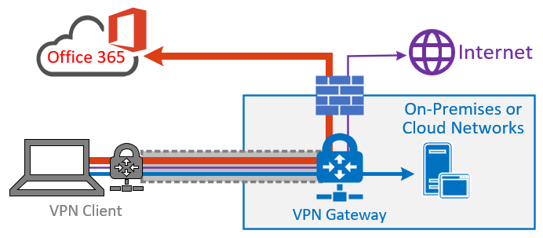

# Overview: VPN split tunneling for Microsoft 365

>[!NOTE]
>This article is part of a set of articles that address Microsoft 365 optimization for remote users.

>- For detailed guidance on implementing VPN split tunneling, see [Implementing VPN split tunneling for Microsoft 365](microsoft-365-vpn-implement-split-tunnel.md).
>- For a detailed list of VPN split tunneling scenarios, see [Common VPN split tunneling scenarios for Microsoft 365](microsoft-365-vpn-common-scenarios.md).
>- For guidance on securing Teams media traffic in VPN split tunneling environments, see [Securing Teams media traffic for VPN split tunneling](microsoft-365-vpn-securing-teams.md).
>- For information about how to configure Stream and live events in VPN environments, see [Special considerations for Stream and live events in VPN environments](microsoft-365-vpn-stream-and-live-events.md).
>- For information about optimizing Microsoft 365 worldwide tenant performance for users in China, see [Microsoft 365 performance optimization for China users](microsoft-365-networking-china.md).

Enterprises have traditionally used VPNs to support secure remote experiences for their users. While core workloads remained on-premises, a VPN from the remote client routed through a datacenter on the corporate network was the primary method for remote users to access corporate resources. To safeguard these connections, enterprises build layers of network security solutions along the VPN paths. This security was built to protect internal infrastructure and to safeguard mobile browsing of external web sites by rerouting traffic into the VPN and then out through the on-premises Internet perimeter. VPNs, network perimeters, and associated security infrastructure were often purpose-built and scaled for a defined volume of traffic, typically with most connectivity being initiated from within the corporate network, and most of it staying within the internal network boundaries.

For quite some time, VPN models where all connections from the remote user device are routed back into the on-premises network (known as _forced tunneling_) were largely sustainable as long as the concurrent scale of remote users was modest and the traffic volumes traversing VPN were low.  Some customers continued to use VPN force tunneling as the status quo even after their applications moved from inside the corporate perimeter to public SaaS clouds.

The use of forced tunneled VPNs for connecting to distributed and performance-sensitive cloud applications is suboptimal, but the negative effects have been accepted by some enterprises so as to maintain the security status quo. An example diagram of this scenario can be seen below:

_Figure 1: A traditional Forced Tunnel VPN solution._

This problem has been growing for many years, with many customers reporting a significant shift of network traffic patterns. Traffic that used to stay on premises now connects to external cloud endpoints. Many Microsoft customers report that previously, around 80% of their network traffic was to some internal source (represented by the dotted line in the above diagram). In 2020 that number decreased to around 20% or lower as they have shifted major workloads to the cloud. These trends aren't uncommon with other enterprises. Over time, as the cloud journey progresses, the above model becomes increasingly cumbersome and unsustainable, preventing an organization from being agile as they move into a cloud-first world.

The worldwide COVID-19 crisis escalated this problem to require immediate remediation. The need to ensure employee safety has generated unprecedented demands on enterprise IT to support work-from-home productivity at a massive scale. Microsoft 365 is well positioned to help customers fulfill that demand, but high concurrency of users working from home generates a large volume of Microsoft 365 traffic which, if routed through forced tunnel VPN and on-premises network perimeters, causes rapid saturation and runs VPN infrastructure out of capacity. In this new reality, using VPN to access Microsoft 365 is no longer just a performance impediment, but a hard wall that not only impacts Microsoft 365 but critical business operations that still have to rely on the VPN to operate.

Microsoft has been working closely with customers and the wider industry to provide effective, modern solutions to these problems from within our own services, and to align with industry best practice. [Connectivity principles](./microsoft-365-network-connectivity-principles.md) for the Microsoft 365 service have been designed to work efficiently for remote users while still allowing an organization to maintain security and control over their connectivity. These solutions can also be implemented quickly with limited work yet achieve a significant positive effect on the problems outlined above.

For customers who connect their remote worker devices to the corporate network or cloud infrastructure over VPN, Microsoft recommends that the key Microsoft 365 scenarios **Microsoft Teams**, **SharePoint Online**, and **Exchange Online** are routed over a _VPN split tunnel_ configuration. This becomes especially important as the first line strategy to facilitate continued employee productivity during large-scale work-from-home events such as the COVID-19 crisis.

_Figure 2: A VPN split tunnel solution with defined Microsoft 365 exceptions sent directly to the service. All other traffic traverses the VPN tunnel regardless of destination._

The essence of this approach is to provide a simple method for enterprises to mitigate the risk of VPN infrastructure saturation and dramatically improve Microsoft 365 performance in the shortest timeframe possible. Configuring VPN clients to allow the most critical, high volume Microsoft 365 traffic to bypass the VPN tunnel achieves the following benefits:

- Immediately mitigates the root cause of a majority of customer-reported performance and network capacity issues in enterprise VPN architectures impacting Microsoft 365 user experience
  
  The recommended solution specifically targets Microsoft 365 service endpoints categorized as **Optimize** in the topic [Microsoft 365 URLs and IP address ranges](./urls-and-ip-address-ranges.md). Traffic to these endpoints is highly sensitive to latency and bandwidth throttling, and enabling it to bypass the VPN tunnel can dramatically improve the end-user experience as well as reduce the corporate network load. Microsoft 365 connections that do not constitute the majority of bandwidth or user experience footprint can continue to be routed through the VPN tunnel along with the rest of the Internet-bound traffic. For more information, see [The VPN split tunnel strategy](#the-vpn-split-tunnel-strategy).

- Can be configured, tested, and implemented rapidly by customers and with no additional infrastructure or application requirements

  Depending on the VPN platform and network architecture, implementation can take as little as a few hours. For more information, see [Implement VPN split tunneling](microsoft-365-vpn-implement-split-tunnel.md#implement-vpn-split-tunneling).

- Preserves the security posture of customer VPN implementations by not changing how other connections are routed, including traffic to the Internet

  The recommended configuration follows the **least privilege** principle for VPN traffic exceptions and allows customers to implement split tunnel VPN without exposing users or infrastructure to additional security risks. Network traffic routed directly to Microsoft 365 endpoints is encrypted, validated for integrity by Office client application stacks and scoped to IP addresses dedicated to Microsoft 365 services that are hardened at both the application and network level. For more information, see [Alternative ways for security professionals and IT to achieve modern security controls in today's unique remote work scenarios (Microsoft Security Team blog)](https://www.microsoft.com/security/blog/2020/03/26/alternative-security-professionals-it-achieve-modern-security-controls-todays-unique-remote-work-scenarios/).

- Is natively supported by most enterprise VPN platforms

  Microsoft continues to collaborate with industry partners producing commercial VPN solutions to help partners develop targeted guidance and configuration templates for their solutions in alignment with the above recommendations. For more information, see [HOWTO guides for common VPN platforms](microsoft-365-vpn-implement-split-tunnel.md#howto-guides-for-common-vpn-platforms).

>[!TIP]
>Microsoft recommends focusing split tunnel VPN configuration on documented dedicated IP ranges for Microsoft 365 services. FQDN or AppID-based split tunnel configurations, while possible on certain VPN client platforms, may not fully cover key Microsoft 365 scenarios and may conflict with IP based VPN routing rules. For this reason, Microsoft does not recommend using Microsoft 365 FQDNs to configure split tunnel VPN. The use of FQDN configuration may be useful in other related scenarios, such as .pac file customizations or to implement proxy bypass.

For full implementation guidance, see [Implementing VPN split tunneling for Microsoft 365](microsoft-365-vpn-implement-split-tunnel.md).

For a step-by-step process to configure Microsoft 365 for remote workers, see [Set up your infrastructure for remote work](..\solutions\empower-people-to-work-remotely.md)

## The VPN split tunnel strategy

Traditional corporate networks are often designed to work securely for a pre-cloud world where most important data, services, applications are hosted on premises and are directly connected to the internal corporate network, as are the majority of users. Thus network infrastructure is built around these elements in that branch offices are connected to the head office via _Multiprotocol Label Switching (MPLS)_ networks, and remote users must connect to the corporate network over a VPN to access both on premises endpoints and the Internet. In this model, all traffic from remote users traverses the corporate network and is routed to the cloud service through a common egress point.

_Figure 2: A common VPN solution for remote users where all traffic is forced back into the corporate network regardless of destination_

As organizations move data and applications to the cloud, this model has begun to become less effective as it quickly becomes cumbersome, expensive, and unscalable, significantly impacting network performance and efficiency of users and restricting the ability of the organization to adapt to changing needs. Numerous Microsoft customers have reported that a few years ago 80% of network traffic was to an internal destination, but in 2020 80% plus of traffic connects to an external cloud-based resource.

The COVID-19 crisis has aggravated this problem to require immediate solutions for the vast majority of organizations. Many customers have found that the forced VPN model is not scalable or performant enough for 100% remote work scenarios such as that which this crisis has necessitated. Rapid solutions are required for these organizations to continue to operate efficiently.

For the Microsoft 365 service, Microsoft has designed the connectivity requirements for the service with this problem squarely in mind, where a focused, tightly controlled and relatively static set of service endpoints can be optimized very simply and quickly so as to deliver high performance for users accessing the service, and reducing the burden on the VPN infrastructure so it can be used by traffic that still requires it.

Microsoft 365 categorizes the required endpoints for Microsoft 365 into three categories: **Optimize**, **Allow**, and **Default**. **Optimize** endpoints are our focus here and have the following characteristics:

- Are Microsoft owned and managed endpoints, hosted on Microsoft infrastructure
- Are dedicated to core Microsoft 365 workloads such as Exchange Online, SharePoint Online, Skype for Business Online, and Microsoft Teams
- Have IPs provided
- Low rate of change and are expected to remain small in number (currently 20 IP subnets)
- Are high volume and/or latency sensitive
- Are able to have required security elements provided in the service rather than inline on the network
- Account for around 70-80% of the volume of traffic to the Microsoft 365 service

This tightly scoped set of endpoints can be split out of the forced VPN tunnel and sent securely and directly to the Microsoft 365 service via the user's local interface. This is known as **split tunneling**.

Security elements such as DLP, AV protection, authentication, and access control can all be delivered much more efficiently against these endpoints at different layers within the service. As we also divert the bulk of the traffic volume away from the VPN solution, this frees the VPN capacity up for business critical traffic that still relies on it. It also should remove the need in many cases to go through a lengthy and costly upgrade program to deal with this new way of operating.

_Figure 3: A VPN split tunnel solution with defined Microsoft 365 exceptions sent direct to the service. All other traffic is forced back into the corporate network regardless of destination._

From a security perspective, Microsoft has an array of security features which can be used to provide similar, or even enhanced security than that delivered by inline inspection by on premises security stacks. The Microsoft Security team's blog post [Alternative ways for security professionals and IT to achieve modern security controls in today's unique remote work scenarios](https://www.microsoft.com/security/blog/2020/03/26/alternative-security-professionals-it-achieve-modern-security-controls-todays-unique-remote-work-scenarios/) has a clear summary of features available and you'll find more detailed guidance within this article. You can also read about Microsoft's implementation of VPN split tunneling at [Running on VPN: How Microsoft is keeping its remote workforce connected](https://www.microsoft.com/itshowcase/blog/running-on-vpn-how-microsoft-is-keeping-its-remote-workforce-connected/?elevate-lv).

In many cases, this implementation can be achieved in a matter of hours, allowing rapid resolution to one of the most pressing problems facing organizations as they rapidly shift to full scale remote working. For VPN split tunnel implementation guidance, see [Implementing VPN split tunneling for Microsoft 365](microsoft-365-vpn-implement-split-tunnel.md).

## FAQ

The Microsoft Security Team has published [Alternative ways for security professionals and IT to achieve modern security controls in today’s unique remote work scenarios](https://www.microsoft.com/security/blog/2020/03/26/alternative-security-professionals-it-achieve-modern-security-controls-todays-unique-remote-work-scenarios/), a blog post, that outlines key ways for security professionals and IT can achieve modern security controls in today's unique remote work scenarios. In addition, below are some of the common customer questions and answers on this subject.

### How do I stop users accessing other tenants I do not trust where they could exfiltrate data?

The answer is a [feature called tenant restrictions](/azure/active-directory/manage-apps/tenant-restrictions). Authentication traffic isn't high volume nor especially latency sensitive so can be sent through the VPN solution to the on-premises proxy where the feature is applied. An allow list of trusted tenants is maintained here and if the client attempts to obtain a token to a tenant that isn't trusted, the proxy simply denies the request. If the tenant is trusted, then a token is accessible if the user has the right credentials and rights.

So even though a user can make a TCP/UDP connection to the Optimize marked endpoints above, without a valid token to access the tenant in question, they simply cannot log in and access/move any data.

### Does this model allow access to consumer services such as personal OneDrive accounts?

No, it does not, the Microsoft 365 endpoints aren't the same as the consumer services (Onedrive.live.com as an example) so the split tunnel won't allow a user to directly access consumer services. Traffic to consumer endpoints will continue to use the VPN tunnel and existing policies will continue to apply.

### How do I apply DLP and protect my sensitive data when the traffic no longer flows through my on-premises solution?

To help you prevent the accidental disclosure of sensitive information, Microsoft 365 has a rich set of [built-in tools](../compliance/information-protection.md). You can use the built-in [DLP capabilities](../compliance/dlp-learn-about-dlp.md) of Teams and SharePoint to detect inappropriately stored or shared sensitive information. If part of your remote work strategy involves a bring-your-own-device (BYOD) policy, you can use [app-based Conditional Access](/azure/active-directory/conditional-access/app-based-conditional-access) to prevent sensitive data from being downloaded to users' personal devices

### How do I evaluate and maintain control of the user's authentication when they are connecting directly?

In addition to the tenant restrictions feature noted in Q1, [conditional access policies](/azure/active-directory/conditional-access/overview) can be applied to dynamically assess the risk of an authentication request and react appropriately. Microsoft recommends the [Zero Trust model](https://www.microsoft.com/security/zero-trust?rtc=1) is implemented over time and we can use Azure AD conditional access policies to maintain control in a mobile and cloud-first world. Conditional access policies can be used to make a real-time decision on whether an authentication request is successful based on numerous factors such as:

- Device, is the device known/trusted/Domain joined?
- IP – is the authentication request coming from a known corporate IP address? Or from a country/region we do not trust?
- Application – Is the user authorized to use this application?

We can then trigger policy such as approve, trigger MFA or block authentication based on these policies.

### How do I protect against viruses and malware?

Again, Microsoft 365 provides protection for the Optimize marked endpoints in various layers in the service itself, [outlined in this document](/office365/Enterprise/office-365-malware-and-ransomware-protection). As noted, it's vastly more efficient to provide these security elements in the service itself rather than try to do it in line with devices that may not fully understand the protocols/traffic. By default, SharePoint Online [automatically scans file uploads](../security/office-365-security/anti-malware-protection-for-spo-odfb-teams-about.md) for known malware

For the Exchange endpoints listed above, [Exchange Online Protection](/office365/servicedescriptions/exchange-online-protection-service-description/exchange-online-protection-service-description) and [Microsoft Defender for Microsoft 365](/office365/servicedescriptions/office-365-advanced-threat-protection-service-description) do an excellent job of providing security of the traffic to the service.

### Can I send more than just the Optimize traffic direct?

Priority should be given to the **Optimize** marked endpoints as these will give maximum benefit for a low level of work. However, if you wish, the Allow marked endpoints are required for the service to work and have IP addresses provided for the endpoints that can be used if necessary.

There are also various vendors who offer cloud-based proxy/security solutions called _secure web gateways_ which provide central security, control, and corporate policy application for general web browsing. These solutions can work well in a cloud-first world, if highly available, performant, and provisioned close to your users by allowing secure Internet access to be delivered from a cloud-based location close to the user. This removes the need for a hairpin through the VPN/corporate network for general browsing traffic, while still allowing central security control.

Even with these solutions in place however, Microsoft still strongly recommends that Optimize marked Microsoft 365 traffic is sent direct to the service.

For guidance on allowing direct access to an Azure Virtual Network, see [Remote work using Azure VPN Gateway Point-to-site](/azure/vpn-gateway/work-remotely-support).

### Why is port 80 required? Is traffic sent in the clear?

Port 80 is only used for things like redirect to a port 443 session, no customer data is sent or is accessible over port 80. [Encryption](../compliance/encryption.md) outlines encryption for data in transit and at rest for Microsoft 365, and [Types of traffic](/microsoftteams/microsoft-teams-online-call-flows#types-of-traffic) outlines how we use SRTP to protect Teams media traffic.

### Does this advice apply to users in China using a worldwide instance of Microsoft 365?

**No**, it does not. The one caveat to the above advice is users in the PRC who are connecting to a worldwide instance of Microsoft 365. Due to the common occurrence of cross border network congestion in the region, direct Internet egress performance can be variable. Most customers in the region operate using a VPN to bring the traffic into the corporate network and utilize their authorized MPLS circuit or similar to egress outside the country/region via an optimized path. This is outlined further in the article [Microsoft 365 performance optimization for China users](microsoft-365-networking-china.md).

### Does split-tunnel configuration work for Teams running in a browser?

Yes, with caveats. Most Teams functionality is supported in the browsers listed in [Get clients for Microsoft Teams](/microsoftteams/get-clients#web-client).

In addition, Microsoft Edge **96 and above** supports VPN split tunneling for peer-to-peer traffic by enabling the Edge [WebRtcRespectOsRoutingTableEnabled](/deployedge/microsoft-edge-policies#webrtcrespectosroutingtableenabled) policy. At this time, other browsers may not support VPN split tunneling for peer-to-peer traffic.

## Related articles

[Implementing VPN split tunneling for Microsoft 365](microsoft-365-vpn-implement-split-tunnel.md)

[Common VPN split tunneling scenarios for Microsoft 365](microsoft-365-vpn-common-scenarios.md)

[Securing Teams media traffic for VPN split tunneling](microsoft-365-vpn-securing-teams.md)

[Special considerations for Stream and live events in VPN environments](microsoft-365-vpn-stream-and-live-events.md)

[Microsoft 365 performance optimization for China users](microsoft-365-networking-china.md)

[Microsoft 365 Network Connectivity Principles](microsoft-365-network-connectivity-principles.md)

[Assessing Microsoft 365 network connectivity](assessing-network-connectivity.md)

[Microsoft 365 network and performance tuning](network-planning-and-performance.md)

[Alternative ways for security professionals and IT to achieve modern security controls in today's unique remote work scenarios (Microsoft Security Team blog)](https://www.microsoft.com/security/blog/2020/03/26/alternative-security-professionals-it-achieve-modern-security-controls-todays-unique-remote-work-scenarios/)

[Enhancing VPN performance at Microsoft: using Windows 10 VPN profiles to allow auto-on connections](https://www.microsoft.com/itshowcase/enhancing-remote-access-in-windows-10-with-an-automatic-vpn-profile)

[Running on VPN: How Microsoft is keeping its remote workforce connected](https://www.microsoft.com/itshowcase/blog/running-on-vpn-how-microsoft-is-keeping-its-remote-workforce-connected/?elevate-lv)

[Microsoft global network](/azure/networking/microsoft-global-network)
